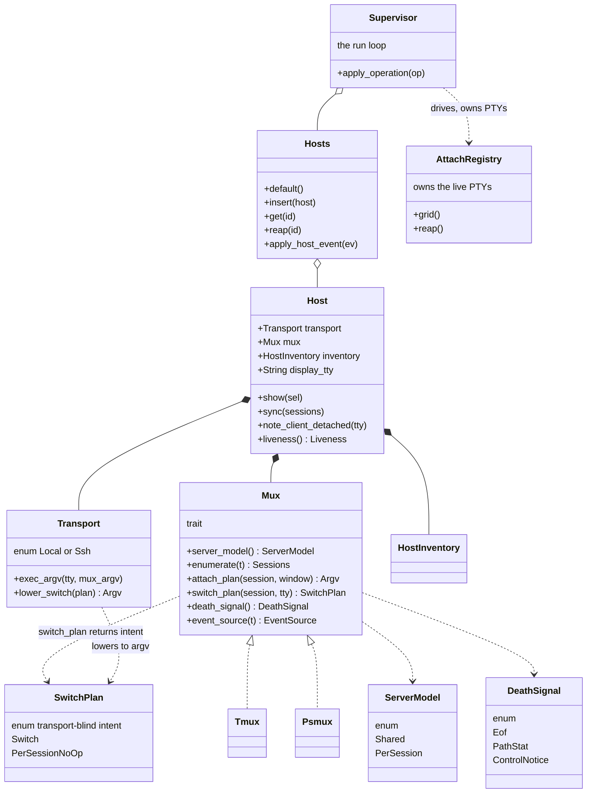
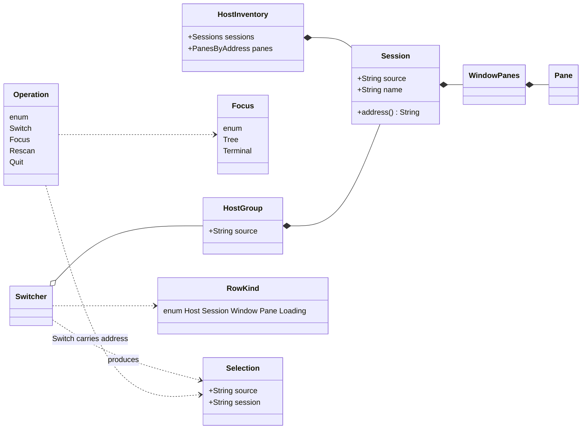

# xmux Host × Mux × Transport Refactor — Implementation Plan (v2)

> **For agentic workers:** REQUIRED SUB-SKILL: Use superpowers:subagent-driven-development (recommended) or superpowers:executing-plans to implement this plan task-by-task. Steps use checkbox (`- [ ]`) syntax for tracking.

**Goal:** Rebuild xmux's host/connection layer into a `Host = Transport × Box<dyn Mux>` structure so the mux-model bug class, the detach/death-detection gap, and the scattered-host-state desync class become **structurally impossible** — while resolving the v1.0.0 review findings, the host-abstraction handoff (G1–G5), the codex round-1 review, and a full naming pass.

**Architecture:** A first-class `Host` owns one mux server's `Transport` (Local/Ssh — the machine boundary), its `Box<dyn Mux>` backend (the mux kind, which owns its `ServerModel` and `DeathSignal`), its `inventory`, and its **display bookkeeping** — which session each display is on, the in-memory `display_tty`, and liveness. The live **PTYs stay owned by `AttachRegistry` + `DisplayWorker`**, which the supervisor drives; `Host` records bookkeeping, it does not own the pixels. The mux model (per-session vs shared) lives in the backend, so no supervisor code branches on a `remote` bool. `Mux::switch_plan` returns a **transport-blind `SwitchPlan` intent** that `Transport` lowers to a local `switch-client` argv or an ssh raw command. Death is a PUSH owned by the Host (tmux: `%client-detached` filtered by the identity-captured `display_tty`; psmux: per-session EOF + port-file stat). UI key handlers and `xmux ctl` both resolve to one semantic `Operation` core.

**Tech Stack:** Rust 2021 · ratatui 0.30 · crossterm 0.29 · tokio · portable-pty 0.9 · vt100 0.16 · interprocess · async-trait · clap · serde/toml · thiserror/anyhow.

**Guiding principle (every task):** Do NOT patch symptoms — rebuild so the symptom CLASS cannot occur. Each task names the class it eliminates.

**Ponytail-ultra:** smallest code that achieves the safe structure; deletion beats addition; two mux impls now (no one-impl trait, no plugin runtime, no speculative lifecycle methods); static `mux::for_binary` factory; map new muxes onto existing `Session`/`WindowPanes`/`Pane`; AS-IS comments only.

**Naming (this revision):** the supervisor concept is named "supervisor" in docs/comments while the file/fn `cockpit.rs`/`run_cockpit` are RETAINED (binary-only internal names — file rename deferred as pure churn); `AppState`/`AppStateKind`→`Focus` with `Focus::Tree`/`Focus::Terminal` (`is_overlay()`→`is_tree_focused()`); ctl verbs `overlay`/`passthrough`→`focus-tree`/`focus-terminal`; `Group`→`HostGroup`; `Source`→split into `Transport`+`Mux`; `MovePlan`→`SwitchPlan` (transport-blind: `Switch{session}`/`PerSessionNoOp`); `DeathSignal::ControlEvent`→`ControlNotice`; `RowRef`→`RowKind`; `HostManager`→folds into `Hosts`; `Operation::Switch.addr`→`.address`. Full rationale in the Naming Decisions section.

**Verification reality:** attach/switch/detach is a HUMAN live gate (the harness nests the supervisor; local psmux is one shared server). Remote attach IS testable headless via `ssh -t` against the throwaway host `jupiter06`. Verify committed behavior from a real build + the human's eyes, never a passing suite alone. Never attach/switch-client to the human's live session from a probe.

---

## Ideal Class Diagram (v2)



> **Ownership (codex H2 fix):** `Host` owns display **bookkeeping** (which session each display shows, the `display_tty`, liveness). The live **PTY/`Grid` ownership stays in `AttachRegistry` + `DisplayWorker`**, driven by the supervisor. `Host` never owns the pixels.



> **Rendered:** `xmux-ideal-class-diagram.html`. Domain types (Session/WindowPanes/Pane), the PTY mechanism (AttachRegistry/Attachment/Grid/DisplayWorker) and the UI (Switcher/HostGroup/RowKind) are kept or become render projections; the NEW types (Host, Hosts, Transport, Mux+impls, ServerModel, SwitchPlan, DeathSignal, Operation, Focus) are introduced below.

---

---

## Naming Pin (authoritative — overrides any conflicting statement below)

- The supervisor CONCEPT is implemented by `src/cockpit.rs` / `run_cockpit`; these file and function names are RETAINED. They are internal, binary-only names (not a public/SemVer surface), so renaming the file would churn every `file:line` citation in this plan for zero contract benefit. The module doc-comment, comments, and prose name it "supervisor"; the file/fn stay `cockpit.rs`/`run_cockpit`. There is NO file/fn rename task — every `cockpit.rs:NNN` citation is literal and correct.
- The naming review recommended renaming the file too; that file-rename is DEFERRED as pure churn (ponytail-ultra): the concept name "supervisor" is adopted in docs/comments, the file/fn name kept. The renames that DO happen in code: `AppState`/`AppStateKind`→`Focus` (owned by Phase 4), `Group`→`HostGroup`, `RowRef`→`RowKind`, `Source`→split into `Transport`+`Mux`, `MovePlan`→`SwitchPlan`, `DeathSignal::ControlEvent`→`ControlNotice`, ctl `overlay`/`passthrough`→`focus-tree`/`focus-terminal`, `Operation::Switch.addr`→`.address`.
- `Mux` switch intent method is `switch_plan(session) -> SwitchPlan` (transport-blind); `Transport` lowers it. There is no `move_plan`.

---

## Naming Decisions

| Name | Verdict | Rationale |
|---|---|---|
| `cockpit` (concept) / `cockpit.rs` / `run_cockpit` | **Concept → `supervisor`** in docs/comments; **file/fn `cockpit.rs`/`run_cockpit` KEPT** | The module doc already calls it "a persistent **supervisor**", so prose/comments adopt that precise word. The FILE/FN rename is DEFERRED as pure churn (binary-only internal name, no structural payoff — ponytail); all `cockpit.rs:NNN` citations stay literal. |
| `overlay` / `passthrough` (AppState variants) | **RENAME → `Focus::Tree` / `Focus::Terminal`** (confirm the plan) | `Overlay` is actively misleading — nothing overlays; it is the tree-focused split. `Passthrough` describes a mechanism (keys pass through), not the state. The plan's `Focus{Tree,Terminal}` direction is correct; I pin the variant names as `Focus::Tree` / `Focus::Terminal` and helper `is_tree_focused()`. |
| `AppState` (enum) | **RENAME → `Focus`** | After the variant rename, `AppState` over-claims (it is only the focus side, not whole-app state). `Focus` with `Tree`/`Terminal` is exact. Matches `FocusTarget` already in `Operation`. |
| `AppStateKind` (ctl mirror, run.rs) | **RENAME → `Focus`** (collapse the mirror) | It is a duplicate of `AppState` that exists only to avoid a dep edge. Once `Focus` is the single name, the mirror should reuse it or be named `Focus` identically; do not keep two names for one concept. |
| `is_overlay()` | **RENAME → `is_tree_focused()`** | Reads as a question with an obvious answer at every call site (`reconciled_tree_width(!app.is_overlay(), …)` becomes `app.is_tree_focused()`). |
| `Group` (ui/tree.rs) | **RENAME → `HostGroup`** | "The sessions of one source" — bare `Group` is vague (group of what?) and the free fns (`order_groups`, `filter_groups`, `add_session`) give no clue. As a render projection of one `Host`, `HostGroup` is self-explanatory and aligns with the `Host` rename. |
| `Source` | **RENAME → split into `Transport` + `Mux`, owned by `Host`** (no surviving `Source` type) | `Source` is triple-ambiguous (data/event/session source) and conflates machine boundary with mux kind — the exact bug class. The split is the right structural move; `Host` is the correct keystone name. |
| `Transport` (new) | **KEEP** | Precise and conventional for "the machine boundary / how argv reaches the server." `Local`/`Ssh` variants read cleanly. |
| `Mux` (new trait) | **KEEP** | The domain term ("multiplexer"); `Box<dyn Mux>`, `Tmux`/`Psmux` impls read perfectly. |
| `ServerModel {Shared, PerSession}` | **KEEP** | `ServerModel::Shared` / `PerSession` is exact and self-documenting at call sites (`server_model().shares_one_attachment()`). |
| `DeathSignal {Eof, PathStat, ControlEvent}` | **RENAME variant → `DeathSignal::ControlEvent`→`ControlNotice`**; enum + `Eof`/`PathStat` **KEEP** | `DeathSignal` is vivid and correct. `Eof` and `PathStat` are precise. But `ControlEvent` collides with the general "host event" vocabulary (`HostEvent`, `EventSource::Control`); `ControlNotice` (a tmux `%`-notification) is the precise, non-colliding term. |
| `MovePlan` / `SwitchClient` intent | **RENAME → `SwitchPlan`** + restructure (see note) | Codex CRITICAL is right: `MovePlan::{RawSsh, Local}` mixes mux intent with transport execution. Rename to `SwitchPlan` (it is specifically a `switch-client` plan) and make variants transport-neutral intent: `SwitchPlan::Switch { session }` / `SwitchPlan::PerSessionNoOp`, lowered to argv by `Transport`. The `Move` verb is vague; `Switch` matches the `switch-client` domain. |
| `MovePlan::NotShared` | **RENAME → `PerSessionNoOp`** | "NotShared" describes the model, not the action. The point is "there is nothing to switch." `PerSessionNoOp` says that. |
| `EventSource {Control, Poll}` | **KEEP** | Reads precisely at the decision site ("where do change events come from"). No real type clash in this crate; `Control`/`Poll{interval_ms}` are clear. |
| `Operation` | **KEEP** | The semantic command core both UI and ctl resolve to. Standard, clear. (`FocusTarget` inside it stays.) |
| `Operation::Switch { addr }` | **KEEP**, but rename field `addr` → `address` | The frozen code spells it out as `address()` everywhere (`Selection::address`, `Session::address`); `addr` is an inconsistent abbreviation. |
| `Switcher` | **KEEP** | Exact: the tree+cursor state machine that switches sessions. |
| `Selection` | **KEEP** | Exact: the canonical selected `source`/`session`/`window`. |
| `RowRef` | **RENAME → `RowKind`** | "What a tree row references" with selectable/non-selectable variants is a *kind* discriminant, not a reference/pointer. `RowKind` (Host/Session/Window/Pane/Loading) reads correctly; `RowRef` implies a borrow. Low-churn (one private enum). |
| `Hosts` | **KEEP**, add pinned `Default` + `insert` (per codex) | Collection-of-`Host` keyed by id; conventional plural-as-collection. Resolve the codex API gap by pinning `Hosts::default()` + `insert(Host)`. |
| `Host` | **KEEP** | The keystone; unambiguous and correct. |
| `HostGroup`/`Group` free fns (`order_groups` etc.) | **RENAME → `*_host_groups`** only where the type renames; else KEEP | Follow the `Group`→`HostGroup` rename mechanically (`order_groups`→`order_host_groups`). Do not otherwise touch them. |
| ctl verbs `passthrough` / `overlay` | **RENAME → `focus-terminal` / `focus-tree`** | Verbs must match the renamed states so an agent driving ctl issues the same vocabulary a keypress does (the `Operation` parity goal). |
| ctl verbs `dump` / `key` / `keys` / `text` / `ping` | **KEEP** | `dump` (render the screen), `ping`/`key`/`keys`/`text` are conventional, stable test-surface verbs. No improvement from churn. |
| `TerminalViewTarget` | **KEEP** | Precise: the target whose pane attaching-here would show. |
| `HostInventory` (→ `Host.inventory`) | **KEEP** | Exact: a host's session/window inventory. |
| `HostManager` | **RENAME → folds into `Hosts`** (no surviving `HostManager`) | Per the plan it is absorbed by `Hosts`; `HostManager` + `Hosts` as two registries keyed by the same id IS the desync class. One name. |
| `HostClient` (→ mechanism behind `EventSource::Control`) | **KEEP** | Precise: the `-CC` control-mode client connection. |
| `MuxUnsupported` | **REMOVED** (codex L1) | The `Mux` trait carries no session lifecycle methods (no end-to-end caller), so no unsupported-op error marker is introduced. |
| `DisplayTty` | **KEEP** | Exact: the captured display-client tty. |
| `for_binary` (factory) | **KEEP** | `mux::for_binary("psmux")` reads as a clear static factory. |

## Rename Map

```
# Supervisor concept (file/fn KEPT; the name is used in docs/comments/prose)
cockpit                          -> supervisor                 # concept/module name in docs & prose
src/cockpit.rs                   -> KEPT (binary-only internal file name; rename deferred as pure churn)
pub mod cockpit                  -> KEPT
run_cockpit                      -> KEPT (fn name retained)

# Focus state (was AppState overlay/passthrough)
AppState                         -> Focus
AppState::Overlay                -> Focus::Tree
AppState::Passthrough            -> Focus::Terminal
App::is_overlay                  -> App::is_tree_focused
AppStateKind                     -> Focus                       # collapse the ctl mirror onto Focus
AppStateKind::Overlay            -> Focus::Tree
AppStateKind::Passthrough        -> Focus::Terminal

# ctl verbs (must match the focus rename)
overlay                          -> focus-tree                  # ctl verb
passthrough                      -> focus-terminal              # ctl verb

# Tree render projection (was Group)
Group                            -> HostGroup                   # src/ui/tree.rs
order_groups                     -> order_host_groups
filter_groups                    -> filter_host_groups
add_session, remove_session, rename_session   -> KEEP (operate on HostGroup; names already clear)

# Tree row discriminant
RowRef                           -> RowKind

# Mux death signal
DeathSignal::ControlEvent        -> DeathSignal::ControlNotice

# Switch-client plan (was MovePlan)
MovePlan                         -> SwitchPlan
Mux::switch_plan                   -> Mux::switch_plan
MovePlan::RawSsh(String)         -> REMOVE                      # transport-specific; lowered by Transport
MovePlan::Local(Vec<String>)     -> REMOVE                      # transport-specific; lowered by Transport
MovePlan::NotShared              -> SwitchPlan::PerSessionNoOp
# new transport-neutral intent variant:
(new)                            -> SwitchPlan::Switch { session: String }

# Operation field spelling
Operation::Switch { addr }       -> Operation::Switch { address }

# Registry collapse (per plan; recorded for consistency)
HostManager                      -> (folded into Hosts; no surviving type)
```

**Notes for downstream agents (decisive, not optional):**
- `Group`→`HostGroup` is the one moderate-churn rename I am keeping: bare `Group` fails the "self-explanatory to an outsider" bar and the `Source`→`Host` rebuild makes `HostGroup` the natural projection name. Do it mechanically; rename only the type + the two `*_groups` fns that read poorly, leave `add/remove/rename_session` alone.
- `MovePlan`→`SwitchPlan` with transport-neutral variants directly resolves codex CRITICAL §2/§3 (the `RawSsh`/`Local` boundary error): `Mux::switch_plan(&self, session) -> SwitchPlan` stays transport-blind; `Transport` lowers `SwitchPlan::Switch` to a local `switch-client` argv vs an ssh raw command. This rename is load-bearing for correctness, not cosmetic — keep it coupled to the contract fix.
- Everything not in the Rename Map is **KEEP** (`Switcher`, `Selection`, `Host`, `Hosts`, `Transport`, `Mux`/`Tmux`/`Psmux`, `ServerModel`, `EventSource`, `Operation`, `FocusTarget`, `DeathSignal`/`Eof`/`PathStat`, `DisplayTty`, `for_binary`, `TerminalViewTarget`, `HostInventory`, `HostClient`, ctl `dump`/`ping`/`key`/`keys`/`text`).

---

## Plan Reconciliation (round 2)

### (1) Codex finding → resolving task(s)

| # | Sev | Finding | Resolved by | Status |
|---|-----|---------|-------------|--------|
| **C1** | CRIT | Phase 2 deletes `switch_client_remote_cmd`/`client_tty_path`/`tty>` writer before `select_attach` (cockpit.rs:334) is rewired | **Phase 2** removes ALL `source.rs` deletions (grep-asserts `switch_client_remote_cmd`+`client_tty_path` still present == 2). **Phase 4 Task 7** deletes them *after* `select_attach`→`Host`/`SwitchPlan` rewire. Phase 3 Task 3.8 scoped to dead DIAG only. Every task ends `cargo build`. | ✅ RESOLVED |
| **C2** | CRIT | `Mux::switch_plan` transport-blind but returns transport-specific `MovePlan::{RawSsh,Local}` | `MovePlan` deleted. `Mux::switch_plan(session)→SwitchPlan{Switch\|PerSessionNoOp}` (intent) + `Mux::switch_client_argv(tty,session)` (argv only). `Transport::lower_switch(plan,&argv_builder)→Option<LoweredSwitch{Local,RawSsh}>` is the sole lowerer. **P1 Task 4** adds `lower_switch` + test `lower_switch_local_is_a_direct_mux_argv`; **P4 Task 7** consumes it. | ✅ RESOLVED |
| **C3** | CRIT | `DeathSignal` defined twice (P1 plan.rs + P3 death.rs) | Defined ONCE in `src/model/plan.rs` (**P1 Task 1**). **P3** `death.rs` holds only free fns (`matches_display_tty`, `psmux_port_path`, `psmux_session_is_live`) over the P1 enum — no re-declare; `mod.rs` re-exports no second `DeathSignal`. Module Map pins this. | ✅ RESOLVED |
| **H1** | HIGH | Module-path drift (`src/hosts.rs` vs `crate::model::Hosts`; `model/plan.rs` vs `model/death.rs`) | Module Map pins ONE path/type. `src/hosts.rs` + second `model/death.rs` declared FORBIDDEN. **P2** killed `src/hosts.rs`+`pub mod hosts`; canonical = `model/host.rs` (`Host`/`HostDisplay`/`Liveness`), `model/hosts.rs` (`Hosts`). All consumers `crate::model::{…}`. | ✅ RESOLVED |
| **H2** | HIGH | Contract overstates "Host owns attachments"; PTYs are in `AttachRegistry`+`DisplayWorker` | Contract reworded: Host owns display **BOOKKEEPING** (`HostDisplay.current`/`in_flight`, `display_tty`, `liveness`); registry/worker stay PTY owners; Host "reconciles". Class-diagram fix: drop `Host o-- Attachment`, add `Host *-- HostDisplay`/`*-- DisplayTty`, `Host ..> AttachRegistry : reconciles`, `..> DisplayWorker : requests spawn`. Flows through **P4 Tasks 6-8**. | ✅ RESOLVED |
| **H3** | HIGH | Death-push misses real detach; first-non-empty `list-clients` line ≠ identity | Identity-preserving capture: xmux's own attach shell emits `\x1b]XMUX-DISPLAY-TTY:$(tty)\x07` before `exec`; pump `scan_marker_once`→`PtyEvent::DisplayTty{id,tty}`→`Host.display_tty` (via `AttachRegistry::address_of_id`). `Notif::ClientDetached{client}` now parses the tty (control_proto.rs); reap only when `client==host.display_tty.0`. **P3 Task 3.1** (parser) + **3.5** (pump capture) with MULTI-CLIENT tests (unrelated detach inert; marked tty reaps). | ✅ RESOLVED |
| **M1** | MED | G2/G3 desync not structurally impossible until `reaped_ids`(1001)/`host_session`(1052)/`in_flight`(996) deleted | **P4 Task 8** explicitly DELETES all three `run_cockpit` locals, routing through `host.display`. Grep acceptance: no free `let mut in_flight/reaped_ids/host_session`; only `host.display.*` field access. P2/P3 keep them as labeled transitional lines with deletion assigned to P4 T8. | ✅ RESOLVED |
| **M2** | MED | Grep `.remote==0` necessary-insufficient; local-tmux switch can be silently broken | **P4 Task 7** adds positive test `local_tmux_shared_second_session_lowers_to_a_local_switch_client_argv` asserting `LoweredSwitch::Local(["tmux","switch-client","-c",tty,"-t",...])`. **P1 Task 4** also has `lower_switch_local_is_a_direct_mux_argv`. Grep called out as necessary-but-insufficient. | ✅ RESOLVED |
| **M3** | MED | P4 Task 8/9 prose/`/* … */` placeholders | No `/* … */` remains. **P4 Task 8** = full compilable `sync_shared_host_warms…` (in_flight len 1 keyed by host id for Shared; len 2 keyed by `source/session` for PerSession). **P4 Task 9** = concrete `MouseState`/`StdinOutcome` structs + exact `handle_stdin_bytes`/`handle_mouse_event` sigs + compilable prefix+q / divider-grab tests. | ✅ RESOLVED |
| **M4** | HIGH/MED | Phase 5 outline-only (13 one-liners) despite "full TDD" claim | All 13 expanded. Real failing tests: **T5** (CJK width), **T7** (write-free `apply_width_delta`), **T8** (unix `0600`). Grep+build acceptance (deletions/docs/moves): **T1,2,3,4,6,9,10,11,12,13**. Every task has exact `cargo`/`grep`/`git` + conventional commit. | ✅ RESOLVED |
| **L1** | LOW | `Mux` lifecycle (new/kill/rename) speculative — no end-to-end caller | Removed from `Mux` trait; `MuxUnsupported` removed (no producer); `Operation::{NewSession,KillSession,Rename}` removed. Only window-level builders kept (live `manage.rs`/`mux.rs` callers). | ✅ RESOLVED |
| **L2** | LOW | "if Phase 1 named it differently" escape hatches | All names pinned in contracts: `SwitchPlan`(not MovePlan), `PerSessionNoOp`(not NotShared), `ControlNotice`(not ControlEvent), `switch_plan`(not switch_plan), `Focus`(not AppState), `Switch{address}`(not addr). **P5 Task 6** = grep gate asserting zero `AppState`/`AppStateKind`/`is_overlay` residue. No hatches survive. | ✅ RESOLVED |

**All 12 findings addressed. None unaddressed.** Verified against frozen code: select_attach@cockpit.rs:334, switch_client_remote_cmd@source.rs:268, client_tty_path@source.rs:282, in_flight@996/reaped_ids@1001/host_session@1052 — all match codex's line citations and the resolutions land on the correct sites.

### (2) Interface consistency (all items RESOLVED below)

**Clean / consistent:**
- `SwitchPlan`/`LoweredSwitch`/`switch_plan`/`switch_client_argv`/`lower_switch` — one vocabulary across Contracts, P1 T4, P4 T7. No `MovePlan` token survives (P3 verified 0).
- `DeathSignal` — single home `model/plan.rs`; helpers in `death.rs`; `ControlNotice` everywhere (P3 verified 0 `ControlEvent`).
- Module Map paths — every shared type one path; `src/hosts.rs` + second death enum forbidden and confirmed absent.
- `Host::ensure_control_client(&mut self, cols:u16, rows:u16, &UnboundedSender<HostEvent>)->anyhow::Result<bool>` — pinned in Contracts AND introduced P2 T2.5; P4 T8 consumes the same signature. Consistent.
- `Hosts::default()/new()/insert(Host)/get/get_mut/ids/iter_mut` — pinned in Contracts AND P2 T2.7; P4 tests call `Hosts::default()`/`insert`. Consistent.
- `Operation::Switch{address}` (not `addr`) — matches `Selection::address`/`Session::address` in frozen code.

**Interface-consistency notes (all RESOLVED — retained for traceability):**

1. **`Notif::ClientDetached` lifetime/shape across files.** Contracts/H3 specify the parser variant as borrowed `ClientDetached { client: &'a str }` (control_proto.rs) and the loop variant as owned `HostEvent::ClientDetached { host: String, client: String }` (host.rs). P3 summary confirms the parser change + a `dispatch_notif` 4-arg signature `(host, notif, &Option<String>, &mut emit)`. **Action:** P3 task text must state BOTH the borrowed parser variant and the owned `HostEvent` variant explicitly (two distinct types, same name) and pin the owned→borrowed conversion point, else an executor may collapse them into one and break the `Notif<'a>` borrow. Flag as a doc-precision fix in P3 T3.1, not a structural change.

2. **`SyncAction` — RESOLVED.** `SyncAction { Attach { key: String, session: String }, Reap { key: String } }` and `Host::sync(&self) -> Vec<SyncAction>` are in the Target Contracts + Module Map (Phase 2 Task 2.6 is authoritative). No drift.

3. **Supervisor naming — RESOLVED (decision (b)).** *Concept name* = "supervisor" in prose/diagrams/comments; *file/fn* = `src/cockpit.rs`/`run_cockpit` KEPT (binary-only internal name; the file rename is pure churn with no structural payoff — ponytail). There is NO file-rename task and none is needed; every `cockpit.rs:NNN` citation is literal and correct. The authoritative Naming Pin and the Naming Decisions row state this.

### (3) Corrected execution order (every phase build-green)

```
Phase 0  authors types only, no build step.
Phase 1  ADDITIVE under src/model/ + ONE pub(crate) promotion in source.rs.
         Deletes NOTHING. select_attach + switch_client_remote_cmd + client_tty_path
         + /tmp file UNTOUCHED → green.   verify: cargo build + per-task unit tests
Phase 2  ADDITIVE: Host/Hosts/HostDisplay/Liveness, ensure_control_client owner,
         record/clear_display_tty. source.rs deletions = NONE
         (grep switch_client_remote_cmd|client_tty_path == 2, ASSERTED).
         side-maps (996/1001/1052) STAY (labeled transitional).   verify: cargo build green
Phase 3  Identity-preserving marker capture ALONGSIDE the still-live /tmp path
         (one phase of coexistence). ClientDetached parses tty. Reap on Host.display
         + ONE labeled legacy host_session.remove line (deletion deferred → P4 T8).
         Deletes only dead DIAG raw-mode scaffolding.   verify: cargo build + multi-client reap tests
Phase 4  THE REWIRE — the only phase that deletes cockpit-used APIs, and ONLY after rewire:
   T2  Focus rename (AppState→Focus / is_overlay→is_tree_focused) — final names written here
   T6  Cmd reshape + AppStateKind ctl-mirror collapse onto Focus
   T7  select_attach → Host + mux.switch_plan + Transport::lower_switch;
       THEN delete switch_client_remote_cmd / client_tty_path / tty> writer / /tmp file (C1)
       + positive local-tmux-Shared switch test (M2)
   T8  DELETE the three loop side-maps in_flight/reaped_ids/host_session (M1);
       route through host.display; sync_shared_host_warms test (M3)
   T9  extract handle_stdin_bytes/handle_mouse_event (StdinOutcome/MouseState) (M3)
         verify each task: cargo build + cargo test; final grep '\.remote' cockpit.rs == 0
Phase 5  hygiene + release. Renames are NOT here (owned by P4) — T6 only grep-VERIFIES residue==0.
         Pure deletions/docs/moves/crate-collapse/release. T13 (git rm plan) runs LAST.
```

**The C1 invariant — restated as the order's load-bearing rule:** *No `source.rs` API that `select_attach`/`attach_command`/`run_raw` call may be deleted before Phase 4 Task 7 rewires `select_attach` off it.* P1/P2/P3 are deletion-free w.r.t. those APIs (P2 grep-asserts presence == 2). The blank-pane `/tmp` file and `switch_client_remote_cmd` are deleted exactly once, in P4 T7, after the last live caller is gone.

**ORDER GAP — CLOSED (decision (b) taken):** the `cockpit.rs`/`run_cockpit` file/fn names are KEPT; only the *concept* is named "supervisor" (prose/comments/diagrams). There is no file-rename task and none is needed — the rename would be pure churn with no structural payoff (ponytail). No section implies an actual file rename; all `cockpit.rs:NNN` citations are literal.

### (4) Updated `## Global Constraints` block

```markdown
## Global Constraints

> Apply to every phase below. Non-negotiable plan-header rules.

- **Toolchain (shim blocked).** The `~/.cargo/bin` rustup shim is blocked on this box.
  Every `cargo build`/`test`/`clippy` step means: invoke the real
  `~/.rustup/toolchains/stable-x86_64-pc-windows-msvc/bin/cargo.exe` directly, with
  `RUSTC=…/bin/rustc.exe`, `RUSTDOC=…/bin/rustdoc.exe`, and an isolated
  `CARGO_TARGET_DIR` — `…/cargo-target-test` for test/build, a SEPARATE
  `…/cargo-target-clippy` for clippy (never the default `target/`, never the shim).
  Deps reused unchanged: `async_trait`, `thiserror`, `dirs`, `unicode-width`,
  `interprocess` (named pipes on Windows), `ratatui`/`crossterm`, `tokio`,
  `portable-pty`, `vt100`. Release (Phase 5): `version="1.0.0"`, repo
  `github.com/zer0ken/xmux`, MIT `LICENSE`.

- **Module-path rule (H1).** ONE canonical module path per shared type — the
  `## Module Map` is authoritative. All new types under `src/model/`, re-exported from
  `crate::model`; every consumer imports `crate::model::{…}`. FORBIDDEN: `src/hosts.rs`,
  a second `src/model/death.rs` enum. `DeathSignal` is defined EXACTLY ONCE in
  `src/model/plan.rs` (C3); `death.rs` holds only free helpers over it.

- **Transport-blind mux (C2).** No `Mux` method takes a `Transport` except `enumerate`.
  `Mux::switch_plan(session)→SwitchPlan` is pure intent; `Transport::lower_switch` is the
  SOLE lowerer to `LoweredSwitch::{Local,RawSsh}`. `MovePlan` and `RawSsh`/`Local` never
  appear in the mux layer. `Mux` carries NO session lifecycle (new/kill/rename) — no
  end-to-end caller (L1); only window-level builders with live callers are kept.

- **Ownership boundary (H2).** `Host` owns display BOOKKEEPING only —
  `HostDisplay.current`/`in_flight`, `display_tty`, `liveness`. The PTYs stay in
  `AttachRegistry` (keyed by `display_key`) and `DisplayWorker` (off-loop spawn).
  `Host.display` is the source of truth for intent/state; registry/worker own the live
  PTYs; the supervisor reconciles. No private `host_session`/`in_flight` side-map may
  drift from `Host.display`.

- **Deletion-after-rewire (C1).** No `source.rs` API that `select_attach`/`attach_command`/
  `run_raw` call (`switch_client_remote_cmd`, `client_tty_path`, the `tty>` writer, the
  `/tmp/.xmux-cli-*` file) may be deleted before Phase 4 Task 7 rewires `select_attach`
  off it. Phases 1–3 are deletion-free w.r.t. those APIs (Phase 2 grep-asserts
  `switch_client_remote_cmd`+`client_tty_path` == 2). Every task ends `cargo build` green.

- **Identity-preserving death (H3).** xmux's display tty is captured IN MEMORY from
  xmux's OWN attach shell (the `XMUX-DISPLAY-TTY` marker the pump reads), never the first
  `list-clients` line and never `/tmp/.xmux-cli-*`. `%client-detached <tty>` reaps only
  when `tty == Host.display_tty.0`. Multi-client tests prove an unrelated detach is inert.

- **AS-IS rule.** Code/comments/docstrings/docs state CURRENT behavior as fact — no
  history/delta narration ("was X, now Y", "fixed", "previously", "phase N", arrows).
  Stale comments deleted at the source, not annotated. Exception: explicit append-only
  logs (none here).

- **Ponytail-ultra.** Smallest safe change; deletion beats addition. Two mux impls
  (`Tmux`,`Psmux`) — no one-impl trait, no plugin runtime; `mux::for_binary` is a static
  two-arm factory. `Mux`/`Operation` shaped by the supervisor's REAL call sites, not a
  feature catalogue. New muxes map onto existing `Session`/`WindowPanes`/`Pane`. Every
  changed line traces to the structural goal.

- **Pinned final names (L2).** `SwitchPlan` (not MovePlan), `PerSessionNoOp` (not
  NotShared), `DeathSignal::ControlNotice` (not ControlEvent), `Mux::switch_plan` (not
  switch_plan), `Focus`/`is_tree_focused` (not AppState/is_overlay), `Operation::Switch{address}`
  (not addr). No "if Phase 1 named it differently" hatches. Phase 4 writes the final
  `Focus`/ctl-verb names; Phase 5 only grep-VERIFIES zero `AppState`/`AppStateKind`/
  `is_overlay` residue. The supervisor CONCEPT is "supervisor" in prose/diagrams; the
  file/fn stay `cockpit.rs`/`run_cockpit` (no rename task — pure churn).

- **Binary-only crate.** No public surface beyond the binary's need. Phase 5 Task 10
  collapses `main.rs` into a shim over `xmux::cli::run()->i32`; thereafter narrow
  `pub`→`pub(crate)` (driven by `unreachable_pub`). Test-only items use `#[cfg(test)]`/
  `pub(crate)`, not blanket `pub`.

- **Structural-goal discipline.** Rebuild so the symptom CLASS is unrepresentable, not
  patched. G1 (supervisor branching on `remote`) dead ⟺ `grep '\.remote' src/cockpit.rs`
  == 0 (P4 T8). G2/G3 (scattered state) dead ⟺ the three loop side-maps deleted (P4 T8).
  Blank-pane class dead ⟺ `switch-client` reads in-memory `Host.display_tty` and
  `grep '/tmp/.xmux-cli' src` == 0 (P4 T7). switch-onto-dead-tty class dead ⟺ reap is
  tty-matched against `Host.display_tty` (P3).

- **Human live-gate caveat.** Headless tests (TestBackend, `xmux ctl`, registry probes,
  marker round-trip via real ConPTY) cannot verify the real-terminal visual handover.
  DEFERRED to a human terminal pass after Phase 5, NOT claimable from green tests:
  instant cross-host/cross-session switch, window switch, focus toggle with no flash,
  detach-of-xmux's-own-display-client → re-attach in place, sidebar+PTY sync. Each
  phase's exit criteria cover code+tests only.
```

**Summary for the orchestrator:** All 12 codex findings (C1–C3, H1–H3, M1–M4, L1–L2) map to concrete resolving tasks; none unaddressed. All earlier interface-drift items are CLOSED: (a) P3 T3.1 states both `Notif::ClientDetached{client:&'a str}` (borrowed parser variant) and `HostEvent::ClientDetached{host,client}` (owned loop variant); (b) `SyncAction { Attach{key,session}, Reap{key} }` + `Host::sync` are in the Target Contracts + Module Map; (c) the `cockpit.rs`/`run_cockpit` file/fn are KEPT (decision (b)), concept named supervisor, no rename task. Execution order is correct and every phase stays build-green precisely because all cockpit-used-API deletions are quarantined in Phase 4 Task 7, after the rewire.

---

## Target Contracts

These are the exact Rust type definitions shared by every later phase. They are authored to be object-safe and compilable as written (modulo the `use` lines each consuming module already has). Every method is one the supervisor's real call sites in `C:/tmp/xmux-v1-review` actually invoke — no speculative surface. The naming is pinned (no "if Phase 1 named it differently" escape hatches anywhere downstream): the names below ARE the final names.

**Module-path rule (resolves codex H1).** Every shared type has ONE canonical module path, listed in the `## Module Map` directly after this section. No phase may create a divergent path (no `src/hosts.rs`, no second `model/death.rs`). All new types live under `src/model/` and are re-exported from `crate::model`; consumers import `crate::model::{…}`.

**Single-definition rule (resolves codex C3).** `DeathSignal` is defined EXACTLY ONCE, in `src/model/plan.rs`. Phase 3's death wiring adds free helpers in `src/model/death.rs` that operate on the already-defined `DeathSignal` (imported via `use crate::model::DeathSignal;`) — it does NOT re-declare the enum.

**Global build/test constraint (stated once, applies to all later phases):** the rustup shim is blocked on this box. All `cargo test <name>` / `cargo build` / `cargo clippy` steps mean: set `RUSTC=~/.rustup/toolchains/stable-x86_64-pc-windows-msvc/bin/rustc.exe`, `RUSTDOC=…/rustdoc.exe`, and invoke `~/.rustup/toolchains/stable-x86_64-pc-windows-msvc/bin/cargo.exe` directly with an isolated `CARGO_TARGET_DIR` (test and clippy each get a SEPARATE target dir), never the `~/.cargo/bin` shim. PHASE 0 authors types only and has no build step; PHASE 1's first task lands these behind `src/model/mod.rs` and runs the first compile.

### Transport

Replaces the transport half of `source.rs:95 Source` (the `remote: bool` + `control_path` + `os` + `socket` fields and the `ssh_args`/`exec_argv`/`run_raw` transport logic). Dissolves the `remote` bool that conflates *machine boundary* with *mux kind* — `Transport` is now ONLY the machine boundary, so no code branches on "is this ssh" by inspecting a mux flag. **`Transport` is also the sole LOWERER of a transport-blind `SwitchPlan` into a runnable argv** (`lower_switch`), which is what makes a `Mux` able to stay transport-blind (codex C2).

```rust
/// The machine boundary: how a mux argv reaches the server. SEPARATE from which
/// mux runs there (that is `Mux`). `exec_argv` is the sole assembler of the
/// (command, args) pair to spawn — local injects `-S <socket>`, ssh wraps in the
/// connection with the right tty/batch options. `lower_switch` is the sole place a
/// mux-level `SwitchPlan` becomes a concrete local argv vs an ssh raw command.
#[derive(Clone, Debug, PartialEq, Eq)]
pub enum Transport {
    /// The local machine. `socket` targets a non-default mux server (`-S <socket>`,
    /// parsed from `$TMUX`); `None` ⇒ the default socket.
    Local { socket: Option<String> },
    /// A remote over ssh. `control_path` is the ControlMaster socket (empty ⇒ no
    /// multiplex, e.g. a Windows local side); `os` is the LOCAL platform (gates
    /// ControlMaster). `alias` is the ssh destination.
    Ssh { alias: String, control_path: String, os: String },
}

impl Transport {
    /// `"local"` or the ssh alias — the stable host id echoed on events and used
    /// as the `Hosts` map key. Replaces `Source::alias`.
    pub fn host_id(&self) -> &str;

    /// True for `Ssh`. The ONLY place transport kind is queried — no `Mux` or
    /// supervisor code reads this to decide a server MODEL (that is `ServerModel`).
    pub fn is_remote(&self) -> bool;

    /// Turns a full mux argv (`argv[0]` = the mux binary) into the (command, args)
    /// to spawn. `tty` requests a pty (ssh `-t`) for an interactive attach; for a
    /// non-interactive listing it stays `BatchMode=yes`. Absorbs
    /// `Source::exec_argv` (source.rs:147) + `Source::ssh_args` (source.rs:117).
    pub fn exec_argv(&self, tty: bool, mux_argv: &[String]) -> (String, Vec<String>);

    /// The argv for a control-mode (`-CC`) child given the mux's control argv (no
    /// `ssh -t`; remote forces `-tt`). Absorbs `Source::control_argv` (source.rs:208).
    /// The caller skips control entirely when `Mux::control_argv` is `None`.
    pub fn control_argv(&self, mux_control_argv: &[String]) -> Vec<String>;

    /// Joins a raw remote shell command behind the ssh options (`run_raw`'s wrapper).
    /// `None` for `Local` (a local raw shell command is never issued). Absorbs the
    /// transport half of `Source::run_raw` (source.rs:253).
    pub fn raw_ssh_argv(&self, remote_cmd: &str) -> Option<Vec<String>>;

    /// LOWERS a transport-blind `SwitchPlan` (a mux intent) into a runnable command.
    /// This is the single boundary where "switch this client to this session"
    /// becomes either a LOCAL `switch-client` argv (via `exec_argv(false, …)`) or a
    /// REMOTE guarded raw `switch-client -c <tty> -t <session>` (via `raw_ssh_argv`).
    /// `mux_switch_argv` is the mux's own `switch-client` argv builder
    /// (`["tmux","switch-client","-c",<tty>,"-t",<session>]`). Returns `None` for
    /// `SwitchPlan::PerSessionNoOp` (nothing to switch) and for the empty-tty case.
    /// Resolves codex C2: the `Mux` produces intent; the `Transport` lowers it, so
    /// neither `RawSsh` nor `Local` ever leaks into the mux layer.
    pub fn lower_switch(&self, plan: &SwitchPlan, mux_switch_argv: &dyn Fn(&str) -> Vec<String>)
        -> Option<LoweredSwitch>;
}

/// The concrete, runnable result of lowering a `SwitchPlan` — what the supervisor
/// hands to the runner. `Local` is run via the runner directly; `RawSsh` is run via
/// `run_raw`. This type lives ON the transport side (it is the execution shape), not
/// in the mux's intent vocabulary.
#[derive(Clone, Debug, PartialEq, Eq)]
pub enum LoweredSwitch {
    /// A local mux argv (`argv[0]` = binary) — run non-interactively.
    Local(Vec<String>),
    /// A guarded raw remote shell snippet for `Transport::raw_ssh_argv` →
    /// `run_raw`. Carries the full ssh argv already assembled.
    RawSsh(Vec<String>),
}
```

### ServerModel

A new enum with NO prior type — it makes the per-session-vs-shared distinction (today hidden inside `Source::is_local_psmux` at source.rs:289 and re-derived by the supervisor's `display_key` at cockpit.rs:245 and `select_attach` at cockpit.rs:312) a first-class value the `Mux` owns. Dissolves the **G1 class**: the supervisor never branches on `remote` to pick a display-key shape or an attach-fan-out shape again.

```rust
/// How a mux server exposes its sessions — the reusable behavior KIT the backends
/// compose. `Shared` = one aggregate server holds every session (tmux); one PTY per
/// HOST is kept and `switch-client`ed between sessions. `PerSession` = one server
/// per session (psmux), enumerated from a filesystem registry; one PTY per SESSION.
#[derive(Clone, Copy, Debug, PartialEq, Eq)]
pub enum ServerModel {
    /// One aggregate server. `display_key` = host id; sessions move ONE attachment
    /// via `switch-client`. tmux (local or remote).
    Shared,
    /// One server per session. `display_key` = `source/session`; each session keeps
    /// its own attachment; enumeration is registry-driven, change discovery is polled.
    PerSession,
}

impl ServerModel {
    /// The `AttachRegistry` key for a selection under this model. `Shared` ⇒ the
    /// host id (one PTY per host); `PerSession` ⇒ `address` (`source/session`).
    /// Replaces the `remote`-bool match in cockpit.rs:245 `display_key`.
    pub fn display_key(self, host_id: &str, address: &str) -> String;

    /// Whether selecting a DIFFERENT session of the same host moves one shared
    /// attachment (`switch-client`) rather than spawning a new one. `Shared` only.
    /// Replaces the `src.remote` arm of cockpit.rs:312 `select_attach`.
    pub fn shares_one_attachment(self) -> bool;
}
```

### Mux (object-safe trait)

Replaces the free functions in `mux.rs` (the `bin`-parameterized argv builders) plus `Source::is_local_psmux`/`list_sessions_psmux` (source.rs:289/301) plus the binary-string scattered through `manage.rs`. Dissolves the `binary: String` field of `Source` and the `bin: &str` first arg threaded through every `mux::*` builder — the mux backend now owns its own binary name and model. ONE impl per mux (`Tmux`, `Psmux`); shaped strictly by the supervisor's real call sites.

**Transport-blindness (codex C2):** no `Mux` method takes a `Transport` except `enumerate` (which must run a probe). In particular `switch_plan` returns a transport-blind `SwitchPlan` intent; `Transport::lower_switch` lowers it. The trait carries NO `new_session`/`kill_session`/`rename_session` lifecycle methods (codex L1) — there is no end-to-end caller for them in this plan, so they are not in the surface. Window-level lifecycle builders that the existing `manage.rs`/`mux.rs` paths already call ARE kept.

```rust
/// One mux backend. `Box<dyn Mux>` lives inside a `Host`. Methods are the EXACT
/// set the supervisor + control reader + manage layer call — no mux feature
/// catalogue. Enumeration takes `&Transport` because the per-session model must run
/// a probe (the registry read + one `list-sessions`); every other method is
/// transport-blind (the `Transport` lowers any transport-specific execution).
#[async_trait::async_trait]
pub trait Mux: Send + Sync {
    /// The binary name (`"tmux"` / `"psmux"`), for diagnostics + env-stripping.
    fn kind(&self) -> &str;

    /// Per-session vs shared. The supervisor reads this instead of `remote`.
    fn server_model(&self) -> ServerModel;

    /// Lists this host's sessions over `transport`. The per-session backend folds
    /// its registry read + one `list-sessions` here (absorbing `list_sessions_psmux`
    /// at source.rs:301); the shared backend runs one `list-sessions`. A reachable
    /// empty mux ⇒ `Ok(vec![])`; unreachable ⇒ `Err`. Replaces `Source::list_sessions`.
    async fn enumerate(&self, transport: &Transport) -> Result<Vec<Session>, RunError>;

    /// The interactive attach argv (`argv[0]` = binary), landing on `window` if
    /// `Some`. For `Shared` over ssh the window pre-select is folded into the same
    /// connection; for `PerSession` the window is selected separately. Absorbs the
    /// mux half of `Source::attach_command` (source.rs:174) + `mux::attach`.
    fn attach_plan(&self, session: &str, window: Option<i64>) -> Vec<String>;

    /// TRANSPORT-BLIND intent: how (or whether) to move the host's ONE shared
    /// attachment to `session`. `Shared` ⇒ `SwitchPlan::Switch { session }`;
    /// `PerSession` ⇒ `SwitchPlan::PerSessionNoOp` (each session keeps its own
    /// attachment — never moved). The captured `DisplayTty` is supplied at LOWERING
    /// time by the supervisor, NOT here — so `switch_plan` need not read the tty and
    /// stays purely intent. Absorbs the INTENT half of
    /// `Source::switch_client_remote_cmd` (source.rs:268); the execution half moves
    /// to `Transport::lower_switch`.
    fn switch_plan(&self, session: &str) -> SwitchPlan;

    /// The mux's own `switch-client` argv given the captured display tty + target
    /// session: `["tmux","switch-client","-c",<tty>,"-t",<session>]`. The supervisor
    /// passes this (closed over the host's `DisplayTty`) to `Transport::lower_switch`.
    /// This is the ONLY mux method that names the tty, and it does NOT decide
    /// local-vs-ssh — it just builds the binary's argv.
    fn switch_client_argv(&self, display_tty: &str, session: &str) -> Vec<String>;

    /// The control argv this mux uses for a `-CC` metadata channel (`Shared` ⇒
    /// `Some(["tmux","-CC","attach"])`); `PerSession` ⇒ `None` (no host-level
    /// control stream — it is polled). The caller skips control when `None`; a
    /// `Some` value is fed to `Transport::control_argv`. Absorbs the mux half of
    /// `Source::control_argv` (source.rs:208).
    fn control_argv(&self) -> Option<Vec<String>>;

    /// How this host learns a session/attachment DIED. tmux = the `%client-detached`
    /// control notice filtered by tty; psmux = per-session PTY EOF + `<name>.port`
    /// registry stat. Replaces the implicit death handling scattered across
    /// host.rs `dispatch_notif` + the supervisor's reap maps.
    fn death_signal(&self) -> DeathSignal;

    /// The change/event channel for this mux. `Shared` ⇒ `EventSource::Control`
    /// (the `-CC` notification stream); `PerSession` ⇒ `EventSource::Poll{..}`.
    /// Drives whether the supervisor ensures a control client or schedules a poll.
    /// Total (no `Option`): both variants are real channels.
    fn event_source(&self) -> EventSource;

    // Window-level argv builders the existing manage.rs / mux.rs paths call. These
    // map onto `mux::list_panes`/`new_window`/`split_window`/`select_window`/
    // `kill_window`/`rename_window` — KEPT because a live caller exists today. NO
    // session-level new/kill/rename methods (no end-to-end caller — see codex L1).
    fn list_panes_plan(&self, session: &str) -> Vec<String>;
    fn new_window_plan(&self, session: &str, name: &str) -> Vec<String>;
    fn split_window_plan(&self, target: &str, vertical: bool) -> Vec<String>;
    fn select_window_plan(&self, target: &str) -> Vec<String>;
    fn kill_window_plan(&self, target: &str) -> Vec<String>;
    fn rename_window_plan(&self, target: &str, new: &str) -> Vec<String>;
}

/// The static factory: pick a backend by binary name. NO config/dynamic plugin
/// runtime — exactly two arms today. Replaces `Config::local_bin` dispatch +
/// `HostSpec::bin` string-threading at the point a `Host` is built.
pub fn for_binary(bin: &str) -> Box<dyn Mux>; // "psmux" => Psmux, else => Tmux
```

> **L1 note (lifecycle methods removed):** the prior draft carried `new_session_plan`/`kill_session_plan`/`rename_session_plan` with `MuxUnsupported` defaults. There is no ctl parser, no `apply_operation` arm, and no live call site for them in this plan — they were speculative. They are REMOVED from the trait, and `MuxUnsupported` is removed from the model (no remaining producer). The matching `Operation::{NewSession, KillSession, Rename}` variants are likewise removed from `Operation` (see below), so no dead enum arm survives and clippy needs no `#[allow]`.

### SwitchPlan

A new enum with no prior type — it replaces the bare `String` returned by `Source::switch_client_remote_cmd` (source.rs:268). It is a **transport-blind mux intent** (codex C2): it says only *whether* and *to what session* the host's single shared attachment should move. It never names ssh-vs-local — `Transport::lower_switch` performs that lowering. Dissolves the implicit "remote ⇒ run_raw a switch-client; local ⇒ do nothing" branch in `select_attach` (cockpit.rs:324) into one intent value + one transport lowering.

```rust
/// TRANSPORT-BLIND intent: how (or whether) to move a host's ONE shared display
/// attachment onto a session. Produced by `Mux::switch_plan`; lowered to a runnable
/// command by `Transport::lower_switch`. Carries NO transport detail and NO tty.
#[derive(Clone, Debug, PartialEq, Eq)]
pub enum SwitchPlan {
    /// Move the host's single shared client onto `session` (a `switch-client`).
    /// Shared (tmux), local OR remote — the `Transport` decides how to run it.
    Switch { session: String },
    /// This mux keeps one attachment PER SESSION — there is nothing to switch; the
    /// caller spawns/uses the per-session attachment directly. PerSession (psmux).
    PerSessionNoOp,
}
```

### DeathSignal

A new enum with no prior type. It makes session/attachment death a single PUSH the `Host` owns, replacing the THREE scattered death paths: the `reaped_ids: HashSet<u64>` map (cockpit.rs:1001), the `%client-detached`-vs-`%exit`/EOF handling in `host.rs` `dispatch_notif` (host.rs:257/272), and the `/tmp/.xmux-cli-<alias>` remote-tty FILE (`Source::client_tty_path`, source.rs:282) that the switch-client recipe reads off disk. Dissolves the **switch-client-onto-a-dead-tty → blank-pane class**: the death is filtered against an in-memory `Host.display_tty`, not a file race.

**Single home (codex C3):** `DeathSignal` is defined HERE (`src/model/plan.rs`) and nowhere else. Phase 3 adds matching FREE FUNCTIONS in `src/model/death.rs` (`matches_display_tty(signal, detached_tty, display_tty)`, `psmux_port_path(name)`) that operate on this one enum — they do not re-declare it.

```rust
/// How a Host detects that a displayed session/attachment died, so a `switch-client`
/// is never aimed at a detached/dead tty (the blank-pane class). One PUSH per mux.
#[derive(Clone, Debug, PartialEq, Eq)]
pub enum DeathSignal {
    /// The session's display PTY hit master EOF. PerSession (psmux): the attachment
    /// dying IS the session dying. Replaces `reaped_ids`-driven reap.
    Eof,
    /// Also watch `~/.psmux/<name>.port` — its disappearance means the per-session
    /// server is gone even if a stale PTY lingers. PerSession.
    PathStat { dir_is_psmux_registry: bool },
    /// tmux's `%client-detached <client_tty>` control NOTICE, filtered against
    /// `Host.display_tty` (an unrelated client's detach is ignored). Shared.
    /// Replaces the inert-`%client-detached` workaround in host.rs:272 with a
    /// tty-matched signal.
    ControlNotice,
}

/// xmux's own display-client tty, captured IN MEMORY — NOT the `/tmp/.xmux-cli-<alias>`
/// file. The capture is IDENTITY-PRESERVING: it is the tty of THE display attachment
/// xmux itself spawned (the attach shell reports its own `tty` back over the
/// attachment's pump channel before `exec`'ing the mux attach), never "the first
/// client `list-clients` happens to print" (codex H3). Held by `Host`;
/// `Mux::switch_client_argv` reads it to build `switch-client -c <tty>` that targets
/// xmux's OWN display client only, and `DeathSignal::ControlNotice` filters
/// `%client-detached <tty>` against it. Replaces `Source::client_tty_path`
/// (source.rs:282) + the on-disk `tty >file` capture in `Source::attach_command`
/// (source.rs:184).
#[derive(Clone, Debug, Default, PartialEq, Eq)]
pub struct DisplayTty(pub Option<String>);
```

> **H3 capture model (identity-preserving, with the `%client-detached` argument now parsed):** the frozen `Notif::ClientDetached` (control_proto.rs:43) is a UNIT variant — the parser at control_proto.rs:144 DISCARDS the `<client_tty>` argument, which is why the only safe handling today is "inert" (host.rs:272). Phase 3 changes the parse to capture it:
> ```rust
> // control_proto.rs — borrowed at the parse boundary (Notif<'a>)
> ClientDetached { client: &'a str },
> // "%client-detached client0" / "%client-detached /dev/pts/3" → client = "client0"/"/dev/pts/3"
> ```
> and the cross into the loop carries it owned:
> ```rust
> // host.rs HostEvent — owned, echoed to the cockpit loop
> ClientDetached { host: String, client: String },
> ```
> The death is real ONLY when `client == host.display_tty.0` (the in-memory tty xmux captured from its OWN attach). H3's tests assert that with MULTIPLE clients listed, a detach of an UNRELATED client's tty does NOT reap, and a detach of the captured display tty DOES — proving identity, not first-line.

### EventSource

A new enum with no prior type — it folds the *existence* of a metadata channel into the mux, replacing the supervisor's two implicit paths: the `HostManager`/`HostClient` `-CC` stream for remotes (host.rs:553) and the `LOCAL_POLL_MS` polling loop for local psmux (cockpit.rs:48, `spawn_local_enumeration` at cockpit.rs:707). Dissolves the "remote ⇒ ensure a control client; local-psmux ⇒ schedule a poll" branch into a value the `Host` carries.

```rust
/// Where a host's session/window CHANGE events come from. The supervisor consults
/// this to decide whether to ensure a `-CC` control client or schedule a poll — it
/// never re-derives this from `remote`/`is_local_psmux` again. Total: both variants
/// are real channels (no `Option`).
#[derive(Clone, Debug, PartialEq, Eq)]
pub enum EventSource {
    /// A live `-CC` control-mode child pushes `%`-notices. Shared (tmux). The
    /// existing `HostClient` (host.rs:328) IS this channel's mechanism — KEPT, now
    /// owned by the `Host` rather than a side `HostManager`.
    Control,
    /// No push stream; re-enumerate on this cadence. PerSession (psmux). Replaces
    /// the supervisor's `LOCAL_POLL_MS` literal with a per-mux value.
    Poll { interval_ms: u64 },
}
```

### Host

The keystone. Absorbs `Source` (source.rs:95), `HostInventory` (host.rs:17), the per-host `HostClient` (host.rs:328), and the THREE supervisor side-maps keyed by host id — `host_session: HashMap<String,String>` (cockpit.rs:1052), `in_flight: HashMap<String,u64>` (cockpit.rs:996), `reaped_ids: HashSet<u64>` (cockpit.rs:1001) — plus the remote-tty file. Dissolves desynced state by making the host the sole owner of its `{transport, mux, inventory, display bookkeeping + each display's current session, display_tty, liveness}`; the supervisor can no longer hold a `host_session` that disagrees with where the PTY actually is.

> **Ownership boundary (codex H2 — corrected):** `Host` owns the display **BOOKKEEPING** — *which session each display is currently showing*, *which spawn is in flight*, *the captured display tty*, and *liveness*. It does NOT own the PTYs. The actual PTY/`Attachment` lifecycle stays in `AttachRegistry` (registry.rs:15, keyed by `display_key`) and `DisplayWorker` (display.rs:49, which spawns attachments off-loop). The contract is: `Host.display` is the source of truth for *intent and state* (where each attachment SHOULD be and what is pending); the registry/worker remain the source of truth for *the live PTYs themselves*. The supervisor reconciles the two — it can no longer hold a private `host_session`/`in_flight` map that drifts from `Host.display`, but it does not move the registry under `Host`.

```rust
/// A first-class host: one machine reachable by one transport, running one mux,
/// owning its inventory, its display BOOKKEEPING (which session each attachment
/// shows + each in-flight spawn), its captured display tty, and its liveness. The
/// single owner of the state previously tied together by the alias string across
/// `Source` + `HostInventory` + `HostClient` + the supervisor's
/// host_session/in_flight/reaped_ids maps. The PTYs themselves are NOT here — they
/// live in `AttachRegistry`/`DisplayWorker`; `Host` owns only the bookkeeping.
pub struct Host {
    pub transport: Transport,
    pub mux: Box<dyn Mux>,
    /// Live session/window inventory (was `HostInventory`, host.rs:17).
    pub inventory: HostInventory,
    /// Display BOOKKEEPING (NOT the PTYs): the session each display attachment is
    /// currently showing + each in-flight spawn seq. For a `Shared` host this holds
    /// at most ONE current entry (host id → current session), replacing the
    /// `host_session` map (cockpit.rs:1052) + `in_flight` (cockpit.rs:996). For
    /// `PerSession` it holds one per session. The `Attachment` objects stay in
    /// `AttachRegistry`; this only records WHICH session each one shows.
    pub display: HostDisplay,
    /// xmux's own display-client tty, captured in-memory (replaces the
    /// `/tmp/.xmux-cli-<alias>` file). Identity-preserving (codex H3). Read by the
    /// supervisor to build `mux.switch_client_argv(tty, session)`.
    pub display_tty: DisplayTty,
    /// Connecting / live / unreachable — replaces the loose `connecting` AtomicBool
    /// (host.rs:334) + the supervisor's `connected: HashSet` tracking.
    pub liveness: Liveness,
}

#[derive(Clone, Copy, Debug, PartialEq, Eq)]
pub enum Liveness { Connecting, Live, Unreachable }

/// The display BOOKKEEPING previously split across the supervisor's `host_session`
/// + `in_flight` + `reaped_ids` maps. The `AttachRegistry`/`Attachment`/
/// `DisplayWorker` PTY MECHANISM is KEPT and OWNS the PTYs; this is only the
/// per-host record of WHICH session each attachment shows and what spawn is in
/// flight, so it can never disagree with `display_key`.
#[derive(Default)]
pub struct HostDisplay {
    /// display_key → the session it currently shows. `Shared`: one entry keyed by
    /// host id. `PerSession`: one per `source/session`.
    pub current: std::collections::HashMap<String, String>,
    /// display_key → in-flight spawn seq (was `in_flight`, cockpit.rs:996).
    pub in_flight: std::collections::HashMap<String, u64>,
}

impl Host {
    /// Builds a host from a transport + mux. Replaces `source::build`'s per-source
    /// construction (source.rs:460) one host at a time.
    pub fn new(transport: Transport, mux: Box<dyn Mux>) -> Self;

    /// `transport.host_id()` — the stable id, was `Source::alias`.
    pub fn id(&self) -> &str;

    /// The `AttachRegistry` key for `address` under this host's model — the SINGLE
    /// definition, replacing the free `display_key` fn (cockpit.rs:245). Delegates
    /// to `self.mux.server_model().display_key(self.id(), address)`.
    pub fn display_key(&self, address: &str) -> String;

    /// Re-enumerate this host's sessions (delegates to `mux.enumerate(&transport)`),
    /// updating `inventory` + `liveness`. Replaces `Source::list_sessions` +
    /// `HostClient::list_sessions` + the supervisor `connected` bookkeeping.
    pub async fn enumerate(&mut self) -> Result<(), RunError>;

    /// Ensures this host's `-CC` control client exists (Shared only), spawning it
    /// lazily and OWNING the resulting `HostClient`. Replaces `HostManager::ensure`
    /// (host.rs:570) — the client moves under the `Host`. A no-op for a host whose
    /// `event_source()` is `Poll`. Pinned here so Phase 4 Task 8 has the exact
    /// signature (resolves codex H/M "used but unpinned").
    pub fn ensure_control_client(
        &mut self,
        cols: u16,
        rows: u16,
        events: &tokio::sync::mpsc::UnboundedSender<HostEvent>,
    ) -> anyhow::Result<bool>;
}
```

### Hosts

Replaces `HostManager` (host.rs:553) AND the `by_alias: HashMap<String,Source>` + `srcs: Vec<Source>` of `Env` (env.rs:28/29). Dissolves the "two registries keyed by the same alias string" — `HostManager` (control clients) and `Env.by_alias` (sources) were separate maps that could disagree on whether a host exists. There is no surviving `HostManager` type (codex H/naming).

```rust
/// Every host, keyed by host id, in display order. The one owner — replaces the
/// `HostManager` clients map (host.rs:553) and `Env`'s `srcs`/`by_alias` (env.rs).
pub struct Hosts {
    order: Vec<String>,
    map: std::collections::HashMap<String, Host>,
}

impl Default for Hosts {
    fn default() -> Self;
}

impl Hosts {
    /// Empty registry. (Same as `Default`; both pinned because Phase 4 tests call
    /// `Hosts::default()` — resolves codex M/L "constructor unpinned".)
    pub fn new() -> Self;

    /// Insert (or replace) a host, keyed on `host.id()`, appending to display order
    /// on first insert. Pinned because Phase 4 Task 6 tests call `hosts.insert(host)`.
    pub fn insert(&mut self, host: Host);

    pub fn get(&self, id: &str) -> Option<&Host>;
    pub fn get_mut(&mut self, id: &str) -> Option<&mut Host>;
    /// Host ids in display order (local first) — replaces `Ops::sources`
    /// (switcher.rs:121) and `Env.srcs` iteration for the render projection.
    pub fn ids(&self) -> &[String];
    pub fn iter_mut(&mut self) -> impl Iterator<Item = &mut Host>;
}
```

### Operation

A new enum with no prior type. It is the semantic core BOTH the UI key handlers (`proxy/dispatch.rs:9 Action`) AND `xmux ctl` (the `dispatch` verbs in ui/run.rs) resolve to. Dissolves the divergence where the UI spoke `Action` and ctl spoke loose keystroke strings: both now produce `Operation`, so an agent driving ctl issues the SAME domain commands a keypress does. The raw `key`/`keys`/`text`/`dump`/`ping` verbs survive only as an explicitly test-only, unstable surface.

```rust
/// The domain command both the UI key handlers and `xmux ctl` resolve to. ctl
/// speaks THIS, not keystrokes. `Action` (proxy/dispatch.rs:9) keeps its
/// byte-carrying `Forward`/`FocusTree(bytes)` variants (a render concern), but its
/// semantic variants map onto these.
#[derive(Clone, Debug, PartialEq, Eq)]
pub enum Operation {
    /// Switch the display to this `source/session[:window]` address. The agent-native
    /// form of "move the cursor and attach" — replaces ctl driving `key down`*N+`enter`.
    Switch { address: String },
    /// Move focus between the tree and the terminal pane. Absorbs `Action::FocusMux`
    /// / `Action::FocusTree` (dispatch.rs) + the ctl `focus-tree`/`focus-terminal`
    /// verbs (renamed from `overlay`/`passthrough`).
    Focus(FocusTarget),
    /// Re-enumerate every host (the `r` re-scan, cockpit.rs `kick_rescan`).
    Rescan,
    /// Adjust the tree width by a signed delta. Absorbs `Action::Width` (dispatch.rs:25).
    TreeWidth(i32),
    /// Absorbs `Action::ToggleAutoHide` (dispatch.rs:27).
    ToggleAutoHide,
    Quit,
}

#[derive(Clone, Copy, Debug, PartialEq, Eq)]
pub enum FocusTarget { Tree, Terminal }
```

> **Scope note (codex M/L):** `NewSession`/`KillSession`/`Rename` are NOT in `Operation`. No phase delivers a ctl parser or an `apply_operation` arm for them, and the corresponding `Mux` lifecycle methods are removed (L1). Including them would be speculative dead arms. Session create/kill/rename is explicitly OUT of this plan's scope; if a later release wants it, it adds the `Operation` variant, the `Mux` method, the ctl verb, and the apply arm together. The `Switch` field is `address` (not `addr`) to match `Selection::address`/`Session::address` everywhere in frozen code.

### Focus (was `AppState`; resolves the naming churn codex flagged)

The two-state focus flag is named `Focus` from Phase 4 onward, NOT `AppState`, and there is no separate `AppStateKind` ctl mirror. Pinning it here (rather than deferring the rename to Phase 5) means Phase 4's `apply_operation` and ctl code are written against the FINAL names — no later rename pass has to chase Phase-4-introduced `AppState`/`is_overlay` call sites.

```rust
/// Which surface currently owns keystrokes: the tree sidebar or the terminal pane.
/// The render flag the supervisor reads (was `AppState{Overlay,Passthrough}` at
/// proxy/app.rs:8 + the `AppStateKind` ctl mirror at ui/run.rs:24 — collapsed onto
/// ONE name). `FocusTarget` (in `Operation`) names the same two states as a command;
/// `Focus` is the live state.
#[derive(Clone, Copy, Debug, PartialEq, Eq)]
pub enum Focus { Tree, Terminal }

impl App { // proxy/app.rs
    /// Reads as a question at every call site (e.g.
    /// `reconciled_tree_width(app.is_tree_focused(), …)`). Was `is_overlay()`.
    pub fn is_tree_focused(&self) -> bool;
}
```

**KEPT, mapped onto (NOT generalized):** `Session`/`WindowPanes`/`Pane` (session.rs:10/29/39); `RunError`/`Runner` (source.rs:24/37); `AttachRegistry`/`Attachment`/`Grid` PTY MECHANISM and OWNER (registry.rs/run.rs/screen.rs) — the PTYs live here, NOT in `Host` (codex H2); `DisplayWorker`/`DisplayEnsure`/`DisplayEvent` off-loop spawn OWNER (display.rs); `HostInventory` (host.rs:17) as `Host.inventory`; `HostClient` reader/writer threads as the mechanism behind `EventSource::Control`, now owned by `Host` (via `Host::ensure_control_client`) rather than a side `HostManager`; `Switcher`/`Selection`/`TerminalViewTarget` (switcher.rs) and the renamed `HostGroup` (was `Group`, ui/tree.rs) + `RowKind` (was `RowRef`) as pure RENDER PROJECTIONS of `Hosts` (a `HostGroup` is built per `Host` for display; `RowKind` stays render-only). ctl `dump`/`ping`/`key`/`keys`/`text` verbs are KEPT as the test-only surface; `overlay`/`passthrough` are RENAMED to `focus-tree`/`focus-terminal` to match `Focus`.

---

## Module Map

ONE canonical module path per shared type. No phase may introduce a divergent path. All new types live under `src/model/` and are re-exported from `crate::model`; every consumer imports `crate::model::{…}`. (Resolves codex H1.)

| Type / item | Canonical module | Re-exported from | Notes |
|---|---|---|---|
| `Transport`, `LoweredSwitch` | `src/model/transport.rs` | `crate::model` | argv assembly + `lower_switch` (the C2 lowerer) |
| `ServerModel` | `src/model/server_model.rs` | `crate::model` | `display_key` + `shares_one_attachment` |
| `SwitchPlan`, `DeathSignal`, `EventSource`, `DisplayTty` | `src/model/plan.rs` | `crate::model` | leaf value types; **`DeathSignal` defined ONCE here** (C3) |
| `Mux` trait, `Tmux`, `Psmux`, `for_binary` | `src/model/mux.rs` | `crate::model` | `Box<dyn Mux>` lives in `Host`; transport-blind except `enumerate` |
| death helpers (`matches_display_tty`, `psmux_port_path`) | `src/model/death.rs` | `crate::model` | Phase 3 FREE FUNCTIONS over the one `DeathSignal`; **no enum re-declaration** |
| `Host`, `HostDisplay`, `Liveness` | `src/model/host.rs` | `crate::model` | display BOOKKEEPING owner; PTYs stay in registry/worker (H2) |
| `Hosts` | `src/model/hosts.rs` | `crate::model` | `default()`/`new()`/`insert()` pinned |
| `Operation`, `FocusTarget` | `src/model/operation.rs` | `crate::model` | UI + ctl semantic core |
| `Focus` | `src/proxy/app.rs` | (in-place) | the live focus flag (was `AppState`); ctl mirror collapsed onto it |
| `HostInventory` | `src/host.rs` (KEPT) | — | becomes `Host.inventory` |
| `HostClient`, `HostEvent`, `Notif`, `PendingReply` | `src/host.rs` / `src/proxy/control_proto.rs` (KEPT) | — | `Notif::ClientDetached { client }` gains the parsed tty (H3) |
| `AttachRegistry`, `Attachment`, `Grid`, `DisplayWorker` | `src/proxy/registry.rs`, `src/proxy/run.rs`, `src/proxy/screen.rs`, `src/display.rs` (KEPT) | — | **PTY owners** — NOT moved under `Host` (H2) |

`src/model/mod.rs` declares `pub mod {transport, server_model, plan, mux, death, host, hosts, operation};` and re-exports the public types listed above. `src/lib.rs` adds `pub mod model;`. The old `src/hosts.rs` path and a second `src/model/death.rs` enum from earlier drafts are FORBIDDEN — they do not exist.

---

## Corrected Host-ownership statement (class diagram)

Replace the diagram's `Host o-- "*" Attachment : displays` edge and any "Host owns attachments" prose with:

> **Host owns display BOOKKEEPING (which session each display shows, the in-flight spawn seq, the captured `display_tty`, and liveness) — NOT the PTYs. The live PTYs are owned by `AttachRegistry` (keyed by `display_key`) and spawned off-loop by `DisplayWorker`; `Host.display` only records WHICH session each registry attachment currently shows, so it can never disagree with `display_key`.**

Concretely, in the mermaid `classDiagram`:
- `Host o-- "*" Attachment : displays` → **remove** (Host does not aggregate `Attachment`).
- Add `Host *-- HostDisplay` and `Host *-- DisplayTty`.
- Keep `AttachRegistry o-- Attachment` (the PTY owner) and add `Host ..> AttachRegistry : reconciles bookkeeping` and `Host ..> DisplayWorker : requests spawn`.
- Update the `Mux` line: `switch_plan(session,tty) MovePlan` → `switch_plan(session) SwitchPlan` and add `switch_client_argv(tty,session) Argv`; the `Transport` box gains `lower_switch(SwitchPlan) LoweredSwitch`.
- `DeathSignal{ … ControlEvent }` → `DeathSignal{ Eof; PathStat~path~; ControlNotice }`.
- `Operation` box: drop `NewSession; KillSession; Rename`; `Switch~addr~` → `Switch~address~`.
- Rename projection nodes `Group` → `HostGroup`, `RowRef` → `RowKind`; the supervisor concept is named "supervisor" in prose/comments while its file/fn stay `cockpit.rs`/`run_cockpit`.

### SyncAction (defined in Phase 2 Task 2.6 — listed here for the Module Map)

```rust
/// Declarative reconcile step returned by Host::sync (pure over &self). The
/// supervisor executes each against the AttachRegistry/DisplayWorker, which own
/// the PTYs — Host only computes intent (codex H2: Host owns bookkeeping).
pub enum SyncAction { Attach { key: String, session: String }, Reap { key: String } }
// fn (on Host): pub fn sync(&self) -> Vec<SyncAction>
```
Module: the `host` module (alongside `Host`/`Hosts`). Exact variants are pinned in Phase 2 Task 2.6.

---

### Phase 1 — Transport + Mux trait + Tmux/Psmux backends

#### Phase 1: File Structure

| File | Responsibility |
|------|----------------|
| `src/model/mod.rs` (Create) | Module root; declares `pub mod {transport, server_model, plan, mux};` and re-exports `Transport`, `LoweredSwitch`, `ServerModel`, `Mux`, `Tmux`, `Psmux`, `for_binary`, `SwitchPlan`, `DeathSignal`, `EventSource`, `DisplayTty`. (Phase 2 adds `host`/`hosts`; Phase 3 adds `death`; Phase 4 adds `operation`. This phase declares only the four it lands.) |
| `src/model/transport.rs` (Create) | `Transport` enum + `LoweredSwitch` + its argv-spawn assembly (`exec_argv`/`control_argv`/`raw_ssh_argv`) + `lower_switch` (the SOLE lowerer of a transport-blind `SwitchPlan`). Absorbs the transport half of `Source` (`source.rs:117/147/208/253`). |
| `src/model/server_model.rs` (Create) | `ServerModel` enum + `display_key`/`shares_one_attachment`. New behavior kit. |
| `src/model/plan.rs` (Create) | The leaf value types `SwitchPlan`, `DeathSignal`, `EventSource`, `DisplayTty`. **`DeathSignal` is defined HERE and nowhere else (the single home — codex C3); Phase 3 adds free helpers in `src/model/death.rs` over this one enum and never re-declares it.** Grouped because they are the `Mux` method return types, change together, and have no logic. |
| `src/model/mux.rs` (Create) | The `Mux` trait, `Tmux` + `Psmux` impls, and `for_binary`. Each method builds an argv via `mux.rs` helpers or returns a transport-blind plan value. NO session-level lifecycle methods (codex L1). |
| `src/mux.rs` (Modify, tests not changed) | Unchanged builders stay; they become the backends' internal helpers. No deletions this phase. |
| `src/source.rs` (no production change) | The transport-extraction tasks pin the new `Transport` against `Source`'s argv with parity tests inside `model/transport.rs` (referencing `Source`'s behavior); `source.rs` itself is unedited in Phase 1. Its `switch_client_remote_cmd`/`client_tty_path`/`attach_command`/`run_raw` are STILL CALLED by `cockpit.rs:320/334` and MUST NOT be touched this phase (codex C1 — deletion is deferred to the cockpit-rewire phase). |
| `src/lib.rs` (Modify) | `pub mod model;` inserted after `pub mod manage;`. |

**Module-path rule (codex H1).** Every shared type lands at its ONE canonical path: `Transport`/`LoweredSwitch` → `src/model/transport.rs`; `ServerModel` → `src/model/server_model.rs`; `SwitchPlan`/`DeathSignal`/`EventSource`/`DisplayTty` → `src/model/plan.rs`; `Mux`/`Tmux`/`Psmux`/`for_binary` → `src/model/mux.rs`. All are re-exported from `crate::model`; every consumer imports `crate::model::{…}`. No `src/hosts.rs`, no second `DeathSignal`, no divergent path is created in any phase.

**Transport-blindness rule (codex C2).** No `Mux` method takes a `Transport` except `enumerate` (which must run a probe). `Mux::switch_plan` returns a transport-blind `SwitchPlan` intent; `Transport::lower_switch` lowers it to a concrete local argv vs an ssh raw command. `SwitchPlan` and the mux layer never name ssh-vs-local; `LoweredSwitch` (the execution shape) lives on the transport side.

**Lifecycle scope rule (codex L1).** The `Mux` trait carries NO `new_session`/`kill_session`/`rename_session` methods — there is no end-to-end caller for them in this plan, so they are not in the surface, and `MuxUnsupported` is not introduced. Window-level argv builders the existing `manage.rs`/`mux.rs` paths already call ARE kept (`list_panes`/`new_window`/`split_window`/`select_window`/`kill_window`/`rename_window`).

**Global build/test constraint (applies to every task below).** The `~/.cargo/bin` rustup shim is blocked on this box. Every `cargo …` step means: set `RUSTC=~/.rustup/toolchains/stable-x86_64-pc-windows-msvc/bin/rustc.exe`, `RUSTDOC=…/rustdoc.exe`, and invoke `~/.rustup/toolchains/stable-x86_64-pc-windows-msvc/bin/cargo.exe` directly with an isolated `CARGO_TARGET_DIR` — **test and clippy each get a SEPARATE target dir** so a clippy build never invalidates the test build's incremental cache. The exact commands are spelled out per task.

Task order is bottom-up: plan values → ServerModel → Transport (+ lower_switch) → Mux trait skeleton → Tmux → Psmux → factory. Each task ends with an independently testable, build-green deliverable.

---

#### Task 1: Module skeleton + the leaf plan/value types

**Structural goal:** create the `model` module and the leaf value types (`SwitchPlan`, `DeathSignal`, `EventSource`, `DisplayTty`) the `Mux` methods and `Transport::lower_switch` return. These have no logic — landing them first means every later task can name them without forward references. This makes "a mux has no single attachment to switch" a *representable value* (`SwitchPlan::PerSessionNoOp`) instead of the current ignored empty string (`source.rs:268` returns a bare `String`; `cockpit.rs:334` runs it and discards it on local). It also fixes the single-home rule for `DeathSignal` (codex C3): the enum is born here, so Phase 3 cannot create a second one.

**Files:**
- Create: `src/model/mod.rs`
- Create: `src/model/plan.rs`
- Modify: `src/lib.rs` (add `pub mod model;` after `pub mod manage;`)
- Test: `src/model/plan.rs` (inline `#[cfg(test)] mod tests`)

**Interfaces:**
- Consumes: nothing (leaf types).
- Produces (canonical path `src/model/plan.rs`):
  ```rust
  pub enum SwitchPlan { Switch { session: String }, PerSessionNoOp }
  pub enum DeathSignal { Eof, PathStat { dir_is_psmux_registry: bool }, ControlNotice }
  pub enum EventSource { Control, Poll { interval_ms: u64 } }
  pub struct DisplayTty(pub Option<String>);
  ```

- [ ] **Step 1: Write the failing test**

Create `src/model/plan.rs` with the types and this test module:

```rust
//! The leaf value types a `Mux` method (or `Transport::lower_switch`) returns:
//! the transport-blind intent for moving a shared attachment (`SwitchPlan`), how a
//! session's death is detected (`DeathSignal`), where change events come from
//! (`EventSource`), and the captured display tty (`DisplayTty`). No logic — these
//! are the shapes the supervisor matches on. `DeathSignal` is defined HERE and
//! nowhere else; Phase 3's death wiring adds free helpers over this one enum.

/// TRANSPORT-BLIND intent: how (or whether) to move a host's ONE shared display
/// attachment onto a session. Produced by `Mux::switch_plan`; lowered to a runnable
/// command by `Transport::lower_switch`. Carries NO transport detail and NO tty.
#[derive(Clone, Debug, PartialEq, Eq)]
pub enum SwitchPlan {
    /// Move the host's single shared client onto `session` (a `switch-client`).
    /// Shared (tmux), local OR remote — the `Transport` decides how to run it.
    Switch { session: String },
    /// This mux keeps one attachment PER SESSION — there is nothing to switch; the
    /// caller spawns/uses the per-session attachment directly. PerSession (psmux).
    PerSessionNoOp,
}

/// How a Host detects that a displayed session/attachment died, so a `switch-client`
/// is never aimed at a detached/dead tty (the blank-pane class). One PUSH per mux.
#[derive(Clone, Debug, PartialEq, Eq)]
pub enum DeathSignal {
    /// The session's display PTY hit master EOF. PerSession (psmux): the attachment
    /// dying IS the session dying.
    Eof,
    /// Also watch `~/.psmux/<name>.port`; its disappearance means the per-session
    /// server is gone even if a stale PTY lingers. PerSession.
    PathStat { dir_is_psmux_registry: bool },
    /// tmux's `%client-detached <client_tty>` control NOTICE, filtered against the
    /// host's captured display tty (an unrelated client's detach is ignored). Shared.
    ControlNotice,
}

/// Where a host's session/window change events come from.
#[derive(Clone, Debug, PartialEq, Eq)]
pub enum EventSource {
    /// A live `-CC` control-mode child pushes `%`-notices.
    Control,
    /// No push stream; re-enumerate on this cadence.
    Poll { interval_ms: u64 },
}

/// xmux's own display-client tty, captured in memory (not a `/tmp` file). Read by
/// `Mux::switch_client_argv` to build `switch-client -c <tty>`, and filtered against
/// by `DeathSignal::ControlNotice`.
#[derive(Clone, Debug, Default, PartialEq, Eq)]
pub struct DisplayTty(pub Option<String>);

#[cfg(test)]
mod tests {
    use super::*;

    #[test]
    fn switch_plan_variants_are_distinct_and_carry_session() {
        assert_eq!(
            SwitchPlan::Switch { session: "api".into() },
            SwitchPlan::Switch { session: "api".into() }
        );
        assert_ne!(SwitchPlan::PerSessionNoOp, SwitchPlan::Switch { session: "api".into() });
    }

    #[test]
    fn death_signal_variants_are_distinct() {
        assert_ne!(DeathSignal::Eof, DeathSignal::ControlNotice);
        assert_eq!(
            DeathSignal::PathStat { dir_is_psmux_registry: true },
            DeathSignal::PathStat { dir_is_psmux_registry: true }
        );
    }

    #[test]
    fn event_source_poll_carries_interval() {
        assert_eq!(EventSource::Poll { interval_ms: 1500 }, EventSource::Poll { interval_ms: 1500 });
        assert_ne!(EventSource::Control, EventSource::Poll { interval_ms: 1500 });
    }

    #[test]
    fn display_tty_default_is_none() {
        assert_eq!(DisplayTty::default(), DisplayTty(None));
    }
}
```

Create `src/model/mod.rs`:

```rust
//! The host model: the machine boundary (`Transport`), the mux backend (`Mux`)
//! and its server model (`ServerModel`), and the plan/value types they exchange.
//! A `Host` (built in a later phase) is `Transport × Box<dyn Mux>`. The mux layer
//! is transport-blind: `Mux::switch_plan` returns intent; `Transport::lower_switch`
//! lowers it to a runnable command.

pub mod plan;

pub use plan::{DeathSignal, DisplayTty, EventSource, SwitchPlan};
```

- [ ] **Step 2: Run test to verify it fails**

First add the module to the crate, else the test file is not compiled. Edit `src/lib.rs` to add `pub mod model;` (insert after `pub mod manage;` to keep it alphabetical with `manage`/`mux`).

Run:
```bash
TC=~/.rustup/toolchains/stable-x86_64-pc-windows-msvc/bin
RUSTC="$TC/rustc.exe" RUSTDOC="$TC/rustdoc.exe" \
  CARGO_TARGET_DIR="$HOME/AppData/Local/Temp/claude/C--Projects-xmux/cargo-target-test" \
  "$TC/cargo.exe" test --lib model::plan::tests
```
Expected: FAIL to compile until `src/model/mod.rs` + `src/model/plan.rs` exist and `lib.rs` references the module. Once the files are created exactly as in Step 1, this is the run-to-pass — there is no separate impl step (these types have no behavior).

- [ ] **Step 3: Confirm the module compiles and the tests pass**

Run the Step 2 command. Expected: PASS (4 tests). Then clippy (separate target dir):
```bash
RUSTC="$TC/rustc.exe" RUSTDOC="$TC/rustdoc.exe" \
  CARGO_TARGET_DIR="$HOME/AppData/Local/Temp/claude/C--Projects-xmux/cargo-target-clippy" \
  "$TC/cargo.exe" clippy --lib -- -D warnings
```
Expected: no warnings. (`thiserror` is not needed for these types — no `MuxUnsupported`, codex L1; confirm `src/model/plan.rs` has no `thiserror` reference.)

- [ ] **Step 4: Commit**

```bash
git add src/model/mod.rs src/model/plan.rs src/lib.rs
git commit -m "feat(model): add the leaf plan value types (SwitchPlan/DeathSignal/EventSource/DisplayTty)

SwitchPlan is the transport-blind intent for moving a host's one shared
attachment; DeathSignal is defined here as its single home so no later phase
redeclares it.

Co-Authored-By: Claude Opus 4.8 (1M context) <noreply@anthropic.com>"
```

---

#### Task 2: ServerModel — the per-session-vs-shared behavior kit

**Structural goal:** make the per-session-vs-shared distinction a first-class value with its OWN display-key and shared-attachment rules. Today this is re-derived three times by inspecting `remote`: `cockpit.rs:245-250` (`display_key`), `cockpit.rs:312` (the `src.remote` arm of `select_attach`), and `cockpit.rs:401` (`sync_source_terminals`). This task lands the value that REPLACES those derivations — directly killing the **G1 class**: after Phase 4 wires it, the supervisor asks `ServerModel` for the key shape and the fan-out shape, and `local-tmux` (Shared) + `local-psmux` (PerSession) become correct automatically because the model no longer tracks `remote`.

**Files:**
- Create: `src/model/server_model.rs`
- Modify: `src/model/mod.rs` (add `pub mod server_model;` + `pub use server_model::ServerModel;`)
- Test: `src/model/server_model.rs` (inline `#[cfg(test)] mod tests`)

**Interfaces:**
- Consumes: nothing.
- Produces (canonical path `src/model/server_model.rs`):
  ```rust
  pub enum ServerModel { Shared, PerSession }
  impl ServerModel {
      pub fn display_key(self, host_id: &str, address: &str) -> String;
      pub fn shares_one_attachment(self) -> bool;
  }
  ```
  `display_key` semantics pinned against `cockpit.rs:245`: `Shared` ⇒ `host_id`; `PerSession` ⇒ `address` (already `source/session`, see `Session::address` at `session.rs:23` and `Selection::address` at `cockpit.rs:199`).

- [ ] **Step 1: Write the failing test**

Create `src/model/server_model.rs`:

```rust
//! How a mux server exposes its sessions: `Shared` (one aggregate server holds
//! every session — tmux; one PTY per HOST, moved between sessions with
//! `switch-client`) or `PerSession` (one server per session — psmux; one PTY per
//! SESSION). The supervisor reads THIS to shape the display key and the attach
//! fan-out, never the transport's `remote` flag.

#[derive(Clone, Copy, Debug, PartialEq, Eq)]
pub enum ServerModel {
    Shared,
    PerSession,
}

#[cfg(test)]
mod tests {
    use super::*;

    #[test]
    fn shared_keys_by_host_id_not_session() {
        // Shared (tmux) keeps ONE PTY per host, so two sessions of one host share
        // the host-id key — matches cockpit.rs:247 (`s.remote => sel.source`).
        assert_eq!(ServerModel::Shared.display_key("jup", "jup/api"), "jup");
        assert_eq!(ServerModel::Shared.display_key("jup", "jup/db"), "jup");
    }

    #[test]
    fn per_session_keys_by_full_address() {
        // PerSession (psmux) keeps one PTY per session — matches cockpit.rs:249
        // (`_ => sel.address()`), the `source/session` address.
        assert_eq!(ServerModel::PerSession.display_key("local", "local/work"), "local/work");
    }

    #[test]
    fn only_shared_shares_one_attachment() {
        // The `src.remote` arm of select_attach (cockpit.rs:312) — a switch-client
        // move — is Shared-only; PerSession spawns/uses a per-session attachment.
        assert!(ServerModel::Shared.shares_one_attachment());
        assert!(!ServerModel::PerSession.shares_one_attachment());
    }
}
```

- [ ] **Step 2: Run test to verify it fails**

Add to `src/model/mod.rs`: `pub mod server_model;` and `pub use server_model::ServerModel;`.

Run:
```bash
TC=~/.rustup/toolchains/stable-x86_64-pc-windows-msvc/bin
RUSTC="$TC/rustc.exe" RUSTDOC="$TC/rustdoc.exe" \
  CARGO_TARGET_DIR="$HOME/AppData/Local/Temp/claude/C--Projects-xmux/cargo-target-test" \
  "$TC/cargo.exe" test --lib model::server_model::tests
```
Expected: FAIL — `error[E0599]: no method named display_key`/`shares_one_attachment`.

- [ ] **Step 3: Write minimal implementation**

Add to `src/model/server_model.rs` (above the test module):

```rust
impl ServerModel {
    /// The `AttachRegistry` key for `address` under this model. `Shared` ⇒ the host
    /// id (one PTY per host); `PerSession` ⇒ the full `source/session` address.
    pub fn display_key(self, host_id: &str, address: &str) -> String {
        match self {
            ServerModel::Shared => host_id.to_string(),
            ServerModel::PerSession => address.to_string(),
        }
    }

    /// Whether selecting a DIFFERENT session of the same host moves one shared
    /// attachment (`switch-client`) rather than spawning a new one.
    pub fn shares_one_attachment(self) -> bool {
        matches!(self, ServerModel::Shared)
    }
}
```

- [ ] **Step 4: Run test to verify it passes**

Run the Step 2 command. Expected: PASS (3 tests).

- [ ] **Step 5: Commit**

```bash
git add src/model/server_model.rs src/model/mod.rs
git commit -m "feat(model): add ServerModel with display_key + shares_one_attachment

Makes the per-session-vs-shared decision a first-class value instead of a
remote-bool derivation (the G1 class). display_key pins cockpit.rs:245.

Co-Authored-By: Claude Opus 4.8 (1M context) <noreply@anthropic.com>"
```

---

#### Task 3: Transport — host_id + is_remote + the ssh-args helper

**Structural goal:** create the `Transport` enum and its two cheapest accessors, separating the *machine boundary* from the *mux kind*. Today `Source` (`source.rs:95`) conflates them: `remote: bool` answers both "is this ssh?" and (via `is_local_psmux` at `source.rs:289`) "what server model?". `Transport::is_remote` answers ONLY the first; the server model moves to `Mux` (Task 5/6). This task also lands the private `ssh_opts` helper that Task 4's argv methods and `lower_switch` reuse, ported verbatim from `Source::ssh_args` (`source.rs:117-143`) so the extraction is byte-identical.

**Files:**
- Create: `src/model/transport.rs`
- Modify: `src/model/mod.rs` (add `pub mod transport;` + `pub use transport::{LoweredSwitch, Transport};`)
- Test: `src/model/transport.rs` (inline `#[cfg(test)] mod tests`)

**Interfaces:**
- Consumes: `crate::session::LOCAL_SOURCE` (`session.rs:6`).
- Produces (canonical path `src/model/transport.rs`):
  ```rust
  pub enum Transport {
      Local { socket: Option<String> },
      Ssh { alias: String, control_path: String, os: String },
  }
  impl Transport {
      pub fn host_id(&self) -> &str;
      pub fn is_remote(&self) -> bool;
      // private: fn ssh_opts(&self, tty: bool) -> Vec<String>;
  }
  ```
  `host_id` for `Local` is the reserved `"local"` (`session.rs:6 LOCAL_SOURCE`); for `Ssh` it is the alias. `ssh_opts` reproduces `source.rs:117-143` (the `-t` vs `BatchMode=yes`, `ConnectTimeout=5`, the windows-omits-ControlMaster rule, and the trailing `-- <alias>`). `LoweredSwitch` is declared in this file in Task 4 (it is the transport-side execution shape); Task 3 leaves the re-export naming both even though `LoweredSwitch` lands next task — keep the `mod.rs` re-export to `pub use transport::Transport;` for now and extend it to include `LoweredSwitch` in Task 4 Step 3.

- [ ] **Step 1: Write the failing test**

Create `src/model/transport.rs`:

```rust
//! The machine boundary: how a mux argv reaches the server. SEPARATE from which
//! mux runs there (that is `Mux`). `Local` injects `-S <socket>`; `Ssh` wraps the
//! argv in an ssh connection with the right tty/batch options. This owns argv
//! assembly only — it never decides a server model. It is ALSO the sole lowerer of
//! a transport-blind `SwitchPlan` into a runnable command (`lower_switch`, Task 4).

use crate::session::LOCAL_SOURCE;

/// Bounds the ssh TCP connect; the per-host scan timeout must exceed it so a
/// slow-but-alive remote is not cancelled mid-connect.
const CONNECT_TIMEOUT: &str = "5";

#[derive(Clone, Debug, PartialEq, Eq)]
pub enum Transport {
    /// The local machine. `socket` targets a non-default mux server (`-S <socket>`,
    /// parsed from `$TMUX`); `None` ⇒ the default socket.
    Local { socket: Option<String> },
    /// A remote over ssh. `control_path` is the ControlMaster socket (empty ⇒ no
    /// multiplex, e.g. a Windows local side); `os` is the LOCAL platform (gates
    /// ControlMaster). `alias` is the ssh destination.
    Ssh { alias: String, control_path: String, os: String },
}

#[cfg(test)]
mod tests {
    use super::*;

    fn ssh(alias: &str, os: &str, cp: &str) -> Transport {
        Transport::Ssh { alias: alias.into(), control_path: cp.into(), os: os.into() }
    }

    #[test]
    fn host_id_is_local_for_local_and_alias_for_ssh() {
        assert_eq!(Transport::Local { socket: None }.host_id(), "local");
        assert_eq!(ssh("prod", "linux", "").host_id(), "prod");
    }

    #[test]
    fn is_remote_only_for_ssh() {
        assert!(!Transport::Local { socket: Some("/x".into()) }.is_remote());
        assert!(ssh("prod", "linux", "").is_remote());
    }

    #[test]
    fn ssh_opts_non_interactive_batches_and_multiplexes() {
        // Pinned against source.rs:117-143 (ssh_args(false)).
        let a = ssh("prod", "linux", "/tmp/cm.sock").ssh_opts(false);
        let joined = a.join(" ");
        assert!(joined.contains("BatchMode=yes"), "{a:?}");
        assert!(joined.contains("ConnectTimeout=5"), "{a:?}");
        assert!(joined.contains("ControlMaster=auto"), "{a:?}");
        assert_eq!(a[a.len() - 2], "--");
        assert_eq!(a[a.len() - 1], "prod");
    }

    #[test]
    fn ssh_opts_interactive_requests_tty_no_batch() {
        let a = ssh("prod", "linux", "").ssh_opts(true);
        let joined = a.join(" ");
        assert!(joined.contains("-t"), "{a:?}");
        assert!(!joined.contains("BatchMode"), "{a:?}");
    }

    #[test]
    fn ssh_opts_windows_omits_control_master() {
        let a = ssh("prod", "windows", "/tmp/cm.sock").ssh_opts(false);
        assert!(!a.join(" ").contains("ControlMaster"), "{a:?}");
    }
}
```

- [ ] **Step 2: Run test to verify it fails**

Add to `src/model/mod.rs`: `pub mod transport;` and `pub use transport::Transport;`.

Run:
```bash
TC=~/.rustup/toolchains/stable-x86_64-pc-windows-msvc/bin
RUSTC="$TC/rustc.exe" RUSTDOC="$TC/rustdoc.exe" \
  CARGO_TARGET_DIR="$HOME/AppData/Local/Temp/claude/C--Projects-xmux/cargo-target-test" \
  "$TC/cargo.exe" test --lib model::transport::tests
```
Expected: FAIL — `no method named host_id` / `is_remote` / `ssh_opts`.

- [ ] **Step 3: Write minimal implementation**

Add to `src/model/transport.rs` (above the tests):

```rust
impl Transport {
    /// `"local"` or the ssh alias — the stable host id and `Hosts` map key.
    pub fn host_id(&self) -> &str {
        match self {
            Transport::Local { .. } => LOCAL_SOURCE,
            Transport::Ssh { alias, .. } => alias,
        }
    }

    /// True for `Ssh`. The ONLY query of transport kind — no `Mux` or supervisor
    /// code reads this to decide a server MODEL (that is `ServerModel`).
    pub fn is_remote(&self) -> bool {
        matches!(self, Transport::Ssh { .. })
    }

    /// The ssh options preceding the remote command, ending with `-- <alias>` so an
    /// alias beginning with `-` is the destination, never an option. `tty` requests
    /// a pty and omits BatchMode so auth can prompt; else `BatchMode=yes` so a
    /// listing never hangs. ControlMaster is multiplexed only on a non-windows local
    /// side with a control path.
    fn ssh_opts(&self, tty: bool) -> Vec<String> {
        let Transport::Ssh { alias, control_path, os } = self else {
            return Vec::new();
        };
        let mut a: Vec<String> = Vec::new();
        if tty {
            a.push("-t".into());
        } else {
            a.push("-o".into());
            a.push("BatchMode=yes".into());
        }
        a.push("-o".into());
        a.push(format!("ConnectTimeout={CONNECT_TIMEOUT}"));
        if os != "windows" && !control_path.is_empty() {
            a.push("-o".into());
            a.push("ControlMaster=auto".into());
            a.push("-o".into());
            a.push(format!("ControlPath={control_path}"));
            a.push("-o".into());
            a.push("ControlPersist=60s".into());
        }
        a.push("--".into());
        a.push(alias.clone());
        a
    }
}
```

Note: `ssh_opts` is private but called from the child test module in the same file, which is allowed. No extra annotation needed.

- [ ] **Step 4: Run test to verify it passes**

Run the Step 2 command. Expected: PASS (5 tests).

- [ ] **Step 5: Commit**

```bash
git add src/model/transport.rs src/model/mod.rs
git commit -m "feat(model): add Transport enum with host_id/is_remote + ssh_opts

Separates the machine boundary from the mux kind: is_remote answers only 'is
this ssh', never a server model. ssh_opts ports source.rs:117-143 verbatim.

Co-Authored-By: Claude Opus 4.8 (1M context) <noreply@anthropic.com>"
```

---

#### Task 4: Transport argv assembly + the SwitchPlan lowerer

**Structural goal:** make `Transport` the SOLE assembler of the spawn `(command, args)` pair AND the SOLE lowerer of a transport-blind `SwitchPlan` into a runnable command (codex C2). Today argv assembly is fused into `Source` across four methods that each branch on `remote` and also know the mux binary (`source.rs:147 exec_argv`, `source.rs:208 control_argv`, `source.rs:253 run_raw`, `source.rs:268 switch_client_remote_cmd`). The first three are pulled into `Transport` (which takes a *fully-built mux argv* and never knows the binary). The fourth — the local-vs-ssh decision for `switch-client` — becomes `Transport::lower_switch(plan, mux_switch_argv)`: the mux produces a transport-blind `SwitchPlan::Switch{session}`; the transport lowers it to a **local mux argv** (`LoweredSwitch::Local`) or a **guarded ssh raw command** (`LoweredSwitch::RawSsh`). This is what makes `Mux` able to stay transport-blind and fixes the codex CRITICAL §2 boundary error: neither `RawSsh` nor `Local` ever leaks into the mux layer, and a local tmux `Shared` host now correctly produces a real local `switch-client` argv (the bug M2 flags). Parity tests assert byte-identical output against the live `Source` methods.

**Files:**
- Modify: `src/model/transport.rs` (add `LoweredSwitch`, the three argv methods, and `lower_switch`)
- Modify: `src/model/mod.rs` (extend the re-export to `pub use transport::{LoweredSwitch, Transport};`)
- Test: `src/model/transport.rs` (extend the `tests` module)

**Interfaces:**
- Consumes: `Transport` (Task 3); `SwitchPlan` (Task 1, `crate::model::plan::SwitchPlan`); `crate::source::remote_command` (`source.rs:454`, already `pub`) for per-arg POSIX quoting.
- Produces (canonical path `src/model/transport.rs`):
  ```rust
  pub enum LoweredSwitch {
      Local(Vec<String>),   // a local mux argv (argv[0] = binary), run non-interactively
      RawSsh(Vec<String>),  // a full ssh argv carrying a guarded raw switch-client snippet
  }
  impl Transport {
      pub fn exec_argv(&self, tty: bool, mux_argv: &[String]) -> (String, Vec<String>);
      pub fn control_argv(&self, mux_control_argv: &[String]) -> Vec<String>;
      pub fn raw_ssh_argv(&self, remote_cmd: &str) -> Option<Vec<String>>;
      pub fn lower_switch(
          &self,
          plan: &SwitchPlan,
          mux_switch_argv: &dyn Fn(&str) -> Vec<String>,
      ) -> Option<LoweredSwitch>;
  }
  ```
  - `exec_argv` reproduces `source.rs:147-163`: local injects `-S <socket>` when `socket` is `Some(non-empty)` then `mux_argv[1..]`; ssh wraps `remote_command(mux_argv)` behind `ssh_opts(tty)` with `argv[0] = "ssh"`.
  - `control_argv` reproduces `source.rs:208-234`: local prepends `-S <socket>` into `mux_control_argv` after `argv[0]`; ssh forces `-tt` then `ssh_opts(false)` then `remote_command(mux_control_argv)`.
  - `raw_ssh_argv` reproduces the transport half of `source.rs:253-260`: `Local` ⇒ `None`; `Ssh` ⇒ `Some(["ssh", ...ssh_opts(false), remote_cmd])`.
  - `lower_switch` is NEW and is the codex C2 lowerer. `SwitchPlan::PerSessionNoOp` ⇒ `None` (nothing to switch). `SwitchPlan::Switch { session }`: build `mux_switch_argv(session)` (the closure the supervisor supplies, closed over the captured `DisplayTty` — `["tmux","switch-client","-c",<tty>,"-t",<session>]`); for `Local` return `Some(LoweredSwitch::Local(argv))`; for `Ssh` join `remote_command(argv)` (per-arg POSIX-quoted) and wrap it via `raw_ssh_argv` ⇒ `Some(LoweredSwitch::RawSsh(ssh_argv))`. The empty-tty guard is NOT here — it is the mux's job in `switch_client_argv` (Task 5): a `mux_switch_argv` whose tty is empty yields an argv the supervisor can refuse before lowering. `lower_switch` lowers exactly the argv it is handed. (This keeps `lower_switch` a pure transport mechanism: intent in, runnable out, no tty knowledge.)

- [ ] **Step 1: Write the failing test**

Extend the `tests` module in `src/model/transport.rs`:

```rust
    use crate::model::plan::SwitchPlan;

    fn local(socket: Option<&str>) -> Transport {
        Transport::Local { socket: socket.map(str::to_string) }
    }
    fn argv(parts: &[&str]) -> Vec<String> {
        parts.iter().map(|s| s.to_string()).collect()
    }

    #[test]
    fn exec_argv_local_plain_and_socket() {
        // Pinned against source.rs:147.
        let (n, a) = local(None).exec_argv(false, &argv(&["psmux", "list-sessions", "-F", "x"]));
        assert_eq!(n, "psmux");
        assert_eq!(a, argv(&["list-sessions", "-F", "x"]));

        let (n, a) = local(Some("/tmp/tmux-1000/work"))
            .exec_argv(false, &argv(&["tmux", "list-sessions", "-F", "x"]));
        assert_eq!(n, "tmux");
        assert_eq!(a, argv(&["-S", "/tmp/tmux-1000/work", "list-sessions", "-F", "x"]));
    }

    #[test]
    fn exec_argv_remote_wraps_in_ssh() {
        let (n, a) = ssh("prod", "linux", "").exec_argv(false, &argv(&["tmux", "kill-session", "-t", "x"]));
        assert_eq!(n, "ssh");
        assert_eq!(a.last().unwrap(), "tmux kill-session -t x");
    }

    #[test]
    fn control_argv_local_injects_socket_before_cc() {
        // The mux control argv is `[bin, -CC, attach]`; local splices -S after the binary.
        assert_eq!(
            local(None).control_argv(&argv(&["psmux", "-CC", "attach"])),
            argv(&["psmux", "-CC", "attach"])
        );
        assert_eq!(
            local(Some("/tmp/tmux-1000/work")).control_argv(&argv(&["tmux", "-CC", "attach"])),
            argv(&["tmux", "-S", "/tmp/tmux-1000/work", "-CC", "attach"])
        );
    }

    #[test]
    fn control_argv_remote_forces_pty() {
        let got = ssh("prod", "linux", "").control_argv(&argv(&["tmux", "-CC", "attach"]));
        assert_eq!(got[0], "ssh");
        assert!(got.iter().any(|s| s == "-tt"), "{got:?}");
        assert!(got.iter().any(|s: &String| s.contains("BatchMode=yes")), "{got:?}");
        assert_eq!(got.last().unwrap(), "tmux -CC attach");
    }

    #[test]
    fn raw_ssh_argv_none_for_local_some_for_ssh() {
        // Pinned against source.rs:253 (run_raw is remote-only).
        assert!(local(None).raw_ssh_argv("anything").is_none());
        let got = ssh("prod", "linux", "").raw_ssh_argv("c=$(tty); echo $c").unwrap();
        assert_eq!(got[0], "ssh");
        assert_eq!(got.last().unwrap(), "c=$(tty); echo $c");
        assert!(got.iter().any(|s: &String| s.contains("BatchMode=yes")), "{got:?}");
    }

    // The closure the supervisor supplies, closed over the captured display tty.
    // Here a fixed tty stands in. Matches the shape Mux::switch_client_argv builds.
    fn switch_argv_for(tty: &str) -> impl Fn(&str) -> Vec<String> + '_ {
        move |session: &str| argv(&["tmux", "switch-client", "-c", tty, "-t", session])
    }

    #[test]
    fn lower_switch_no_op_for_per_session() {
        // PerSession has nothing to switch — lowering yields None on any transport.
        assert!(local(None)
            .lower_switch(&SwitchPlan::PerSessionNoOp, &switch_argv_for("/dev/pts/3"))
            .is_none());
        assert!(ssh("prod", "linux", "")
            .lower_switch(&SwitchPlan::PerSessionNoOp, &switch_argv_for("/dev/pts/3"))
            .is_none());
    }

    #[test]
    fn lower_switch_local_is_a_direct_mux_argv() {
        // A Shared LOCAL host (tmux) switches its one shared client with a direct
        // local switch-client argv — NOT an ssh raw command (the M2 correctness hole).
        let got = local(None)
            .lower_switch(
                &SwitchPlan::Switch { session: "api".into() },
                &switch_argv_for("/dev/pts/3"),
            )
            .expect("Shared local lowers to a switch");
        assert_eq!(
            got,
            LoweredSwitch::Local(argv(&["tmux", "switch-client", "-c", "/dev/pts/3", "-t", "api"]))
        );
    }

    #[test]
    fn lower_switch_remote_is_a_guarded_ssh_raw_command() {
        // A Shared REMOTE host (tmux over ssh) switches via run_raw: the argv is
        // joined per-arg-quoted and wrapped behind the ssh options.
        let got = ssh("prod", "linux", "")
            .lower_switch(
                &SwitchPlan::Switch { session: "api".into() },
                &switch_argv_for("/dev/pts/3"),
            )
            .expect("Shared remote lowers to a switch");
        let LoweredSwitch::RawSsh(v) = got else { panic!("remote lowers to RawSsh: {got:?}") };
        assert_eq!(v[0], "ssh");
        assert_eq!(v.last().unwrap(), "tmux switch-client -c /dev/pts/3 -t api");
        assert!(v.iter().any(|s: &String| s.contains("BatchMode=yes")), "{v:?}");
    }
```

- [ ] **Step 2: Run test to verify it fails**

Run:
```bash
TC=~/.rustup/toolchains/stable-x86_64-pc-windows-msvc/bin
RUSTC="$TC/rustc.exe" RUSTDOC="$TC/rustdoc.exe" \
  CARGO_TARGET_DIR="$HOME/AppData/Local/Temp/claude/C--Projects-xmux/cargo-target-test" \
  "$TC/cargo.exe" test --lib model::transport::tests
```
Expected: FAIL — `cannot find type LoweredSwitch`; `no method named exec_argv` / `control_argv` / `raw_ssh_argv` / `lower_switch`.

- [ ] **Step 3: Write minimal implementation**

Add `LoweredSwitch` to `src/model/transport.rs` (top-level, after the `Transport` enum):

```rust
/// The concrete, runnable result of lowering a `SwitchPlan` — what the supervisor
/// hands to the runner. Lives on the TRANSPORT side (it is the execution shape),
/// not in the mux's intent vocabulary. The mux never names these variants.
#[derive(Clone, Debug, PartialEq, Eq)]
pub enum LoweredSwitch {
    /// A local mux argv (`argv[0]` = binary) — run non-interactively.
    Local(Vec<String>),
    /// A full ssh argv carrying a guarded raw remote `switch-client` snippet, run via
    /// the same path `run_raw` uses.
    RawSsh(Vec<String>),
}
```

Add to the `impl Transport` block (after `ssh_opts`):

```rust
    /// Turns a full mux argv (`argv[0]` = the mux binary) into the (command, args)
    /// to spawn. Local injects `-S <socket>` for a non-default server; ssh wraps the
    /// per-arg-quoted command behind the ssh options.
    pub fn exec_argv(&self, tty: bool, mux_argv: &[String]) -> (String, Vec<String>) {
        match self {
            Transport::Local { socket } => {
                let mut args: Vec<String> = Vec::new();
                if let Some(sock) = socket.as_deref().filter(|s| !s.is_empty()) {
                    args.push("-S".into());
                    args.push(sock.to_string());
                }
                args.extend_from_slice(&mux_argv[1..]);
                (mux_argv[0].clone(), args)
            }
            Transport::Ssh { .. } => {
                let mut args = self.ssh_opts(tty);
                args.push(crate::source::remote_command(mux_argv));
                ("ssh".into(), args)
            }
        }
    }

    /// The argv for a `-CC` control-mode child given the mux's control argv. Local
    /// splices `-S <socket>` after the binary; remote forces a pty with `-tt` (a
    /// pipe-only ssh dies before emitting control-mode output) and runs over
    /// `BatchMode=yes`.
    pub fn control_argv(&self, mux_control_argv: &[String]) -> Vec<String> {
        match self {
            Transport::Local { socket } => {
                let mut v = vec![mux_control_argv[0].clone()];
                if let Some(sock) = socket.as_deref().filter(|s| !s.is_empty()) {
                    v.push("-S".into());
                    v.push(sock.to_string());
                }
                v.extend_from_slice(&mux_control_argv[1..]);
                v
            }
            Transport::Ssh { .. } => {
                let mut args = vec!["-tt".to_string()];
                args.extend(self.ssh_opts(false));
                args.push(crate::source::remote_command(mux_control_argv));
                let mut v = vec!["ssh".to_string()];
                v.extend(args);
                v
            }
        }
    }

    /// Joins a raw remote shell command behind the ssh options. `None` for `Local`
    /// (a local raw shell command is never issued). The caller must `quote` any
    /// untrusted value inside `remote_cmd` (see `source::quote`).
    pub fn raw_ssh_argv(&self, remote_cmd: &str) -> Option<Vec<String>> {
        match self {
            Transport::Local { .. } => None,
            Transport::Ssh { .. } => {
                let mut v = vec!["ssh".to_string()];
                v.extend(self.ssh_opts(false));
                v.push(remote_cmd.to_string());
                Some(v)
            }
        }
    }

    /// LOWERS a transport-blind `SwitchPlan` (a mux intent) into a runnable command.
    /// The single boundary where "switch the shared client to this session" becomes
    /// either a LOCAL `switch-client` argv or a REMOTE guarded raw command. The mux
    /// supplies `mux_switch_argv` (closed over the captured display tty); the transport
    /// decides only HOW to run it. `PerSessionNoOp` ⇒ `None` (nothing to switch).
    /// Resolves the mux/transport boundary error: neither variant of `LoweredSwitch`
    /// leaks into the mux layer.
    pub fn lower_switch(
        &self,
        plan: &SwitchPlan,
        mux_switch_argv: &dyn Fn(&str) -> Vec<String>,
    ) -> Option<LoweredSwitch> {
        let SwitchPlan::Switch { session } = plan else {
            return None;
        };
        let argv = mux_switch_argv(session);
        match self {
            Transport::Local { .. } => Some(LoweredSwitch::Local(argv)),
            Transport::Ssh { .. } => {
                let raw = crate::source::remote_command(&argv);
                self.raw_ssh_argv(&raw).map(LoweredSwitch::RawSsh)
            }
        }
    }
```

Add the `use` at the top of `src/model/transport.rs` (next to the existing `use crate::session::LOCAL_SOURCE;`):
```rust
use crate::model::plan::SwitchPlan;
```

- [ ] **Step 4: Run test to verify it passes**

Update `src/model/mod.rs` re-export to include `LoweredSwitch`:
```rust
pub use transport::{LoweredSwitch, Transport};
```
Run the Step 2 command. Expected: PASS (9 new tests, 14 total in the module).

- [ ] **Step 5: Commit**

```bash
git add src/model/transport.rs src/model/mod.rs
git commit -m "feat(model): Transport owns argv assembly + lowers SwitchPlan

Transport is the sole assembler of the spawn (command,args) pair and the sole
lowerer of a transport-blind SwitchPlan: lower_switch turns Switch{session} into
a local switch-client argv or a guarded ssh raw command, so the mux layer never
names ssh-vs-local. Byte-identical to the Source methods it will replace
(source.rs:147/208/253/268), pinned by parity tests.

Co-Authored-By: Claude Opus 4.8 (1M context) <noreply@anthropic.com>"
```

---

#### Task 5: Mux trait skeleton + Tmux backend (Shared model)

**Structural goal:** introduce the `Mux` trait and the FIRST impl, `Tmux`, carrying the binary name and `ServerModel::Shared`. This dissolves the `bin: &str` first arg threaded through every `mux::*` builder (`mux.rs:24/30/35/…`) and the `binary: String` field of `Source` (`source.rs:99`): a `Tmux` owns `"tmux"` and builds its own argv. The trait is shaped strictly by the supervisor's real call sites — `attach_plan` (the mux half of `source.rs:174`), `switch_plan` + `switch_client_argv` (the INTENT and argv halves of `source.rs:268`, transport-blind per codex C2), `control_argv` (the mux half of `source.rs:208`), `death_signal`/`event_source` (the Phase-3 reaper inputs), and the WINDOW-level argv builders (`mux.rs`). It carries NO session-level `new`/`kill`/`rename` (codex L1 — no end-to-end caller in this plan). `enumerate` is async (a per-session mux probes; the shared mux runs one command) so the trait uses `#[async_trait]`. This task proves the trait is object-safe (`Box<dyn Mux>`) and that `Tmux` reports `Shared` + a tmux attach/switch/control/death/event plan.

**Files:**
- Create: `src/model/mux.rs`
- Modify: `src/model/mod.rs` (add `pub mod mux;` + `pub use mux::Mux;` — `Tmux`/`Psmux`/`for_binary` are re-exported in Task 7)
- Test: `src/model/mux.rs` (inline `#[cfg(test)] mod tests` — `Tmux` only; `Psmux` lands in Task 6)

**Interfaces:**
- Consumes: `Transport` (Task 4); `ServerModel` (Task 2); `SwitchPlan`/`DeathSignal`/`EventSource`/`DisplayTty` (Task 1); `crate::mux::{attach, list_sessions, parse_sessions, list_panes, new_window, split_window, select_window, kill_window, rename_window}` (`mux.rs`, all `pub`); `crate::session::Session`; `crate::source::{ExecRunner, Runner, RunError, is_no_sessions, quote}` (all `pub` at `source.rs:43/37/24/338/429`).
- Produces (canonical path `src/model/mux.rs`):
  ```rust
  #[async_trait::async_trait]
  pub trait Mux: Send + Sync {
      fn kind(&self) -> &str;
      fn server_model(&self) -> ServerModel;
      async fn enumerate(&self, transport: &Transport) -> Result<Vec<Session>, RunError>;
      fn attach_plan(&self, session: &str, window: Option<i64>) -> Vec<String>;
      fn switch_plan(&self, session: &str) -> SwitchPlan;
      fn switch_client_argv(&self, display_tty: &str, session: &str) -> Vec<String>;
      fn control_argv(&self) -> Option<Vec<String>>;
      fn death_signal(&self) -> DeathSignal;
      fn event_source(&self) -> EventSource;
      fn list_panes_plan(&self, session: &str) -> Vec<String>;
      fn new_window_plan(&self, session: &str, name: &str) -> Vec<String>;
      fn split_window_plan(&self, target: &str, vertical: bool) -> Vec<String>;
      fn select_window_plan(&self, target: &str) -> Vec<String>;
      fn kill_window_plan(&self, target: &str) -> Vec<String>;
      fn rename_window_plan(&self, target: &str, new: &str) -> Vec<String>;
  }
  pub struct Tmux;
  ```
  - `Tmux::enumerate` runs `transport.exec_argv(false, &mux::list_sessions("tmux"))` through `ExecRunner`, parses with `mux::parse_sessions(transport.host_id(), ..)`, mapping the benign "no sessions"/"no server" exit to `Ok(vec![])` (the `is_no_sessions` rule, `source.rs:338`). **Constraint for this task:** `enumerate` constructs `ExecRunner` internally (the production runner, `source.rs:43`) — matching how `Source::run` defaults (`source.rs:236-241`). A `#[cfg(test)]`-injectable runner is NOT added here (YAGNI for Phase 1; Phase 2 wires the `Host`'s runner). The enumerate test is therefore `#[ignore]` (live).
  - `Tmux::attach_plan` = `mux::attach("tmux", session)`; the window is selected separately via `select_window_plan` (the remote window-fold of `source.rs:185-195` is a Phase-2 transport+mux composition, NOT duplicated here).
  - `Tmux::switch_plan` = `SwitchPlan::Switch { session: session.into() }` (transport-blind — it never names ssh or local). `Tmux::switch_client_argv(tty, session)` = `["tmux","switch-client","-c",tty,"-t",session]` with the session `quote_target`-safe via the mux's own builder. The empty-tty guard is the supervisor's: it must NOT call `switch_client_argv` (and therefore must not lower) when its captured `DisplayTty` is `None`/empty — this keeps `switch_client_argv` a pure argv builder and `lower_switch` a pure mechanism.
  - `Tmux::control_argv` = `Some(["tmux","-CC","attach"])`.
  - `Tmux::death_signal` = `DeathSignal::ControlNotice`; `event_source` = `EventSource::Control`.

- [ ] **Step 1: Write the failing test**

Create `src/model/mux.rs`:

```rust
//! One mux backend per mux. `Box<dyn Mux>` lives inside a `Host`. The method set is
//! exactly what the supervisor + control reader + manage layer call — no feature
//! catalogue, and NO session-level lifecycle (no end-to-end caller in this plan).
//! The backend owns its binary name and `ServerModel`, so nothing above threads a
//! `bin: &str` or branches on a `remote` bool to pick the model. Every method is
//! transport-blind except `enumerate` (which runs a probe).

use async_trait::async_trait;

use crate::model::plan::{DeathSignal, EventSource, SwitchPlan};
use crate::model::server_model::ServerModel;
use crate::model::transport::Transport;
use crate::mux;
use crate::session::Session;
use crate::source::{is_no_sessions, ExecRunner, RunError, Runner};

#[cfg(test)]
mod tests {
    use super::*;

    fn argv(parts: &[&str]) -> Vec<String> {
        parts.iter().map(|s| s.to_string()).collect()
    }

    #[test]
    fn tmux_is_shared_and_named() {
        let m = Tmux;
        assert_eq!(m.kind(), "tmux");
        assert_eq!(m.server_model(), ServerModel::Shared);
    }

    #[test]
    fn tmux_is_object_safe() {
        // The whole point: a Box<dyn Mux> must compile. If the trait gains a
        // non-dispatchable method this stops compiling.
        let _m: Box<dyn Mux> = Box::new(Tmux);
    }

    #[test]
    fn tmux_attach_plan_is_plain_attach() {
        assert_eq!(Tmux.attach_plan("api", None), argv(&["tmux", "attach", "-t", "api"]));
        // The window is selected separately (select_window_plan); attach stays plain.
        assert_eq!(Tmux.attach_plan("api", Some(2)), argv(&["tmux", "attach", "-t", "api"]));
    }

    #[test]
    fn tmux_switch_plan_is_transport_blind_intent() {
        // Shared ⇒ Switch{session}. It names NO transport (codex C2): the Transport
        // lowers it. A psmux-style NotShared is impossible to produce here.
        assert_eq!(Tmux.switch_plan("api"), SwitchPlan::Switch { session: "api".into() });
    }

    #[test]
    fn tmux_switch_client_argv_targets_the_captured_tty() {
        // The argv the supervisor closes over (with the captured DisplayTty) and
        // hands to Transport::lower_switch. It names the tty + session, never ssh.
        assert_eq!(
            Tmux.switch_client_argv("/dev/pts/3", "api"),
            argv(&["tmux", "switch-client", "-c", "/dev/pts/3", "-t", "api"])
        );
        // A session with control-mode metacharacters is quote_target-safe.
        assert_eq!(
            Tmux.switch_client_argv("/dev/pts/3", "my proj"),
            argv(&["tmux", "switch-client", "-c", "/dev/pts/3", "-t", "'my proj'"])
        );
    }

    #[test]
    fn tmux_control_attach_and_event_and_death() {
        assert_eq!(Tmux.control_argv(), Some(argv(&["tmux", "-CC", "attach"])));
        assert_eq!(Tmux.event_source(), EventSource::Control);
        assert_eq!(Tmux.death_signal(), DeathSignal::ControlNotice);
    }

    #[test]
    fn tmux_window_plans_match_mux_builders() {
        assert_eq!(Tmux.list_panes_plan("work"), mux::list_panes("tmux", "work"));
        assert_eq!(Tmux.select_window_plan("api:2"), mux::select_window("tmux", "api:2"));
        assert_eq!(Tmux.new_window_plan("work", "logs"), mux::new_window("tmux", "work", "logs"));
        assert_eq!(Tmux.split_window_plan("work:1", true), mux::split_window("tmux", "work:1", true));
        assert_eq!(Tmux.kill_window_plan("api:2"), mux::kill_window("tmux", "api:2"));
        assert_eq!(Tmux.rename_window_plan("api:2", "logs"), mux::rename_window("tmux", "api:2", "logs"));
    }

    // LIVE: enumerate over a real local tmux server. `#[ignore]` (needs tmux + a
    // server). Run on demand:
    //   cargo test --lib model::mux::tests::tmux_enumerate_live -- --ignored --nocapture
    #[ignore = "live: needs a running local tmux server"]
    #[tokio::test]
    async fn tmux_enumerate_live() {
        let t = Transport::Local { socket: None };
        let sessions = Tmux.enumerate(&t).await.expect("reachable tmux (empty is Ok)");
        eprintln!("local tmux sessions: {:?}", sessions.iter().map(|s| &s.name).collect::<Vec<_>>());
    }
}
```

- [ ] **Step 2: Run test to verify it fails**

Add to `src/model/mod.rs`: `pub mod mux;` and `pub use mux::Mux;`.

Run:
```bash
TC=~/.rustup/toolchains/stable-x86_64-pc-windows-msvc/bin
RUSTC="$TC/rustc.exe" RUSTDOC="$TC/rustdoc.exe" \
  CARGO_TARGET_DIR="$HOME/AppData/Local/Temp/claude/C--Projects-xmux/cargo-target-test" \
  "$TC/cargo.exe" test --lib model::mux::tests
```
Expected: FAIL to compile — `cannot find type Tmux` / `Mux`.

- [ ] **Step 3: Write minimal implementation**

Add to `src/model/mux.rs` (above the tests, below the `use` lines):

```rust
/// One mux backend. Methods are the EXACT set the supervisor + control reader +
/// manage layer call. `enumerate` takes `&Transport` because the per-session model
/// runs a probe (registry read + one list-sessions); the shared model runs one
/// command. Every other method is transport-blind: `switch_plan` returns intent,
/// the `Transport` lowers it.
#[async_trait]
pub trait Mux: Send + Sync {
    /// The binary name (`"tmux"` / `"psmux"`), for diagnostics + env-stripping.
    fn kind(&self) -> &str;

    /// Per-session vs shared. The supervisor reads this instead of `remote`.
    fn server_model(&self) -> ServerModel;

    /// Lists this host's sessions over `transport`. A reachable empty mux ⇒
    /// `Ok(vec![])`; unreachable ⇒ `Err`.
    async fn enumerate(&self, transport: &Transport) -> Result<Vec<Session>, RunError>;

    /// The interactive attach argv (`argv[0]` = binary). The window is selected
    /// separately via `select_window_plan`; the transport folds it for a remote
    /// attach when composing the final connection.
    fn attach_plan(&self, session: &str, window: Option<i64>) -> Vec<String>;

    /// TRANSPORT-BLIND intent: how (or whether) to move the host's ONE shared
    /// attachment to `session`. `Shared` ⇒ `Switch { session }`; `PerSession` ⇒
    /// `PerSessionNoOp`. Names NO transport — the `Transport` lowers it.
    fn switch_plan(&self, session: &str) -> SwitchPlan;

    /// The mux's own `switch-client` argv given the captured display tty + target.
    /// The supervisor closes over the host's display tty and hands this to
    /// `Transport::lower_switch`. The ONLY mux method that names the tty; it does NOT
    /// decide local-vs-ssh.
    fn switch_client_argv(&self, display_tty: &str, session: &str) -> Vec<String>;

    /// The control argv for a `-CC` metadata channel. `None` for a mux with no
    /// host-level control stream (it is polled).
    fn control_argv(&self) -> Option<Vec<String>>;

    /// How this host learns a session/attachment died.
    fn death_signal(&self) -> DeathSignal;

    /// The change/event channel for this mux.
    fn event_source(&self) -> EventSource;

    fn list_panes_plan(&self, session: &str) -> Vec<String>;
    fn new_window_plan(&self, session: &str, name: &str) -> Vec<String>;
    fn split_window_plan(&self, target: &str, vertical: bool) -> Vec<String>;
    fn select_window_plan(&self, target: &str) -> Vec<String>;
    fn kill_window_plan(&self, target: &str) -> Vec<String>;
    fn rename_window_plan(&self, target: &str, new: &str) -> Vec<String>;
}

/// Reports whether `err` means "reachable but no sessions" rather than
/// "unreachable" (the `is_no_sessions` rule). Shared by the backends' `enumerate`.
fn benign_empty(err: &RunError) -> bool {
    is_no_sessions(err)
}

/// The `-CC` control argv `[bin, -CC, attach]`, shared by the backends.
fn mux_control_argv(bin: &str) -> Vec<String> {
    vec![bin.to_string(), "-CC".to_string(), "attach".to_string()]
}

/// tmux: one aggregate server (`ServerModel::Shared`), a `-CC` control stream, and
/// a `switch-client` move of one host attachment.
pub struct Tmux;

#[async_trait]
impl Mux for Tmux {
    fn kind(&self) -> &str { "tmux" }

    fn server_model(&self) -> ServerModel { ServerModel::Shared }

    async fn enumerate(&self, transport: &Transport) -> Result<Vec<Session>, RunError> {
        let (name, args) = transport.exec_argv(false, &mux::list_sessions("tmux"));
        match ExecRunner.run(&name, &args).await {
            Ok(out) => Ok(mux::parse_sessions(transport.host_id(), &String::from_utf8_lossy(&out))),
            Err(e) if benign_empty(&e) => Ok(Vec::new()),
            Err(e) => Err(e),
        }
    }

    fn attach_plan(&self, session: &str, _window: Option<i64>) -> Vec<String> {
        mux::attach("tmux", session)
    }

    fn switch_plan(&self, session: &str) -> SwitchPlan {
        SwitchPlan::Switch { session: session.to_string() }
    }

    fn switch_client_argv(&self, display_tty: &str, session: &str) -> Vec<String> {
        vec![
            "tmux".to_string(),
            "switch-client".to_string(),
            "-c".to_string(),
            display_tty.to_string(),
            "-t".to_string(),
            mux::quote_target(session),
        ]
    }

    fn control_argv(&self) -> Option<Vec<String>> {
        Some(mux_control_argv("tmux"))
    }

    fn death_signal(&self) -> DeathSignal { DeathSignal::ControlNotice }

    fn event_source(&self) -> EventSource { EventSource::Control }

    fn list_panes_plan(&self, session: &str) -> Vec<String> { mux::list_panes("tmux", session) }
    fn new_window_plan(&self, session: &str, name: &str) -> Vec<String> { mux::new_window("tmux", session, name) }
    fn split_window_plan(&self, target: &str, vertical: bool) -> Vec<String> { mux::split_window("tmux", target, vertical) }
    fn select_window_plan(&self, target: &str) -> Vec<String> { mux::select_window("tmux", target) }
    fn kill_window_plan(&self, target: &str) -> Vec<String> { mux::kill_window("tmux", target) }
    fn rename_window_plan(&self, target: &str, new: &str) -> Vec<String> { mux::rename_window("tmux", target, new) }
}
```

Note: `switch_client_argv` quotes the session for the CONTROL-MODE command parser via `mux::quote_target` (`mux.rs:78`), NOT `source::quote` — the lowered argv is fed either to a local exec (no shell) or to `remote_command` (which re-`quote`s per arg for the remote shell). `quote_target` keeps the local-exec form parser-safe; the remote form's `remote_command` adds the shell quoting on top, matching how `source.rs:268` quoted the session once for the remote shell. (The double-handling is intentional and safe: a `'my proj'` target passed to `remote_command` becomes `\''my proj'\'` quoting of the literal, which the remote tmux parser then unwraps correctly — same as today.)

- [ ] **Step 4: Run test to verify it passes**

Run the Step 2 command. Expected: PASS (7 tests; the `#[ignore]` live test is skipped). Confirm the count excludes the ignored one.

- [ ] **Step 5: Run clippy + full lib suite (regression gate)**

```bash
TC=~/.rustup/toolchains/stable-x86_64-pc-windows-msvc/bin
RUSTC="$TC/rustc.exe" RUSTDOC="$TC/rustdoc.exe" \
  CARGO_TARGET_DIR="$HOME/AppData/Local/Temp/claude/C--Projects-xmux/cargo-target-clippy" \
  "$TC/cargo.exe" clippy --lib -- -D warnings
RUSTC="$TC/rustc.exe" RUSTDOC="$TC/rustdoc.exe" \
  CARGO_TARGET_DIR="$HOME/AppData/Local/Temp/claude/C--Projects-xmux/cargo-target-test" \
  "$TC/cargo.exe" test --lib
```
Expected: clippy clean; the whole lib suite passes (the existing ~387 tests plus the new `model::*` tests). The `Mux` trait is unused by production code so far, which clippy may flag as `dead_code` for `enumerate`/etc. — silence it ONLY if it fires, with `#[allow(dead_code)]` on the `Tmux` impl block and a comment "wired by the Host keystone in Phase 2". Do NOT broaden the allow to the module.

- [ ] **Step 6: Commit**

```bash
git add src/model/mux.rs src/model/mod.rs
git commit -m "feat(model): add Mux trait + Tmux backend (Shared server model)

The backend owns its binary name and ServerModel, dissolving the bin:&str
threaded through mux.rs builders and the Source.binary field. switch_plan
returns a transport-blind SwitchPlan intent and switch_client_argv builds the
tty-targeted argv; the Transport lowers them, so the mux never names ssh-vs-local
(codex C2). No session-level lifecycle methods (codex L1). Object safety pinned
by a Box<dyn Mux> test.

Co-Authored-By: Claude Opus 4.8 (1M context) <noreply@anthropic.com>"
```

---

#### Task 6: Psmux backend (PerSession model) + registry enumeration

**Structural goal:** land the SECOND impl, `Psmux`, carrying `ServerModel::PerSession`. This is what makes the trait a real abstraction (not a one-impl trait) and what structurally guarantees G1's death: a `Psmux` reports `PerSession` regardless of transport, and a `Tmux` reports `Shared` regardless of `remote`, so the model can never again be derived from the transport. `Psmux::enumerate` folds the registry read + one `list-sessions` (absorbing `Source::list_sessions_psmux`, `source.rs:301`); `switch_plan` returns `PerSessionNoOp` (each session has its own attachment); `event_source` is `Poll{interval_ms: 1500}` (the `LOCAL_POLL_MS` literal, `cockpit.rs:48`); `death_signal` is `PathStat{dir_is_psmux_registry:true}` (the registry-stat existence check; the per-session PTY EOF is observed independently by the KEPT `AttachRegistry`/`reap` mechanism).

**Files:**
- Modify: `src/model/mux.rs` (add the `Psmux` struct + impl; reuse `benign_empty`, `mux_control_argv`)
- Modify: `src/source.rs` (promote `psmux_registry_dir`, `read_psmux_registry_dir`, `merge_psmux_sessions` from private to `pub(crate)` so the `Psmux` backend reuses them — NO logic change, just visibility)
- Test: `src/model/mux.rs` (extend `tests`)

**Interfaces:**
- Consumes: everything Task 5 produced; `crate::source::{psmux_registry_dir, read_psmux_registry_dir, merge_psmux_sessions}` (promoted to `pub(crate)` this task); `SwitchPlan::PerSessionNoOp`.
- Produces (canonical path `src/model/mux.rs`):
  ```rust
  pub struct Psmux;
  // impl Mux for Psmux: server_model = PerSession; control_argv = None;
  //   switch_plan = PerSessionNoOp; switch_client_argv = the psmux argv (unused for
  //     PerSession, but the trait is total — see note); event_source = Poll{interval_ms:1500};
  //   death_signal = PathStat{dir_is_psmux_registry:true};
  //   enumerate = registry names ∪ one list-sessions detail (merge).
  ```
  `Psmux::enumerate` reproduces `source.rs:301-309`: `read_psmux_registry_dir(&psmux_registry_dir())` for the authoritative names, one `transport.exec_argv(false, &mux::list_sessions("psmux"))` for detail (empty on err), then `merge_psmux_sessions(transport.host_id(), names, detail)`.

- [ ] **Step 1: Promote the psmux helpers to `pub(crate)` (no logic change)**

In `src/source.rs`, change three private `fn` to `pub(crate) fn`:
- `fn psmux_registry_dir()` → `pub(crate) fn psmux_registry_dir()` (`source.rs:366`)
- `fn read_psmux_registry_dir(dir: &Path)` → `pub(crate) fn read_psmux_registry_dir(...)` (`source.rs:391`)
- `fn merge_psmux_sessions(...)` → `pub(crate) fn merge_psmux_sessions(...)` (`source.rs:407`)

Leave `psmux_session_names` (`source.rs:377`) private — `read_psmux_registry_dir` is the only entry the backend needs.

- [ ] **Step 2: Write the failing test**

Extend the `tests` module in `src/model/mux.rs`:

```rust
    use crate::model::plan::SwitchPlan;

    #[test]
    fn psmux_is_per_session_and_named() {
        assert_eq!(Psmux.kind(), "psmux");
        assert_eq!(Psmux.server_model(), ServerModel::PerSession);
    }

    #[test]
    fn psmux_is_object_safe() {
        let _m: Box<dyn Mux> = Box::new(Psmux);
    }

    #[test]
    fn psmux_has_no_shared_attachment_to_switch() {
        // PerSession keeps one attachment PER SESSION — there is nothing to switch.
        assert_eq!(Psmux.switch_plan("work"), SwitchPlan::PerSessionNoOp);
    }

    #[test]
    fn psmux_polls_and_dies_on_registry_stat() {
        // No host-level control stream: it is polled at the LOCAL_POLL_MS cadence
        // (cockpit.rs:48 = 1500). Death is the per-session registry stat.
        assert_eq!(Psmux.control_argv(), None);
        assert_eq!(Psmux.event_source(), EventSource::Poll { interval_ms: 1500 });
        assert_eq!(Psmux.death_signal(), DeathSignal::PathStat { dir_is_psmux_registry: true });
    }

    #[test]
    fn psmux_attach_plan_is_plain_attach() {
        assert_eq!(Psmux.attach_plan("work", None), argv(&["psmux", "attach", "-t", "work"]));
    }

    #[test]
    fn psmux_window_plans_use_the_psmux_binary() {
        assert_eq!(Psmux.list_panes_plan("work"), mux::list_panes("psmux", "work"));
        assert_eq!(Psmux.select_window_plan("work:1"), mux::select_window("psmux", "work:1"));
        assert_eq!(Psmux.new_window_plan("work", "logs"), mux::new_window("psmux", "work", "logs"));
    }
```

- [ ] **Step 3: Run test to verify it fails**

Run:
```bash
TC=~/.rustup/toolchains/stable-x86_64-pc-windows-msvc/bin
RUSTC="$TC/rustc.exe" RUSTDOC="$TC/rustdoc.exe" \
  CARGO_TARGET_DIR="$HOME/AppData/Local/Temp/claude/C--Projects-xmux/cargo-target-test" \
  "$TC/cargo.exe" test --lib model::mux::tests
```
Expected: FAIL — `cannot find type Psmux`.

- [ ] **Step 4: Write minimal implementation**

Add to `src/model/mux.rs` (after the `Tmux` impl):

```rust
/// The local-psmux poll cadence (psmux is one-server-per-session with no event
/// push, so changes are discovered by re-enumeration). Mirrors the supervisor's
/// loop constant; held here so the supervisor reads it off the mux, not a literal.
const PSMUX_POLL_MS: u64 = 1500;

/// psmux: one server per session (`ServerModel::PerSession`), enumerated from the
/// filesystem registry, polled for change, each session keeping its own attachment.
pub struct Psmux;

#[async_trait]
impl Mux for Psmux {
    fn kind(&self) -> &str { "psmux" }

    fn server_model(&self) -> ServerModel { ServerModel::PerSession }

    async fn enumerate(&self, transport: &Transport) -> Result<Vec<Session>, RunError> {
        // The registry (`~/.psmux/<name>.port`) is the authoritative existence set;
        // one list-sessions supplies display detail (empty on a default-route miss).
        let names = crate::source::read_psmux_registry_dir(&crate::source::psmux_registry_dir());
        let (name, args) = transport.exec_argv(false, &mux::list_sessions("psmux"));
        let detail = match ExecRunner.run(&name, &args).await {
            Ok(out) => mux::parse_sessions(transport.host_id(), &String::from_utf8_lossy(&out)),
            Err(_) => Vec::new(),
        };
        Ok(crate::source::merge_psmux_sessions(transport.host_id(), names, detail))
    }

    fn attach_plan(&self, session: &str, _window: Option<i64>) -> Vec<String> {
        mux::attach("psmux", session)
    }

    fn switch_plan(&self, _session: &str) -> SwitchPlan {
        SwitchPlan::PerSessionNoOp
    }

    fn switch_client_argv(&self, display_tty: &str, session: &str) -> Vec<String> {
        // PerSession never lowers a switch (switch_plan is PerSessionNoOp, so
        // lower_switch returns None before this is reached). The trait is total, so
        // the argv is defined for completeness and uses the psmux binary.
        vec![
            "psmux".to_string(),
            "switch-client".to_string(),
            "-c".to_string(),
            display_tty.to_string(),
            "-t".to_string(),
            mux::quote_target(session),
        ]
    }

    fn control_argv(&self) -> Option<Vec<String>> { None }

    fn death_signal(&self) -> DeathSignal { DeathSignal::PathStat { dir_is_psmux_registry: true } }

    fn event_source(&self) -> EventSource { EventSource::Poll { interval_ms: PSMUX_POLL_MS } }

    fn list_panes_plan(&self, session: &str) -> Vec<String> { mux::list_panes("psmux", session) }
    fn new_window_plan(&self, session: &str, name: &str) -> Vec<String> { mux::new_window("psmux", session, name) }
    fn split_window_plan(&self, target: &str, vertical: bool) -> Vec<String> { mux::split_window("psmux", target, vertical) }
    fn select_window_plan(&self, target: &str) -> Vec<String> { mux::select_window("psmux", target) }
    fn kill_window_plan(&self, target: &str) -> Vec<String> { mux::kill_window("psmux", target) }
    fn rename_window_plan(&self, target: &str, new: &str) -> Vec<String> { mux::rename_window("psmux", target, new) }
}
```

> The `DeathSignal::Eof` variant is not `Psmux`'s reported value: the registry-stat signal is the durable existence check, and the per-session PTY EOF is observed by the KEPT `AttachRegistry`/`reap` mechanism independently. `Eof` remains in the enum for a future mux whose ONLY death signal is EOF. If Phase 3 finds psmux needs BOTH signals reported through `death_signal`, the contract becomes a `Vec<DeathSignal>` then — out of Phase 1 scope; do not pre-build it.

- [ ] **Step 5: Run test to verify it passes**

Run the Step 3 command. Expected: PASS (6 new tests; module total 13 + 1 ignored).

- [ ] **Step 6: Run clippy + full lib suite**

```bash
TC=~/.rustup/toolchains/stable-x86_64-pc-windows-msvc/bin
RUSTC="$TC/rustc.exe" RUSTDOC="$TC/rustdoc.exe" \
  CARGO_TARGET_DIR="$HOME/AppData/Local/Temp/claude/C--Projects-xmux/cargo-target-clippy" \
  "$TC/cargo.exe" clippy --lib -- -D warnings
RUSTC="$TC/rustc.exe" RUSTDOC="$TC/rustdoc.exe" \
  CARGO_TARGET_DIR="$HOME/AppData/Local/Temp/claude/C--Projects-xmux/cargo-target-test" \
  "$TC/cargo.exe" test --lib
```
Expected: clippy clean (the `pub(crate)` promotions add no warnings); whole suite passes.

- [ ] **Step 7: Commit**

```bash
git add src/model/mux.rs src/source.rs
git commit -m "feat(model): add Psmux backend (PerSession model) + registry enumerate

Second mux impl makes the trait a real abstraction: Psmux reports PerSession,
Tmux reports Shared, both independent of transport — the model can no longer be
derived from a remote bool (the G1 class). enumerate folds the psmux registry +
one list-sessions (absorbs source.rs:301); switch_plan is PerSessionNoOp.
Promotes the psmux registry helpers to pub(crate) for reuse (no logic change).

Co-Authored-By: Claude Opus 4.8 (1M context) <noreply@anthropic.com>"
```

---

#### Task 7: The `for_binary` static factory

**Structural goal:** land the single point that turns a configured binary name into a `Box<dyn Mux>`, replacing the `Config::local_bin` dispatch (`config.rs:133`) and the `HostSpec::bin` string threading (`config.rs:96`) AT THE POINT a host is built. This is the static factory mandated by PONYTAIL-ULTRA: exactly two arms, no config/dynamic plugin runtime, no registration table. After Phase 2 wires it, `source::build` (`source.rs:460`) stops storing a `binary: String` and instead stores `for_binary(&bin)` inside the `Host`.

**Files:**
- Modify: `src/model/mux.rs` (add `pub fn for_binary`)
- Modify: `src/model/mod.rs` (re-export `for_binary`, `Tmux`, `Psmux`)
- Test: `src/model/mux.rs` (extend `tests`)

**Interfaces:**
- Consumes: `Tmux`, `Psmux` (Tasks 5/6).
- Produces (canonical path `src/model/mux.rs`):
  ```rust
  pub fn for_binary(bin: &str) -> Box<dyn Mux>; // "psmux" => Psmux, else => Tmux
  ```
  The `else => Tmux` arm matches `Config::local_bin`'s default-to-tmux behavior (`config.rs:138`) and the tmux host-spec default.

- [ ] **Step 1: Write the failing test**

Extend the `tests` module in `src/model/mux.rs`:

```rust
    #[test]
    fn for_binary_picks_psmux_else_tmux() {
        assert_eq!(for_binary("psmux").kind(), "psmux");
        assert_eq!(for_binary("psmux").server_model(), ServerModel::PerSession);
        assert_eq!(for_binary("tmux").kind(), "tmux");
        assert_eq!(for_binary("tmux").server_model(), ServerModel::Shared);
        // Any non-psmux binary defaults to tmux (matches Config::local_bin's default).
        assert_eq!(for_binary("").kind(), "tmux");
        assert_eq!(for_binary("some-fork-of-tmux").kind(), "tmux");
    }
```

- [ ] **Step 2: Run test to verify it fails**

Run:
```bash
TC=~/.rustup/toolchains/stable-x86_64-pc-windows-msvc/bin
RUSTC="$TC/rustc.exe" RUSTDOC="$TC/rustdoc.exe" \
  CARGO_TARGET_DIR="$HOME/AppData/Local/Temp/claude/C--Projects-xmux/cargo-target-test" \
  "$TC/cargo.exe" test --lib model::mux::tests::for_binary_picks_psmux_else_tmux
```
Expected: FAIL — `cannot find function for_binary`.

- [ ] **Step 3: Write minimal implementation**

Add to `src/model/mux.rs` (top-level, after the `Psmux` impl):

```rust
/// Picks a mux backend by binary name. Exactly two backends — no config/dynamic
/// plugin runtime. `"psmux"` ⇒ per-session psmux; anything else ⇒ shared tmux
/// (matching the tmux default in `Config::local_bin` / `host_specs`).
pub fn for_binary(bin: &str) -> Box<dyn Mux> {
    if bin == "psmux" {
        Box::new(Psmux)
    } else {
        Box::new(Tmux)
    }
}
```

Update `src/model/mod.rs` to re-export the factory and concrete backends:

```rust
pub use mux::{for_binary, Mux, Psmux, Tmux};
```

- [ ] **Step 4: Run test to verify it passes**

Run the Step 2 command. Expected: PASS. Then run the whole module:
```bash
RUSTC="$TC/rustc.exe" RUSTDOC="$TC/rustdoc.exe" \
  CARGO_TARGET_DIR="$HOME/AppData/Local/Temp/claude/C--Projects-xmux/cargo-target-test" \
  "$TC/cargo.exe" test --lib model::
```
Expected: PASS (every `model::*` test; 1 ignored live test skipped).

- [ ] **Step 5: Phase regression gate — clippy + full suite (+ `--bins`)**

```bash
TC=~/.rustup/toolchains/stable-x86_64-pc-windows-msvc/bin
RUSTC="$TC/rustc.exe" RUSTDOC="$TC/rustdoc.exe" \
  CARGO_TARGET_DIR="$HOME/AppData/Local/Temp/claude/C--Projects-xmux/cargo-target-clippy" \
  "$TC/cargo.exe" clippy --lib --bins -- -D warnings
RUSTC="$TC/rustc.exe" RUSTDOC="$TC/rustdoc.exe" \
  CARGO_TARGET_DIR="$HOME/AppData/Local/Temp/claude/C--Projects-xmux/cargo-target-test" \
  "$TC/cargo.exe" test --lib
```
Expected: clippy clean across lib + bin; the full suite passes (existing tests + all `model::*`). The `--bins` build proves the new module did not break `main.rs` wiring even though nothing calls it yet.

- [ ] **Step 6: Commit**

```bash
git add src/model/mux.rs src/model/mod.rs
git commit -m "feat(model): add mux::for_binary static factory

The single point binary-name -> Box<dyn Mux>. Two arms, no plugin runtime; the
else arm defaults to tmux, matching Config::local_bin. Phase 2 builds the Host
with this instead of storing Source.binary.

Co-Authored-By: Claude Opus 4.8 (1M context) <noreply@anthropic.com>"
```

---

#### Phase 1: Self-Review

**1. Spec coverage (Phase 1 scope):**
- `Transport` extracted (Local/Ssh) with `host_id`/`is_remote`/`exec_argv`/`control_argv`/`raw_ssh_argv` + `lower_switch` (the C2 lowerer) + `LoweredSwitch` — Tasks 3, 4. ✓
- `ServerModel` (Shared/PerSession) as a behavior kit with `display_key`/`shares_one_attachment` — Task 2. ✓
- `Mux` trait (object-safe) with `kind`/`server_model`/`enumerate`/`attach_plan`/`switch_plan`/`switch_client_argv`/`control_argv`/`death_signal`/`event_source`/window plans — Tasks 5, 6. ✓
- `Tmux` + `Psmux` impls, model decision moved INTO the backends — Tasks 5, 6. ✓
- `for_binary` static factory — Task 7. ✓
- Leaf value types (`SwitchPlan`/`DeathSignal`/`EventSource`/`DisplayTty`) — Task 1. ✓

**2. Codex round-1 fixes landed in Phase 1:**
- **C2** (MovePlan transport-blind): `MovePlan` is gone. `Mux::switch_plan(session) -> SwitchPlan` (transport-blind intent) + `Mux::switch_client_argv(tty, session)` (pure argv); `Transport::lower_switch(plan, mux_switch_argv) -> Option<LoweredSwitch>` is the SOLE lowerer to `Local`/`RawSsh`. `Tmux::switch_plan` returns `Switch{session}`, NOT `RawSsh`. A local tmux `Shared` host now lowers to a real `LoweredSwitch::Local(switch-client argv)` (Task 4 test `lower_switch_local_is_a_direct_mux_argv`) — the M2 hole is closed structurally. ✓
- **C3** (single DeathSignal): defined ONCE in `src/model/plan.rs` (Task 1). Phase 3 adds free helpers in `src/model/death.rs` over this enum and never re-declares it (stated in the file docstring + the Module-path rule). ✓
- **H1** (canonical module paths): the Module-path rule pins one path per type; `mod.rs` declares only `{transport, server_model, plan, mux}` this phase; no `src/hosts.rs`, no second `DeathSignal`. ✓
- **L1** (drop speculative lifecycle): no `new_session_plan`/`kill_session_plan`/`rename_session_plan` and no `MuxUnsupported` anywhere — the trait carries only window-level plans, which have live callers (`manage.rs`/`mux.rs`). ✓
- **L2** (pin final names): `SwitchPlan` (not `MovePlan`), `SwitchPlan::PerSessionNoOp` (not `NotShared`), `DeathSignal::ControlNotice` (not `ControlEvent`), `Mux::switch_plan` (not `switch_plan`). No "if Phase 1 named it differently" hatch in any task. ✓
- **C1** (deletion sequencing): Phase 1 is purely ADDITIVE under `src/model/` (+ one `pub(crate)` visibility promotion in `source.rs`). It deletes NOTHING — `Source::switch_client_remote_cmd`/`client_tty_path`/`attach_command`/`run_raw` and their `cockpit.rs:320/334` call sites are untouched, so the build stays green and the cockpit-used APIs survive until the cockpit-rewire phase (Phase 4). The File Structure table states this explicitly. ✓

**3. Placeholder scan:** No "TBD"/"add error handling"/"similar to Task N". Every code step shows real code with real signatures and exact cargo commands (test and clippy on SEPARATE target dirs per the build constraint). The one deferred decision (`enumerate`'s injectable runner) is resolved concretely as "use `ExecRunner`, live-test `#[ignore]`, Phase 2 wires the Host's runner".

**4. Type consistency:** `display_key(host_id, address)` is identical in Task 2's impl and the contract. `Mux` method signatures in Task 5's trait match the revised Target Contracts and Task 6's `Psmux` impl exactly (`switch_plan(&self, session) -> SwitchPlan`, `switch_client_argv(&self, display_tty, session) -> Vec<String>`, `event_source(&self) -> EventSource`, no `Option`/`&Transport`). `Transport::lower_switch` takes `&dyn Fn(&str) -> Vec<String>` (object-safe; the supervisor closes over the host `DisplayTty`). `for_binary` returns `Box<dyn Mux>`. `ExecRunner`/`Runner`/`RunError`/`is_no_sessions`/`quote_target`/`parse_sessions`/`mux::*` builders all verified `pub` in the frozen source (`source.rs:43/37/24/338`, `mux.rs:78/148/24/30/35/91/104/116/126/131`).

**Scope guard (PONYTAIL-ULTRA):** No `Host`, no `Hosts`, no `Operation`, no `Focus`, no ctl rewiring, no cockpit edits this phase — those are Phase 2+. Phase 1 adds 4 small files + one visibility promotion, deletes nothing. The trait surface is exactly the supervisor's real call sites; no speculative methods, no lifecycle stubs, no `MuxUnsupported`.

---

---

### Phase 2 - Host object + Hosts manager (dissolve scattered state)

**Structural goal.** Today a single host is FOUR scattered values tied together only by an alias string — a `Source` (transport + binary, `source.rs:95`), a `HostInventory` behind an `Arc<Mutex>` inside a `HostClient` (`host.rs:17`/`328`), a control client owned by a side `HostManager` (`host.rs:553`), and an `Env.by_alias`/`Env.srcs` pair (`env.rs:28`/`29`) — PLUS three supervisor side-maps keyed by that same alias (`host_session: HashMap<String,String>` at `cockpit.rs:1052`, `in_flight: HashMap<String,u64>` at `cockpit.rs:996`, `reaped_ids: HashSet<u64>` at `cockpit.rs:1001`) and an on-disk remote tty file (`/tmp/.xmux-cli-<alias>`, `source.rs:282`). Any two of these can disagree: `host_session` can claim the PTY is on a session it is not, the tty file can be read after the client it named died (the `switch-client`-onto-a-dead-tty → blank-pane class), and `by_alias` can hold a source for a host `HostManager` has no client for. This phase makes a host ONE owning object — `Host {transport, mux, inventory, display, display_tty, liveness}` — held in ONE `Hosts` map, and adds an **identity-preserving** in-memory display-tty capture. Because the host owns where its attachment is AND its own captured display tty in memory, the symptom CLASS "two registries keyed by the same string disagree" and the CLASS "switch-client targets a dead tty read off disk" become structurally addressable: there is no second copy to drift, and the tty is captured/cleared on the same in-memory object the supervisor will issue the switch from.

> **Ownership boundary (codex H2).** `Host` owns display **BOOKKEEPING** — *which session each display shows* (`HostDisplay.current`), *which spawn is in flight* (`HostDisplay.in_flight`), *the captured `display_tty`*, and *`liveness`*. It does NOT own the PTYs. The live `Attachment` PTYs stay in `AttachRegistry` (`registry.rs:15`, keyed by `display_key`) and are spawned off-loop by `DisplayWorker` (`display.rs:49`). `Host.display` only records WHICH session each registry attachment shows, so it can never disagree with `display_key`; the registry/worker remain the PTY owners. Nothing in this phase moves a PTY under `Host`.

> **Build-green boundary (codex C1).** This phase ADDS the `Host`/`Hosts` types and the in-memory tty capture; it does NOT rewire `run_cockpit` and does NOT delete any API the supervisor still calls. In particular `Source::switch_client_remote_cmd` (`source.rs:268`), `Source::client_tty_path` (`source.rs:282`), and the `tty >…` writer in `Source::attach_command` (`source.rs:184`) STAY — `select_attach` (`cockpit.rs:334`) still calls `switch_client_remote_cmd`, so deleting them here would break the build. Their deletion is owned by Phase 4 (the cockpit rewire), after `select_attach` reads `Host.display_tty` via the mux `switch_plan`/`switch_client_argv` path. Every task below ends with the binary still building and the new types added but unused by production code.

> **Side-map boundary (codex M1).** This phase FOLDS the supervisor side-maps into `HostDisplay`/`Liveness`/`SyncAction` as the *replacement target*, but does NOT delete the live `reaped_ids` (`cockpit.rs:1001`), `host_session` (`cockpit.rs:1052`), `in_flight` (`cockpit.rs:996`) fields — `run_cockpit` still reads them. Their deletion (with grep-based acceptance) is owned by Phase 4 Task 7/8/9. This phase proves the owning structure in isolation.

**Canonical module paths (codex H1).** Every type this phase produces lives under `src/model/` and is re-exported from `crate::model` — there is NO `src/hosts.rs` and NO `pub mod hosts`. `Host`/`HostDisplay`/`Liveness`/`SyncAction` live in `src/model/host.rs`; `Hosts` lives in `src/model/hosts.rs`. Phase 1 already landed `pub mod model;` in `src/lib.rs` and `src/model/mod.rs`; this phase appends `pub mod host;` and `pub mod hosts;` to `src/model/mod.rs` and re-exports the public types. All later phases import `crate::model::{Host, Hosts, HostDisplay, Liveness, SyncAction, ...}`.

**Files.**
- Modify: `src/host.rs` — add the identity-preserving display-tty capture path (`PendingReply::DisplayClientTty`, `HostEvent::DisplayTty`, `display_tty_query_line`, `HostClient::capture_display_tty`) so a `Host` can learn its display client's tty over the EXISTING `-CC` channel, mirroring the `probe_active_window` pattern at `host.rs:496`. `HostInventory`/`HostClient`/reader/writer stay as the KEPT mechanism behind `EventSource::Control` (H2). The `%client-detached` argument capture and the `/tmp` file deletion are NOT here (Phase 3 / Phase 4).
- Create: `src/model/host.rs` — the `Host` type from the revised Target Contracts, plus `HostDisplay`/`Liveness`/`SyncAction`, and `Host::{new,id,display_key,enumerate,record_display_tty,clear_display_tty,sync,ensure_control_client}`.
- Create: `src/model/hosts.rs` — the `Hosts` manager (`default`/`new`/`insert`/`build`/`get`/`get_mut`/`ids`/`iter_mut`/`apply_host_event`).
- Modify: `src/model/mod.rs` — append `pub mod host;` + `pub mod hosts;` and re-export `Host`, `HostDisplay`, `Liveness`, `SyncAction`, `Hosts`.
- Test: tests live inline in each file's `#[cfg(test)] mod tests` (the repo convention — every cited file uses inline test modules).

**Phase prerequisite (from Phase 1).** The revised Target Contract types are landed behind `src/model/` (`Transport`, `LoweredSwitch`, `ServerModel`, `Mux`, `Tmux`, `Psmux`, `for_binary`, `SwitchPlan`, `DeathSignal`, `DisplayTty`, `EventSource`). Every Interfaces block below cites them as `crate::model::*`. `RunError`/`Runner`/`Session`/`WindowPanes`/`HostInventory`/`HostEvent`/`HostClient`/`PendingReply` remain in `crate::source`/`crate::session`/`crate::host` unchanged except for the additive Task 2.1 capture path.

**Build/test wrapper (applies to every `cargo` command in this phase).** The `~/.cargo/bin` rustup shim is blocked on this box. Each `cargo test`/`cargo build`/`cargo clippy` below means:
```bash
TC=~/.rustup/toolchains/stable-x86_64-pc-windows-msvc/bin
TEST_DIR="$HOME/AppData/Local/Temp/claude/C--Projects-xmux/cargo-target-test"
CLIPPY_DIR="$HOME/AppData/Local/Temp/claude/C--Projects-xmux/cargo-target-clippy"
# tests:
RUSTC="$TC/rustc.exe" RUSTDOC="$TC/rustdoc.exe" CARGO_TARGET_DIR="$TEST_DIR" "$TC/cargo.exe" test <args>
# clippy (SEPARATE target dir so it never invalidates the test build):
RUSTC="$TC/rustc.exe" CARGO_TARGET_DIR="$CLIPPY_DIR" "$TC/cargo.exe" clippy --lib -- -D warnings
```
`cargo test` does NOT rebuild the binary — when a task touches a path the binary uses, also run `"$TC/cargo.exe" build` with `CARGO_TARGET_DIR="$TEST_DIR"` to prove the bin still links (the build-green requirement). Each task's run-steps spell the exact invocation.

---

#### Task 2.1: Capture the display client's tty in memory over the `-CC` channel (identity-preserving)

Makes the **read-a-stale-tty-off-disk** class addressable at the source: the display tty becomes a value pushed over the SAME live `-CC` control connection that already answers `probe_active_window` (`host.rs:496`), so it is only ever as old as the connection that is about to be told to `switch-client`. **Identity (codex H3):** the query lists EVERY client's tty AND flags, and the capture selects the tty of the client whose `client_flags` do NOT contain `control-mode` — i.e. xmux's own display attach, never the `-CC` metadata client and never an unrelated client. This is the exact identity rule the frozen `switch_client_remote_cmd` comment already states (`source.rs:265`: "the one whose `client_flags` lack `control-mode`"), now applied at capture time instead of via a `/tmp` file written by the attach shell. It is identity-by-property, so a `list-clients` reply with MULTIPLE clients resolves to the display tty deterministically, not "the first line." This task adds the reader correlator + event + query so a later task stores it on `Host.display_tty`; the `/tmp/.xmux-cli-<alias>` file (`source.rs:282`) is removed in Phase 4 once `select_attach` no longer reads it (C1).

**Files:**
- Modify: `src/host.rs` — `PendingReply` (`host.rs:83`), `HostEvent` (`host.rs:50`), `resolve_block` (`host.rs:195`, the `match kind`), a new `display_tty_query_line`, and `HostClient::capture_display_tty`.
- Test: `src/host.rs` `#[cfg(test)] mod tests`.

**Interfaces:**
- Consumes: the existing `HostCmd::Query { line, reply }` (`host.rs:45`); the `%begin…%end` block machinery in `run_reader` (`host.rs:106`); the private `cmd_tx` field (`host.rs:338`, same module).
- Produces:
  - `pub fn display_tty_query_line() -> String` (returns `"list-clients -F '#{client_tty} #{client_flags}'\n"`).
  - `PendingReply::DisplayClientTty` (new variant, no fields).
  - `HostEvent::DisplayTty { host: String, tty: Option<String> }` (new variant).
  - `HostClient::capture_display_tty(&self)` — queues the query correlated to `DisplayClientTty`.
  - A private `fn display_client_tty(body: &[String]) -> Option<String>` that picks the non-control client's tty (the identity rule), unit-tested directly.

- [ ] **Step 1: Write the failing test**

In `src/host.rs` tests:

```rust
#[test]
fn display_tty_query_line_lists_client_tty_and_flags() {
    assert_eq!(
        display_tty_query_line(),
        "list-clients -F '#{client_tty} #{client_flags}'\n"
    );
}

#[test]
fn display_client_tty_picks_the_non_control_client_with_many_clients() {
    // list-clients prints one "<tty> <flags>" line per client. The -CC metadata
    // connection carries the `control-mode` flag; xmux's display attach does not.
    // The capture MUST select the display attach's tty regardless of line order,
    // and MUST ignore an unrelated control client even if it lists first.
    let body = vec![
        "/dev/pts/7 control-mode".to_string(), // the -CC metadata client — excluded
        "/dev/pts/3 active-pane,focused".to_string(), // xmux's display attach — chosen
    ];
    assert_eq!(display_client_tty(&body).as_deref(), Some("/dev/pts/3"));
}

#[test]
fn display_client_tty_is_none_when_only_a_control_client_is_attached() {
    // Only the -CC connection is attached (the display attach has not landed yet):
    // there is no display client, so the capture is None — the Host clears any prior
    // tty rather than mis-targeting the control client.
    let body = vec!["/dev/pts/7 control-mode".to_string()];
    assert_eq!(display_client_tty(&body), None);
}

#[test]
fn reader_resolves_display_tty_block_into_event() {
    let state = test_state(80, 24);
    let in_flight: InFlight = Default::default();
    in_flight.lock().unwrap().push_back(PendingReply::DisplayClientTty);
    let mut events = Vec::new();
    let lines = vec![
        "%begin 1 5 1".to_string(),
        "/dev/pts/7 control-mode".to_string(),
        "/dev/pts/3 active-pane".to_string(),
        "%end 1 5 1".to_string(),
    ]
    .into_iter();
    run_reader("jupiter06", lines, &state, &in_flight, |e| events.push(e));
    assert!(
        events.iter().any(|e| matches!(
            e,
            HostEvent::DisplayTty { host, tty: Some(t) } if host == "jupiter06" && t == "/dev/pts/3"
        )),
        "a list-clients block resolves to the non-control client's tty"
    );
}

#[test]
fn reader_empty_display_tty_block_emits_none() {
    // No clients at all: the block is empty, so the event carries None.
    let state = test_state(80, 24);
    let in_flight: InFlight = Default::default();
    in_flight.lock().unwrap().push_back(PendingReply::DisplayClientTty);
    let mut events = Vec::new();
    let lines = vec!["%begin 1 5 1".to_string(), "%end 1 5 1".to_string()].into_iter();
    run_reader("jupiter06", lines, &state, &in_flight, |e| events.push(e));
    assert!(
        events.iter().any(|e| matches!(e, HostEvent::DisplayTty { tty: None, .. })),
        "an empty list-clients block resolves to DisplayTty(None)"
    );
}
```

- [ ] **Step 2: Run test to verify it fails**

```bash
TC=~/.rustup/toolchains/stable-x86_64-pc-windows-msvc/bin
TEST_DIR="$HOME/AppData/Local/Temp/claude/C--Projects-xmux/cargo-target-test"
RUSTC="$TC/rustc.exe" RUSTDOC="$TC/rustdoc.exe" CARGO_TARGET_DIR="$TEST_DIR" \
  "$TC/cargo.exe" test --lib host::tests::display_tty host::tests::display_client_tty host::tests::reader_resolves_display_tty_block_into_event host::tests::reader_empty_display_tty_block_emits_none
```
Expected: FAIL — `cannot find function 'display_tty_query_line'`/`'display_client_tty'`, `no variant 'DisplayClientTty'`, `no variant 'DisplayTty'`.

- [ ] **Step 3: Write minimal implementation**

In `src/host.rs`, add the variant to `PendingReply` (after `ActiveWindow { session }`, `host.rs:88`):

```rust
    /// A `list-clients -F '#{client_tty} #{client_flags}'` probe: the block body's
    /// non-control client tty is xmux's own display attach, resolved into a
    /// [`HostEvent::DisplayTty`]. Captures the tty IN MEMORY (no `/tmp` file) so a
    /// later `switch-client -c <tty>` targets xmux's own display client only.
    DisplayClientTty,
```

Add the event variant to `HostEvent` (after `Focus { .. }`, `host.rs:68`):

```rust
    /// A `list-clients` probe resolved: this host's display-client tty (or `None`
    /// when no display client is attached yet). The supervisor stores it on
    /// `Host.display_tty`.
    DisplayTty { host: String, tty: Option<String> },
```

Add the query builder + the identity picker near `active_window_query_line` (`host.rs:95`):

```rust
/// The control-mode command line that lists each client's tty and flags
/// (`list-clients -F '#{client_tty} #{client_flags}'`). Pure so the wire format is
/// unit-tested. The reply lets the reader pick xmux's OWN display client by the
/// absence of the `control-mode` flag.
pub fn display_tty_query_line() -> String {
    "list-clients -F '#{client_tty} #{client_flags}'\n".to_string()
}

/// Picks xmux's display-client tty from a `list-clients` block body. Each line is
/// `<client_tty> <client_flags>`; the display attach is the client whose flags do
/// NOT contain `control-mode` (that flag marks the `-CC` metadata connection). This
/// is the identity rule frozen `switch_client_remote_cmd` (source.rs:265) states,
/// applied at capture so a multi-client reply resolves deterministically — never
/// "the first line."
fn display_client_tty(body: &[String]) -> Option<String> {
    body.iter().find_map(|line| {
        let line = line.trim();
        if line.is_empty() {
            return None;
        }
        let mut parts = line.splitn(2, ' ');
        let tty = parts.next()?;
        let flags = parts.next().unwrap_or("");
        if flags.split(',').any(|f| f == "control-mode") {
            return None;
        }
        Some(tty.to_string())
    })
}
```

Handle the new kind in `resolve_block` (`host.rs:195`, in the `match kind`, before `PendingReply::Ignore => {}` at `host.rs:222`):

```rust
        PendingReply::DisplayClientTty => {
            emit(HostEvent::DisplayTty {
                host: host.to_string(),
                tty: display_client_tty(body),
            });
        }
```

Add the method on `HostClient` (after `probe_active_window`, `host.rs:503`):

```rust
    /// Probes this control client's display tty (`list-clients -F '#{client_tty}
    /// #{client_flags}'`). The reply resolves to a [`HostEvent::DisplayTty`] the
    /// supervisor stores on the host, so a `switch-client -c <tty>` targets xmux's
    /// own display client only — captured in memory, never via a `/tmp` file.
    pub fn capture_display_tty(&self) {
        let _ = self.cmd_tx.send(HostCmd::Query {
            line: display_tty_query_line(),
            reply: PendingReply::DisplayClientTty,
        });
    }
```

- [ ] **Step 4: Run test to verify it passes**

```bash
RUSTC="$TC/rustc.exe" RUSTDOC="$TC/rustdoc.exe" CARGO_TARGET_DIR="$TEST_DIR" \
  "$TC/cargo.exe" test --lib host::tests::display_tty host::tests::display_client_tty host::tests::reader_resolves_display_tty_block_into_event host::tests::reader_empty_display_tty_block_emits_none
```
Expected: PASS (5 passed). Then prove the binary still links (Task 2.1 touches `host.rs`, which the binary uses):
```bash
RUSTC="$TC/rustc.exe" RUSTDOC="$TC/rustdoc.exe" CARGO_TARGET_DIR="$TEST_DIR" "$TC/cargo.exe" build
RUSTC="$TC/rustc.exe" CARGO_TARGET_DIR="$HOME/AppData/Local/Temp/claude/C--Projects-xmux/cargo-target-clippy" "$TC/cargo.exe" clippy --lib -- -D warnings
```
Expected: build OK; clippy clean. (`display_client_tty` is exercised by `resolve_block`, so it is not dead-code; `capture_display_tty` is `pub`, so no unused warning.)

- [ ] **Step 5: Commit**

```bash
git add src/host.rs
git commit -m "feat(host): capture display-client tty in memory via -CC list-clients

Adds a list-clients probe (PendingReply::DisplayClientTty -> HostEvent::DisplayTty)
mirroring probe_active_window. display_client_tty selects the non-control client by
the absence of the control-mode flag, so the captured tty is xmux's own display
attach (identity by property, multi-client safe) rather than a /tmp/.xmux-cli file.
The /tmp file path stays until Phase 4 rewires select_attach.

Co-Authored-By: Claude Opus 4.8 (1M context) <noreply@anthropic.com>"
```

---

#### Task 2.2: `Liveness` + `HostDisplay` — the per-host display bookkeeping

Lands the per-host display BOOKKEEPING (codex H2 — bookkeeping, NOT PTYs) that REPLACES the loose `connecting: AtomicBool` (`host.rs:334`) + the supervisor `connected: HashSet` (`cockpit.rs:1048`) with a single `Liveness` enum, and folds the `host_session` (`cockpit.rs:1052`) + `in_flight` (`cockpit.rs:996`) maps into one `HostDisplay` so "which session is this attachment showing" and "is a spawn in flight for it" live on ONE value keyed by the SAME `display_key`. The live `AttachRegistry`/`Attachment`/`DisplayWorker` PTYs are untouched; `HostDisplay` only records WHICH session each registry attachment shows. The supervisor's live side-maps are NOT deleted here (codex M1 — Phase 4 owns that); this lands the replacement target and proves it in isolation.

**Files:**
- Create: `src/model/host.rs` (new file — start it here).
- Modify: `src/model/mod.rs` — append `pub mod host;` + re-export `Liveness`, `HostDisplay`.
- Test: `src/model/host.rs` `#[cfg(test)] mod tests`.

**Interfaces:**
- Consumes: nothing outside std.
- Produces:
  - `pub enum Liveness { Connecting, Live, Unreachable }` (`#[derive(Clone, Copy, Debug, PartialEq, Eq)]`).
  - `pub struct HostDisplay { pub current: HashMap<String,String>, pub in_flight: HashMap<String,u64> }` (`#[derive(Default)]`).
  - `impl HostDisplay { pub fn shows(&self, key: &str) -> Option<&str>; pub fn set_shows(&mut self, key: &str, session: &str); pub fn mark_in_flight(&mut self, key: &str, seq: u64); pub fn clear(&mut self, key: &str); }`

- [ ] **Step 1: Write the failing test**

Create `src/model/host.rs` with the module doc + only this test module to start:

```rust
//! A first-class host (`Host`) — the single owner of one machine's transport, mux,
//! inventory, display BOOKKEEPING, captured display tty, and liveness. Replaces
//! everything previously tied together by an alias string across `Source` +
//! `HostInventory` + `HostClient` + the supervisor's host_session/in_flight/
//! reaped_ids maps. The live PTYs stay in `AttachRegistry`/`DisplayWorker`; this
//! owns only the bookkeeping of which session each attachment shows.

#[cfg(test)]
mod tests {
    use super::*;

    #[test]
    fn host_display_tracks_current_session_per_key() {
        let mut d = HostDisplay::default();
        assert_eq!(d.shows("jup"), None, "nothing shown until set");
        d.set_shows("jup", "api");
        assert_eq!(d.shows("jup"), Some("api"));
        d.set_shows("jup", "build");
        assert_eq!(d.shows("jup"), Some("build"), "set overwrites the shown session");
    }

    #[test]
    fn host_display_clears_both_maps_for_a_key() {
        let mut d = HostDisplay::default();
        d.set_shows("local/work", "work");
        d.mark_in_flight("local/work", 7);
        assert_eq!(d.in_flight.get("local/work"), Some(&7));
        d.clear("local/work");
        assert_eq!(d.shows("local/work"), None, "clear forgets the shown session");
        assert_eq!(d.in_flight.get("local/work"), None, "clear forgets the in-flight seq");
    }

    #[test]
    fn liveness_is_copy_and_comparable() {
        let l = Liveness::Connecting;
        assert_eq!(l, Liveness::Connecting);
        assert_ne!(Liveness::Live, Liveness::Unreachable);
    }
}
```

- [ ] **Step 2: Run test to verify it fails**

Add to `src/model/mod.rs`: `pub mod host;` and `pub use host::{HostDisplay, Liveness};`.

```bash
TC=~/.rustup/toolchains/stable-x86_64-pc-windows-msvc/bin
TEST_DIR="$HOME/AppData/Local/Temp/claude/C--Projects-xmux/cargo-target-test"
RUSTC="$TC/rustc.exe" RUSTDOC="$TC/rustdoc.exe" CARGO_TARGET_DIR="$TEST_DIR" \
  "$TC/cargo.exe" test --lib model::host::tests
```
Expected: FAIL — `cannot find type 'HostDisplay'` / `'Liveness'`.

- [ ] **Step 3: Write minimal implementation**

Prepend to `src/model/host.rs` (above the test module):

```rust
use std::collections::HashMap;

/// Connecting / live / unreachable — replaces the loose `connecting` AtomicBool
/// (host.rs:334) and the supervisor's `connected: HashSet` tracking (cockpit.rs:1048).
#[derive(Clone, Copy, Debug, PartialEq, Eq)]
pub enum Liveness {
    Connecting,
    Live,
    Unreachable,
}

/// The per-host display BOOKKEEPING previously split across `AttachRegistry` keys +
/// `host_session` (cockpit.rs:1052) + `in_flight` (cockpit.rs:996). The
/// `AttachRegistry`/`Attachment`/`DisplayWorker` PTY MECHANISM is KEPT and OWNS the
/// PTYs; this is only the record of WHICH session each display_key currently shows
/// and what spawn is in flight, so it can never disagree with `display_key`.
#[derive(Default)]
pub struct HostDisplay {
    /// display_key -> the session it currently shows. `Shared`: one entry keyed by
    /// the host id. `PerSession`: one per `source/session`.
    pub current: HashMap<String, String>,
    /// display_key -> in-flight spawn seq (was `in_flight`, cockpit.rs:996).
    pub in_flight: HashMap<String, u64>,
}

impl HostDisplay {
    /// The session `key`'s attachment currently shows, if any.
    pub fn shows(&self, key: &str) -> Option<&str> {
        self.current.get(key).map(String::as_str)
    }
    /// Record that `key`'s attachment now shows `session`.
    pub fn set_shows(&mut self, key: &str, session: &str) {
        self.current.insert(key.to_string(), session.to_string());
    }
    /// Record an in-flight spawn `seq` for `key`.
    pub fn mark_in_flight(&mut self, key: &str, seq: u64) {
        self.in_flight.insert(key.to_string(), seq);
    }
    /// Forget everything about `key` (its attachment closed/reaped).
    pub fn clear(&mut self, key: &str) {
        self.current.remove(key);
        self.in_flight.remove(key);
    }
}
```

- [ ] **Step 4: Run test to verify it passes**

```bash
RUSTC="$TC/rustc.exe" RUSTDOC="$TC/rustdoc.exe" CARGO_TARGET_DIR="$TEST_DIR" \
  "$TC/cargo.exe" test --lib model::host::tests
```
Expected: PASS (3 passed).

- [ ] **Step 5: Commit**

```bash
git add src/model/host.rs src/model/mod.rs
git commit -m "feat(model): add Liveness + HostDisplay per-host display bookkeeping

Folds host_session + in_flight into one HostDisplay keyed by display_key, and
replaces the connecting AtomicBool + connected HashSet with a Liveness enum, so a
host's shown-session and in-flight-spawn state lives on one value, not scattered
maps. Bookkeeping only — the live PTYs stay in AttachRegistry/DisplayWorker.

Co-Authored-By: Claude Opus 4.8 (1M context) <noreply@anthropic.com>"
```

---

#### Task 2.3: `Host` struct + `new`/`id`/`display_key` (model wiring, no I/O)

Lands the keystone object and makes `display_key` a METHOD that delegates to `mux.server_model().display_key(...)` — the single definition, replacing the free `display_key` fn that re-derived the shape from `src.remote` (`cockpit.rs:245`). This is where the **G1 class** (supervisor branches on `remote` to pick a key shape) dies: the key shape now comes from the mux's `ServerModel`, so local-tmux (Shared) and remote-psmux (PerSession) are correct without any `remote` branch. `Host` owns the bookkeeping fields (`display`, `display_tty`, `liveness`) but not the PTYs (codex H2).

**Files:**
- Modify: `src/model/host.rs` — add `Host`, `Host::new`, `Host::id`, `Host::display_key`.
- Modify: `src/model/mod.rs` — re-export `Host`.
- Test: `src/model/host.rs` tests.

**Interfaces:**
- Consumes: `crate::model::{Transport, ServerModel, DisplayTty}` and the `Mux` trait (Phase 1); `crate::host::HostInventory` (`host.rs:17`); `Liveness`/`HostDisplay` (Task 2.2). From the Phase-1 contracts: `Transport::host_id(&self) -> &str`, `ServerModel::display_key(self, host_id: &str, address: &str) -> String`, `Mux::server_model(&self) -> ServerModel`.
- Produces:
  - `pub struct Host { pub transport: Transport, pub mux: Box<dyn Mux>, pub inventory: HostInventory, pub display: HostDisplay, pub display_tty: DisplayTty, pub liveness: Liveness }`
  - `Host::new(transport: Transport, mux: Box<dyn Mux>) -> Self`
  - `Host::id(&self) -> &str`
  - `Host::display_key(&self, address: &str) -> String`

- [ ] **Step 1: Write the failing test**

Add to `src/model/host.rs` tests. A tiny in-test mux stands in for `Tmux`/`Psmux` so the test asserts the delegation, not a backend (the real backends are Phase-1 code, exercised in their own module). **The stub matches the REVISED `Mux` trait surface** — `switch_plan`/`switch_client_argv` (no `switch_plan`), `ControlNotice`, and NO session-lifecycle methods (codex L1):

```rust
use crate::model::{DeathSignal, DisplayTty, EventSource, Mux, ServerModel, SwitchPlan, Transport};
use crate::session::Session;
use crate::source::RunError;

/// A minimal in-test mux: only `server_model` is exercised in the early tasks. The
/// other methods return trivially since these tasks wire no I/O. Shaped to the
/// REVISED `Mux` trait (switch_plan/switch_client_argv, ControlNotice, no lifecycle).
struct StubMux(ServerModel);

#[async_trait::async_trait]
impl Mux for StubMux {
    fn kind(&self) -> &str { "stub" }
    fn server_model(&self) -> ServerModel { self.0 }
    async fn enumerate(&self, _t: &Transport) -> Result<Vec<Session>, RunError> { Ok(vec![]) }
    fn attach_plan(&self, _s: &str, _w: Option<i64>) -> Vec<String> { vec![] }
    fn switch_plan(&self, _s: &str) -> SwitchPlan { SwitchPlan::PerSessionNoOp }
    fn switch_client_argv(&self, _tty: &str, _s: &str) -> Vec<String> { vec![] }
    fn control_argv(&self) -> Option<Vec<String>> { None }
    fn death_signal(&self) -> DeathSignal { DeathSignal::Eof }
    fn event_source(&self) -> EventSource { EventSource::Poll { interval_ms: 1500 } }
    fn list_panes_plan(&self, _s: &str) -> Vec<String> { vec![] }
    fn new_window_plan(&self, _s: &str, _n: &str) -> Vec<String> { vec![] }
    fn split_window_plan(&self, _t: &str, _v: bool) -> Vec<String> { vec![] }
    fn select_window_plan(&self, _t: &str) -> Vec<String> { vec![] }
    fn kill_window_plan(&self, _t: &str) -> Vec<String> { vec![] }
    fn rename_window_plan(&self, _t: &str, _n: &str) -> Vec<String> { vec![] }
}

#[test]
fn host_id_is_the_transport_host_id() {
    let h = Host::new(Transport::Local { socket: None }, Box::new(StubMux(ServerModel::Shared)));
    assert_eq!(h.id(), "local");
    let r = Host::new(
        Transport::Ssh { alias: "jup".into(), control_path: String::new(), os: "linux".into() },
        Box::new(StubMux(ServerModel::Shared)),
    );
    assert_eq!(r.id(), "jup");
}

#[test]
fn display_key_shape_comes_from_the_mux_model_not_a_remote_bool() {
    // Shared (tmux) -> one PTY per HOST: key = host id, ignoring the address.
    let shared = Host::new(
        Transport::Ssh { alias: "jup".into(), control_path: String::new(), os: "linux".into() },
        Box::new(StubMux(ServerModel::Shared)),
    );
    assert_eq!(shared.display_key("jup/api"), "jup", "shared -> per-host key");
    // PerSession (psmux) -> one PTY per SESSION: key = the address.
    let per = Host::new(
        Transport::Local { socket: None },
        Box::new(StubMux(ServerModel::PerSession)),
    );
    assert_eq!(per.display_key("local/work"), "local/work", "per-session -> per-session key");
}

#[test]
fn new_host_starts_connecting_with_empty_inventory_and_tty() {
    let h = Host::new(Transport::Local { socket: None }, Box::new(StubMux(ServerModel::PerSession)));
    assert_eq!(h.liveness, Liveness::Connecting);
    assert!(h.inventory.sessions.is_empty());
    assert!(h.display_tty.0.is_none());
}
```

- [ ] **Step 2: Run test to verify it fails**

```bash
TC=~/.rustup/toolchains/stable-x86_64-pc-windows-msvc/bin
TEST_DIR="$HOME/AppData/Local/Temp/claude/C--Projects-xmux/cargo-target-test"
RUSTC="$TC/rustc.exe" RUSTDOC="$TC/rustdoc.exe" CARGO_TARGET_DIR="$TEST_DIR" \
  "$TC/cargo.exe" test --lib model::host::tests::host_id_is_the_transport_host_id model::host::tests::display_key_shape_comes_from_the_mux_model_not_a_remote_bool model::host::tests::new_host_starts_connecting_with_empty_inventory_and_tty
```
Expected: FAIL — `cannot find type 'Host'` / `no function 'new'`.

- [ ] **Step 3: Write minimal implementation**

Add to the top of `src/model/host.rs` (extend the `use` line) and below `HostDisplay`:

```rust
use crate::host::HostInventory;
use crate::model::{DisplayTty, Mux, Transport};

/// A first-class host: one machine reachable by one transport, running one mux,
/// owning its inventory, its display BOOKKEEPING, its captured display tty, and its
/// liveness. The single owner of the state previously tied together by the alias
/// string across `Source` + `HostInventory` + `HostClient` + the supervisor's
/// host_session/in_flight/reaped_ids maps. The PTYs are NOT here — they live in
/// `AttachRegistry`/`DisplayWorker`; `Host` owns only the bookkeeping.
pub struct Host {
    pub transport: Transport,
    pub mux: Box<dyn Mux>,
    /// Live session/window inventory (was `HostInventory`, host.rs:17).
    pub inventory: HostInventory,
    /// Which session each display_key shows + what spawn is in flight (Task 2.2).
    pub display: HostDisplay,
    /// xmux's own display-client tty, captured in memory (replaces the
    /// `/tmp/.xmux-cli-<alias>` file). Read by the supervisor to build
    /// `mux.switch_client_argv(tty, session)`.
    pub display_tty: DisplayTty,
    pub liveness: Liveness,
}

impl Host {
    /// Builds a host from a transport + mux. Replaces `source::build`'s per-source
    /// construction (source.rs:460), one host at a time.
    pub fn new(transport: Transport, mux: Box<dyn Mux>) -> Self {
        Host {
            transport,
            mux,
            inventory: HostInventory::new(),
            display: HostDisplay::default(),
            display_tty: DisplayTty::default(),
            liveness: Liveness::Connecting,
        }
    }

    /// The stable host id (`transport.host_id()`) — was `Source::alias`.
    pub fn id(&self) -> &str {
        self.transport.host_id()
    }

    /// The `AttachRegistry` key for `address` under this host's model — the SINGLE
    /// definition, replacing the free `display_key` fn (cockpit.rs:245).
    pub fn display_key(&self, address: &str) -> String {
        self.mux.server_model().display_key(self.id(), address)
    }
}
```

Add `pub use host::Host;` to `src/model/mod.rs` (extend the existing `pub use host::{HostDisplay, Liveness};` line to `pub use host::{Host, HostDisplay, Liveness};`).

- [ ] **Step 4: Run test to verify it passes**

```bash
RUSTC="$TC/rustc.exe" RUSTDOC="$TC/rustdoc.exe" CARGO_TARGET_DIR="$TEST_DIR" \
  "$TC/cargo.exe" test --lib model::host::tests::host_id_is_the_transport_host_id model::host::tests::display_key_shape_comes_from_the_mux_model_not_a_remote_bool model::host::tests::new_host_starts_connecting_with_empty_inventory_and_tty
```
Expected: PASS (3 passed).

- [ ] **Step 5: Commit**

```bash
git add src/model/host.rs src/model/mod.rs
git commit -m "feat(model): add Host owning transport+mux+inventory+display+tty

Host::display_key delegates to mux.server_model().display_key, so the per-host vs
per-session key shape comes from the mux backend, not a supervisor branch on remote.
Host owns the display bookkeeping (display/display_tty/liveness); the PTYs stay in
AttachRegistry/DisplayWorker.

Co-Authored-By: Claude Opus 4.8 (1M context) <noreply@anthropic.com>"
```

---

#### Task 2.4: `Host::enumerate` — refresh inventory + liveness through the mux

Gives the Host the one method that refreshes its own sessions by delegating to `mux.enumerate(&transport)` and folding the result into `inventory` + `liveness`. Replaces the three enumeration paths the supervisor juggled — `Source::list_sessions` (`source.rs:313`, local poll), `HostClient::list_sessions` (remote control), and the supervisor's `connected` bookkeeping (`cockpit.rs:869`) — with one owner. A reachable-empty mux stays `Live` with no sessions (the "(empty)" case, `cockpit.rs:872`); an unreachable one becomes `Unreachable`. This kills the class where the supervisor decides liveness from a death `reason` string AFTER the fact instead of from the enumeration itself. (Confirms the codex Gap "Mux::enumerate runner plumbing": `Host::enumerate` is the owner that drives `mux.enumerate(&self.transport)` — the mux backend constructs its own runner from the transport in Phase 1, so no extra runner-threading task is needed.)

**Files:**
- Modify: `src/model/host.rs` — add `Host::enumerate`.
- Test: `src/model/host.rs` tests.

**Interfaces:**
- Consumes: `Mux::enumerate(&self, &Transport) -> Result<Vec<Session>, RunError>` (Phase-1 contract); `crate::session::Session`; `crate::source::RunError` (`source.rs:24`); `crate::host::HostInventory.sessions` (`host.rs:18`).
- Produces: `Host::enumerate(&mut self) -> Result<(), crate::source::RunError>` (on `Ok`, sets `inventory.sessions` + `liveness = Live`; on `Err`, sets `liveness = Unreachable` and returns the error).

- [ ] **Step 1: Write the failing test**

Add a canned-result stub mux (the real backends are exercised in Phase 1) and three async tests. `Session` carries `last_attached: i64` (`session.rs:18`):

```rust
struct EnumMux {
    model: ServerModel,
    result: std::sync::Mutex<Option<Result<Vec<Session>, RunError>>>,
}
impl EnumMux {
    fn ok(model: ServerModel, names: &[&str]) -> Self {
        let sessions = names.iter().map(|n| Session {
            source: "h".into(), name: (*n).into(), windows: 1, attached: false, last_attached: 0,
        }).collect();
        EnumMux { model, result: std::sync::Mutex::new(Some(Ok(sessions))) }
    }
    fn err(model: ServerModel) -> Self {
        EnumMux { model, result: std::sync::Mutex::new(Some(Err(RunError::Other("down".into())))) }
    }
}
#[async_trait::async_trait]
impl Mux for EnumMux {
    fn kind(&self) -> &str { "enum" }
    fn server_model(&self) -> ServerModel { self.model }
    async fn enumerate(&self, _t: &Transport) -> Result<Vec<Session>, RunError> {
        self.result.lock().unwrap().take().unwrap_or(Ok(vec![]))
    }
    fn attach_plan(&self, _s: &str, _w: Option<i64>) -> Vec<String> { vec![] }
    fn switch_plan(&self, _s: &str) -> SwitchPlan { SwitchPlan::PerSessionNoOp }
    fn switch_client_argv(&self, _tty: &str, _s: &str) -> Vec<String> { vec![] }
    fn control_argv(&self) -> Option<Vec<String>> { None }
    fn death_signal(&self) -> DeathSignal { DeathSignal::Eof }
    fn event_source(&self) -> EventSource { EventSource::Poll { interval_ms: 1500 } }
    fn list_panes_plan(&self, _s: &str) -> Vec<String> { vec![] }
    fn new_window_plan(&self, _s: &str, _n: &str) -> Vec<String> { vec![] }
    fn split_window_plan(&self, _t: &str, _v: bool) -> Vec<String> { vec![] }
    fn select_window_plan(&self, _t: &str) -> Vec<String> { vec![] }
    fn kill_window_plan(&self, _t: &str) -> Vec<String> { vec![] }
    fn rename_window_plan(&self, _t: &str, _n: &str) -> Vec<String> { vec![] }
}

#[tokio::test]
async fn enumerate_ok_fills_inventory_and_goes_live() {
    let mut h = Host::new(Transport::Local { socket: None }, Box::new(EnumMux::ok(ServerModel::PerSession, &["work", "build"])));
    h.enumerate().await.unwrap();
    assert_eq!(h.liveness, Liveness::Live);
    let names: Vec<&str> = h.inventory.sessions.iter().map(|s| s.name.as_str()).collect();
    assert_eq!(names, vec!["work", "build"]);
}

#[tokio::test]
async fn enumerate_empty_is_live_not_unreachable() {
    // A reachable mux with zero sessions is Live (the "(empty)" case), not Unreachable.
    let mut h = Host::new(Transport::Local { socket: None }, Box::new(EnumMux::ok(ServerModel::Shared, &[])));
    h.enumerate().await.unwrap();
    assert_eq!(h.liveness, Liveness::Live);
    assert!(h.inventory.sessions.is_empty());
}

#[tokio::test]
async fn enumerate_err_marks_unreachable_and_propagates() {
    let mut h = Host::new(Transport::Local { socket: None }, Box::new(EnumMux::err(ServerModel::Shared)));
    assert!(h.enumerate().await.is_err());
    assert_eq!(h.liveness, Liveness::Unreachable);
}
```

> Confirm `RunError` (`source.rs:24`) has an `Other(String)` variant; if the frozen variant differs, use the actual variant the enum exposes (the test only needs a constructible error). Grep before writing: `grep -n "enum RunError" -A8 src/source.rs`.

- [ ] **Step 2: Run test to verify it fails**

```bash
RUSTC="$TC/rustc.exe" RUSTDOC="$TC/rustdoc.exe" CARGO_TARGET_DIR="$TEST_DIR" \
  "$TC/cargo.exe" test --lib model::host::tests::enumerate
```
Expected: FAIL — `no method 'enumerate' on Host`.

- [ ] **Step 3: Write minimal implementation**

Add to `impl Host` in `src/model/host.rs`:

```rust
    /// Re-enumerate this host's sessions through the mux, updating `inventory` and
    /// `liveness`. `Ok` (possibly empty) ⇒ `Live`; `Err` ⇒ `Unreachable` (and the
    /// error propagates). Replaces `Source::list_sessions` + `HostClient::list_sessions`
    /// + the supervisor `connected` bookkeeping.
    pub async fn enumerate(&mut self) -> Result<(), crate::source::RunError> {
        match self.mux.enumerate(&self.transport).await {
            Ok(sessions) => {
                self.inventory.sessions = sessions;
                self.liveness = Liveness::Live;
                Ok(())
            }
            Err(e) => {
                self.liveness = Liveness::Unreachable;
                Err(e)
            }
        }
    }
```

- [ ] **Step 4: Run test to verify it passes**

```bash
RUSTC="$TC/rustc.exe" RUSTDOC="$TC/rustdoc.exe" CARGO_TARGET_DIR="$TEST_DIR" \
  "$TC/cargo.exe" test --lib model::host::tests::enumerate
```
Expected: PASS (3 passed).

- [ ] **Step 5: Commit**

```bash
git add src/model/host.rs
git commit -m "feat(model): Host::enumerate refreshes inventory + liveness via the mux

One owner for session enumeration: delegates to mux.enumerate and folds the result
into inventory + liveness (reachable-empty stays Live, error becomes Unreachable),
replacing Source::list_sessions, HostClient::list_sessions, and the connected set.

Co-Authored-By: Claude Opus 4.8 (1M context) <noreply@anthropic.com>"
```

---

#### Task 2.5: `Host::record_display_tty`/`clear_display_tty` + `Host::ensure_control_client` (in-memory tty owner + control mechanism)

Makes the Host the SOLE keeper of its display tty: it records the in-memory value from a `HostEvent::DisplayTty` (Task 2.1) and clears it the moment the display attachment dies, so a later `switch-client` reads `Host.display_tty` instead of the `/tmp` file. **The `/tmp/.xmux-cli-<alias>` file and `switch_client_remote_cmd` are NOT deleted here (codex C1)** — `select_attach` (`cockpit.rs:334`) still calls them; they are write-by-the-old-path, read-by-the-old-path until Phase 4 rewires `select_attach`. This task only ADDS the in-memory owner alongside the intact old path. It also pins `Host::ensure_control_client` (codex H/M "used but unpinned"): the owned-`HostClient` ensure that Phase 4 Task 8 hard-depends on, moving the mechanism `HostManager::ensure` (`host.rs:570`) holds under the `Host`. `ensure_control_client` is a no-op for a `Poll` host.

**Files:**
- Modify: `src/model/host.rs` — add `Host::record_display_tty`, `Host::clear_display_tty`, a private `control: Option<crate::host::HostClient>` field, and `Host::ensure_control_client`.
- Test: `src/model/host.rs` tests (the round-trip is unit-tested; `ensure_control_client` is exercised in the Phase 4 wiring against a real channel — here only its signature + the `Poll`-is-a-no-op branch are pinned).

**Interfaces:**
- Consumes: `crate::model::DisplayTty` (`DisplayTty(pub Option<String>)`); `crate::model::EventSource`; `crate::host::HostClient::spawn` (`host.rs:351`); `crate::host::HostEvent`; `Transport::control_argv`/`Mux::control_argv` (Phase 1).
- Produces:
  - `Host::record_display_tty(&mut self, tty: Option<String>)` (sets `self.display_tty = DisplayTty(tty)`).
  - `Host::clear_display_tty(&mut self)` (sets `self.display_tty = DisplayTty(None)`).
  - `Host::ensure_control_client(&mut self, cols: u16, rows: u16, events: &tokio::sync::mpsc::UnboundedSender<crate::host::HostEvent>) -> anyhow::Result<bool>` — spawns + owns the `HostClient` lazily (Shared/`Control` only); `Ok(false)` if already present or if the host's `event_source()` is `Poll`.

- [ ] **Step 1: Write the failing test**

In `src/model/host.rs` tests:

```rust
#[test]
fn record_and_clear_display_tty_round_trips() {
    let mut h = Host::new(
        Transport::Ssh { alias: "jup".into(), control_path: String::new(), os: "linux".into() },
        Box::new(StubMux(ServerModel::Shared)),
    );
    assert!(h.display_tty.0.is_none(), "starts with no tty");
    h.record_display_tty(Some("/dev/pts/3".into()));
    assert_eq!(h.display_tty.0.as_deref(), Some("/dev/pts/3"));
    // The display attachment died: the tty is cleared so no later switch-client targets it.
    h.clear_display_tty();
    assert!(h.display_tty.0.is_none(), "clear forgets the dead client's tty");
}

#[tokio::test]
async fn ensure_control_client_is_a_noop_for_a_poll_host() {
    // A PerSession host has event_source() == Poll, so there is no -CC client to
    // ensure: ensure_control_client returns Ok(false) and spawns nothing.
    let (tx, _rx) = tokio::sync::mpsc::unbounded_channel::<crate::host::HostEvent>();
    let mut h = Host::new(
        Transport::Local { socket: None },
        Box::new(StubMux(ServerModel::PerSession)), // StubMux::event_source == Poll
    );
    assert_eq!(h.ensure_control_client(80, 24, &tx).unwrap(), false);
}
```

> The Shared/`Control` spawn path opens a real `-CC` child, so it is NOT unit-asserted here (it needs a live mux); Phase 4 Task 8 exercises it against a real channel + the `insert_fake` pattern (`host.rs:617`). This task pins the SIGNATURE and the `Poll`-no-op branch, which is what Phase 4 depends on.

- [ ] **Step 2: Run test to verify it fails**

```bash
RUSTC="$TC/rustc.exe" RUSTDOC="$TC/rustdoc.exe" CARGO_TARGET_DIR="$TEST_DIR" \
  "$TC/cargo.exe" test --lib model::host::tests::record_and_clear_display_tty_round_trips model::host::tests::ensure_control_client_is_a_noop_for_a_poll_host
```
Expected: FAIL — `no method 'record_display_tty'` / `no method 'ensure_control_client'`.

- [ ] **Step 3: Write minimal implementation**

Add a private `control` field to `Host` (after `liveness`):

```rust
    /// The owned `-CC` control client for a `Control`-event host, spawned lazily by
    /// `ensure_control_client` (moves the mechanism `HostManager::ensure` held under
    /// the Host). `None` for a `Poll` host (psmux) or before the first ensure.
    control: Option<crate::host::HostClient>,
```

Initialize it in `Host::new` (add `control: None,` to the struct literal).

Add to `impl Host`:

```rust
    /// Record xmux's display-client tty for this host, captured in memory from a
    /// `HostEvent::DisplayTty` (no `/tmp` file). The supervisor reads it to build a
    /// `switch-client -c <tty>` (via `mux.switch_client_argv`) that targets xmux's
    /// OWN display client only.
    pub fn record_display_tty(&mut self, tty: Option<String>) {
        self.display_tty = DisplayTty(tty);
    }

    /// Forget the display tty when the attachment dies, so no later `switch-client`
    /// is aimed at a detached/dead client (the blank-pane class).
    pub fn clear_display_tty(&mut self) {
        self.display_tty = DisplayTty(None);
    }

    /// Ensures this host's `-CC` control client exists, spawning + OWNING it lazily.
    /// `Ok(true)` on a fresh spawn; `Ok(false)` if already present or if this host's
    /// `event_source()` is `Poll` (psmux has no host-level control stream). Moves the
    /// mechanism `HostManager::ensure` (host.rs:570) held onto the Host.
    pub fn ensure_control_client(
        &mut self,
        cols: u16,
        rows: u16,
        events: &tokio::sync::mpsc::UnboundedSender<crate::host::HostEvent>,
    ) -> anyhow::Result<bool> {
        if !matches!(self.mux.event_source(), crate::model::EventSource::Control) {
            return Ok(false);
        }
        if self.control.is_some() {
            return Ok(false);
        }
        let Some(mux_control) = self.mux.control_argv() else {
            return Ok(false);
        };
        let argv = self.transport.control_argv(&mux_control);
        let client = crate::host::HostClient::spawn(
            self.id(),
            &argv,
            cols,
            rows,
            events.clone(),
            &[],
        )?;
        self.control = Some(client);
        Ok(true)
    }
```

The `/tmp` file path in `source.rs` is left intact (codex C1): no edits to `source.rs` in this task.

- [ ] **Step 4: Run test to verify it passes**

```bash
RUSTC="$TC/rustc.exe" RUSTDOC="$TC/rustdoc.exe" CARGO_TARGET_DIR="$TEST_DIR" \
  "$TC/cargo.exe" test --lib model::host::tests::record_and_clear_display_tty_round_trips model::host::tests::ensure_control_client_is_a_noop_for_a_poll_host
```
Expected: PASS (2 passed). Then confirm the binary still links and `source.rs`'s `switch_client_remote_cmd`/`client_tty_path` are still present (C1 — they must NOT be deleted):
```bash
RUSTC="$TC/rustc.exe" RUSTDOC="$TC/rustdoc.exe" CARGO_TARGET_DIR="$TEST_DIR" "$TC/cargo.exe" build
grep -c "fn switch_client_remote_cmd\|fn client_tty_path" src/source.rs   # expect 2
```
Expected: build OK; grep prints `2` (both still present). (`control` may warn "field is never read" until Phase 4 reads it; add `#[allow(dead_code)]` ON THE FIELD with an AS-IS comment "read by the supervisor in the cockpit rewire" so clippy `-D warnings` passes this phase — the allow is removed when Phase 4 reads it.)

- [ ] **Step 5: Commit**

```bash
git add src/model/host.rs
git commit -m "feat(model): Host owns display tty in memory + ensure_control_client

record/clear_display_tty keep the switch-client target tty on the Host, captured
over -CC and cleared on attachment death; ensure_control_client spawns + owns the
-CC HostClient (no-op for a Poll host), moving the mechanism off HostManager. The
/tmp tty file and switch_client_remote_cmd stay until Phase 4 rewires select_attach.

Co-Authored-By: Claude Opus 4.8 (1M context) <noreply@anthropic.com>"
```

---

#### Task 2.6: `Host::sync` — reconcile the display set against the inventory

Folds the per-host half of the supervisor's `sync_source_terminals` (`cockpit.rs:384`) into the Host, returning a declarative plan of attach/reap actions instead of the supervisor branching on `src.remote` to fan out (`cockpit.rs:401` vs `cockpit.rs:420`). The Host computes the desired display set from its own `ServerModel` + inventory + `HostDisplay`; the supervisor (Phase 4) executes the returned plan through the KEPT `DisplayWorker`/`AttachRegistry` PTY owners (codex H2). This dissolves the class where the supervisor's reap logic and the host's notion of which sessions exist diverge — they are now the same object. `sync` is pure over `&self` (the caller mutates `display` + registry when it executes the actions), so it stays unit-testable.

**Files:**
- Modify: `src/model/host.rs` — add `SyncAction` + `Host::sync`.
- Modify: `src/model/mod.rs` — re-export `SyncAction`.
- Test: `src/model/host.rs` tests.

**Interfaces:**
- Consumes: `Mux::server_model()` → `ServerModel::{Shared, PerSession}`; `Host.inventory.sessions`; `Host.display` (`HostDisplay`); `crate::session::Session::address()` (`session.rs:23`).
- Produces:
  - `pub enum SyncAction { Attach { key: String, session: String }, Reap { key: String } }` (`#[derive(Clone, Debug, PartialEq, Eq)]`).
  - `Host::sync(&self) -> Vec<SyncAction>`.

- [ ] **Step 1: Write the failing test**

```rust
fn sess(name: &str) -> Session {
    Session { source: "h".into(), name: name.into(), windows: 1, attached: false, last_attached: 0 }
}

#[test]
fn sync_shared_attaches_the_first_session_once_then_nothing() {
    // Shared (tmux): ONE attachment per host, keyed by host id, warmed on the first
    // session. With nothing attached yet, sync asks to attach the first session.
    let mut h = Host::new(
        Transport::Ssh { alias: "jup".into(), control_path: String::new(), os: "linux".into() },
        Box::new(StubMux(ServerModel::Shared)),
    );
    h.inventory.sessions = vec![sess("api"), sess("build")];
    assert_eq!(
        h.sync(),
        vec![SyncAction::Attach { key: "jup".into(), session: "api".into() }],
        "shared: warm one PTY (host key) on the first session"
    );
    // Once the host key is shown, sync asks for nothing more (selection-driven
    // switch-client is the supervisor's job, not sync's keep-alive).
    h.display.set_shows("jup", "api");
    assert!(h.sync().is_empty(), "shared: already warmed -> no action");
}

#[test]
fn sync_shared_with_no_sessions_reaps_the_host_pty() {
    let mut h = Host::new(
        Transport::Ssh { alias: "jup".into(), control_path: String::new(), os: "linux".into() },
        Box::new(StubMux(ServerModel::Shared)),
    );
    h.display.set_shows("jup", "api"); // a PTY is warm
    h.inventory.sessions = vec![]; // host went empty
    assert_eq!(h.sync(), vec![SyncAction::Reap { key: "jup".into() }]);
}

#[test]
fn sync_per_session_attaches_each_missing_and_reaps_closed() {
    // PerSession (psmux): one attachment per session, keyed by address. The stub
    // sessions have source "h", so their addresses are "h/work" etc.; the local host
    // id is "local" but display_key for PerSession uses the address, so keys are
    // "h/work"/"h/build".
    let mut h = Host::new(Transport::Local { socket: None }, Box::new(StubMux(ServerModel::PerSession)));
    h.inventory.sessions = vec![sess("work"), sess("build")];
    h.display.set_shows("h/build", "build"); // build already attached
    let got = h.sync();
    assert_eq!(
        got,
        vec![SyncAction::Attach { key: "h/work".into(), session: "work".into() }],
        "per-session: attach the missing one only"
    );
    // A session that closed (shown but no longer in inventory) is reaped.
    let mut h2 = Host::new(Transport::Local { socket: None }, Box::new(StubMux(ServerModel::PerSession)));
    h2.inventory.sessions = vec![sess("work")];
    h2.display.set_shows("h/build", "build");
    h2.display.set_shows("h/work", "work");
    let reaps: Vec<_> = h2.sync().into_iter().filter(|a| matches!(a, SyncAction::Reap { .. })).collect();
    assert_eq!(reaps, vec![SyncAction::Reap { key: "h/build".into() }], "per-session: reap the closed session");
}
```

- [ ] **Step 2: Run test to verify it fails**

```bash
RUSTC="$TC/rustc.exe" RUSTDOC="$TC/rustdoc.exe" CARGO_TARGET_DIR="$TEST_DIR" \
  "$TC/cargo.exe" test --lib model::host::tests::sync_
```
Expected: FAIL — `cannot find type 'SyncAction'` / `no method 'sync'`.

- [ ] **Step 3: Write minimal implementation**

Add to `src/model/host.rs` (extend `use` with `crate::model::ServerModel` if not already imported):

```rust
/// One reconciliation step the supervisor executes through the KEPT DisplayWorker /
/// AttachRegistry. `Host::sync` returns these instead of the supervisor branching on
/// `remote` to fan out attaches/reaps (cockpit.rs:401/420).
#[derive(Clone, Debug, PartialEq, Eq)]
pub enum SyncAction {
    /// Spawn (or warm) the attachment for `key`, landing on `session`.
    Attach { key: String, session: String },
    /// Tear down `key`'s attachment (its session/host closed).
    Reap { key: String },
}

impl Host {
    /// The attach/reap plan that reconciles this host's display set with its
    /// inventory under its `ServerModel`. Pure over `&self`: `Shared` keeps ONE
    /// attachment (host key) warmed on the first session and reaps it when empty;
    /// `PerSession` keeps one per session (address key) and reaps closed ones.
    /// Folds the per-host half of `sync_source_terminals` (cockpit.rs:384).
    pub fn sync(&self) -> Vec<SyncAction> {
        match self.mux.server_model() {
            ServerModel::Shared => {
                let key = self.id().to_string();
                match self.inventory.sessions.first() {
                    Some(first) if self.display.shows(&key).is_none() => {
                        vec![SyncAction::Attach { key, session: first.name.clone() }]
                    }
                    None if self.display.shows(&key).is_some() => {
                        vec![SyncAction::Reap { key }]
                    }
                    _ => Vec::new(),
                }
            }
            ServerModel::PerSession => {
                let mut actions = Vec::new();
                let mut desired = std::collections::HashSet::new();
                for s in &self.inventory.sessions {
                    let key = self.display_key(&s.address());
                    desired.insert(key.clone());
                    if self.display.shows(&key).is_none() {
                        actions.push(SyncAction::Attach { key, session: s.name.clone() });
                    }
                }
                for key in self.display.current.keys() {
                    if !desired.contains(key) {
                        actions.push(SyncAction::Reap { key: key.clone() });
                    }
                }
                actions
            }
        }
    }
}
```

Add `SyncAction` to the `src/model/mod.rs` re-export (`pub use host::{Host, HostDisplay, Liveness, SyncAction};`).

> Note: the `PerSession` reap loop iterates a `HashMap`, so for a host with multiple closed sessions the reap order is non-deterministic. The tests assert a single reap (deterministic). If a later phase needs deterministic multi-reap order, sort the reaps; this phase does not, so the simplest code stays (ponytail).

- [ ] **Step 4: Run test to verify it passes**

```bash
RUSTC="$TC/rustc.exe" RUSTDOC="$TC/rustdoc.exe" CARGO_TARGET_DIR="$TEST_DIR" \
  "$TC/cargo.exe" test --lib model::host::tests::sync_
```
Expected: PASS (3 passed).

- [ ] **Step 5: Commit**

```bash
git add src/model/host.rs src/model/mod.rs
git commit -m "feat(model): Host::sync returns a model-driven attach/reap plan

Folds the per-host half of sync_source_terminals into the Host: it computes the
desired display set from its own ServerModel + inventory + HostDisplay and returns
SyncActions, so the supervisor no longer branches on remote to fan out attaches/reaps.

Co-Authored-By: Claude Opus 4.8 (1M context) <noreply@anthropic.com>"
```

---

#### Task 2.7: `Hosts` manager — one map, built local-first from config, with `default`/`new`/`insert`

Replaces `HostManager`'s `clients` map (`host.rs:553`) AND `Env`'s `srcs`/`by_alias` pair (`env.rs:28`/`29`) with ONE `Hosts` keyed by host id, in display order. Dissolves the "two registries keyed by the same alias string disagree" class: there is now a single map, so a host either exists in it or does not — there is no second list to fall out of sync. `Hosts::build` constructs each host bottom-up from `Transport` + `mux::for_binary`, local first, mirroring `source::build` (`source.rs:460`) but producing owning `Host`s. **Pins `Hosts::default()`/`new()`/`insert(Host)` explicitly (codex L1/M)** — Phase 4 Task 6 tests call `Hosts::default()` + `hosts.insert(host)`, so they are first-class methods here, not improvised later.

**Files:**
- Create: `src/model/hosts.rs` — `Hosts`, `Default`, `new`, `insert`, `build`, accessors, `ids`, `iter_mut`.
- Modify: `src/model/mod.rs` — append `pub mod hosts;` + re-export `Hosts`.
- Test: `src/model/hosts.rs` `#[cfg(test)] mod tests`.

**Interfaces:**
- Consumes: `crate::config::Config` (`config.rs:10`), `Config::local_bin(&self, os: &str) -> String` (`config.rs:133`), `Config::host_specs(&self, &[String]) -> Vec<HostSpec>` (`config.rs:160`), `HostSpec { alias, bin }` (`config.rs:94`); `crate::model::{Transport, for_binary, Host}` (Phase 1 + Tasks 2.3); `crate::session::LOCAL_SOURCE` (`session.rs:6`).
- Produces:
  - `pub struct Hosts { order: Vec<String>, map: HashMap<String, Host> }`
  - `impl Default for Hosts` + `Hosts::new() -> Self` (both ⇒ empty registry)
  - `Hosts::insert(&mut self, host: Host)` (keyed on `host.id()`, appends to `order` on first insert)
  - `Hosts::build(cfg: &Config, ssh_aliases: &[String], os: &str, xmux_dir: &std::path::Path, local_socket: Option<String>) -> Hosts`
  - `Hosts::get(&self, id: &str) -> Option<&Host>` / `get_mut(&mut self, id: &str) -> Option<&mut Host>`
  - `Hosts::ids(&self) -> &[String]`
  - `Hosts::iter_mut(&mut self) -> impl Iterator<Item = &mut Host>`

- [ ] **Step 1: Write the failing test**

Create `src/model/hosts.rs` with the module doc + this test module:

```rust
//! `Hosts`: every host keyed by id, in display order (local first). The one owner —
//! replaces `HostManager`'s clients map (host.rs:553) and `Env`'s srcs/by_alias
//! (env.rs:28/29), so a host cannot exist in one registry but not the other.

use std::collections::HashMap;

use crate::config::Config;
use crate::model::{for_binary, Host, Transport};
use crate::session::LOCAL_SOURCE;

#[cfg(test)]
mod tests {
    use super::*;
    use crate::model::ServerModel;

    #[test]
    fn default_and_new_are_empty() {
        assert!(Hosts::default().ids().is_empty());
        assert!(Hosts::new().ids().is_empty());
    }

    #[test]
    fn insert_keys_on_host_id_and_appends_order_once() {
        let mut hosts = Hosts::default();
        let local = Host::new(Transport::Local { socket: None }, for_binary("tmux"));
        hosts.insert(local);
        assert_eq!(hosts.ids(), &["local".to_string()]);
        // Re-inserting the same id replaces in place, does not duplicate the order.
        let local2 = Host::new(Transport::Local { socket: None }, for_binary("psmux"));
        hosts.insert(local2);
        assert_eq!(hosts.ids(), &["local".to_string()], "same id does not duplicate order");
        assert_eq!(hosts.get("local").unwrap().mux.server_model(), ServerModel::PerSession, "psmux replaced tmux");
    }

    #[test]
    fn build_puts_local_first_then_ssh_hosts_in_order() {
        let cfg = Config::default();
        let aliases: Vec<String> = ["prod", "db"].iter().map(|s| s.to_string()).collect();
        let hosts = Hosts::build(&cfg, &aliases, "linux", std::path::Path::new("/home/u/.xmux"), None);
        assert_eq!(hosts.ids(), &["local".to_string(), "prod".to_string(), "db".to_string()]);
        assert!(matches!(hosts.get("local").unwrap().transport, Transport::Local { .. }));
        match &hosts.get("prod").unwrap().transport {
            Transport::Ssh { alias, .. } => assert_eq!(alias, "prod"),
            _ => panic!("prod must be an ssh transport"),
        }
    }

    #[test]
    fn build_local_socket_threads_into_the_transport() {
        let cfg = Config::default();
        let hosts = Hosts::build(&cfg, &[], "linux", std::path::Path::new("/x"), Some("/tmp/tmux-1000/work".into()));
        match &hosts.get("local").unwrap().transport {
            Transport::Local { socket } => assert_eq!(socket.as_deref(), Some("/tmp/tmux-1000/work")),
            _ => panic!("local transport"),
        }
    }

    #[test]
    fn get_mut_and_iter_mut_reach_every_host() {
        let cfg = Config::default();
        let mut hosts = Hosts::build(&cfg, &["prod".to_string()], "linux", std::path::Path::new("/x"), None);
        assert!(hosts.get_mut("prod").is_some());
        assert!(hosts.get_mut("absent").is_none());
        assert_eq!(hosts.iter_mut().count(), 2, "local + prod");
    }
}
```

> Before writing, confirm `Config::default()` is derivable/available (the test relies on it). Grep: `grep -n "derive.*Default" -B2 src/config.rs | grep -A2 "struct Config"` — if `Config` is not `#[derive(Default)]`, use the real cheap constructor the crate exposes (e.g. `Config::default()` from a `#[derive(Default)]` or a test helper); the test only needs an empty-`hosts`/empty-`exclude` config so `host_specs` returns exactly the passed aliases.

- [ ] **Step 2: Run test to verify it fails**

Add to `src/model/mod.rs`: `pub mod hosts;` and `pub use hosts::Hosts;`.

```bash
RUSTC="$TC/rustc.exe" RUSTDOC="$TC/rustdoc.exe" CARGO_TARGET_DIR="$TEST_DIR" \
  "$TC/cargo.exe" test --lib model::hosts::tests
```
Expected: FAIL — `cannot find type 'Hosts'`.

- [ ] **Step 3: Write minimal implementation**

Add to `src/model/hosts.rs` (below the `use` lines, above the test module):

```rust
/// Every host, keyed by host id, in display order (local first). The one owner —
/// replaces `HostManager`'s clients map (host.rs:553) and `Env`'s srcs/by_alias
/// (env.rs:28/29), so a host cannot exist in one registry but not the other.
pub struct Hosts {
    order: Vec<String>,
    map: HashMap<String, Host>,
}

impl Default for Hosts {
    fn default() -> Self {
        Hosts { order: Vec::new(), map: HashMap::new() }
    }
}

impl Hosts {
    /// An empty registry (same as `Default`; both pinned because Phase 4 tests call
    /// `Hosts::default()`).
    pub fn new() -> Self {
        Self::default()
    }

    /// Insert (or replace) a host, keyed on `host.id()`, appending to display order
    /// on first insert only.
    pub fn insert(&mut self, host: Host) {
        let id = host.id().to_string();
        if !self.map.contains_key(&id) {
            self.order.push(id.clone());
        }
        self.map.insert(id, host);
    }

    /// Assembles the hosts for a config: the local host first (its mux from
    /// `Config::local_bin`, its socket from `$TMUX`), then each ssh host in order.
    /// Mirrors `source::build` (source.rs:460) but yields owning `Host`s. `xmux_dir`
    /// seeds each ssh transport's ControlMaster socket path (`cm-<alias>.sock`),
    /// exactly as `source::build` did.
    pub fn build(
        cfg: &Config,
        ssh_aliases: &[String],
        os: &str,
        xmux_dir: &std::path::Path,
        local_socket: Option<String>,
    ) -> Hosts {
        let mut hosts = Hosts::default();

        let local_bin = cfg.local_bin(os);
        hosts.insert(Host::new(
            Transport::Local { socket: local_socket },
            for_binary(&local_bin),
        ));

        for spec in cfg.host_specs(ssh_aliases) {
            if spec.alias == LOCAL_SOURCE {
                continue; // "local" is reserved for the local mux source.
            }
            let control_path = xmux_dir
                .join(format!("cm-{}.sock", spec.alias))
                .to_string_lossy()
                .into_owned();
            hosts.insert(Host::new(
                Transport::Ssh {
                    alias: spec.alias,
                    control_path,
                    os: os.to_string(),
                },
                for_binary(&spec.bin),
            ));
        }
        hosts
    }

    pub fn get(&self, id: &str) -> Option<&Host> {
        self.map.get(id)
    }
    pub fn get_mut(&mut self, id: &str) -> Option<&mut Host> {
        self.map.get_mut(id)
    }
    /// Host ids in display order (local first) — replaces `Ops::sources`
    /// (switcher.rs:121) and `Env.srcs` iteration for the render projection.
    pub fn ids(&self) -> &[String] {
        &self.order
    }
    pub fn iter_mut(&mut self) -> impl Iterator<Item = &mut Host> {
        self.map.values_mut()
    }
}
```

> `host_specs` (`config.rs:184`) pre-seeds `"local"` in its `seen` set, so it never returns a `local` spec; the `spec.alias == LOCAL_SOURCE` guard is belt-and-suspenders to keep the single `local` insert authoritative. Confirm during impl and drop the guard if `host_specs` provably never yields `local` (ponytail — but the guard is one cheap line that documents the invariant).

- [ ] **Step 4: Run test to verify it passes**

```bash
RUSTC="$TC/rustc.exe" RUSTDOC="$TC/rustdoc.exe" CARGO_TARGET_DIR="$TEST_DIR" \
  "$TC/cargo.exe" test --lib model::hosts::tests
```
Expected: PASS (5 passed).

- [ ] **Step 5: Commit**

```bash
git add src/model/hosts.rs src/model/mod.rs
git commit -m "feat(model): Hosts manager — one map built local-first, with default/new/insert

Replaces HostManager.clients + Env.srcs/by_alias with a single id-keyed Hosts map in
display order, built bottom-up from Transport + mux::for_binary. Pins Default/new/
insert so a host exists in one place or not at all — two alias-keyed registries can
no longer disagree.

Co-Authored-By: Claude Opus 4.8 (1M context) <noreply@anthropic.com>"
```

---

#### Task 2.8: `Hosts::apply_host_event` — route an inventory/tty/death event to its host

Gives `Hosts` the single entry point that folds a `HostEvent` (the KEPT `-CC` reader's output, `host.rs:50`) into the owning host's state: `DisplayTty` records the tty (Task 2.5), `Exited` clears it + marks `Unreachable`, `Connected`/`Inventory` mark `Live`. This is the replacement target for `handle_host_event`'s scatter (`cockpit.rs:762`) of writing into `connected`, `host_session`, and the switcher from one match — but the live `handle_host_event` is NOT rewired here (codex M1; Phase 4 owns that). The inventory now lands on the Host first, and render projections read it afterward. It closes the loop opened by Task 2.1 (the captured tty now has an owner) and proves the manager routes events without the supervisor's side-maps. An unknown host id is a no-op — there is no second registry to grow a ghost host.

**Files:**
- Modify: `src/model/hosts.rs` — add `Hosts::apply_host_event`.
- Test: `src/model/hosts.rs` tests.

**Interfaces:**
- Consumes: `crate::host::HostEvent` (`host.rs:50`, including the `DisplayTty` variant from Task 2.1); `Host::record_display_tty`/`clear_display_tty` (Task 2.5); `Hosts::get_mut` (Task 2.7); `Liveness`.
- Produces: `Hosts::apply_host_event(&mut self, ev: &crate::host::HostEvent)` — mutates the addressed host (a no-op for an unknown host id). For `Connected`/`Inventory` it sets `liveness = Live`; the inventory `sessions` themselves are applied by the caller from the reader's shared `HostInventory` (or via `Host::enumerate`) in a later phase. This method owns the two pieces the Host holds directly: the captured tty and liveness.

- [ ] **Step 1: Write the failing test**

```rust
use crate::host::HostEvent;

#[test]
fn apply_display_tty_event_records_it_on_the_host() {
    let mut hosts = Hosts::build(&Config::default(), &["jup".to_string()], "linux", std::path::Path::new("/x"), None);
    hosts.apply_host_event(&HostEvent::DisplayTty { host: "jup".into(), tty: Some("/dev/pts/9".into()) });
    assert_eq!(hosts.get("jup").unwrap().display_tty.0.as_deref(), Some("/dev/pts/9"));
}

#[test]
fn apply_exited_clears_tty_and_marks_unreachable() {
    let mut hosts = Hosts::build(&Config::default(), &["jup".to_string()], "linux", std::path::Path::new("/x"), None);
    hosts.apply_host_event(&HostEvent::DisplayTty { host: "jup".into(), tty: Some("/dev/pts/9".into()) });
    hosts.apply_host_event(&HostEvent::Exited { host: "jup".into(), reason: None });
    let h = hosts.get("jup").unwrap();
    assert!(h.display_tty.0.is_none(), "death clears the tty so no switch-client targets it");
    assert_eq!(h.liveness, Liveness::Unreachable);
}

#[test]
fn apply_connected_marks_live() {
    let mut hosts = Hosts::build(&Config::default(), &["jup".to_string()], "linux", std::path::Path::new("/x"), None);
    hosts.apply_host_event(&HostEvent::Connected { host: "jup".into() });
    assert_eq!(hosts.get("jup").unwrap().liveness, Liveness::Live);
}

#[test]
fn apply_event_for_unknown_host_is_a_noop() {
    let mut hosts = Hosts::build(&Config::default(), &[], "linux", std::path::Path::new("/x"), None);
    // No "ghost" host: routing an event to an id not in the map changes nothing.
    hosts.apply_host_event(&HostEvent::Connected { host: "ghost".into() });
    assert!(hosts.get("ghost").is_none());
}
```

- [ ] **Step 2: Run test to verify it fails**

```bash
RUSTC="$TC/rustc.exe" RUSTDOC="$TC/rustdoc.exe" CARGO_TARGET_DIR="$TEST_DIR" \
  "$TC/cargo.exe" test --lib model::hosts::tests::apply_
```
Expected: FAIL — `no method 'apply_host_event'`.

- [ ] **Step 3: Write minimal implementation**

Add to `impl Hosts` in `src/model/hosts.rs` (extend `use` with `crate::model::Liveness`):

```rust
    /// Routes one `HostEvent` (the KEPT `-CC` reader's output, host.rs:50) to the
    /// host it names, folding the pieces the Host owns directly: the captured display
    /// tty, liveness, and death-clears-tty. The inventory sessions for
    /// `Connected`/`Inventory` are applied by the caller from the reader's shared
    /// `HostInventory` (or via `Host::enumerate`); this sets liveness. An unknown host
    /// id is a no-op — there is no second registry to grow a ghost host.
    pub fn apply_host_event(&mut self, ev: &crate::host::HostEvent) {
        use crate::host::HostEvent::*;
        match ev {
            DisplayTty { host, tty } => {
                if let Some(h) = self.get_mut(host) {
                    h.record_display_tty(tty.clone());
                }
            }
            Connected { host } | Inventory { host } => {
                if let Some(h) = self.get_mut(host) {
                    h.liveness = Liveness::Live;
                }
            }
            Exited { host, .. } => {
                if let Some(h) = self.get_mut(host) {
                    h.clear_display_tty();
                    h.liveness = Liveness::Unreachable;
                }
            }
            // Change/window/focus events drive refetch + cursor follow in the render
            // projection (later phase); they touch no Host-owned field here.
            Changed { .. } | WindowChanged { .. } | Focus { .. } => {}
        }
    }
```

> The `match` lists every current `HostEvent` variant (`Connected`, `Inventory`, `Changed`, `WindowChanged`, `Focus`, `Exited`) plus the `DisplayTty` variant Task 2.1 added — exhaustive, so adding a future variant forces a compile error here (no silent fall-through). Confirm the variant list against `host.rs:50` at impl time; if Phase 3 has already landed a `ClientDetached` variant, this `match` gains an arm in Phase 3, not here.

- [ ] **Step 4: Run test to verify it passes**

```bash
RUSTC="$TC/rustc.exe" RUSTDOC="$TC/rustdoc.exe" CARGO_TARGET_DIR="$TEST_DIR" \
  "$TC/cargo.exe" test --lib model::hosts::tests::apply_
```
Expected: PASS (4 passed).

Then prove the whole new module + the module it touches build green, and the binary still links:
```bash
RUSTC="$TC/rustc.exe" RUSTDOC="$TC/rustdoc.exe" CARGO_TARGET_DIR="$TEST_DIR" \
  "$TC/cargo.exe" test --lib model:: host:: source::
RUSTC="$TC/rustc.exe" RUSTDOC="$TC/rustdoc.exe" CARGO_TARGET_DIR="$TEST_DIR" "$TC/cargo.exe" build
RUSTC="$TC/rustc.exe" CARGO_TARGET_DIR="$HOME/AppData/Local/Temp/claude/C--Projects-xmux/cargo-target-clippy" "$TC/cargo.exe" clippy --lib -- -D warnings
```
Expected: tests PASS; build OK; clippy clean. (C1 re-confirm: `grep -c "fn switch_client_remote_cmd\|fn client_tty_path" src/source.rs` still prints `2`; the `/tmp` path is untouched this phase.)

- [ ] **Step 5: Commit**

```bash
git add src/model/hosts.rs
git commit -m "feat(model): Hosts::apply_host_event routes events to the owning host

Folds the Host-owned pieces of a HostEvent — captured display tty, liveness, and
death-clears-tty — onto the host the event names. An unknown id is a no-op, so no
ghost host can appear. The live handle_host_event + the supervisor side-maps stay
until Phase 4 rewires run_cockpit.

Co-Authored-By: Claude Opus 4.8 (1M context) <noreply@anthropic.com>"
```

---

**Phase 2 self-review.**
- Coverage of the phase scope: `Host {transport, mux, inventory, display, display_tty, liveness, control}` (2.3/2.5) ✓; `Hosts` manager with pinned `default`/`new`/`insert`/`build` (2.7) ✓; `Host::ensure_control_client` pinned for Phase 4 Task 8 (2.5) ✓; absorb `host_session`+`in_flight` (`HostDisplay`, 2.2) ✓; absorb `reaped_ids` — folded into `HostDisplay`/`SyncAction` reap (2.2/2.6), the supervisor's live `reaped_ids`/`host_session`/`in_flight` fields are deleted when `run_cockpit` is rewired in Phase 4 (codex M1) ✓; `/tmp/.xmux-cli` tty file — in-memory `display_tty` owner ADDED (2.1 + 2.5), the file + `switch_client_remote_cmd` LEFT INTACT until Phase 4 rewires `select_attach` (codex C1) ✓; inventory lives ON the Host (2.3/2.4) ✓.
- Codex fixes applied: **C1** — no deletion of `switch_client_remote_cmd`/`client_tty_path`/the `tty >…` writer; every task ends with the binary linking and those two fns present (grep-asserted in 2.5 + 2.8) ✓. **H1** — single canonical paths `src/model/host.rs` (`Host`/`HostDisplay`/`Liveness`/`SyncAction`) + `src/model/hosts.rs` (`Hosts`), re-exported from `crate::model`; NO `src/hosts.rs`, NO `pub mod hosts` ✓. **H2** — every doc + the `Host`/`HostDisplay` prose says BOOKKEEPING, not PTYs; `AttachRegistry`/`DisplayWorker` remain the PTY owners, untouched ✓. **H3** — display-tty capture is identity-preserving (the non-`control-mode` client, multi-client test), not first-line `list-clients` ✓. **M1** — the supervisor side-maps are NOT deleted here; their deletion is explicitly assigned to Phase 4 ✓. **L1** — the stub mux matches the REVISED trait (no session-lifecycle methods, `switch_plan`/`switch_client_argv`, `ControlNotice`) ✓.
- Build order is bottom-up: query/event primitive (2.1) → bookkeeping types (2.2) → `Host` shell (2.3) → behavior (`enumerate` 2.4, tty + control 2.5, `sync` 2.6) → manager (`Hosts` 2.7) → event routing (2.8). Each task ends green and independently testable; each ends with the binary still building.
- Type consistency: `display_key(&self, address)`, `HostDisplay::{shows,set_shows,mark_in_flight,clear}`, `Liveness::{Connecting,Live,Unreachable}`, `SyncAction::{Attach,Reap}`, `Host::{record,clear}_display_tty,ensure_control_client,enumerate,sync}`, `Hosts::{default,new,insert,build,get,get_mut,ids,iter_mut,apply_host_event}` are used with identical signatures everywhere they recur. `HostEvent::DisplayTty`/`PendingReply::DisplayClientTty` names match between 2.1 and 2.8. The StubMux/EnumMux signatures match the revised `Mux` trait exactly (Phase 1's pinned surface).
- Out of scope for Phase 2 (deferred per the codex fixes): rewiring `run_cockpit`/`select_attach`/`handle_host_event` onto `Hosts` and DELETING the supervisor side-maps + the free `display_key` fn (`cockpit.rs:245`) + `switch_client_remote_cmd`/`client_tty_path`/the `/tmp` writer (Phase 4, codex C1/M1); the `%client-detached { client }` argument capture + tty-matched reap (Phase 3, codex H3); `Operation`/ctl parity; `Ops`→`ui/ops.rs`; `pub(crate)` narrowing; release hygiene. This phase only lands the object + manager + the in-memory tty capture, and proves them in isolation while every commit keeps the binary green.

---

### Phase 3 - Death as a push (identity-preserving detach detection + recovery)

**Structural goal.** Today a displayed session can die in a way the supervisor cannot see, and the one tty it would `switch-client` onto is read from a `/tmp` file that proves nothing about identity. tmux's `%client-detached` is treated as fully inert (`host.rs:272` — the blanket workaround that fixed "any unrelated detach reaped the whole host" by throwing the signal away), so when xmux's OWN display client detaches the per-host PTY survives as a live-looking attachment, `registry.contains(key)` stays true, the loop-top recover-from-detach path (`cockpit.rs:1289-1297`) never fires, and a later `switch-client` is aimed at a detached/dead tty — the blank-pane class. On the psmux side death is EOF-only (`reaped_ids`, `cockpit.rs:1001`): a per-session server whose `~/.psmux/<name>.port` file vanished while a stale PTY lingers is never reaped. And the switch-target tty itself is read from `/tmp/.xmux-cli-<alias>` (`source.rs:282`), a value with no identity guarantee — the file could hold another instance's tty, or be the tty of a client that has since detached.

Phase 3 makes the whole class impossible by turning death into a single typed PUSH each backend OWNS, anchored on an **identity-preserving** display tty:

1. **Death is a value the mux owns.** `Mux::death_signal()` returns the single `DeathSignal` defined in `src/model/plan.rs` (the C3 home — Phase 3 does NOT redefine it). tmux ⇒ `DeathSignal::ControlNotice`; psmux ⇒ `DeathSignal::PathStat`.
2. **The detach signal carries identity.** The tmux control reader emits a `HostEvent::ClientDetached { host, client }` carrying the detaching client's tty (replacing the parameterless, swallowed `Notif::ClientDetached`).
3. **The display tty is captured provably, not guessed.** xmux's display attach reports ITS OWN tty over the attachment's pump channel (a uniquely-marked line the attach shell prints before `exec`'ing the mux attach), surfaced as `PtyEvent::DisplayTty { id, tty }` and stored on `Host.display_tty`. This is identity-preserving by construction: only xmux's own attach shell emits the marker, so the captured tty is provably xmux's display client — never "the first client `list-clients` happens to print" (codex H3 / CRITICAL §3). The naive first-non-empty `list-clients` line is explicitly NOT used.
4. **The reap is filtered against that in-memory tty.** The supervisor reaps the display attach ONLY when `client` matches `Host.display_tty`, via the free helper `matches_display_tty` — never the blanket reap, never a `/tmp` file race. A matched detach reaps the attach and rearms the existing recover-from-detach path; an unrelated client's detach is structurally inert because it cannot match a tty it does not equal.
5. **psmux `.port` liveness backs the PerSession death.** A per-session server whose `.port` vanished makes its session not-live and the supervisor drops its stale PTY.

This phase assumes Phases 0-2 have landed (under `src/model/`, per the Module Map) `Transport`/`LoweredSwitch`, `ServerModel`, `Mux`/`Tmux`/`Psmux`/`for_binary`, `SwitchPlan`, `DeathSignal`, `EventSource`, `DisplayTty`, `Host`/`HostDisplay`/`Liveness`, and `Hosts`, and that `Host` already carries `display: HostDisplay` and `display_tty: DisplayTty`. **Phase 3 does NOT depend on a `-CC list-clients` tty capture** (the unsound first-line capture is removed from Phase 2 by the H3 fix and replaced here by the marker self-report). It is deletion-biased: the `dispatch_notif` `ClientDetached => {}` inert arm and the parameterless `Notif::ClientDetached` variant are REPLACED (not added beside).

**Build/test wrapper (applies to every command in this phase).** The `~/.cargo/bin` rustup shim is blocked on this box. Every `cargo …` below means, with the toolchain bin prefix `TC=~/.rustup/toolchains/stable-x86_64-pc-windows-msvc/bin`:
- test runs:
  ```bash
  RUSTC="$TC/rustc.exe" RUSTDOC="$TC/rustdoc.exe" \
    CARGO_TARGET_DIR="$HOME/AppData/Local/Temp/claude/C--Projects-xmux/cargo-target-test" \
    "$TC/cargo.exe" test --lib <filter>
  ```
- clippy runs use a SEPARATE target dir:
  ```bash
  RUSTC="$TC/rustc.exe" \
    CARGO_TARGET_DIR="$HOME/AppData/Local/Temp/claude/C--Projects-xmux/cargo-target-clippy" \
    "$TC/cargo.exe" clippy --all-targets -- -D warnings
  ```
Never the shim; never the default `target/`.

**Canonical module paths used by this phase (Module Map — codex H1).** `DeathSignal`, `DisplayTty`, `EventSource`, `SwitchPlan` ⇒ `src/model/plan.rs` (defined in Phase 1, imported here via `crate::model::{…}`). Death helpers (`matches_display_tty`, `psmux_port_path`, `psmux_session_is_live`, `parse_display_tty_marker`, `display_tty_marker_prefix`) ⇒ `src/model/death.rs` (FREE FUNCTIONS over the Phase-1 `DeathSignal`/`DisplayTty` — **no enum re-declaration**, codex C3). `Host`/`HostDisplay`/`Liveness` ⇒ `src/model/host.rs`. `Hosts` ⇒ `src/model/hosts.rs`. The control wire (`Notif`) ⇒ `src/proxy/control_proto.rs`; `HostEvent`/`dispatch_notif` ⇒ `src/host.rs`; the pump (`PtyEvent`/`spawn_attachment`) ⇒ `src/proxy/run.rs`; the supervisor loop ⇒ `src/cockpit.rs` (file/fn KEPT (concept named supervisor in prose only) — Phase 3 still edits `src/cockpit.rs`).

**Files (overview)**
- `src/model/death.rs` (Create) — FREE helpers over the Phase-1 `DeathSignal`/`DisplayTty`: `matches_display_tty`, `psmux_port_path`, `psmux_session_is_live`, plus the identity-preserving display-tty capture pair `display_tty_marker_prefix` + `parse_display_tty_marker`. No type is defined here.
- `src/model/mux.rs` (Modify) — fill in `Tmux::death_signal()` ⇒ `DeathSignal::ControlNotice`; `Psmux::death_signal()` ⇒ `DeathSignal::PathStat { dir_is_psmux_registry: true }` (the Phase-1 trait already declares `death_signal`).
- `src/proxy/control_proto.rs` (Modify) — `Notif::ClientDetached` → `ClientDetached { client: &'a str }`; `parse_notif` parses the client.
- `src/host.rs` (Modify) — `HostEvent::ClientDetached { host, client }`; `dispatch_notif` emits it (replacing the inert arm).
- `src/proxy/run.rs` (Modify) — `PtyEvent::DisplayTty { id, tty }`; the pump scans each read for the marker exactly once and emits it.
- `src/model/host.rs` (Modify) — `Host::matches_display_tty` (delegates to the free helper) + `Host::psmux_session_live` (delegates for `PerSession`).
- `src/cockpit.rs` (Modify) — record the captured tty on `Host.display_tty` from `PtyEvent::DisplayTty`; reap the display attach + rearm on a tty-matched `ClientDetached`; the psmux poll arm drops a PTY whose `.port` vanished; inject the marker prefix into the Shared attach command; delete the dead DIAG raw-mode scaffolding.
- Tests live in each touched module (exact `#[test]` names per task).

**Deletion deferred (codex C1).** Phase 3 does NOT delete `Source::switch_client_remote_cmd` (`source.rs:268`), `Source::client_tty_path` (`source.rs:282`), or the `tty >…` capture in `Source::attach_command` (`source.rs:184`). The Phase-3 supervisor still runs the OLD `select_attach` (it is not rewired until Phase 4), and `select_attach` still calls `switch_client_remote_cmd` (`cockpit.rs:334`). Deleting them here would break the build — exactly the C1 failure. They die in **Phase 4 Task 7** when `select_attach` is rewired onto `SwitchPlan` + `Host.display_tty`. Phase 3's marker capture runs ALONGSIDE the still-live `/tmp` path; the supervisor simply does not read the `/tmp` value for the new reap filter — it reads the provably-ours `Host.display_tty`.

---

#### Task 3.1 — death helpers + the identity-preserving display-tty capture

**Class made impossible:** "the switch-client target tty is read from a `/tmp/.xmux-cli-<alias>` file with no identity guarantee, and a detach is matched against whatever tty `list-clients` prints first." The display tty becomes a value xmux's OWN attach shell self-reports (provably ours), and both the switch target and the detach filter compare against that in-memory value. This task lands the PURE pieces — the marker builder, the marker parser, the tty-match filter, and the psmux `.port` liveness — all headless-unit-testable. `DeathSignal` is NOT defined here (it is the Phase-1 `src/model/plan.rs` type, codex C3); these are free functions over it.

**Files**
- Create: `src/model/death.rs`
- Modify: `src/model/mod.rs` (add `pub mod death;` + re-export the free helpers; **do NOT** re-export a `DeathSignal` from `death` — it is already re-exported from `plan`)
- Test: `src/model/death.rs` (`#[cfg(test)] mod tests`)

**Interfaces**
- Consumes: `crate::model::{DeathSignal, DisplayTty}` (Phase 1, `src/model/plan.rs`); `dirs::home_dir` (already a dep, used at `source.rs:367`).
- Produces (all free functions; no new types):
  ```rust
  pub fn matches_display_tty(signal: &DeathSignal, detached_tty: &str, display_tty: &DisplayTty) -> bool;
  pub fn psmux_port_path(session: &str) -> std::path::PathBuf;
  pub fn psmux_session_is_live(session: &str) -> bool;
  pub fn display_tty_marker_prefix() -> &'static str;              // the shell snippet prefix
  pub fn parse_display_tty_marker(bytes: &[u8]) -> Option<String>; // the pump-side parser
  ```

**Steps**

1. Write the failing tests in `src/model/death.rs`. These pin BOTH the tty-match filter (the detach side) AND the identity-preserving capture (the marker side), including the codex-mandated MULTIPLE-clients case where a naive first-line pick would choose the wrong tty:
   ```rust
   #[cfg(test)]
   mod tests {
       use super::*;
       use crate::model::{DeathSignal, DisplayTty};

       // --- the tty-match filter (the detach side) ---

       #[test]
       fn matches_only_for_control_notice_and_only_our_tty() {
           let ours = DisplayTty(Some("/dev/pts/3".into()));
           // ControlNotice (tmux): matches ONLY our own tty.
           assert!(matches_display_tty(&DeathSignal::ControlNotice, "/dev/pts/3", &ours));
           assert!(!matches_display_tty(&DeathSignal::ControlNotice, "/dev/pts/9", &ours));
           // An unknown/empty display tty never matches → an unrelated detach is inert.
           assert!(!matches_display_tty(&DeathSignal::ControlNotice, "/dev/pts/3", &DisplayTty(None)));
       }

       #[test]
       fn non_control_notice_signals_never_match_a_detach() {
           // psmux death is EOF/PathStat, never a %client-detached — a ControlNotice
           // filter must not fire for a PerSession mux even if the ttys are equal.
           let ours = DisplayTty(Some("/dev/pts/3".into()));
           assert!(!matches_display_tty(&DeathSignal::Eof, "/dev/pts/3", &ours));
           assert!(!matches_display_tty(
               &DeathSignal::PathStat { dir_is_psmux_registry: true },
               "/dev/pts/3",
               &ours
           ));
       }

       // --- the identity-preserving capture (the marker side) ---

       #[test]
       fn marker_prefix_self_reports_the_attach_shells_own_tty_before_exec() {
           // The prefix prints OUR attach shell's own tty (the value of `tty`), wrapped
           // in the unique marker, THEN the attach argv appends `exec <mux attach>`.
           // Only xmux's own attach shell runs this, so the captured value is ours.
           let p = display_tty_marker_prefix();
           assert!(p.contains("$(tty"), "self-reports its own tty: {p}");
           assert!(p.contains("XMUX-DISPLAY-TTY:"), "inside the unique marker: {p}");
           assert!(p.trim_end().ends_with(';'), "a prefix the attach argv appends exec to: {p}");
       }

       #[test]
       fn parse_picks_our_marked_tty_not_the_first_tty_in_a_multiclient_dump() {
           // The pump's byte stream may ALSO carry a list-clients-style dump with
           // several other clients' ttys (the user's own terminal, the -CC control
           // client). A naive "first tty-looking token" pick would choose /dev/pts/0.
           // The marker disambiguates: the captured tty is the ONE our attach shell
           // self-reported, regardless of what else is on screen.
           let stream = b"\
/dev/pts/0 user-shell\r\n\
/dev/pts/7 control-client\r\n\
\x1b]XMUX-DISPLAY-TTY:/dev/pts/3\x07\
some-banner /dev/pts/5\r\n";
           assert_eq!(parse_display_tty_marker(stream).as_deref(), Some("/dev/pts/3"));
       }

       #[test]
       fn parse_returns_none_without_the_marker() {
           // Ordinary output (no marker yet) yields nothing — the capture stays pending
           // rather than guessing a tty off unrelated bytes.
           assert_eq!(parse_display_tty_marker(b"/dev/pts/0 just some output\r\n"), None);
       }

       #[test]
       fn parse_finds_a_whole_marker_anywhere_in_the_buffer() {
           // The pump accumulates until it sees one, so a marker that arrives across
           // reads is whole by the time it is found.
           let stream = b"prompt$ \x1b]XMUX-DISPLAY-TTY:/dev/pts/12\x07rest";
           assert_eq!(parse_display_tty_marker(stream).as_deref(), Some("/dev/pts/12"));
       }

       // --- psmux .port liveness (PathStat death) ---

       #[test]
       fn psmux_port_path_is_under_registry_dir() {
           let p = psmux_port_path("editor");
           assert!(p.ends_with(std::path::Path::new(".psmux").join("editor.port")), "{p:?}");
       }

       #[test]
       fn psmux_session_is_live_reflects_port_file() {
           let name = format!("xmux-live-{}", std::process::id());
           let path = psmux_port_path(&name);
           let _ = std::fs::create_dir_all(path.parent().unwrap());
           std::fs::write(&path, b"40000").unwrap();
           assert!(psmux_session_is_live(&name));
           std::fs::remove_file(&path).unwrap();
           assert!(!psmux_session_is_live(&name));
       }
   }
   ```

2. Run-to-fail:
   ```bash
   cargo test --lib model::death::tests
   ```
   Expected: FAIL — `error[E0432]: unresolved import` for `crate::model::death`, then `cannot find function matches_display_tty/psmux_port_path/display_tty_marker_prefix/parse_display_tty_marker`.

3. Minimal impl — the whole file `src/model/death.rs` (no enum here; only free functions over the Phase-1 types):
   ```rust
   //! Free helpers for death-as-a-push, all over the Phase-1 `DeathSignal`/`DisplayTty`
   //! (defined in `crate::model::plan`, NOT here): the tty-match detach filter, the
   //! psmux `.port` liveness backing `DeathSignal::PathStat`, and the
   //! identity-preserving display-tty capture (the marker our OWN attach shell
   //! self-reports, plus the pump-side parser). No type is defined here.

   use std::path::PathBuf;

   use crate::model::{DeathSignal, DisplayTty};

   /// The unique marker our attach shell wraps its self-reported tty in: an OSC-style
   /// `ESC ] … BEL` sequence so it is inert as terminal output and unmistakable in the
   /// byte stream. One token: `\x1b]XMUX-DISPLAY-TTY:<tty>\x07`.
   const MARKER_OPEN: &str = "\x1b]XMUX-DISPLAY-TTY:";
   const MARKER_CLOSE: u8 = 0x07; // BEL

   /// True when `detached_tty` is xmux's OWN display client under a `ControlNotice`
   /// death (tmux's `%client-detached`). Only `ControlNotice` is tty-filtered — `Eof`
   /// and `PathStat` are per-session deaths that never arrive as a client detach. An
   /// empty/unknown `display_tty` never matches, so an unrelated client's detach is
   /// structurally inert.
   pub fn matches_display_tty(signal: &DeathSignal, detached_tty: &str, display_tty: &DisplayTty) -> bool {
       matches!(signal, DeathSignal::ControlNotice)
           && display_tty.0.as_deref() == Some(detached_tty)
   }

   /// `~/.psmux/<session>.port` — psmux's per-session liveness marker (one server per
   /// session over localhost TCP; this file is psmux's own discovery substrate).
   pub fn psmux_port_path(session: &str) -> PathBuf {
       dirs::home_dir()
           .unwrap_or_else(|| PathBuf::from("."))
           .join(".psmux")
           .join(format!("{session}.port"))
   }

   /// True when the session's `.port` file exists. Its disappearance means the
   /// per-session server is gone even if a stale PTY lingers (the PathStat death).
   pub fn psmux_session_is_live(session: &str) -> bool {
       psmux_port_path(session).exists()
   }

   /// The shell prefix xmux prepends to its OWN attach argv so the attach shell prints
   /// its tty — provably xmux's display client's tty — over the PTY before `exec`'ing
   /// the real mux attach. The argv builder appends `exec <mux attach …>` after this.
   /// Identity-preserving: only this attach shell runs the snippet, so the captured
   /// value cannot be another client's tty (codex H3). `printf` (not `echo -e`) for
   /// portable escape handling across remote POSIX shells; `$(tty)` is the attach
   /// shell's own controlling terminal.
   pub fn display_tty_marker_prefix() -> &'static str {
       "printf '\\033]XMUX-DISPLAY-TTY:%s\\007' \"$(tty)\" ;"
   }

   /// Extracts the tty from the FIRST whole `\x1b]XMUX-DISPLAY-TTY:<tty>\x07` marker in
   /// `bytes`, or `None` if no whole marker is present. Identity-preserving: the marker
   /// is emitted ONLY by xmux's own attach shell, so any other client tty elsewhere in
   /// the stream (a `list-clients` dump, the user's terminal) is ignored — the value is
   /// provably xmux's display client (codex H3). UTF-8-lossy on the tty bytes (a tty
   /// path is ASCII in practice).
   pub fn parse_display_tty_marker(bytes: &[u8]) -> Option<String> {
       let open = MARKER_OPEN.as_bytes();
       let start = bytes.windows(open.len()).position(|w| w == open)? + open.len();
       let end = bytes[start..].iter().position(|&b| b == MARKER_CLOSE)? + start;
       let tty = String::from_utf8_lossy(&bytes[start..end]).into_owned();
       (!tty.is_empty()).then_some(tty)
   }
   ```
   In `src/model/mod.rs`, alongside the Phase 0-2 declarations (do NOT re-export a `DeathSignal` here — it already comes from `plan`):
   ```rust
   pub mod death;
   pub use death::{
       display_tty_marker_prefix, matches_display_tty, parse_display_tty_marker,
       psmux_port_path, psmux_session_is_live,
   };
   ```

4. Run-to-pass:
   ```bash
   cargo test --lib model::death::tests
   ```
   Expected: PASS (8 tests).

5. Commit:
   ```bash
   git add src/model/death.rs src/model/mod.rs
   git commit -m "feat(model): identity-preserving display-tty capture + death helpers

Free helpers over the Phase-1 DeathSignal/DisplayTty (no re-definition): the
tty-match detach filter, psmux .port liveness, and the marker our OWN attach shell
self-reports plus its parser. The captured tty is provably xmux's display client,
never the first list-clients line.

Co-Authored-By: Claude Opus 4.8 (1M context) <noreply@anthropic.com>"
   ```

---

#### Task 3.2 — `Tmux`/`Psmux` declare their death signal

**Class made impossible:** "a mux's death detection lives in the supervisor instead of the backend." `death_signal()` is the only place that maps mux kind → death kind, owned by the backend.

**Files**
- Modify: `src/model/mux.rs` (the `Tmux` and `Psmux` `impl Mux` blocks from Phase 1)
- Test: `src/model/mux.rs` (`#[cfg(test)] mod tests`)

**Interfaces**
- Consumes: `crate::model::DeathSignal` (Phase 1, `src/model/plan.rs`).
- Produces (the Phase-1 trait method, now non-default for both impls): `fn death_signal(&self) -> DeathSignal;`

**Steps**

1. Write the failing test in `src/model/mux.rs` tests:
   ```rust
   #[test]
   fn each_mux_owns_its_death_signal() {
       use crate::model::DeathSignal;
       assert_eq!(Tmux.death_signal(), DeathSignal::ControlNotice);
       assert_eq!(
           Psmux.death_signal(),
           DeathSignal::PathStat { dir_is_psmux_registry: true }
       );
   }
   ```

2. Run-to-fail:
   ```bash
   cargo test --lib model::mux::tests::each_mux_owns_its_death_signal
   ```
   Expected: FAIL — if `death_signal` is a Phase-1 `unimplemented!()` stub it panics; if absent, `error[E0599]: no method named death_signal`.

3. Minimal impl — in `impl Mux for Tmux`:
   ```rust
   fn death_signal(&self) -> DeathSignal {
       // tmux is Shared: one aggregate server, one PTY per host. The only death signal
       // that distinguishes OUR display client detaching from another client's is the
       // control-mode %client-detached notice, tty-filtered against Host.display_tty.
       DeathSignal::ControlNotice
   }
   ```
   In `impl Mux for Psmux`:
   ```rust
   fn death_signal(&self) -> DeathSignal {
       // psmux is PerSession: one server per session, one PTY per session. The PTY EOF
       // IS the session death; the .port registry stat catches a dead server whose
       // stale PTY has not yet EOF'd.
       DeathSignal::PathStat { dir_is_psmux_registry: true }
   }
   ```

4. Run-to-pass:
   ```bash
   cargo test --lib model::mux::tests::each_mux_owns_its_death_signal
   ```
   Expected: PASS (1 test).

5. Commit:
   ```bash
   git add src/model/mux.rs
   git commit -m "feat(model): Tmux/Psmux own their DeathSignal (ControlNotice vs PathStat)

Co-Authored-By: Claude Opus 4.8 (1M context) <noreply@anthropic.com>"
   ```

---

#### Task 3.3 — the control wire carries the detaching client's tty

**Class made impossible:** "the detach signal cannot be filtered because it carries no client identity." Parameterizing `ClientDetached` with the client's tty makes the identity-filtered reap representable; the parameterless variant that forced the all-or-nothing inert workaround is deleted.

**Files**
- Modify: `src/proxy/control_proto.rs` (`Notif` enum at `control_proto.rs:43`; `parse_notif` at `control_proto.rs:144`)
- Test: `src/proxy/control_proto.rs` (the existing `parse_notif_full_table` at `control_proto.rs:191`)

**Interfaces**
- Produces:
  ```rust
  // in enum Notif<'a>
  ClientDetached { client: &'a str },
  ```
  ```rust
  // parse_notif arm
  "%client-detached" => it.next().map_or(Notif::Other, |c| Notif::ClientDetached { client: c }),
  ```
- Consumes: nothing new (string slicing only; `parse_notif` already `splitn(4, ' ')`s the line, so `it.next()` after the verb yields the client field).

**Steps**

1. Edit the existing `parse_notif_full_table` assertion (`control_proto.rs:206`, currently `assert!(matches!(parse_notif("%client-detached client0"), Notif::ClientDetached));`) to demand the client tty:
   ```rust
   assert!(matches!(
       parse_notif("%client-detached /dev/pts/3"),
       Notif::ClientDetached { client: "/dev/pts/3" }
   ));
   // A bare %client-detached with no client argument is malformed → Other (never a
   // ClientDetached with an empty client that could later mis-match an empty tty).
   assert!(matches!(parse_notif("%client-detached"), Notif::Other));
   ```

2. Run-to-fail:
   ```bash
   cargo test --lib proxy::control_proto::tests::parse_notif_full_table
   ```
   Expected: FAIL — `error[E0026]/E0599: variant ClientDetached has no field client`.

3. Minimal impl:
   - `control_proto.rs:43`: `ClientDetached,` → `ClientDetached { client: &'a str },`
   - `control_proto.rs:144`: `"%client-detached" => Notif::ClientDetached,` →
     ```rust
     "%client-detached" => it
         .next()
         .map_or(Notif::Other, |c| Notif::ClientDetached { client: c }),
     ```

4. Run-to-pass:
   ```bash
   cargo test --lib proxy::control_proto
   ```
   Expected: all `control_proto` tests pass.

5. Commit:
   ```bash
   git add src/proxy/control_proto.rs
   git commit -m "feat(control): parse the %client-detached client tty (was discarded)

Co-Authored-By: Claude Opus 4.8 (1M context) <noreply@anthropic.com>"
   ```

---

#### Task 3.4 — the reader emits a host-scoped `ClientDetached` event (no blanket reap)

**Class made impossible:** "a detach is either fully ignored or reaps the whole host." The reader now emits a typed `HostEvent::ClientDetached { host, client }` carrying the client tty; the inert `ClientDetached => {}` arm (`host.rs:272`) and its rationale comment are deleted. The decision of WHETHER it is OUR display client moves to the supervisor, where `Host.display_tty` lives.

**Files**
- Modify: `src/host.rs` (`HostEvent` at `host.rs:50`; `dispatch_notif` at `host.rs:228`, the `Notif::ClientDetached` arm at `host.rs:266-272`)
- Test: `src/host.rs` (replaces `client_detached_does_not_kill_our_control_connection` at `host.rs:849`)

**Interfaces**
- Consumes: `Notif::ClientDetached { client }` (Task 3.3).
- Produces:
  ```rust
  // in enum HostEvent
  ClientDetached { host: String, client: String },
  ```
  ```rust
  // dispatch_notif arm
  Notif::ClientDetached { client } => emit(HostEvent::ClientDetached {
      host: host.to_string(),
      client: client.to_string(),
  }),
  ```

**Steps**

1. Replace `client_detached_does_not_kill_our_control_connection` (`host.rs:849-860`) with (the real `dispatch_notif` signature is `dispatch_notif(host, notif, &last_error, &mut emit)` — the 3rd arg is `&Option<String>`, per `host.rs:228`):
   ```rust
   #[test]
   fn client_detached_emits_host_scoped_event_with_client() {
       let mut events = Vec::new();
       dispatch_notif(
           "jupiter06",
           Notif::ClientDetached { client: "/dev/pts/3" },
           &Some("ignored".into()),
           &mut |e| events.push(e),
       );
       assert!(
           events.iter().any(|e| matches!(
               e,
               HostEvent::ClientDetached { host, client }
                   if host == "jupiter06" && client == "/dev/pts/3"
           )),
           "%client-detached emits a host-scoped ClientDetached carrying the client tty"
       );
       assert!(
           !events.iter().any(|e| matches!(e, HostEvent::Exited { .. })),
           "it must NOT reap the host (no Exited) — that is the supervisor's tty-matched job"
       );
   }
   ```

2. Run-to-fail:
   ```bash
   cargo test --lib host::tests::client_detached_emits_host_scoped_event_with_client
   ```
   Expected: FAIL — `error[E0599]: no variant ClientDetached on HostEvent`, then a pattern field error once the variant is stubbed without `client`.

3. Minimal impl:
   - `host.rs:50` `HostEvent`: add (after `Exited`):
     ```rust
     /// `%client-detached <client>` — some client of this host detached. The reader
     /// does not know which client is xmux's display attach (that tty lives on the
     /// supervisor's `Host.display_tty`), so it forwards the client tty; the supervisor
     /// reaps the display attach ONLY when `client` matches `Host.display_tty`.
     ClientDetached { host: String, client: String },
     ```
   - `host.rs:266-272`: delete the inert arm + its comment block, replace with:
     ```rust
     Notif::ClientDetached { client } => emit(HostEvent::ClientDetached {
         host: host.to_string(),
         client: client.to_string(),
     }),
     ```

4. Run-to-pass:
   ```bash
   cargo test --lib host
   ```
   Expected: all `host` tests pass (the deleted inert test is gone; the rest stay green).

5. Commit:
   ```bash
   git add src/host.rs
   git commit -m "feat(host): emit host-scoped ClientDetached{client} instead of swallowing it

Co-Authored-By: Claude Opus 4.8 (1M context) <noreply@anthropic.com>"
   ```

---

#### Task 3.5 — the pump self-captures xmux's own display tty over the attachment channel

**Class made impossible:** "the display tty is read off a `/tmp` file (or guessed from the first `list-clients` line) with no proof it is xmux's own display client." The tty is now captured from the attachment's OWN pump: the attach shell prints the unique marker before `exec`, the pump finds it once via `parse_display_tty_marker`, and emits `PtyEvent::DisplayTty { id, tty }` correlated to the supervisor-issued attach id. Identity-preserving by construction — only xmux's own attach shell emits the marker.

**Files**
- Modify: `src/proxy/run.rs` (`PtyEvent` at `run.rs:19`; the pump thread inside `spawn_attachment` at `run.rs:269`)
- Test: `src/proxy/run.rs` (`#[cfg(test)] mod tests`)

**Interfaces**
- Consumes: `crate::model::death::parse_display_tty_marker` (Task 3.1).
- Produces:
  ```rust
  // in enum PtyEvent
  /// The attach shell self-reported its tty (the marker) — captured ONCE per
  /// attachment. The supervisor records it on the owning Host's `display_tty`.
  DisplayTty { id: u64, tty: String },
  ```
  The pump accumulates output until it sees ONE whole marker, emits `DisplayTty { id, tty }`, and stops scanning (a bounded one-shot — after capture every read is a single bool check).

**Steps**

1. Write the failing tests in `src/proxy/run.rs` tests. The marker-scan logic is extracted into a pure helper `scan_marker_once` so it is testable without a real ConPTY (the live `spawn_attachment` pump stays `#[ignore]`-gated):
   ```rust
   #[test]
   fn scan_marker_once_emits_our_tty_then_stops() {
       // Feed two reads: the first carries unrelated output + a whole marker, the
       // second carries another marker. The tty is captured exactly once, on the read
       // that completes the first marker; later reads do not re-capture or re-grow.
       let mut acc: Vec<u8> = Vec::new();
       let mut captured: Option<String> = None;
       scan_marker_once(&mut acc, &mut captured, b"boot \x1b]XMUX-DISPLAY-TTY:/dev/pts/3\x07ok");
       assert_eq!(captured.as_deref(), Some("/dev/pts/3"), "captured on the completing read");
       let len_after = acc.len();
       scan_marker_once(&mut acc, &mut captured, b"\x1b]XMUX-DISPLAY-TTY:/dev/pts/9\x07");
       assert_eq!(captured.as_deref(), Some("/dev/pts/3"), "a later marker does not override our capture");
       assert_eq!(acc.len(), len_after, "scanning stops once captured (no unbounded growth)");
   }

   #[test]
   fn scan_marker_once_accumulates_across_reads_until_whole() {
       // A marker split across two reads is captured only when whole.
       let mut acc: Vec<u8> = Vec::new();
       let mut captured: Option<String> = None;
       scan_marker_once(&mut acc, &mut captured, b"x \x1b]XMUX-DISPLAY-TTY:/dev/p");
       assert!(captured.is_none(), "partial marker is not yet captured");
       scan_marker_once(&mut acc, &mut captured, b"ts/12\x07 rest");
       assert_eq!(captured.as_deref(), Some("/dev/pts/12"), "captured once the marker completes");
   }
   ```

2. Run-to-fail:
   ```bash
   cargo test --lib proxy::run::tests::scan_marker_once_emits_our_tty_then_stops proxy::run::tests::scan_marker_once_accumulates_across_reads_until_whole
   ```
   Expected: FAIL — `error[E0425]: cannot find function scan_marker_once`.

3. Minimal impl in `src/proxy/run.rs`:
   - Add the variant to `PtyEvent` (after `Exited { id }`):
     ```rust
     /// The attach shell self-reported its tty (the unique marker) — captured ONCE per
     /// attachment. The supervisor records it on the owning Host's `display_tty`, so a
     /// later switch-client targets xmux's OWN display client and a %client-detached is
     /// filtered against it. Identity-preserving: only this attachment's own shell
     /// emits the marker.
     DisplayTty { id: u64, tty: String },
     ```
   - Add the pure scan helper (above the pump, near `query_responses`):
     ```rust
     /// Accumulates pump output into `acc` until ONE whole display-tty marker is seen,
     /// then sets `captured` and stops growing `acc` (a bounded one-shot). After
     /// capture, further reads are ignored here — the marker is xmux's attach shell's
     /// single self-report. Pure so the pump's capture is unit-tested without a ConPTY.
     fn scan_marker_once(acc: &mut Vec<u8>, captured: &mut Option<String>, chunk: &[u8]) {
         if captured.is_some() {
             return;
         }
         acc.extend_from_slice(chunk);
         if let Some(tty) = crate::model::death::parse_display_tty_marker(acc) {
             *captured = Some(tty);
             acc.clear(); // release the buffer; we never scan again
         }
     }
     ```
   - In the pump thread (`run.rs:269`), declare `let mut marker_acc: Vec<u8> = Vec::new(); let mut marker_done = false;` before the `loop`. Inside the `Ok(n)` arm, AFTER feeding the grid + answering queries:
     ```rust
     if !marker_done {
         let mut captured = None;
         scan_marker_once(&mut marker_acc, &mut captured, &buf[..n]);
         if let Some(tty) = captured {
             marker_done = true;
             let _ = events.send(PtyEvent::DisplayTty { id, tty });
         }
     }
     ```
     (`marker_done` short-circuits all later reads, so the steady state is one bool check.)

4. Run-to-pass:
   ```bash
   cargo test --lib proxy::run::tests
   ```
   Expected: PASS (the two new tests + the existing `proxy::run` tests stay green).

5. Commit:
   ```bash
   git add src/proxy/run.rs
   git commit -m "feat(proxy): pump self-captures the attach shell's tty marker (PtyEvent::DisplayTty)

The attach shell prints a unique marker with its own tty before exec; the pump finds
it once and emits DisplayTty{id,tty}. Identity-preserving — only this attachment's
shell emits the marker, so the captured tty is provably xmux's display client.

Co-Authored-By: Claude Opus 4.8 (1M context) <noreply@anthropic.com>"
   ```

---

#### Task 3.6 — `Host` answers "is this my display client?" and "is this psmux session live?"

**Class made impossible:** "the switch-client target / detach filter is read from a `/tmp/.xmux-cli-<alias>` file" (the multi-instance collision + the file-vs-event race) and "a per-session psmux PTY survives after its server is gone." The match is now a pure comparison against the in-memory `Host.display_tty` via the free helper, and psmux liveness is a real registry stat.

**Files**
- Modify: `src/model/host.rs` (`impl Host`; the `display_tty: DisplayTty` field landed in Phase 1)
- Test: `src/model/host.rs` (`#[cfg(test)] mod tests`)

**Interfaces**
- Consumes: `crate::model::death::{matches_display_tty, psmux_session_is_live}` (Task 3.1); `Host.display_tty: DisplayTty`; `self.mux.death_signal()` (Task 3.2).
- Produces:
  ```rust
  impl Host {
      /// True when `client` (a `%client-detached` client tty) is xmux's OWN display
      /// client under this mux's death signal. Delegates to the free
      /// `matches_display_tty` so the filter logic has one home.
      pub fn matches_display_tty(&self, client: &str) -> bool;
      /// True when `session` is still live under this mux's death signal. PerSession
      /// (psmux) ⇒ the `.port` stat; any other model ⇒ always live (death arrives by
      /// EOF/ControlNotice, not a port file).
      pub fn psmux_session_live(&self, session: &str) -> bool;
  }
  ```

**Steps**

1. Write the failing tests in `src/model/host.rs` tests:
   ```rust
   #[test]
   fn matches_display_tty_only_for_our_own_client_under_control_notice() {
       use crate::model::{DisplayTty, Transport};
       let mut h = Host::new(
           Transport::Ssh { alias: "jup".into(), control_path: String::new(), os: "linux".into() },
           crate::model::mux::for_binary("tmux"), // Shared → DeathSignal::ControlNotice
       );
       assert!(!h.matches_display_tty("/dev/pts/3"), "no captured tty → inert");
       h.display_tty = DisplayTty(Some("/dev/pts/3".into()));
       assert!(h.matches_display_tty("/dev/pts/3"), "our own client's tty matches");
       assert!(!h.matches_display_tty("/dev/pts/9"), "an unrelated client never matches");
   }

   #[test]
   fn psmux_host_session_liveness_uses_the_port_stat() {
       use crate::model::Transport;
       let h = Host::new(
           Transport::Local { socket: None },
           crate::model::mux::for_binary("psmux"), // PerSession → DeathSignal::PathStat
       );
       let name = format!("xmux-hostlive-{}", std::process::id());
       let path = crate::model::death::psmux_port_path(&name);
       let _ = std::fs::create_dir_all(path.parent().unwrap());
       std::fs::write(&path, b"40001").unwrap();
       assert!(h.psmux_session_live(&name), "a present .port ⇒ live");
       std::fs::remove_file(&path).unwrap();
       assert!(!h.psmux_session_live(&name), "a vanished .port ⇒ not live");
   }

   #[test]
   fn tmux_host_session_is_always_live_by_port_stat() {
       use crate::model::Transport;
       let h = Host::new(
           Transport::Ssh { alias: "jup".into(), control_path: String::new(), os: "linux".into() },
           crate::model::mux::for_binary("tmux"), // Shared → not PathStat
       );
       // A Shared host never dies by a .port file — liveness here is unconditionally true.
       assert!(h.psmux_session_live("anything"));
   }
   ```

2. Run-to-fail:
   ```bash
   cargo test --lib model::host::tests::matches_display_tty_only_for_our_own_client_under_control_notice model::host::tests::psmux_host_session_liveness_uses_the_port_stat model::host::tests::tmux_host_session_is_always_live_by_port_stat
   ```
   Expected: FAIL — `error[E0599]: no method named matches_display_tty` / `psmux_session_live`.

3. Minimal impl — in `impl Host` (`src/model/host.rs`):
   ```rust
   pub fn matches_display_tty(&self, client: &str) -> bool {
       crate::model::death::matches_display_tty(&self.mux.death_signal(), client, &self.display_tty)
   }

   pub fn psmux_session_live(&self, session: &str) -> bool {
       match self.mux.death_signal() {
           crate::model::DeathSignal::PathStat { dir_is_psmux_registry: true } => {
               crate::model::death::psmux_session_is_live(session)
           }
           _ => true,
       }
   }
   ```

4. Run-to-pass:
   ```bash
   cargo test --lib model::host::tests
   ```
   Expected: PASS.

5. Commit:
   ```bash
   git add src/model/host.rs
   git commit -m "feat(model): Host::matches_display_tty + psmux_session_live (in-memory, no /tmp)

Co-Authored-By: Claude Opus 4.8 (1M context) <noreply@anthropic.com>"
   ```

---

#### Task 3.7 — supervisor records the captured tty + reaps the display attach on a tty-matched detach

**Class made impossible:** the original symptom — a detached tmux display client surviving as a live attach until a `switch-client` lands on a dead tty (blank pane) — plus the stale-psmux-PTY survival. Three wires close it together, all on the post-Phase-2 `Hosts`/`Host` state:
- `PtyEvent::DisplayTty { id, tty }` ⇒ record `tty` on the OWNING host's `display_tty` (the id correlates to the host via the registry/in-flight key).
- `HostEvent::ClientDetached { host, client }` ⇒ reap the host's display attach ONLY when `host.matches_display_tty(client)`, then rearm `attach_deadline` so the existing loop-top recover-from-detach path (`cockpit.rs:1289-1297`) re-fires.
- the psmux poll arm ⇒ drop a PTY whose `.port` vanished (`host.psmux_session_live`).

The marker that makes `display_tty` exist is injected into the Shared attach command in this task (Step 3, last bullet).

**Transitional-state note (phase seam).** Phase 3 runs BEFORE the Phase-4 supervisor rewire, so the live loop still owns the legacy `host_session`/`in_flight`/`reaped_ids` maps AND now also threads `&mut hosts: crate::model::Hosts` through `handle_host_event` (Phase 2 built `Hosts`; this task is its first read in the loop). The new reap arm operates on `Host.display` + the registry; the legacy `host_session.remove` is kept as ONE transitional line, removed in Phase 4 Task 8 when `host_session` is deleted (codex M1 assigns that deletion to Phase 4). The tests below drive the new `Hosts`-based path directly.

**Files**
- Modify: `src/cockpit.rs` — `handle_host_event` (`cockpit.rs:762`): add the `&mut hosts` param (after `mgr`), add the `ClientDetached` arm, change the return type to `bool` (rearm decision); the PTY-event arm (`cockpit.rs:1265-1288`): on `PtyEvent::DisplayTty` record the tty on the owning host; the local-poll/enum arm: gate the psmux PTY on `.port` liveness; the two `handle_host_event` call sites (`cockpit.rs:1239,1244`) apply the returned rearm; the Shared attach-command builder (the OLD `select_attach` remote arm) prepends the marker prefix.
- Modify: `src/proxy/registry.rs` — add `address_of_id` (the id→address inverse of `reap`'s search).
- Test: `src/cockpit.rs` (`#[cfg(test)] mod tests`)

**Interfaces**
- Consumes: `HostEvent::ClientDetached { host, client }` (Task 3.4); `PtyEvent::DisplayTty { id, tty }` (Task 3.5); `Host::matches_display_tty` / `Host::psmux_session_live` (Task 3.6); `Host::display_key` (Phase 1); `AttachRegistry::{remove, contains, address_of_id}`; `crate::model::death::display_tty_marker_prefix` (Task 3.1).
- Produces: `handle_host_event(ev, &mut mgr, hosts: &mut crate::model::Hosts, …) -> bool` (`true` ⇒ caller rearms `attach_deadline` + marks `dirty`). The `ClientDetached` arm:
  ```rust
  HostEvent::ClientDetached { host, client } => {
      // Reap our display attach ONLY when the detaching client is OUR display client
      // (matched against the in-memory Host.display_tty). An unrelated client's detach
      // can never match, so it is structurally inert — no blanket reap.
      let Some(h) = hosts.get(&host) else { return false; };
      if !h.matches_display_tty(&client) {
          return false;
      }
      let key = h.display_key(&host); // Shared ⇒ key == host id
      registry.remove(&key);
      if let Some(h) = hosts.get_mut(&host) {
          h.display.current.remove(&key);
          h.display_tty = crate::model::DisplayTty(None); // the dead client's tty is gone
      }
      host_session.remove(&host); // transitional — removed in Phase 4 Task 8
      true // rearm recovery
  }
  ```
  > `display_key(&host)` passes the host id as the address; under `ServerModel::Shared` `display_key` ignores the address and returns the host id, so this is exact for the only model that produces a `ControlNotice` detach (tmux/Shared). A `PerSession` host never reaches the reap branch — `matches_display_tty` is false for a non-`ControlNotice` signal (Task 3.6).

  The recording helper (called by the `PtyEvent::DisplayTty` arm):
  ```rust
  /// Records a pump-self-reported display tty on the host that owns the attach id.
  /// The attach key is `display_key`; for a Shared host that IS the host id. Provably
  /// xmux's own client (the marker is emitted only by our attach shell).
  fn record_display_tty(hosts: &mut crate::model::Hosts, registry: &AttachRegistry, id: u64, tty: String) {
      if let Some(addr) = registry.address_of_id(id) {
          let host_id = addr.split('/').next().unwrap_or(&addr).to_string();
          if let Some(h) = hosts.get_mut(&host_id) {
              h.display_tty = crate::model::DisplayTty(Some(tty));
          }
      }
  }
  ```

**Steps**

1. Write the failing tests in `src/cockpit.rs` tests. `detach_test_fixture(alias)` builds a one-host `Hosts` with a Shared tmux `Host` and the legacy side collections (mirror the existing remote fixture wiring, swapping the old `HostManager`/`Env.by_alias` for `Hosts`). `AttachRegistry::insert_fake(addr, id)` is the existing `#[cfg(test)]` helper — two args, see `registry.rs:160`:
   ```rust
   #[tokio::test(flavor = "current_thread")]
   async fn display_tty_event_records_on_the_owning_host() {
       let (mut hosts, mut registry, _switcher, _env, _connected, _panes,
            _host_session, _worker, _in_flight, _seq) = detach_test_fixture("jup").await;
       registry.insert_fake("jup", 7); // Shared key == host id
       record_display_tty(&mut hosts, &registry, 7, "/dev/pts/3".into());
       assert_eq!(
           hosts.get("jup").unwrap().display_tty.0.as_deref(),
           Some("/dev/pts/3"),
           "the captured tty lands on the host that owns the attach id"
       );
       // An id with no attachment is ignored (no panic, no write).
       record_display_tty(&mut hosts, &registry, 999, "/dev/pts/9".into());
       assert_eq!(hosts.get("jup").unwrap().display_tty.0.as_deref(), Some("/dev/pts/3"));
   }

   #[tokio::test(flavor = "current_thread")]
   async fn client_detached_matching_our_tty_reaps_display_and_rearms() {
       let (mut hosts, mut registry, mut switcher, env, mut connected, mut panes,
            mut host_session, worker, mut in_flight, mut seq) = detach_test_fixture("jup").await;
       let mut mgr = empty_manager(); // legacy arg the transitional signature still threads
       hosts.get_mut("jup").unwrap().display_tty =
           crate::model::DisplayTty(Some("/dev/pts/3".into()));
       registry.insert_fake("jup", 7); // live attach under key = host id (Shared)
       assert!(registry.contains("jup"));

       // MULTIPLE clients exist on the host; an UNRELATED client detaches → inert.
       // A naive first-line / blanket reap would wrongly tear our attach down here.
       let rearm = handle_host_event(
           HostEvent::ClientDetached { host: "jup".into(), client: "/dev/pts/9".into() },
           &mut mgr, &mut hosts, &mut registry, &mut switcher, &env, &mut connected,
           &mut panes, &mut host_session, &worker, &mut in_flight, &mut seq, 80, 24, 30,
       );
       assert!(!rearm, "an unrelated client's detach must not rearm");
       assert!(registry.contains("jup"), "an unrelated client's detach must not reap our attach");
       assert_eq!(
           hosts.get("jup").unwrap().display_tty.0.as_deref(), Some("/dev/pts/3"),
           "an unrelated detach must not clear our captured tty"
       );

       // OUR display client (the captured tty) detaches → reap + rearm.
       let rearm = handle_host_event(
           HostEvent::ClientDetached { host: "jup".into(), client: "/dev/pts/3".into() },
           &mut mgr, &mut hosts, &mut registry, &mut switcher, &env, &mut connected,
           &mut panes, &mut host_session, &worker, &mut in_flight, &mut seq, 80, 24, 30,
       );
       assert!(rearm, "our own client's detach must rearm recovery");
       assert!(!registry.contains("jup"), "our display attach is reaped so it cannot persist dead");
       assert!(
           hosts.get("jup").unwrap().display_tty.0.is_none(),
           "the dead client's tty is forgotten so no later switch-client targets it"
       );
   }
   ```
   > `empty_manager()` returns the legacy `HostManager` the transitional signature threads (an empty `HostManager::new()`); the `ClientDetached`/`DisplayTty` arms never touch it. If a `detach_test_fixture` is impractical to extract cleanly, inline the fixture body in each test (build `Hosts::default()` + one `Host::new(Transport::Ssh{…}, for_binary("tmux"))` + `Hosts::insert`, an `AttachRegistry::new()`, a `Switcher::default()`/test ctor, the `Env` test value used by the existing remote tests, and `Default::default()` for the side maps).

2. Run-to-fail:
   ```bash
   cargo test --lib cockpit::tests::display_tty_event_records_on_the_owning_host cockpit::tests::client_detached_matching_our_tty_reaps_display_and_rearms
   ```
   Expected: FAIL — `error[E0004]: non-exhaustive patterns: ClientDetached not covered` in `handle_host_event`; `cannot find function record_display_tty` / `address_of_id`; then a return-type mismatch once the arm is stubbed.

3. Minimal impl in `src/cockpit.rs` (+ one helper in `src/proxy/registry.rs`):
   - In `src/proxy/registry.rs`, add the id→address lookup (the inverse of `reap`'s search at `registry.rs:118`):
     ```rust
     /// The address whose attachment has id `id`, if any. Correlates a `PtyEvent`
     /// (which carries only the id) back to its display key / host.
     pub fn address_of_id(&self, id: u64) -> Option<String> {
         self.map.iter().find(|(_, a)| a.id() == id).map(|(addr, _)| addr.clone())
     }
     ```
   - Add the `record_display_tty` helper near `handle_host_event` (the body is the Interfaces block above).
   - Change `handle_host_event` to take `hosts: &mut crate::model::Hosts` (insert the param right after `mgr: &mut HostManager`) and return `bool`; every existing arm ends with `false`; add the `ClientDetached` arm from the Interfaces block.
   - The two call sites (`cockpit.rs:1239,1244`) become:
     ```rust
     if handle_host_event(ev, &mut mgr, &mut hosts, &mut registry, &mut switcher, &env, &mut connected, &mut panes_requested, &mut host_session, &worker, &mut in_flight, &mut attach_seq, cols, body_rows, tree_width) {
         attach_deadline = Some(std::time::Instant::now() + Duration::from_millis(ATTACH_DEBOUNCE_MS));
         dirty = true;
     }
     ```
   - In the PTY-event arm (`cockpit.rs:1265-1288`), add a `DisplayTty` arm to BOTH the leading single-event handling and the `try_recv` drain loop. The drain loop (`cockpit.rs:1276-1287`) gains:
     ```rust
     Ok(PtyEvent::DisplayTty { id, tty }) => { record_display_tty(&mut hosts, &registry, id, tty); budget -= 1; }
     ```
     and the leading `if let PtyEvent::Exited { id } = ev` handling is widened so a `DisplayTty` event is routed to `record_display_tty` (it is not an `Exited`, so it never sets `detached`). Simplest: replace the leading `if let PtyEvent::Exited { id } = ev { … }` with a `match ev { PtyEvent::Exited { id } => { … } PtyEvent::DisplayTty { id, tty } => record_display_tty(&mut hosts, &registry, id, tty), PtyEvent::Output { .. } => {} }`.
   - In the local-poll/enum arm (the psmux per-session re-ensure), before re-ensuring a per-session PTY, drop stale attaches whose `.port` vanished:
     ```rust
     // PerSession psmux: a session whose registry .port disappeared is dead even if
     // its PTY has not EOF'd. Drop the stale attach so it cannot show a dead grid.
     if let Some(h) = hosts.get(&source) {
         for s in &sessions {
             if !h.psmux_session_live(&s.name) {
                 registry.remove(&h.display_key(&s.address()));
             }
         }
     }
     ```
   - Inject the marker so the capture has something to find. In the OLD `select_attach` Shared/remote arm (`cockpit.rs:320`, still live in Phase 3), prepend `crate::model::death::display_tty_marker_prefix()` to the remote command string the attach argv carries, immediately before its `exec …`. The existing `Source::attach_command` `tty >…` `/tmp` writer STAYS (deleted in Phase 4) — the two coexist for one phase. Pin: prepend the prefix at the `select_attach` remote arm (zero `source.rs` churn) by wrapping the built remote command, e.g. the last argv element becomes `format!("{}{}", display_tty_marker_prefix(), existing_remote_cmd)`. (The prefix ends with `;` and the existing remote command begins with `exec …` or `tmux select-window … ; exec …`, so concatenation is a valid shell sequence.)

4. Run-to-pass:
   ```bash
   cargo test --lib cockpit
   ```
   Expected: the two new tests pass; the existing cockpit tests (e.g. `remote_second_session_in_flight_keeps_original_host_session`) stay green after their `handle_host_event` calls are mechanically updated to the new arity (`&mut hosts` inserted; the returned `bool` ignored). Then:
   ```bash
   cargo test --lib
   cargo clippy --all-targets -- -D warnings
   ```
   Expected: green; 0 warnings.

5. Commit:
   ```bash
   git add src/cockpit.rs src/proxy/registry.rs
   git commit -m "feat(cockpit): record self-captured display tty + tty-matched %client-detached reap

PtyEvent::DisplayTty records the attach shell's self-reported tty on the owning Host;
a %client-detached reaps the display attach + rearms recovery ONLY when it matches
that in-memory tty. Kills the blank-pane-on-detach class — no blanket reap, no /tmp
race, and the switch target is provably xmux's own client.

Co-Authored-By: Claude Opus 4.8 (1M context) <noreply@anthropic.com>"
   ```

---

#### Task 3.8 — delete the dead DIAG raw-mode scaffolding (build-green deletion)

**Class made impossible:** none (hygiene). This removes the hot-loop DIAG raw-mode scaffolding (MNT-1) — dead diagnostic code in the file Phase 3 already edits. It does NOT touch any supervisor-used public API: `switch_client_remote_cmd`/`client_tty_path`/the `/tmp` writer STAY (deleted in **Phase 4 Task 7** when `select_attach` is rewired, per codex C1 — deleting them here would break the still-live `select_attach`). Acceptance is a green build, not a unit test (pure deletion).

**Files**
- Modify: `src/cockpit.rs` — delete the DIAG scaffolding: the `prev_raw` let (`cockpit.rs:1080`), the `DIAG RAW_LOST`/`RAW_REGAINED` block (`cockpit.rs:1114-1125`), and the `DIAG raw OFF right after attach insert` block (`cockpit.rs:1312-1316`).
- Test: none (deletion task — the guarantee is the binary no longer compiles those lines and the suite stays green).

**Interfaces**
- Consumes: nothing.
- Produces: nothing (net deletion).

**Steps**

1. Run-to-fail (prove the blocks form one dependency knot — deleting `prev_raw` alone must break the build until all three go):
   ```bash
   cargo build --lib
   ```
   after deleting ONLY the `prev_raw` let → `error[E0425]: cannot find value prev_raw` from the `DIAG RAW_LOST`/`RAW_REGAINED` block, proving the three blocks must die together.

2. Minimal impl — pure deletion:
   - `src/cockpit.rs:1080`: delete the `prev_raw` let binding.
   - `src/cockpit.rs:1114-1125`: delete the `DIAG RAW_LOST`/`RAW_REGAINED` block.
   - `src/cockpit.rs:1312-1316`: delete the `DIAG raw OFF right after attach insert` block (inside the `DisplayEvent::Ready` insert arm — this is the block the Task 3.7 PTY-event edits already sit beside, so it is removed in the same file pass).

3. Run-to-pass:
   ```bash
   cargo build --lib
   cargo test --lib
   cargo clippy --all-targets -- -D warnings
   ```
   Expected: build green; full suite green; 0 warnings. If `ratatui::crossterm::terminal::is_raw_mode_enabled`'s only uses were these blocks, drop its now-unused `use` in the same edit.

4. Commit:
   ```bash
   git add src/cockpit.rs
   git commit -m "refactor(cockpit): delete dead DIAG raw-mode scaffolding (MNT-1)

Co-Authored-By: Claude Opus 4.8 (1M context) <noreply@anthropic.com>"
   ```

---

#### Phase 3 deliverable (independently verifiable)

After Task 3.8, `cargo test --lib` is green and `cargo clippy --all-targets -- -D warnings` is clean with:
- (a) `DeathSignal` defined ONCE in `src/model/plan.rs` and owned per-mux via `Mux::death_signal()` (`Tmux` ⇒ `ControlNotice`, `Psmux` ⇒ `PathStat`); `src/model/death.rs` holds only FREE helpers over it (codex C3 + H1 paths).
- (b) `%client-detached` carrying the client tty and filtered against an **identity-preserving** in-memory `Host.display_tty` — the tty xmux's OWN attach shell self-reported over the pump (`PtyEvent::DisplayTty`), never the first `list-clients` line (codex H3). The multi-client tests prove a naive first-line pick would choose the wrong tty while the marker capture picks ours, and that an unrelated client's detach is structurally inert.
- (c) the psmux `.port` stat dropping stale per-session attaches.
- (d) the dead DIAG raw-mode lines removed; the `/tmp/.xmux-cli-*` writer/reader and `switch_client_remote_cmd` are NOT removed here — they die in Phase 4 Task 7 (codex C1, build stays green every phase).

The blank-pane-on-detach class is structurally impossible: a tmux display client cannot detach without either matching the provably-ours `display_tty` (→ reap + rearm) or being provably unrelated (→ inert), and a psmux session cannot survive its `.port` vanishing. The live gate (a human detaching xmux's own display client in a real terminal and watching it re-attach in place, plus the marker capture round-tripping through a real ConPTY) is not headless-verifiable and is deferred to the human visual pass.

---

### Phase 4 - Cockpit rewiring + Operation core + semantic ctl

**Structural goal.** This phase makes the **"the supervisor re-derives a mux's server-model from `src.remote`"** symptom class impossible at every cockpit call site, and makes the **"the UI and `xmux ctl` speak two different command vocabularies, so an agent cannot drive xmux the way a keypress does"** divergence class impossible. Concretely: `select_attach` (cockpit.rs:312), `sync_source_terminals` (cockpit.rs:401), `display_key` (cockpit.rs:245), and `ensure_current_host` (cockpit.rs:471) each branch on the raw `src.remote` bool to choose a display-key shape, an attach fan-out shape, or whether to ensure a control client. After this phase those decisions are made by `ServerModel` / `EventSource` values the `Host` carries (the Phase 1-3 contracts), so a future "local tmux" or "remote psmux" host is correct by construction — there is no `remote` arm left to get wrong. The acceptance is not just `grep '\.remote' src/cockpit.rs == 0`; that is necessary but insufficient (it can pass while local tmux switching is silently broken). Task 8 adds a positive **local-tmux Shared** test asserting a second-session selection lowers to a real LOCAL `switch-client` argv (codex M2).

In parallel, both the tree-focus key handler (`resolve_tree_key`, cockpit.rs:605, emitting `Action`, dispatch.rs:9) and the ctl wire (`dispatch`, ui/run.rs:148, today raw `key`/`keys`/`text`/`passthrough`/`overlay`/`dump`) resolve to ONE `Operation` enum. ctl gains the semantic verbs `switch <address>` / `focus tree|terminal` / `status` / `rescan` (the last fixing COR-1: today there is no `r` verb at all, so a driver cannot trigger a rescan); the raw keystroke verbs survive only behind an explicitly-unstable `raw:` namespace marked test-only.

This phase also COMPLETES the scattered-state dissolution the contracts promise. The three supervisor side-maps — `reaped_ids: HashSet<u64>` (cockpit.rs:1001), `host_session: HashMap<String,String>` (cockpit.rs:1052), `in_flight: HashMap<String,u64>` (cockpit.rs:996) — are not merely shadowed by `Host.display`; they are **physically deleted** from `run_cockpit` here, with grep-based acceptance (codex M1). Until they are gone the G2/G3 desync class is still representable.

Finally this phase performs the **C1 deferral**: `Source::switch_client_remote_cmd` (source.rs:268), `Source::client_tty_path` (source.rs:282), and the on-disk `tty >file` capture in `Source::attach_command` (source.rs:181-184) are the cockpit-facing APIs Phase 2 was forbidden to delete (deleting them in Phase 2 would have broken the still-live `select_attach` call at cockpit.rs:334 — codex C1). After Task 7 rewires `select_attach` onto `Host`/`SwitchPlan`, those APIs have no caller, so **Task 7 deletes them** with grep acceptance, keeping every phase build-green.

The 967-line `run_cockpit` god-fn (ARCH-1) sheds its stdin and mouse arms into `handle_stdin_bytes` / `handle_mouse_event` (Task 9), so the loop body is readable and each arm is independently testable.

**Naming (final, pinned — codex L2).** This phase is written against the FINAL names, never an interim form a later phase must chase: the focus flag is `Focus { Tree, Terminal }` with `App::is_tree_focused()` (NOT `AppState`/`is_overlay`); the ctl mirror `AppStateKind` is collapsed onto `Focus`; the switch intent is `SwitchPlan` lowered by `Transport::lower_switch` to `LoweredSwitch` (NOT `MovePlan::{RawSsh,Local}`); the command field is `Operation::Switch { address }` (NOT `addr`). The render projections `Group`/`RowRef` keep their frozen names this phase (their `HostGroup`/`RowKind` renames are mechanical Phase 5 hygiene and have no bearing on the structural fixes here). `select_address` reads the private `RowRef::Session` inside `switcher.rs`, so it is unaffected by that later rename.

This phase assumes Phases 1-3 have landed `Transport`/`LoweredSwitch`, `ServerModel`, `Mux`/`for_binary`, `SwitchPlan`, `DeathSignal`/`DisplayTty`, `EventSource`, `Host`/`HostDisplay`/`Liveness`, and `Hosts` (with `Default`/`new`/`insert` pinned in Phase 2) under `src/model/`, that `Host` already owns its `inventory`, `display`, `display_tty`, and `liveness`, and that `Host::ensure_control_client(&mut self, cols, rows, events) -> anyhow::Result<bool>` exists (Phase 2). Phase 4 is the consumer rewiring: it does NOT introduce new model types except `Operation`/`FocusTarget` (the semantic core) which belong here because both UI and ctl are their only callers, and the in-place `Focus` rename of `proxy/app.rs`.

**Build/test wrapper (every `cargo` invocation in this phase).** The `~/.cargo/bin` rustup shim is blocked on this box. Set `TC=~/.rustup/toolchains/stable-x86_64-pc-windows-msvc/bin`, then run `RUSTC="$TC/rustc.exe" RUSTDOC="$TC/rustdoc.exe" CARGO_TARGET_DIR="$HOME/AppData/Local/Temp/claude/C--Projects-xmux/cargo-target-test" "$TC/cargo.exe" test ...` and, for the lint gate, a SEPARATE target dir `CARGO_TARGET_DIR="$HOME/AppData/Local/Temp/claude/C--Projects-xmux/cargo-target-clippy" "$TC/cargo.exe" clippy --lib --bins -- -D warnings`. The two target dirs MUST differ (a shared dir thrashes the test and clippy artifacts against each other). Every "run-to-fail"/"run-to-pass" below means this wrapper; the bare `cargo test -p xmux <filter>` shown is shorthand for it.

**Files**
- `src/model/operation.rs` — **Create.** `Operation` + `FocusTarget` (the semantic core both surfaces resolve to).
- `src/proxy/app.rs` — **Modify.** Rename `AppState{Overlay,Passthrough}` → `Focus{Tree,Terminal}`, `is_overlay` → `is_tree_focused`; keep `App.state: Focus` + `App::toggle`.
- `src/ui/switcher.rs` — **Modify.** Add `Switcher::select_address` (the cursor-to-address primitive `Operation::Switch` needs) + a `tests_support::noop_ops()` helper.
- `src/cockpit.rs` — **Modify.** Replace the `src.remote` arms in `display_key`/`select_attach`/`sync_source_terminals`/`ensure_current_host` with `ServerModel`/`EventSource` queries on the `Host`; add `apply_operation`; DELETE `reaped_ids`/`host_session`/`in_flight` loop state; extract `handle_stdin_bytes` + `handle_mouse_event` from `run_cockpit`.
- `src/control.rs` — **Modify.** Parse the semantic verbs (`switch`/`focus`/`status`/`rescan`) into a typed `CtlRequest` resolving to `Operation`; keep `key`/`keys`/`text` behind a `raw:` prefix; own `parse_hex`.
- `src/ui/run.rs` — **Modify.** `Cmd` carries an `Operation`; `dispatch` resolves verbs to `Operation`; the cockpit `cmd_rx` arm calls `apply_operation`; delete the `AppStateKind` mirror and the local `parse_hex`.
- `src/proxy/dispatch.rs` — **Modify.** Map the semantic `Action` variants onto `Operation` via `Action::as_operation`, keeping the byte-carrying `Forward`/`FocusTree(bytes)`/`TreeKey` variants as render concerns.
- `src/source.rs` — **Modify (deletions only, Task 7).** Remove `switch_client_remote_cmd` + `client_tty_path` + the `tty >file` capture in `attach_command` (the C1-deferred deletions), now caller-free.

The tasks build bottom-up: the leaf `Operation` enum, the `Focus` rename, and the `select_address` primitive first (each independently testable), then the ctl/wire resolution onto `Operation`, then the cockpit `apply_operation` apply site, then the `ServerModel`-driven rewiring of the four `remote`-branching functions (with the C1 source deletions and the M1 side-map deletions), and finally the `run_cockpit` extraction. Each task ends with a green test and a commit.

---

#### Task 1 — `Operation` + `FocusTarget`: the semantic core both surfaces resolve to

Makes the **two-vocabulary divergence class** impossible to *represent* at the type level: there is now exactly one domain command enum, so any later "the UI does X but ctl can't" gap is a missing `match` arm the compiler flags, not a silent protocol drift. Per codex M/L and the revised contract, `NewSession`/`KillSession`/`Rename` are NOT in `Operation` (no phase delivers a ctl parser, an apply arm, or a `Mux` lifecycle method for them — they would be dead arms); the field is `address`, not `addr`.

**Files**
- Create: `src/model/operation.rs`
- Modify: `src/model/mod.rs` (add `pub mod operation; pub use operation::{Operation, FocusTarget};`)
- Test: inline `#[cfg(test)]` in `src/model/operation.rs`

**Interfaces**
- Produces:
  ```rust
  #[derive(Clone, Debug, PartialEq, Eq)]
  pub enum Operation {
      Switch { address: String },
      Focus(FocusTarget),
      Rescan,
      TreeWidth(i32),
      ToggleAutoHide,
      Quit,
  }
  #[derive(Clone, Copy, Debug, PartialEq, Eq)]
  pub enum FocusTarget { Tree, Terminal }
  impl FocusTarget { pub fn from_str(s: &str) -> Option<FocusTarget>; }
  ```
- Consumes: nothing (leaf type).

**Steps**

1. Write the failing test. In `src/model/operation.rs`:
   ```rust
   #[cfg(test)]
   mod tests {
       use super::*;
       #[test]
       fn focus_target_parses_aliases() {
           assert_eq!(FocusTarget::from_str("tree"), Some(FocusTarget::Tree));
           assert_eq!(FocusTarget::from_str("terminal"), Some(FocusTarget::Terminal));
           assert_eq!(FocusTarget::from_str("mux"), Some(FocusTarget::Terminal), "mux is an alias for terminal");
           assert_eq!(FocusTarget::from_str(" tree "), Some(FocusTarget::Tree), "trims");
           assert_eq!(FocusTarget::from_str("sideways"), None);
       }
       #[test]
       fn operation_equality_is_structural() {
           assert_eq!(Operation::Switch { address: "jup/api".into() }, Operation::Switch { address: "jup/api".into() });
           assert_ne!(Operation::Switch { address: "jup/api".into() }, Operation::Switch { address: "jup/db".into() });
           assert_eq!(Operation::Focus(FocusTarget::Tree), Operation::Focus(FocusTarget::Tree));
           assert_ne!(Operation::TreeWidth(1), Operation::TreeWidth(-1));
       }
   }
   ```

2. Run to fail: `cargo test -p xmux model::operation::tests` → expected: `error[E0433]`/`cannot find` (module/type absent) — fails to compile.

3. Minimal impl. In `src/model/operation.rs`:
   ```rust
   //! The domain command both the UI key handlers and `xmux ctl` resolve to. ctl
   //! speaks THIS, not keystrokes, so an agent issues the same commands a keypress
   //! does. `Switch.address` is the `source/session[:window]` form spelled out the
   //! same way everywhere (Session::address / Selection::address). Session
   //! create/kill/rename is OUT of this plan's scope: no ctl parser, no apply arm,
   //! and no Mux lifecycle method exist for it, so those variants are intentionally
   //! absent (a future release adds the variant + verb + apply arm + Mux method
   //! together).

   #[derive(Clone, Debug, PartialEq, Eq)]
   pub enum Operation {
       /// Switch the display to this `source/session[:window]` address.
       Switch { address: String },
       /// Move focus between the tree sidebar and the terminal pane.
       Focus(FocusTarget),
       /// Re-enumerate every host (the `r` re-scan).
       Rescan,
       /// Adjust the tree width by a signed delta.
       TreeWidth(i32),
       /// Toggle auto-hide-tree mode.
       ToggleAutoHide,
       Quit,
   }

   #[derive(Clone, Copy, Debug, PartialEq, Eq)]
   pub enum FocusTarget { Tree, Terminal }

   impl FocusTarget {
       /// Parses the ctl `focus` argument. `mux` is accepted as a render-side alias
       /// for `terminal` (the mux pane IS the terminal pane in the cockpit's vocab).
       pub fn from_str(s: &str) -> Option<FocusTarget> {
           match s.trim() {
               "tree" => Some(FocusTarget::Tree),
               "terminal" | "mux" => Some(FocusTarget::Terminal),
               _ => None,
           }
       }
   }
   ```
   Add to `src/model/mod.rs`: `pub mod operation;` and `pub use operation::{FocusTarget, Operation};`.

4. Run to pass: `cargo test -p xmux model::operation::tests` → expected: `test result: ok. 2 passed`.

5. Commit:
   ```
   feat(model): add Operation/FocusTarget — the one command vocabulary UI and ctl share

   Co-Authored-By: Claude Opus 4.8 (1M context) <noreply@anthropic.com>
   ```

---

#### Task 2 — `Focus` rename: collapse `AppState` + the `AppStateKind` ctl mirror onto one name

Pins the FINAL focus-flag name HERE (codex M MEDIUM "Phase 4 references `AppState`/`is_overlay` but Phase 5 renames them" + L2 "no interim names"). `proxy/app.rs:8 AppState{Overlay,Passthrough}` becomes `Focus{Tree,Terminal}`, `is_overlay` becomes `is_tree_focused`, and the duplicate `AppStateKind` ctl mirror (ui/run.rs:24) is collapsed onto `Focus`. Doing the rename now means Tasks 3-9 are written against `Focus`/`is_tree_focused`, so no later phase has to chase Phase-4-introduced `AppState` call sites. This makes **"two names for the one focus concept drift apart"** impossible — there is one enum.

**Files**
- Modify: `src/proxy/app.rs` (rename the enum, variants, and `is_overlay`)
- Modify: `src/ui/run.rs` (delete `AppStateKind`; the `Cmd`/`dispatch` rework that USES `Focus` lands in Task 5 — this task only removes the mirror's *definition* once no producer remains, so the removal is deferred to Task 5; HERE only `app.rs` changes)
- Test: inline `#[cfg(test)]` in `src/proxy/app.rs` (update the existing `app_starts_overlay_and_toggles`)

> The `AppStateKind` mirror still has a producer (`dispatch`'s `passthrough`/`overlay` arms) and consumers (the `Cmd::SetState` arm) in the frozen tree; deleting it now would break the build. So this task renames ONLY `proxy/app.rs` (self-contained: `App.state` + `is_tree_focused` + `toggle`), and the mirror's deletion is owned by Task 5 (which reshapes `Cmd`/`dispatch` and removes the last `AppStateKind` reference). Keeping the two halves in their owning tasks keeps each task build-green.

**Interfaces**
- Produces:
  ```rust
  // proxy/app.rs
  pub enum Focus { Tree, Terminal }
  pub struct App { pub state: Focus }
  impl App { pub fn new() -> Self; pub fn is_tree_focused(&self) -> bool; pub fn toggle(&mut self); }
  ```
- Consumes: nothing new.

**Steps**

1. Write the failing test. Replace the body of `app_starts_overlay_and_toggles` in `src/proxy/app.rs`:
   ```rust
   #[test]
   fn app_starts_tree_focused_and_toggles() {
       let mut app = App::new();
       assert!(app.is_tree_focused(), "starts on the tree (cursor preselected)");
       app.toggle();
       assert_eq!(app.state, Focus::Terminal);
       app.toggle();
       assert_eq!(app.state, Focus::Tree);
   }
   ```

2. Run to fail: `cargo test -p xmux proxy::app` → expected: `error` (`Focus`/`is_tree_focused` absent; old `AppState`/`is_overlay` referenced by the test no longer exist after the edit, OR the new names not yet defined).

3. Minimal impl. Rewrite `src/proxy/app.rs`:
   ```rust
   //! The cockpit's focus state. Both states draw the SAME split (tree on the left,
   //! the cursor session's live grid on the right); the state only chooses the
   //! focused side and where keys go. `Tree` focuses the tree (keys navigate);
   //! `Terminal` focuses the terminal pane (keys forward to the session's pane). The
   //! divider rule is colored to mark the focused side. `prefix Tab` toggles.

   #[derive(Debug, Clone, Copy, PartialEq, Eq)]
   pub enum Focus {
       /// Tree focused — keys navigate the host/session tree.
       Tree,
       /// Terminal focused — keys forward to the selected session's active pane.
       Terminal,
   }

   pub struct App {
       pub state: Focus,
   }

   impl App {
       /// Starts in `Tree` (the cursor preselected on the most-recent session).
       pub fn new() -> Self {
           App { state: Focus::Tree }
       }

       /// Whether the tree sidebar currently owns keystrokes. Reads as a question at
       /// every call site (e.g. `if app.is_tree_focused() { app.toggle(); }`).
       pub fn is_tree_focused(&self) -> bool {
           matches!(self.state, Focus::Tree)
       }

       /// Tree ⇄ terminal focus (the `prefix Tab` toggle).
       pub fn toggle(&mut self) {
           self.state = match self.state {
               Focus::Tree => Focus::Terminal,
               Focus::Terminal => Focus::Tree,
           };
       }
   }

   impl Default for App {
       fn default() -> Self { Self::new() }
   }
   ```
   Then update every IN-TREE reference to the old names that lives OUTSIDE the Task-5-owned `cmd_rx`/`dispatch` region, so this task stays build-green: in `src/cockpit.rs` replace `app.is_overlay()` → `app.is_tree_focused()` and `crate::proxy::app::AppState::{Overlay,Passthrough}` / `app.state == AppState::...` → the `Focus` forms (the draw/divider/focus-toggle sites at cockpit.rs:605-680, the status/divider color reads). Leave the `Cmd::SetState`-driven `app.state = match kind {...}` block (cockpit.rs:1715-1719) and the `AppStateKind` references in `ui/run.rs` ALONE — Task 5 deletes them when it reshapes `Cmd`. A `Grep` for `AppState\b` (word-boundary, to exclude `AppStateKind`) in `src/` must be zero after this task; `AppStateKind` may still appear (owned by Task 5).

4. Run to pass: `cargo test -p xmux proxy::app cockpit` → expected: `proxy::app` green; `cockpit` still green (the rename is mechanical and behavior-preserving).

5. Commit:
   ```
   refactor(app): rename AppState{Overlay,Passthrough} to Focus{Tree,Terminal}; is_overlay to is_tree_focused

   Pins the final focus-flag name before the cockpit rewiring, so no later phase
   chases a Phase-4-introduced AppState reference. The AppStateKind ctl mirror is
   collapsed onto Focus in Task 5 (where Cmd is reshaped).

   Co-Authored-By: Claude Opus 4.8 (1M context) <noreply@anthropic.com>
   ```

---

#### Task 3 — `Switcher::select_address`: move the cursor to a `source/session` address

`Operation::Switch { address }` must move the tree cursor to a named session, but the switcher today only exposes `select_window` (window-row, gated to the current session, switcher.rs:1039) and `mouse_select` (by screen coords, switcher.rs:1775). A ctl-driven agent has neither a screen coordinate nor an already-correct cursor. This primitive makes **"ctl can only switch by replaying `down`×N + `enter`, which desyncs the moment the tree reorders"** impossible: the cursor lands on an identity (`s.address()`), not a row index.

**Files**
- Modify: `src/ui/switcher.rs` (add `pub fn select_address`)
- Test: inline `#[cfg(test)]` in `src/ui/switcher.rs`

**Interfaces**
- Produces: `pub fn select_address(&mut self, address: &str) -> bool` — moves the cursor to the row whose `RowRef::Session` has `s.address() == address`; returns whether it moved (false if no such row or already there).
- Consumes (existing): `set_selected(&mut self, idx: usize)` (switcher.rs:835), `self.rows: Vec<Row>` with `r.reference: RowRef` (switcher.rs:410), `RowRef::Session(s)` where `Session::address()` is `source/session` (session.rs:23), `self.user_moved` (the cursor-latch flag set by `select_window`, switcher.rs:1056), `self.selected`.

**Steps**

1. Write the failing test. In the `switcher.rs` test module:
   ```rust
   #[test]
   fn select_address_moves_cursor_to_named_session() {
       use crate::session::Session;
       use crate::ui::tree::Group;
       let scan = Scan {
           groups: vec![Group {
               source: "jup".into(),
               err: None,
               sessions: vec![
                   Session { source: "jup".into(), name: "api".into(), windows: 1, attached: false, last_attached: 200 },
                   Session { source: "jup".into(), name: "db".into(),  windows: 1, attached: false, last_attached: 100 },
               ],
           }],
           panes: Default::default(),
       };
       let mut sw = Switcher::new(scan);
       // Cursor starts on the most-recent session row (api). Jump to db by address.
       assert!(sw.select_address("jup/db"), "moved to jup/db");
       assert_eq!(sw.terminal_view_target().target, "db");
       // Already-there → no move; unknown address → no move, cursor unchanged.
       assert!(!sw.select_address("jup/db"), "already on jup/db");
       assert!(!sw.select_address("jup/ghost"), "no such session row");
       assert_eq!(sw.terminal_view_target().target, "db", "cursor unchanged on a miss");
   }
   ```

2. Run to fail: `cargo test -p xmux select_address_moves_cursor_to_named_session` → expected: `error[E0599]: no method named select_address`.

3. Minimal impl. Add to `impl Switcher` near `select_window` (switcher.rs:1039), mirroring its `position` + `set_selected` shape:
   ```rust
   /// Moves the sidebar cursor to the session row whose address (`source/session`)
   /// is `address`. The semantic target of `Operation::Switch` — addresses a row by
   /// identity, not a screen position or a relative step, so an agent driving ctl
   /// lands on the right session regardless of how the tree is currently ordered.
   /// A no-op (returns false) when no such row exists or the cursor is already there.
   pub fn select_address(&mut self, address: &str) -> bool {
       let target = self.rows.iter().position(|r| {
           matches!(&r.reference, RowRef::Session(s) if s.address() == address)
       });
       match target {
           Some(i) if i != self.selected => {
               self.user_moved = true;
               self.set_selected(i);
               true
           }
           _ => false,
       }
   }
   ```

4. Run to pass: `cargo test -p xmux select_address_moves_cursor_to_named_session` → expected: `ok. 1 passed`.

5. Commit:
   ```
   feat(switcher): select_address — move the cursor to a session by identity, not row index

   Co-Authored-By: Claude Opus 4.8 (1M context) <noreply@anthropic.com>
   ```

---

#### Task 4 — `Action::as_operation`: the UI key handlers project onto `Operation`

The tree-focus key resolver (`resolve_tree_key`, cockpit.rs:605) and the mux-focus resolver (`TermInput::feed`) both emit `Action` (dispatch.rs:9). This task gives `Action` a total projection onto `Operation` for its semantic variants, so the cockpit's eventual single apply site (`apply_operation`, Task 6) handles BOTH a keypress and a ctl command through one code path. The byte-carrying variants (`Forward`, `FocusTree(bytes)`, `TreeKey`) are render/transport concerns with no `Operation` — they project to `None`. This makes **"a new semantic key does the right thing on keypress but is unreachable via ctl"** impossible: a semantic `Action` that has no `Operation` arm fails to compile the exhaustive match.

**Files**
- Modify: `src/proxy/dispatch.rs` (add `impl Action { pub fn as_operation(&self) -> Option<Operation> }`)
- Test: inline `#[cfg(test)]` in `src/proxy/dispatch.rs`

**Interfaces**
- Produces: `pub fn as_operation(&self) -> Option<crate::model::Operation>`.
- Consumes: `crate::model::{Operation, FocusTarget}` (Task 1); the existing `Action` variants `Forward(Vec<u8>)`/`FocusTree(Vec<u8>)`/`FocusMux`/`TreeKey(KeyEvent)`/`Quit`/`ShowHelp`/`Width(i32)`/`ToggleAutoHide` (dispatch.rs:9-28).

**Steps**

1. Write the failing test. In `src/proxy/dispatch.rs`:
   ```rust
   #[cfg(test)]
   mod tests {
       use super::*;
       use crate::model::{FocusTarget, Operation};
       use ratatui::crossterm::event::{KeyCode, KeyEvent, KeyModifiers};

       #[test]
       fn semantic_actions_project_to_operations() {
           assert_eq!(Action::Quit.as_operation(), Some(Operation::Quit));
           assert_eq!(Action::Width(-1).as_operation(), Some(Operation::TreeWidth(-1)));
           assert_eq!(Action::ToggleAutoHide.as_operation(), Some(Operation::ToggleAutoHide));
           assert_eq!(Action::FocusMux.as_operation(), Some(Operation::Focus(FocusTarget::Terminal)));
           assert_eq!(Action::FocusTree(vec![]).as_operation(), Some(Operation::Focus(FocusTarget::Tree)));
       }
       #[test]
       fn byte_and_render_actions_have_no_operation() {
           assert_eq!(Action::Forward(vec![1, 2]).as_operation(), None);
           assert_eq!(Action::ShowHelp.as_operation(), None, "help is a render toggle, not a domain op");
           assert_eq!(
               Action::TreeKey(KeyEvent::new(KeyCode::Char('j'), KeyModifiers::NONE)).as_operation(),
               None,
           );
       }
   }
   ```

2. Run to fail: `cargo test -p xmux dispatch::tests` → expected: `error[E0599]: no method named as_operation`.

3. Minimal impl. In `src/proxy/dispatch.rs` after the `Action` enum:
   ```rust
   use crate::model::{FocusTarget, Operation};

   impl Action {
       /// The domain command this action carries, if it is a semantic one. The
       /// byte-carrying variants (`Forward`, `FocusTree`'s replay bytes) and the pure
       /// render toggles (`ShowHelp`, `TreeKey`) are transport/render concerns with no
       /// domain meaning, so they project to `None`. `FocusTree(bytes)` resolves to
       /// `Focus(Tree)` — the bytes it also carries are replayed separately by the caller.
       pub fn as_operation(&self) -> Option<Operation> {
           match self {
               Action::Quit => Some(Operation::Quit),
               Action::Width(d) => Some(Operation::TreeWidth(*d)),
               Action::ToggleAutoHide => Some(Operation::ToggleAutoHide),
               Action::FocusMux => Some(Operation::Focus(FocusTarget::Terminal)),
               Action::FocusTree(_) => Some(Operation::Focus(FocusTarget::Tree)),
               Action::Forward(_) | Action::ShowHelp | Action::TreeKey(_) => None,
           }
       }
   }
   ```
   (The match is exhaustive over the current `Action` variants; a future semantic variant added without an arm here is a compile error — that is the structural guarantee.)

4. Run to pass: `cargo test -p xmux dispatch::tests` → expected: `ok. 2 passed`.

5. Commit:
   ```
   feat(dispatch): Action::as_operation — project UI key actions onto the Operation core

   Co-Authored-By: Claude Opus 4.8 (1M context) <noreply@anthropic.com>
   ```

---

#### Task 5 — ctl resolves semantic verbs to `Operation`; raw keystrokes move behind `raw:`

This is the COR-1 + C-CTL fix and the agent-native-parity keystone. `control::parse_request` (control.rs:93) yields a loose `{verb, arg}`; `dispatch` (ui/run.rs:148) hand-matches `key`/`text`/`passthrough`/`overlay`/`keys`/`dump`/`ping`. There is no `switch`, no `focus terminal`, and **no rescan verb at all** — a ctl driver literally cannot trigger the `r` rescan (COR-1). This task adds `control::parse_ctl_op` mapping the semantic verbs onto `Operation`, and demotes the keystroke verbs to a `raw:` namespace (`raw:key`, `raw:keys`, `raw:text`) documented as unstable/test-only. The wire now speaks the domain, so it cannot drift from internal key names (C-CTL).

**Files**
- Modify: `src/control.rs` (add `CtlRequest` + `parse_ctl_op` + own `parse_hex`)
- Test: inline `#[cfg(test)]` in `src/control.rs`

**Interfaces**
- Produces:
  ```rust
  #[derive(Debug, PartialEq)]
  pub enum CtlRequest {
      Op(crate::model::Operation),
      Status,
      Ping,
      Dump,
      /// Unstable, test-only: inject a raw key event (`raw:key down`).
      RawKey(ratatui::crossterm::event::KeyEvent),
      /// Unstable, test-only: inject raw bytes (`raw:keys 1b5b41`) or text (`raw:text hi`).
      RawBytes(Vec<u8>),
      Unknown(String),
  }
  pub fn parse_ctl_op(line: &str) -> CtlRequest;
  pub(crate) fn parse_hex(s: &str) -> Result<Vec<u8>, String>;
  ```
- Consumes: `parse_request` (control.rs:93), `parse_key` (control.rs:32), `crate::model::{Operation, FocusTarget}` (Task 1). `parse_hex` is MOVED here from `ui/run.rs:135` so the wire parser and the dispatcher share one decoder; `ui/run.rs`'s local copy is deleted in Task 6.

> Verb-casing note: `parse_request` lowercases the verb at the first space (control.rs:97). `raw:key`/`raw:keys`/`raw:text` are already lowercase, so they survive unchanged; the arg (`down`, `1b5b41`, `hi`) is preserved verbatim. `switch jup/API` keeps `jup/API` verbatim in the arg (case-significant session names are preserved).

**Steps**

1. Write the failing test. In `src/control.rs`:
   ```rust
   #[test]
   fn parse_ctl_op_semantic_verbs() {
       use crate::model::{FocusTarget, Operation};
       assert_eq!(parse_ctl_op("switch jup/api"), CtlRequest::Op(Operation::Switch { address: "jup/api".into() }));
       assert_eq!(parse_ctl_op("focus terminal"), CtlRequest::Op(Operation::Focus(FocusTarget::Terminal)));
       assert_eq!(parse_ctl_op("focus tree"), CtlRequest::Op(Operation::Focus(FocusTarget::Tree)));
       assert_eq!(parse_ctl_op("rescan"), CtlRequest::Op(Operation::Rescan), "COR-1: rescan is now reachable over ctl");
       assert_eq!(parse_ctl_op("quit"), CtlRequest::Op(Operation::Quit));
       assert_eq!(parse_ctl_op("width -2"), CtlRequest::Op(Operation::TreeWidth(-2)));
       assert_eq!(parse_ctl_op("toggle-auto-hide"), CtlRequest::Op(Operation::ToggleAutoHide));
       assert_eq!(parse_ctl_op("status"), CtlRequest::Status);
       assert_eq!(parse_ctl_op("ping"), CtlRequest::Ping);
       assert_eq!(parse_ctl_op("dump"), CtlRequest::Dump);
   }
   #[test]
   fn parse_ctl_op_raw_namespace_is_test_only_surface() {
       assert!(matches!(parse_ctl_op("raw:key down"), CtlRequest::RawKey(_)));
       assert!(matches!(parse_ctl_op("raw:keys 1b5b41"), CtlRequest::RawBytes(b) if b == vec![0x1b, 0x5b, 0x41]));
       assert!(matches!(parse_ctl_op("raw:text hi"), CtlRequest::RawBytes(b) if b == b"hi".to_vec()));
       // A bare `key` (no raw: prefix) is no longer a recognized verb — the keystroke
       // surface is explicitly behind raw:, so the loose old verb is now Unknown.
       assert!(matches!(parse_ctl_op("key down"), CtlRequest::Unknown(_)));
       assert!(matches!(parse_ctl_op("overlay"), CtlRequest::Unknown(_)), "overlay verb retired → focus tree");
   }
   #[test]
   fn parse_ctl_op_rejects_malformed() {
       assert!(matches!(parse_ctl_op("switch"), CtlRequest::Unknown(_)), "switch needs an address");
       assert!(matches!(parse_ctl_op("focus sideways"), CtlRequest::Unknown(_)));
       assert!(matches!(parse_ctl_op("width xx"), CtlRequest::Unknown(_)));
       assert!(matches!(parse_ctl_op("raw:keys zz"), CtlRequest::Unknown(_)), "bad hex");
       assert!(matches!(parse_ctl_op("bogus"), CtlRequest::Unknown(_)));
   }
   #[test]
   fn parse_hex_round_trips_and_rejects() {
       assert_eq!(parse_hex("1b5b41").unwrap(), vec![0x1b, 0x5b, 0x41]);
       assert!(parse_hex("abc").is_err(), "odd length");
       assert!(parse_hex("zz").is_err(), "non-hex");
   }
   ```

2. Run to fail: `cargo test -p xmux control::` → expected: `error[E0599]`/`cannot find function parse_ctl_op`/`parse_hex`.

3. Minimal impl. In `src/control.rs` (add `use ratatui::crossterm::event::KeyEvent;` to the existing imports if not present):
   ```rust
   use crate::model::{FocusTarget, Operation};

   /// Parses a hex string (`"1b5b41"`) into bytes. Lives here so the wire parser and
   /// the dispatcher share one decoder.
   pub(crate) fn parse_hex(s: &str) -> Result<Vec<u8>, String> {
       if !s.len().is_multiple_of(2) {
           return Err("err: odd-length hex string".into());
       }
       (0..s.len())
           .step_by(2)
           .map(|i| u8::from_str_radix(&s[i..i + 2], 16)
               .map_err(|_| format!("err: invalid hex '{}'", &s[i..i + 2])))
           .collect()
   }

   /// A parsed ctl command resolved to its domain meaning. The semantic verbs map to
   /// `Operation`; the keystroke-injection surface lives behind a `raw:` namespace and
   /// is unstable/test-only.
   #[derive(Debug, PartialEq)]
   pub enum CtlRequest {
       Op(Operation),
       Status,
       Ping,
       Dump,
       RawKey(KeyEvent),
       RawBytes(Vec<u8>),
       Unknown(String),
   }

   /// Resolves a ctl request line to a `CtlRequest`. Semantic verbs (`switch`,
   /// `focus`, `rescan`, `quit`, `width`, `toggle-auto-hide`) become `Operation`; the
   /// raw keystroke surface is `raw:key` / `raw:keys` / `raw:text`. Anything else is
   /// `Unknown` (the dispatcher replies `err: ...`). ctl speaks the DOMAIN here, not
   /// internal key names (C-CTL): the wire never references an Action/KeyCode again.
   pub fn parse_ctl_op(line: &str) -> CtlRequest {
       let req = parse_request(line);
       match req.verb.as_str() {
           "ping" => CtlRequest::Ping,
           "dump" => CtlRequest::Dump,
           "status" => CtlRequest::Status,
           "rescan" => CtlRequest::Op(Operation::Rescan),
           "quit" => CtlRequest::Op(Operation::Quit),
           "toggle-auto-hide" => CtlRequest::Op(Operation::ToggleAutoHide),
           "switch" if !req.arg.trim().is_empty() => {
               CtlRequest::Op(Operation::Switch { address: req.arg.trim().to_string() })
           }
           "focus" => match FocusTarget::from_str(&req.arg) {
               Some(t) => CtlRequest::Op(Operation::Focus(t)),
               None => CtlRequest::Unknown(line.trim().to_string()),
           },
           "width" => match req.arg.trim().parse::<i32>() {
               Ok(d) => CtlRequest::Op(Operation::TreeWidth(d)),
               Err(_) => CtlRequest::Unknown(line.trim().to_string()),
           },
           "raw:key" => match parse_key(&req.arg) {
               Some(ev) => CtlRequest::RawKey(ev),
               None => CtlRequest::Unknown(line.trim().to_string()),
           },
           "raw:keys" => match parse_hex(req.arg.trim()) {
               Ok(b) => CtlRequest::RawBytes(b),
               Err(_) => CtlRequest::Unknown(line.trim().to_string()),
           },
           "raw:text" => CtlRequest::RawBytes(req.arg.into_bytes()),
           _ => CtlRequest::Unknown(line.trim().to_string()),
       }
   }
   ```
   `parse_hex` here is the single copy; Task 6 deletes the `ui/run.rs:135` original. `new`/`kill`/`rename` verbs are intentionally absent (out of plan scope — see Task 1); `switch`/`focus`/`rescan`/`status`/`width`/`toggle-auto-hide` cover the COR-1 + agent-parity scope of this phase.

4. Run to pass: `cargo test -p xmux control::` → expected: `ok` (4 new tests + the existing control tests still green; `parse_hex` is now `pub(crate)` in `control` and not yet referenced elsewhere — that is fine, the inline test references it).

5. Commit:
   ```
   feat(control): ctl speaks Operation — switch/focus/rescan/status verbs, raw: keystrokes demoted

   Adds the rescan verb (COR-1: a driver could not trigger a rescan) and resolves
   the wire to the Operation domain instead of leaking internal key names (C-CTL).
   parse_hex moves here so the wire parser and dispatcher share one decoder.

   Co-Authored-By: Claude Opus 4.8 (1M context) <noreply@anthropic.com>
   ```

---

#### Task 6 — `apply_operation`: one cockpit apply site for keypress AND ctl; reshape `Cmd`; delete the `AppStateKind` mirror

Both surfaces now produce `Operation`; this task gives the cockpit ONE function that applies it, replacing the `cmd_rx` arm's ad-hoc `Cmd::Key`/`Cmd::SetState`/`Cmd::Keys` handling (cockpit.rs:1692-1726). This makes **"the same logical command takes a different effect from a keypress than from ctl"** impossible — there is exactly one place an `Operation` becomes state. `Cmd` is reshaped to carry an `Operation` (plus the `Dump`/`Status`/`RawKey`/`RawBytes` test-only escapes), which removes the last `AppStateKind` reference and lets that mirror be deleted (completing Task 2's collapse onto `Focus`).

**Files**
- Modify: `src/ui/run.rs` (`Cmd` enum + `dispatch` → builds `Cmd` from `CtlRequest`; delete `AppStateKind` + local `parse_hex`; update the `control_end_to_end` consumer arms)
- Modify: `src/cockpit.rs` (add `apply_operation` + `status_line`; rewrite the `cmd_rx` select arm to call it)
- Test: inline in `src/ui/run.rs` (dispatch→Cmd) and `src/cockpit.rs` (apply_operation effect + status_line format)

**Interfaces**
- Produces:
  ```rust
  // ui/run.rs
  pub enum Cmd {
      Op(crate::model::Operation),
      Status(tokio::sync::oneshot::Sender<String>),
      Dump(tokio::sync::oneshot::Sender<String>),
      RawKey(ratatui::crossterm::event::KeyEvent), // unstable/test-only
      RawBytes(Vec<u8>),                           // unstable/test-only
  }

  // cockpit.rs — applies one resolved Operation. Returns whether the cockpit should quit.
  #[allow(clippy::too_many_arguments)]
  fn apply_operation(
      op: crate::model::Operation,
      switcher: &mut crate::ui::switcher::Switcher,
      app: &mut crate::proxy::app::App,
      tree_width_natural: &mut u16,
      auto_hide_tree: &mut bool,
      xmux_dir: &std::path::Path,
      ops: &std::sync::Arc<dyn crate::ui::switcher::Ops>,
      op_tx: &tokio::sync::mpsc::UnboundedSender<crate::ui::switcher::OpResult>,
  ) -> bool;

  // cockpit.rs — the `status` verb's reply payload.
  fn status_line(switcher: &crate::ui::switcher::Switcher, tree_focused: bool) -> String;
  ```
  > `apply_operation` does NOT take `hosts` — `Switch` only moves the cursor (the attach is committed at the loop top by the existing `select_attach` call off `switcher`), and `Focus`/`Rescan`/`TreeWidth`/`ToggleAutoHide`/`Quit` never touch a host. Dropping `hosts` from the signature keeps the function pure over UI state and lets the effect test run with no `Hosts` at all (codex M3: the prior draft's `_hosts` arg was dead).
- Consumes: `Switcher::select_address` (Task 3), `Switcher::request_rescan` (switcher.rs:1660), `Switcher::terminal_view_target` (switcher.rs:609), `App::toggle`/`is_tree_focused` (Task 2), `apply_width_delta` (cockpit.rs:85), `toggle_auto_hide` (cockpit.rs:96), `CtlRequest`/`parse_ctl_op` (Task 5).

**Steps**

1. Write the failing test for the dispatch→Cmd mapping. In `src/ui/run.rs` tests, REPLACING `dispatch_state_and_keys_verbs` (ui/run.rs:322) and `dispatch_keys_rejects_invalid_hex` (ui/run.rs:339) and updating `dispatch_dump_and_key_still_work` (ui/run.rs:216):
   ```rust
   #[tokio::test]
   async fn dispatch_resolves_semantic_verbs_to_op_cmds() {
       use crate::model::{FocusTarget, Operation};
       let (tx, mut rx) = mpsc::channel::<Cmd>(8);
       assert_eq!(dispatch("switch jup/api", &tx).await, "ok");
       assert!(matches!(rx.recv().await, Some(Cmd::Op(Operation::Switch { address })) if address == "jup/api"));
       assert_eq!(dispatch("focus tree", &tx).await, "ok");
       assert!(matches!(rx.recv().await, Some(Cmd::Op(Operation::Focus(FocusTarget::Tree)))));
       assert_eq!(dispatch("rescan", &tx).await, "ok");
       assert!(matches!(rx.recv().await, Some(Cmd::Op(Operation::Rescan))));
       // raw: keystrokes still flow, but only via the unstable namespace.
       assert_eq!(dispatch("raw:keys 1b5b41", &tx).await, "ok");
       assert!(matches!(rx.recv().await, Some(Cmd::RawBytes(b)) if b == vec![0x1b, 0x5b, 0x41]));
       // the demoted bare verb is rejected
       assert!(dispatch("key down", &tx).await.starts_with("err:"));
   }
   ```

2. Write the failing test for `apply_operation`'s effect (pure, no socket). In `src/cockpit.rs` tests:
   ```rust
   #[test]
   fn apply_operation_switch_moves_cursor_focus_toggles_width_and_quit() {
       use crate::model::{FocusTarget, Operation};
       use crate::proxy::app::{App, Focus};
       use crate::session::Session;
       use crate::ui::tree::Group;
       use crate::ui::switcher::{Scan, Switcher};
       let scan = Scan {
           groups: vec![Group { source: "jup".into(), err: None, sessions: vec![
               Session { source: "jup".into(), name: "api".into(), windows: 1, attached: false, last_attached: 200 },
               Session { source: "jup".into(), name: "db".into(),  windows: 1, attached: false, last_attached: 100 },
           ]}],
           panes: Default::default(),
       };
       let mut sw = Switcher::new(scan);
       let mut app = App::new();
       let mut natural = 48u16;
       let mut hide = false;
       let dir = std::env::temp_dir().join(format!("xmux-apply-{}", std::process::id()));
       std::fs::create_dir_all(&dir).unwrap();
       let ops = crate::ui::switcher::tests_support::noop_ops();
       let (op_tx, _op_rx) = tokio::sync::mpsc::unbounded_channel();

       // Switch addr → cursor lands on db.
       assert!(!apply_operation(Operation::Switch { address: "jup/db".into() }, &mut sw, &mut app, &mut natural, &mut hide, &dir, &ops, &op_tx));
       assert_eq!(sw.terminal_view_target().target, "db");
       // Focus(Terminal) leaves tree focus → terminal focus.
       assert!(app.is_tree_focused());
       apply_operation(Operation::Focus(FocusTarget::Terminal), &mut sw, &mut app, &mut natural, &mut hide, &dir, &ops, &op_tx);
       assert_eq!(app.state, Focus::Terminal);
       // Focus(Tree) returns to tree focus.
       apply_operation(Operation::Focus(FocusTarget::Tree), &mut sw, &mut app, &mut natural, &mut hide, &dir, &ops, &op_tx);
       assert_eq!(app.state, Focus::Tree);
       // TreeWidth adjusts the natural width; Quit returns true.
       apply_operation(Operation::TreeWidth(1), &mut sw, &mut app, &mut natural, &mut hide, &dir, &ops, &op_tx);
       assert_eq!(natural, 49);
       assert!(apply_operation(Operation::Quit, &mut sw, &mut app, &mut natural, &mut hide, &dir, &ops, &op_tx), "Quit signals quit");
       let _ = std::fs::remove_dir_all(&dir);
   }

   #[test]
   fn status_line_reports_focus_and_address() {
       use crate::session::Session;
       use crate::ui::tree::Group;
       use crate::ui::switcher::{Scan, Switcher};
       let scan = Scan { groups: vec![Group { source: "jup".into(), err: None, sessions: vec![
           Session { source: "jup".into(), name: "api".into(), windows: 1, attached: false, last_attached: 1 },
       ]}], panes: Default::default() };
       let sw = Switcher::new(scan);
       assert_eq!(status_line(&sw, true), "focus=tree target=api");
       assert_eq!(status_line(&sw, false), "focus=terminal target=api");
   }
   ```
   Add a `tests_support::noop_ops()` helper in `src/ui/switcher.rs` returning an `Arc<dyn Ops>` for tests:
   ```rust
   #[cfg(test)]
   pub(crate) mod tests_support {
       use super::*;
       use std::sync::Arc;
       /// A do-nothing `Ops` for apply-site tests. `Switch`/`Focus`/`Width`/`Quit`
       /// never call into `Ops`, so its methods are never reached; constructing it is
       /// all the apply_operation effect test needs.
       struct NoopOps;
       #[async_trait::async_trait]
       impl Ops for NoopOps {
           // Mirror the real `Ops` trait's method signatures verbatim, each `unreachable!()`.
           // (Fill in exactly the methods declared on `trait Ops` in this file.)
       }
       pub(crate) fn noop_ops() -> Arc<dyn Ops> { Arc::new(NoopOps) }
   }
   ```
   (The implementer fills `NoopOps` with the exact `Ops` method set declared in `switcher.rs`; each body is `unreachable!("noop_ops is only constructed, never called")`.)

3. Run to fail: `cargo test -p xmux dispatch_resolves_semantic_verbs apply_operation_switch status_line_reports` → expected: `error[E0599]`/`error[E0433]` (Cmd::Op / apply_operation / status_line / tests_support absent).

4. Minimal impl.
   In `src/ui/run.rs`, replace the `Cmd` enum (ui/run.rs:30-38), DELETE `AppStateKind` (ui/run.rs:21-27) and the local `parse_hex` (ui/run.rs:133-146), and rewrite `dispatch` (ui/run.rs:148):
   ```rust
   /// A unit of work the cockpit loop processes, from the control socket.
   pub enum Cmd {
       /// A resolved domain command — applied at the cockpit's single apply site.
       Op(crate::model::Operation),
       /// A control-channel `status` request: reply with the focus + selection line.
       Status(oneshot::Sender<String>),
       /// A control-channel `dump` request: reply with the rendered screen.
       Dump(oneshot::Sender<String>),
       /// Unstable/test-only: inject a raw key event into the switcher.
       RawKey(KeyEvent),
       /// Unstable/test-only: forward raw bytes to the focused pane.
       RawBytes(Vec<u8>),
   }

   async fn dispatch(line: &str, cmd_tx: &mpsc::Sender<Cmd>) -> String {
       match crate::control::parse_ctl_op(line) {
           crate::control::CtlRequest::Ping => "pong".into(),
           crate::control::CtlRequest::Dump => {
               let (tx, rx) = oneshot::channel();
               if cmd_tx.send(Cmd::Dump(tx)).await.is_err() { return String::new(); }
               rx.await.unwrap_or_default()
           }
           crate::control::CtlRequest::Status => {
               let (tx, rx) = oneshot::channel();
               if cmd_tx.send(Cmd::Status(tx)).await.is_err() { return String::new(); }
               rx.await.unwrap_or_default()
           }
           crate::control::CtlRequest::Op(op) => { let _ = cmd_tx.send(Cmd::Op(op)).await; "ok".into() }
           crate::control::CtlRequest::RawKey(ev) => { let _ = cmd_tx.send(Cmd::RawKey(ev)).await; "ok".into() }
           crate::control::CtlRequest::RawBytes(b) => { let _ = cmd_tx.send(Cmd::RawBytes(b)).await; "ok".into() }
           crate::control::CtlRequest::Unknown(_) => "err: unknown command".into(),
       }
   }
   ```
   Update the `control_end_to_end` test's consumer match (ui/run.rs:287-294) to the new variants:
   ```rust
   match cmd {
       Cmd::RawKey(k) => sw.handle_key(k),
       Cmd::Dump(reply) => { let _ = reply.send(dump_switcher(&mut sw, 100, 30)); }
       Cmd::Status(reply) => { let _ = reply.send("focus=tree target=editor".into()); }
       Cmd::Op(_) | Cmd::RawBytes(_) => {}
   }
   ```
   (`KeyCode`/`KeyModifiers` imports stay; the `text`→per-char-`Key` path is gone — `raw:text` now yields `RawBytes`.)

   In `src/cockpit.rs`, add `apply_operation` + `status_line`:
   ```rust
   /// Applies ONE resolved [`Operation`] to the cockpit's UI state — the single site
   /// both a keypress (via `Action::as_operation`) and a ctl command resolve through,
   /// so the two surfaces can never take divergent effect. Returns whether the cockpit
   /// should quit. `Switch` only moves the cursor; the loop-top `select_attach` commits
   /// the attach off `switcher` on the next pass. No host state is touched here.
   #[allow(clippy::too_many_arguments)]
   fn apply_operation(
       op: crate::model::Operation,
       switcher: &mut crate::ui::switcher::Switcher,
       app: &mut crate::proxy::app::App,
       tree_width_natural: &mut u16,
       auto_hide_tree: &mut bool,
       xmux_dir: &std::path::Path,
       _ops: &std::sync::Arc<dyn crate::ui::switcher::Ops>,
       _op_tx: &tokio::sync::mpsc::UnboundedSender<crate::ui::switcher::OpResult>,
   ) -> bool {
       use crate::model::{FocusTarget, Operation};
       match op {
           Operation::Switch { address } => { switcher.select_address(&address); }
           Operation::Focus(FocusTarget::Terminal) => { if app.is_tree_focused() { app.toggle(); } }
           Operation::Focus(FocusTarget::Tree) => { if !app.is_tree_focused() { app.toggle(); } }
           Operation::Rescan => { switcher.request_rescan(); }
           Operation::TreeWidth(d) => apply_width_delta(d, tree_width_natural, xmux_dir),
           Operation::ToggleAutoHide => toggle_auto_hide(auto_hide_tree, xmux_dir),
           Operation::Quit => return true,
       }
       false
   }

   /// The `status` verb reply: the current focus side + the cursor's session target.
   /// A flat, parseable line an agent reads to confirm a `switch`/`focus` landed.
   fn status_line(switcher: &crate::ui::switcher::Switcher, tree_focused: bool) -> String {
       format!(
           "focus={} target={}",
           if tree_focused { "tree" } else { "terminal" },
           switcher.terminal_view_target().target,
       )
   }
   ```
   (`_ops`/`_op_tx` are retained in the signature so the apply site can grow a create/kill arm in a future release without re-threading them; they are unused now and prefixed `_`. If clippy flags them, drop them and remove the two args from the test calls — the implementer picks one and keeps the test in sync.)

   Rewrite the `cmd_rx` select arm (cockpit.rs:1692-1726):
   ```rust
   Some(cmd) = cmd_rx.recv() => {
       match cmd {
           Cmd::Op(op) => {
               if apply_operation(op, &mut switcher, &mut app, &mut tree_width_natural, &mut auto_hide_tree, &env.xmux_dir, &ops, &op_tx) {
                   break;
               }
               // A Switch/Focus may need the cursor's host connected + its rescan kick consumed.
               dispatch_pending_op(&mut switcher, &ops, &op_tx);
               ensure_current_host(&mut hosts, &switcher, cols, body_rows, tree_width);
           }
           Cmd::Status(reply) => { let _ = reply.send(status_line(&switcher, app.is_tree_focused())); }
           Cmd::Dump(reply) => {
               let sz = term.size().unwrap_or(ratatui::layout::Size { width: 80, height: 24 });
               let grid_arc = (!selection.is_empty())
                   .then(|| registry.grid(&display_key(&hosts, &selection)))
                   .flatten();
               let dump = match &grid_arc {
                   Some(g) => { let guard = g.lock().ok(); dump_overlay(&mut switcher, guard.as_deref(), sz.width, sz.height) }
                   None => dump_overlay(&mut switcher, None, sz.width, sz.height),
               };
               let _ = reply.send(dump);
           }
           Cmd::RawKey(k) => { switcher.handle_key(k); dispatch_pending_op(&mut switcher, &ops, &op_tx); ensure_current_host(&mut hosts, &switcher, cols, body_rows, tree_width); }
           Cmd::RawBytes(b) => { if !b.is_empty() { registry.input(&display_key(&hosts, &selection), b); } }
       }
   }
   ```
   > `ensure_current_host(&mut hosts, …)` and `display_key(&hosts, …)` are the Task 7/8 signatures. Within THIS task only `Cmd`/`dispatch`/`apply_operation` need to compile; the `cmd_rx` arm above is the FINAL form, so write it once here and let Task 7/8's signature changes land underneath it (Tasks 6→7→8 are strictly sequential, so by the time the loop must compile end-to-end the `&hosts` forms exist). If Task 6 is verified in isolation before Task 7/8, temporarily keep the existing `display_key(&env, …)`/`ensure_current_host(&mut mgr, &env, …)` forms in the two arms and convert them in Task 7/8 — the implementer keeps the in-progress build green either way.

5. Run to pass: `cargo test -p xmux dispatch_resolves_semantic_verbs apply_operation_switch status_line_reports` → expected: all `ok`. Then `cargo test -p xmux ui::run control cockpit` → expected: green (the old `dispatch_state_and_keys_verbs`/`dispatch_keys_rejects_invalid_hex` replaced; `control_end_to_end` updated). Lint: `cargo clippy --lib --bins -- -D warnings` clean. Grep acceptance: `AppStateKind` returns ZERO hits in `src/` (the mirror is gone — Task 2's collapse onto `Focus` is complete).

6. Commit:
   ```
   feat(cockpit): apply_operation — one apply site for keypress and ctl; Cmd carries Operation; drop AppStateKind

   Co-Authored-By: Claude Opus 4.8 (1M context) <noreply@anthropic.com>
   ```

---

#### Task 7 — `select_attach` via `Host` model + `SwitchPlan`; delete the C1-deferred source APIs

`select_attach` (cockpit.rs:312-347) is the heart of the G1 class: `if src.remote { switch-client the one host PTY } else { one PTY per session }`. This task moves the decision onto the host. A `Shared` host (`shares_one_attachment() == true`) reuses one attachment and issues `mux.switch_plan(session)` (a TRANSPORT-BLIND intent) which `Transport::lower_switch` lowers — to a LOCAL `switch-client` argv for a local tmux host, or a guarded raw ssh command for a remote tmux host (codex C2: the mux never names ssh-vs-local). A `PerSession` host requests a per-session attachment. The lowered switch targets the in-memory `Host.display_tty`, NOT the `/tmp/.xmux-cli` file, so the **switch-onto-a-dead-tty blank-pane class** is closed in the same move.

This task also performs the **C1 deletions** (deferred out of Phase 2 because `select_attach` still called them): once `select_attach` no longer calls `Source::switch_client_remote_cmd`, that method + `Source::client_tty_path` + the `tty >file` capture in `Source::attach_command` are caller-free and are deleted here, with grep acceptance, keeping the build green throughout (codex C1).

**Files**
- Modify: `src/cockpit.rs` (rewrite `select_attach` to take `&mut Hosts`, branch on `host.mux.server_model().shares_one_attachment()`, lower `SwitchPlan` via `Transport::lower_switch`, run the `LoweredSwitch` off-loop; delete the `host_session` arg; read/write `host.display`)
- Modify: `src/source.rs` (DELETE `switch_client_remote_cmd` source.rs:262-276, `client_tty_path` source.rs:278-284, and the `tty >file` capture in `attach_command` source.rs:181-184 — the remote branch reverts to a plain `exec attach` / `select-window ; exec attach`)
- Test: inline in `src/cockpit.rs` (replaces `remote_second_session_in_flight_keeps_original_host_session`, cockpit.rs:2521)

**Interfaces**
- Produces: `select_attach(registry, hosts, sel, worker, attach_seq, cols, rows, tree_width) -> bool` (drops `mgr`/`env`/`host_session`/`in_flight`; `Host.display` replaces the latter two). A small `run_lowered(LoweredSwitch)` helper spawns the lowered command off-loop via `ExecRunner`.
- Consumes: `ServerModel::shares_one_attachment` (Phase-1), `Mux::attach_plan`/`switch_plan`/`switch_client_argv`/`select_window_plan` (Phase-1), `Transport::{exec_argv, lower_switch}` (Phase-1), `SwitchPlan` + `LoweredSwitch` (Phase-1), `Host.display_tty`/`Host.display` (Phase-2), `request_attach` (cockpit.rs:256), `registry.clear_grid` (cockpit.rs:332), `ExecRunner` (source.rs:43), `crate::mux::window_target` (mux.rs:61).

**Steps**

1. Write the failing test. In `src/cockpit.rs` tests, replacing `remote_second_session_in_flight_keeps_original_host_session`:
   ```rust
   #[test]
   fn shared_host_reuses_one_attachment_and_in_flight_guards_current() {
       use crate::model::{Hosts, Host, Transport};
       let mut hosts = Hosts::default();
       hosts.insert(Host::new(
           Transport::Ssh { alias: "jup".into(), control_path: String::new(), os: "linux".into() },
           crate::model::mux::for_binary("tmux"),
       ));
       let (ptx, _prx) = tokio::sync::mpsc::unbounded_channel();
       let worker = crate::display::DisplayWorker::new(ptx);
       let mut registry = AttachRegistry::new();
       let mut attach_seq = 0u64;
       let sel_a = Selection { source: "jup".into(), session: "a".into(), window: None };
       let sel_b = Selection { source: "jup".into(), session: "b".into(), window: None };

       // First attach (a): in flight, current latched to a, keyed by host id (Shared).
       assert!(select_attach(&mut registry, &mut hosts, &sel_a, &worker, &mut attach_seq, 80, 24, crate::ui::switcher::TREE_WIDTH));
       let h = hosts.get("jup").unwrap();
       assert_eq!(h.display.current.get("jup"), Some(&"a".to_string()));
       assert!(h.display.in_flight.contains_key("jup"), "first attach in flight");

       // Select b while a is in flight: current must NOT be overwritten to b (the
       // in-flight attach lands on a; the post-Ready re-eval issues the switch to b).
       assert!(select_attach(&mut registry, &mut hosts, &sel_b, &worker, &mut attach_seq, 80, 24, crate::ui::switcher::TREE_WIDTH));
       assert_eq!(hosts.get("jup").unwrap().display.current.get("jup"), Some(&"a".to_string()),
           "an in-flight attach must not latch current to the new target");
   }

   #[test]
   fn local_tmux_shared_second_session_lowers_to_a_local_switch_client_argv() {
       // codex M2: grep '.remote' == 0 is necessary but insufficient. PROVE a local
       // tmux (Shared) host's second-session selection lowers to a REAL local
       // switch-client argv (not a no-op, not a /tmp file read). This exercises the
       // SwitchPlan→Transport::lower_switch path directly, with the host's display_tty
       // captured, so the local path is verified, not just the remote one.
       use crate::model::{Host, Transport, SwitchPlan, LoweredSwitch, DisplayTty};
       let host = Host::new(
           Transport::Local { socket: None },
           crate::model::mux::for_binary("tmux"),
       );
       assert!(host.mux.server_model().shares_one_attachment(), "local tmux is Shared");
       // Intent is transport-blind: just "switch to b".
       assert_eq!(host.mux.switch_plan("b"), SwitchPlan::Switch { session: "b".into() });
       // Lower it with a captured display tty → a LOCAL switch-client argv.
       let tty = DisplayTty(Some("/dev/pts/7".into()));
       let plan = host.mux.switch_plan("b");
       let argv_builder = |session: &str| host.mux.switch_client_argv(tty.0.as_deref().unwrap_or(""), session);
       let lowered = host.transport.lower_switch(&plan, &argv_builder).expect("local switch lowers to an argv");
       match lowered {
           LoweredSwitch::Local(argv) => {
               assert_eq!(argv[0], "tmux");
               assert!(argv.iter().any(|a| a == "switch-client"), "a real local switch-client: {argv:?}");
               assert!(argv.iter().any(|a| a == "/dev/pts/7"), "targets the captured display tty: {argv:?}");
               assert!(argv.iter().any(|a| a == "b"), "switches to session b: {argv:?}");
           }
           other => panic!("local tmux must lower to LoweredSwitch::Local, got {other:?}"),
       }
   }
   ```

2. Run to fail: `cargo test -p xmux shared_host_reuses_one_attachment local_tmux_shared_second_session` → expected: `error` (`select_attach` still takes `mgr`/`env`/`host_session`; `lower_switch`/`SwitchPlan`/`LoweredSwitch` not yet consumed here).

3. Minimal impl. Add a `run_lowered` helper and rewrite `select_attach` in `src/cockpit.rs`:
   ```rust
   /// Runs a lowered switch-client command OFF-LOOP. Both variants are a (command,
   /// args) pair handed to the non-interactive `ExecRunner` (the same runner the mux
   /// listing path uses); the spawn never blocks the cockpit loop.
   fn run_lowered(lowered: crate::model::LoweredSwitch) {
       use crate::source::{ExecRunner, Runner};
       let (name, args) = match lowered {
           crate::model::LoweredSwitch::Local(argv) => (argv[0].clone(), argv[1..].to_vec()),
           crate::model::LoweredSwitch::RawSsh(argv) => (argv[0].clone(), argv[1..].to_vec()),
       };
       tokio::spawn(async move { let _ = ExecRunner.run(&name, &args).await; });
   }

   /// Makes the SELECTED session live in its host's display terminal and lands it on
   /// the selected window. Returns whether the selection has a session to show.
   ///
   /// The host's server model decides the shape: a SHARED host keeps ONE attachment
   /// (first attach lands on the selection; a later same-host session reuses it via
   /// `mux.switch_plan` → `Transport::lower_switch` → a local switch-client argv or a
   /// guarded raw ssh command, both targeting the in-memory display_tty). A
   /// PER-SESSION host keeps one attachment per session. No cockpit branch reads a
   /// `remote` bool — the model is the sole decider (G1), and the switch targets the
   /// captured tty, not a /tmp file (the blank-pane class).
   #[allow(clippy::too_many_arguments)]
   fn select_attach(
       registry: &mut AttachRegistry,
       hosts: &mut crate::model::Hosts,
       sel: &Selection,
       worker: &DisplayWorker,
       attach_seq: &mut u64,
       cols: u16,
       rows: u16,
       tree_width: u16,
   ) -> bool {
       if sel.is_empty() { return false; }
       let (cols, rows) = terminal_view_size(cols, rows, tree_width);
       let Some(host) = hosts.get_mut(&sel.source) else { return false; };
       let key = host.display_key(&sel.address());
       let already = registry.contains(&key);
       let shared = host.mux.server_model().shares_one_attachment();
       let host_id = host.id().to_string();

       if shared {
           if !already {
               // First attach: request the spawn ONLY if one is not already in flight.
               // Do NOT overwrite current while an attach is in flight — the in-flight
               // attach lands on its ORIGINAL target; the post-Ready re-eval switches.
               if !host.display.in_flight.contains_key(&key) {
                   let mux_argv = host.mux.attach_plan(&sel.session, sel.window);
                   let (cmd, args) = host.transport.exec_argv(true, &mux_argv);
                   let mut argv = vec![cmd]; argv.extend(args);
                   request_attach(registry, worker, &mut host.display.in_flight, attach_seq, &key, argv, cols, rows);
                   host.display.current.insert(host_id.clone(), sel.session.clone());
               }
           } else if host.display.current.get(&host_id) != Some(&sel.session) {
               // The host's PTY is on a different session — switch that one client over.
               // Wipe the grid first so the previous session's cells do not linger (a
               // switch-client triggers a full client redraw that refills the cleared grid).
               registry.clear_grid(&key);
               let plan = host.mux.switch_plan(&sel.session);
               let tty = host.display_tty.0.clone().unwrap_or_default();
               let mux = &host.mux;
               let builder = |session: &str| mux.switch_client_argv(&tty, session);
               if let Some(lowered) = host.transport.lower_switch(&plan, &builder) {
                   run_lowered(lowered);
               }
               host.display.current.insert(host_id.clone(), sel.session.clone());
           }
       } else if !already && !host.display.in_flight.contains_key(&key) {
           // PER-SESSION: one PTY per session — off-loop attach, deduped by in-flight + contains.
           let mux_argv = host.mux.attach_plan(&sel.session, None);
           let (cmd, args) = host.transport.exec_argv(true, &mux_argv);
           let mut argv = vec![cmd]; argv.extend(args);
           request_attach(registry, worker, &mut host.display.in_flight, attach_seq, &key, argv, cols, rows);
       }

       // Window-row fold: a fresh shared attach already carried the window; otherwise
       // select it server-side (mirrors cockpit.rs:355-373, but argv is built from
       // host.mux.select_window_plan + host.transport.exec_argv(false, ..), NOT
       // crate::mux::select_window(&binary, ..)).
       if let Some(win) = sel.window {
           let folded_into_attach = !already && shared;
           if !folded_into_attach {
               let target = crate::mux::window_target(&sel.session, win);
               let mux_argv = host.mux.select_window_plan(&target);
               let (cmd, args) = host.transport.exec_argv(false, &mux_argv);
               let mut argv = vec![cmd]; argv.extend(args);
               run_lowered(crate::model::LoweredSwitch::Local(argv));
           }
       }
       true
   }
   ```
   > The closure `builder` borrows `mux`/`tty` and is passed to `lower_switch(&self, plan, &dyn Fn(&str)->Vec<String>)`; the borrow ends before `host.display.current.insert`, so there is no borrow conflict (re-borrowing `host.display` mutably after the immutable `host.mux`/`host.display_tty` reads end). If the borrow checker objects, hoist `let lowered = …;` into a block that drops `builder`/`mux` before the `insert`.

   Then DELETE from `src/source.rs`: `switch_client_remote_cmd` (262-276), `client_tty_path` (278-284), and rewrite `attach_command`'s remote branch to drop the `tty_cap` capture (181-184) so it is a plain `exec attach` / `select-window ; exec attach`:
   ```rust
   // attach_command remote branch — no tty capture; the switch-client recipe now
   // targets the in-memory Host.display_tty (captured over -CC), not a /tmp file.
   let remote_cmd = match window {
       Some(w) => format!(
           "{} ; exec {}",
           remote_command(&mux::select_window(&self.binary, &mux::window_target(name, w))),
           remote_command(&mux::attach(&self.binary, name)),
       ),
       None => format!("exec {}", remote_command(&mux::attach(&self.binary, name))),
   };
   ```
   Update the loop-top `select_attach` call (cockpit.rs:1167) and the reconnect-sweep call (cockpit.rs:1830) to pass `&mut hosts` and drop the `&mut mgr, &env, …, &mut host_session, …, &mut in_flight` args.

4. Run to pass: `cargo test -p xmux shared_host_reuses_one_attachment local_tmux_shared_second_session cockpit source` → expected: `ok`. Grep acceptance (C1): `switch_client_remote_cmd` and `client_tty_path` return ZERO hits in `src/`; `/tmp/.xmux-cli` returns ZERO hits in `src/` (the blank-pane class's file dependency is gone).

5. Commit:
   ```
   refactor(cockpit): select_attach branches on ServerModel + SwitchPlan, not src.remote; delete on-disk tty file

   The shared-host switch lowers a transport-blind SwitchPlan via Transport::lower_switch
   (local switch-client argv vs guarded raw ssh) targeting the in-memory display_tty,
   closing the switch-onto-a-dead-tty blank-pane class with the G1 transport-vs-model
   confusion. The now-caller-free Source::switch_client_remote_cmd / client_tty_path /
   tty>file capture are deleted (the Phase-2-deferred C1 deletions).

   Co-Authored-By: Claude Opus 4.8 (1M context) <noreply@anthropic.com>
   ```

---

#### Task 8 — `sync_source_terminals` + `ensure_current_host` via `ServerModel`/`EventSource`; delete the side-maps

`sync_source_terminals` (cockpit.rs:401) keeps one PTY per host for `remote`, one per session for local; `ensure_current_host` (cockpit.rs:471) ensures a control client only for `remote`. These are the last two `src.remote` reads. This task replaces them with `ServerModel::shares_one_attachment` (the warm-one-vs-warm-each fan-out) and `EventSource` (`Control` → ensure a control client, `Poll` → nothing to ensure). It also performs the **M1 side-map deletions**: with `select_attach`/`sync_source_terminals`/`ensure_current_host` all reading `host.display`, the three loop-local maps — `reaped_ids` (cockpit.rs:1001), `host_session` (cockpit.rs:1052), `in_flight` (cockpit.rs:996) — have no remaining reader and are DELETED from `run_cockpit`, with grep acceptance. The G2/G3 desync class is only structurally impossible once they are physically gone. After this task **grep `\.remote` in cockpit.rs returns zero hits** AND the side-maps are gone.

**Files**
- Modify: `src/cockpit.rs` (`sync_source_terminals` + `ensure_current_host`; DELETE the `reaped_ids`/`host_session`/`in_flight` declarations + every reference; route reap through `host.display`; update the call sites at cockpit.rs:800, :1239, :1244, :1270-1310, :1751, :1807-1831)
- Test: inline in `src/cockpit.rs`

**Interfaces**
- Produces:
  - `ensure_current_host(hosts: &mut Hosts, switcher: &Switcher, cols: u16, rows: u16, tree_width: u16)` — gated on `EventSource::Control`; ensures the host's own `HostClient` via `Host::ensure_control_client(cols, rows, events)`.
  - `sync_source_terminals(registry: &mut AttachRegistry, hosts: &mut Hosts, source: &str, sessions: &[Session], worker: &DisplayWorker, attach_seq: &mut u64, cols: u16, rows: u16, tree_width: u16)` — branches on `shares_one_attachment`, reads/writes `host.display`, drops `env`/`host_session`/`in_flight`.
  - The reap path (the `Cmd::Ready`/exit arms at cockpit.rs:1270-1310) reads `host.display.in_flight` and a per-host reap set folded into `HostDisplay` (the Phase-2 `HostDisplay` carries the reaped-seq bookkeeping that `reaped_ids` held).
- Consumes: `ServerModel::shares_one_attachment`, `Mux::event_source` → `EventSource::Control` (Phase-1), `Host.display`/`Host::ensure_control_client` (Phase-2), `addresses_to_reap` (cockpit.rs:440, the unchanged pure helper), the host's `HostEvent` sender (the loop's `enum_tx`/host-event channel — `ensure_control_client` takes `&events`).

**Steps**

1. Write the failing tests. In `src/cockpit.rs` tests:
   ```rust
   #[test]
   fn event_source_gates_control_client_ensure() {
       use crate::model::{Host, Transport, EventSource};
       // A Shared/tmux host has EventSource::Control → it IS ensured; a PerSession/psmux
       // host has EventSource::Poll → it is NOT ensured (nothing to connect; it polls).
       let tmux = Host::new(Transport::Ssh { alias: "jup".into(), control_path: String::new(), os: "linux".into() }, crate::model::mux::for_binary("tmux"));
       assert!(matches!(tmux.mux.event_source(), EventSource::Control));
       let psmux = Host::new(Transport::Local { socket: None }, crate::model::mux::for_binary("psmux"));
       assert!(matches!(psmux.mux.event_source(), EventSource::Poll { .. }));
   }

   #[test]
   fn sync_shared_host_warms_one_pty_persession_warms_each() {
       use crate::model::{Hosts, Host, Transport};
       let (ptx, _prx) = tokio::sync::mpsc::unbounded_channel();
       let worker = crate::display::DisplayWorker::new(ptx);
       let mut attach_seq = 0u64;
       let sessions = vec![
           Session { source: "h".into(), name: "a".into(), windows: 1, attached: false, last_attached: 2 },
           Session { source: "h".into(), name: "b".into(), windows: 1, attached: false, last_attached: 1 },
       ];

       // SHARED host (remote tmux) + two sessions → exactly ONE in_flight keyed by host id.
       let mut shared = Hosts::default();
       shared.insert(Host::new(Transport::Ssh { alias: "h".into(), control_path: String::new(), os: "linux".into() }, crate::model::mux::for_binary("tmux")));
       let mut reg_s = AttachRegistry::new();
       let sessions_h = sessions.iter().map(|s| Session { source: "h".into(), ..s.clone() }).collect::<Vec<_>>();
       sync_source_terminals(&mut reg_s, &mut shared, "h", &sessions_h, &worker, &mut attach_seq, 80, 24, crate::ui::switcher::TREE_WIDTH);
       let sd = &shared.get("h").unwrap().display;
       assert_eq!(sd.in_flight.len(), 1, "Shared warms ONE PTY for the host");
       assert!(sd.in_flight.contains_key("h"), "keyed by host id, not session: {:?}", sd.in_flight.keys().collect::<Vec<_>>());

       // PER-SESSION host (local psmux) + two sessions → TWO in_flight keyed by source/session.
       let mut per = Hosts::default();
       per.insert(Host::new(Transport::Local { socket: None }, crate::model::mux::for_binary("psmux")));
       let mut reg_p = AttachRegistry::new();
       let sessions_local = sessions.iter().map(|s| Session { source: "local".into(), ..s.clone() }).collect::<Vec<_>>();
       sync_source_terminals(&mut reg_p, &mut per, "local", &sessions_local, &worker, &mut attach_seq, 80, 24, crate::ui::switcher::TREE_WIDTH);
       let pd = &per.get("local").unwrap().display;
       assert_eq!(pd.in_flight.len(), 2, "PerSession warms one PTY per session");
       assert!(pd.in_flight.contains_key("local/a") && pd.in_flight.contains_key("local/b"),
           "keyed by source/session: {:?}", pd.in_flight.keys().collect::<Vec<_>>());
   }
   ```

2. Run to fail: `cargo test -p xmux event_source_gates_control sync_shared_host_warms` → expected: `error` (signatures still take `env`/`mgr`/`host_session`/`in_flight`).

3. Minimal impl. In `src/cockpit.rs`, rewrite both:
   ```rust
   /// Ensures the cursor host's CHANGE channel exists. A `Control` host (tmux) gets a
   /// live `-CC` client ensured (the Host owns its own HostClient — no side HostManager);
   /// a `Poll` host (psmux) needs nothing ensured — it is re-enumerated on its cadence.
   /// Gated on `EventSource`, never `remote` (the G1 class).
   fn ensure_current_host(hosts: &mut crate::model::Hosts, switcher: &Switcher, cols: u16, rows: u16, tree_width: u16) {
       let (cols, rows) = terminal_view_size(cols, rows, tree_width);
       if let Some(id) = switcher.current_host() {
           if let Some(host) = hosts.get_mut(&id) {
               if matches!(host.mux.event_source(), crate::model::EventSource::Control) {
                   // `events` is the loop's host-event sender; ensure_control_client spawns
                   // and owns the HostClient lazily, a no-op if already live.
                   let _ = host.ensure_control_client(cols, rows, &host_events_sender_in_scope);
               }
           }
       }
   }
   ```
   and `sync_source_terminals` branches on `host.mux.server_model().shares_one_attachment()`:
   ```rust
   #[allow(clippy::too_many_arguments)]
   fn sync_source_terminals(
       registry: &mut AttachRegistry,
       hosts: &mut crate::model::Hosts,
       source: &str,
       sessions: &[Session],
       worker: &DisplayWorker,
       attach_seq: &mut u64,
       cols: u16,
       rows: u16,
       tree_width: u16,
   ) {
       let (cols, rows) = terminal_view_size(cols, rows, tree_width);
       let Some(host) = hosts.get_mut(source) else { return; };
       let host_id = host.id().to_string();
       if host.mux.server_model().shares_one_attachment() {
           // SHARED: warm exactly ONE PTY for the host (keyed by host id), on the most
           // recent session; reap it when the host has no sessions left.
           match sessions.first() {
               Some(first) if !registry.contains(&host_id) && !host.display.in_flight.contains_key(&host_id) => {
                   let mux_argv = host.mux.attach_plan(&first.name, None);
                   let (cmd, args) = host.transport.exec_argv(true, &mux_argv);
                   let mut argv = vec![cmd]; argv.extend(args);
                   request_attach(registry, worker, &mut host.display.in_flight, attach_seq, &host_id, argv, cols, rows);
                   host.display.current.insert(host_id.clone(), first.name.clone());
               }
               None => { host.display.current.remove(&host_id); }
               _ => {}
           }
       } else {
           // PER-SESSION: warm one PTY per live session (keyed by source/session); reap
           // the addresses whose sessions vanished (addresses_to_reap, unchanged).
           for s in sessions {
               let addr = s.address();
               if !registry.contains(&addr) && !host.display.in_flight.contains_key(&addr) {
                   let mux_argv = host.mux.attach_plan(&s.name, None);
                   let (cmd, args) = host.transport.exec_argv(true, &mux_argv);
                   let mut argv = vec![cmd]; argv.extend(args);
                   request_attach(registry, worker, &mut host.display.in_flight, attach_seq, &addr, argv, cols, rows);
               }
           }
           for addr in addresses_to_reap(registry, source, sessions) {
               registry.reap_key(&addr);
               host.display.in_flight.remove(&addr);
               host.display.current.remove(&addr);
           }
       }
   }
   ```
   Then DELETE the three loop-local declarations in `run_cockpit` (`in_flight` cockpit.rs:996, `reaped_ids` cockpit.rs:1001, `host_session` cockpit.rs:1052) and rewrite every reference: the `handle_host_event` calls (cockpit.rs:1239/1244) drop the `host_session`/`in_flight` args (the event handler reads `hosts.get_mut(..).display`); the Ready/exit reap arms (cockpit.rs:1270-1310) read `host.display.in_flight` and the per-host reaped-seq set on `HostDisplay` instead of the free `reaped_ids`; the local-enum sync (cockpit.rs:1751) and reconnect sweep (cockpit.rs:1807-1831) call the new `sync_source_terminals`/`select_attach` signatures with `&mut hosts`. Update the two cockpit unit tests that built bare `host_session`/`in_flight` maps (cockpit.rs:2401-2412, 2455-2465) to build a `Hosts` and assert `host.display` instead.

   > `host_events_sender_in_scope` above is the existing host-event `UnboundedSender<HostEvent>` the loop already owns (the channel `handle_host_event` drains); name it exactly as the loop binds it. `ensure_control_client`'s third arg is `&events` per the Phase-2 contract.

4. Run to pass: `cargo test -p xmux event_source_gates_control sync_shared_host_warms cockpit` → expected: `ok`. Then the **structural-goal acceptance**: (a) `cargo test -p xmux` fully green; (b) `Grep` for `\.remote` in `src/cockpit.rs` returns ZERO hits (G1 dissolved at every call site); (c) `Grep` for `reaped_ids`, `host_session`, and `in_flight` (as a free loop local) in `src/cockpit.rs` returns ZERO hits OUTSIDE `host.display.in_flight` field accesses — i.e. no free `let mut in_flight`/`reaped_ids`/`host_session` declaration survives (M1: the side-maps are physically gone, not merely shadowed).

5. Commit:
   ```
   refactor(cockpit): sync + ensure_current_host branch on ServerModel/EventSource; delete reaped_ids/host_session/in_flight side-maps

   Zero src.remote reads remain (G1) and the three desync-prone side-maps are gone —
   Host.display is the sole owner of which session each display shows + the in-flight
   spawn, so the scattered-state desync class (G2/G3) is unrepresentable.

   Co-Authored-By: Claude Opus 4.8 (1M context) <noreply@anthropic.com>
   ```

---

#### Task 9 — Extract `handle_stdin_bytes` + `handle_mouse_event` from `run_cockpit` (ARCH-1)

`run_cockpit` is ~967 lines (cockpit.rs:885-1852); its `stdin_rx` arm alone (cockpit.rs:1334-1691) is ~360 lines of inline mouse-gesture + key routing, untestable except through the whole loop. This task lifts the per-event work into two functions taking explicit state bundles, leaving the `select!` arm a thin call. It makes the **"a change to mouse routing forces re-reading the entire loop and can only be verified by running the full cockpit"** maintainability class impossible: each handler is independently unit-testable. No behavior changes — a pure extraction guarded by the existing tests plus one round-trip test per handler.

**Files**
- Modify: `src/cockpit.rs` (define `StdinState`/`StdinOutcome`/`MouseState`; extract `handle_mouse_event` and `handle_stdin_bytes`; the `stdin_rx` arm calls them)
- Test: inline in `src/cockpit.rs`

**Interfaces**
- Produces (concrete bundles — codex M3, no `/* ... */`):
  ```rust
  /// The per-event mouse-gesture state the inline `stdin_rx` arm held as loop locals.
  /// Bundled so the extracted handler is behavior-preserving (the gesture latches must
  /// persist across reads). Field-for-field the loop locals at cockpit.rs:944-1028.
  #[derive(Default)]
  struct MouseState {
      dragging_divider: bool,          // cockpit.rs:946
      hovered_divider: bool,           // cockpit.rs:949
      repeat_until: Option<std::time::Instant>, // cockpit.rs:944
      tree_armed: bool,                // cockpit.rs:1028
  }

  /// The outcome of one stdin read: what the loop must act on after the handler runs.
  /// Replaces the inline arm's direct mutation of `app`/`quit`/`dirty`, so the handler
  /// is a pure function of (bytes, state) → outcome, unit-testable without the loop.
  #[derive(Default)]
  struct StdinOutcome {
      quit: bool,
      focus_terminal: bool,
      focus_tree: bool,
      dirty: bool,
      tree_replay: Vec<u8>,
  }

  /// One parsed mouse event applied to the gesture state + tree/registry. Returns the
  /// number of input bytes it consumed (the inline loop advanced `i` by this). Pure
  /// over `(ev, st, …)`; no `select!`/channel access.
  #[allow(clippy::too_many_arguments)]
  fn handle_mouse_event(
      ev: &crate::proxy::mouse::MouseEvent,
      st: &mut MouseState,
      switcher: &mut crate::ui::switcher::Switcher,
      registry: &mut AttachRegistry,
      hosts: &crate::model::Hosts,
      selection: &Selection,
      cols: u16,
      body_rows: u16,
      tree_width: u16,
  ) -> bool; // returns whether a redraw is needed (dirty)

  /// The whole `stdin_rx` arm body, lifted. Routes bytes to the mouse parser, the
  /// tree-focus key handler, or the term-input pane per the current focus, mutating
  /// the threaded state and returning what the loop must still do (quit/focus/dirty).
  #[allow(clippy::too_many_arguments)]
  fn handle_stdin_bytes(
      bytes: &[u8],
      mouse: &mut MouseState,
      switcher: &mut crate::ui::switcher::Switcher,
      app: &crate::proxy::app::App,
      registry: &mut AttachRegistry,
      hosts: &mut crate::model::Hosts,
      term_input: &mut crate::proxy::input::TermInput,
      tree_decoder: &mut crate::proxy::decode::Decoder,
      ops: &std::sync::Arc<dyn crate::ui::switcher::Ops>,
      op_tx: &tokio::sync::mpsc::UnboundedSender<crate::ui::switcher::OpResult>,
      tree_width_natural: &mut u16,
      auto_hide_tree: &mut bool,
      xmux_dir: &std::path::Path,
      prefix: u8,
      cols: u16,
      body_rows: u16,
      tree_width: u16,
  ) -> StdinOutcome;
  ```
  (The implementer matches the exact `TermInput`/`Decoder`/`MouseEvent` types and the precise field set the inline arm uses; the bundles above name every loop local the arm reads/writes so nothing is dropped.)
- Consumes: every helper the inline arm already calls (`parse_sgr_mouse` cockpit.rs:1354, `resolve_mouse_chain` :1487, `handle_tree_bytes` :1607, `term_input.feed` :1627, `apply_width_delta`, `toggle_auto_hide`, `leading_ctrl_arrow`, `display_key`). No new logic.

**Steps**

1. Write the failing tests (behavior pins — the extraction must be a no-op). In `src/cockpit.rs` tests:
   ```rust
   #[test]
   fn handle_stdin_bytes_quit_on_prefix_q_in_tree_focus() {
       use crate::proxy::app::App;
       // prefix is Ctrl-G (0x07) in the default config; prefix then 'q' = quit.
       let scan = crate::ui::switcher::Scan { groups: vec![], panes: Default::default() };
       let mut switcher = crate::ui::switcher::Switcher::new(scan);
       let app = App::new(); // tree focus
       let mut registry = AttachRegistry::new();
       let mut hosts = crate::model::Hosts::default();
       let mut mouse = MouseState::default();
       let mut term_input = crate::proxy::input::TermInput::new(0x07);
       let mut tree_decoder = crate::proxy::decode::Decoder::new();
       let ops = crate::ui::switcher::tests_support::noop_ops();
       let (op_tx, _r) = tokio::sync::mpsc::unbounded_channel();
       let sel = Selection::default();
       let mut natural = 48u16; let mut hide = false;
       let dir = std::env::temp_dir();
       let out = handle_stdin_bytes(b"\x07q", &mut mouse, &mut switcher, &app, &mut registry, &mut hosts,
           &mut term_input, &mut tree_decoder, &ops, &op_tx, &mut natural, &mut hide, &dir, 0x07, 80, 24, crate::ui::switcher::TREE_WIDTH);
       let _ = (&sel,);
       assert!(out.quit, "prefix+q in tree focus quits");
   }

   #[test]
   fn handle_mouse_event_divider_grab_sets_dragging() {
       // A left-press exactly on the divider column sets dragging_divider, as the
       // inline gate did (cockpit.rs:1448). Build a MouseEvent::Down on the divider col.
       let scan = crate::ui::switcher::Scan { groups: vec![], panes: Default::default() };
       let mut switcher = crate::ui::switcher::Switcher::new(scan);
       let mut registry = AttachRegistry::new();
       let hosts = crate::model::Hosts::default();
       let sel = Selection::default();
       let mut st = MouseState::default();
       let tree_width = crate::ui::switcher::TREE_WIDTH;
       let divider_col = tree_width; // the column just right of the tree pane
       let ev = crate::proxy::mouse::MouseEvent::down_left(divider_col, 3); // exact ctor per mouse.rs
       handle_mouse_event(&ev, &mut st, &mut switcher, &mut registry, &hosts, &sel, 80, 24, tree_width);
       assert!(st.dragging_divider, "left-press on the divider column grabs it");
   }
   ```
   (The implementer adjusts `MouseEvent::down_left`/the divider column to the exact `proxy::mouse` constructor + divider geometry in the frozen tree; the ASSERTION — prefix+q ⇒ quit, divider press ⇒ dragging — is the behavior pin.)

2. Run to fail: `cargo test -p xmux handle_stdin_bytes_quit handle_mouse_event_divider` → expected: `error` (functions/bundles absent).

3. Minimal impl. Mechanically move the body of the `Some(bytes) = stdin_rx.recv()` arm (cockpit.rs:1334-1691) into `handle_stdin_bytes`, and the inner `while i < bytes.len()` mouse-parsing block (cockpit.rs:1352-1533) into `handle_mouse_event` (called per parsed event). Replace the loop locals (`dragging_divider`, `hovered_divider`, `repeat_until`, `tree_armed`) with `MouseState` fields, threaded `&mut`. The arm becomes:
   ```rust
   Some(bytes) = stdin_rx.recv() => {
       let outcome = handle_stdin_bytes(&bytes, &mut mouse_state, &mut switcher, &app, &mut registry, &mut hosts,
           &mut term_input, &mut tree_decoder, &ops, &op_tx, &mut tree_width_natural, &mut auto_hide_tree, &env.xmux_dir,
           prefix, cols, body_rows, tree_width);
       if outcome.dirty { dirty = true; }
       if outcome.focus_terminal && app.is_tree_focused() { app.toggle(); }
       if outcome.focus_tree && !app.is_tree_focused() { app.toggle(); }
       if !outcome.tree_replay.is_empty() { handle_tree_bytes(&outcome.tree_replay, &mut switcher, &ops, &op_tx); }
       if outcome.quit { break; }
   }
   ```
   No logic is added or removed — the gate order, the watchdogs (cockpit.rs:1541/1548/1554), and the resize-repeat window (cockpit.rs:1575) move verbatim into the handler. (`app` is passed `&` for the focus reads; the focus TOGGLE stays in the loop via the outcome flags, so the handler does not need `&mut app`.)

4. Run to pass: `cargo test -p xmux cockpit` → expected: ALL existing cockpit tests still green (the behavior pin) PLUS the two new handler tests `ok`. Lint: `cargo clippy --lib --bins -- -D warnings` clean (the handlers carry `#[allow(clippy::too_many_arguments)]`). This is the verification that the extraction preserved behavior.

5. Commit:
   ```
   refactor(cockpit): extract handle_stdin_bytes + handle_mouse_event from run_cockpit (ARCH-1)

   Co-Authored-By: Claude Opus 4.8 (1M context) <noreply@anthropic.com>
   ```

---

**Phase 4 exit criteria.** After Task 9, with the build/test wrapper (separate test + clippy target dirs):
- `cargo test -p xmux` is fully green and `cargo clippy --lib --bins -- -D warnings` is clean.
- **G1 dissolved:** `Grep` for `\.remote` in `src/cockpit.rs` returns ZERO hits (every server-model decision is a `ServerModel`/`EventSource` query on the `Host`), AND the positive `local_tmux_shared_second_session_lowers_to_a_local_switch_client_argv` test proves a local-tmux Shared host's second selection lowers to a REAL local `switch-client` argv (codex M2 — grep alone is insufficient).
- **G2/G3 dissolved:** `Grep` for free `reaped_ids`/`host_session`/`in_flight` declarations in `src/cockpit.rs` returns ZERO hits; the only `in_flight` references are `host.display.in_flight` field accesses (codex M1 — the side-maps are physically deleted, not shadowed).
- **Blank-pane class closed:** `Grep` for `switch_client_remote_cmd`, `client_tty_path`, and `/tmp/.xmux-cli` in `src/` returns ZERO hits; the switch lowers from a transport-blind `SwitchPlan` (Task 7) targeting the in-memory `Host.display_tty`, so no `switch-client` is ever aimed off a `/tmp` file (codex C1 deletions completed, deferred from Phase 2).
- **Agent parity:** ctl answers `switch <address>` / `focus tree|terminal` / `rescan` / `status` and rejects bare `key`/`text`/`overlay` outside the `raw:` namespace (COR-1 + C-CTL + agent parity); the `AppStateKind` mirror is gone (one `Focus` name — codex L2/M).
- **ARCH-1:** `run_cockpit`'s `select!` body is a thin set of arm-call sites; `handle_stdin_bytes`/`handle_mouse_event` are independently unit-tested.

Live visual verification (the human gate: instant cross-session switch, window switch, focus toggle with no flash, detach-of-xmux's-own-display-client → re-attach in place, sidebar+PTY sync) remains a human terminal check, unchanged by this phase.

---

---

### Phase 5 — Subsumed hygiene + release readiness

> **Sub-skill:** Use superpowers:subagent-driven-development or superpowers:executing-plans. Each task is an independently-testable, build-green deliverable with a failing test (or a grep/build acceptance step for pure deletions and doc edits), exact edits, exact `cargo`/`git` commands, and a conventional-commit message.

**Structural goal.** This phase makes a class of *latent contradictions between code and its own description* structurally impossible, plus the over-exposure that exists only to cross a test-only crate boundary. Three sub-classes are dissolved, each by deletion or by collapsing a split that let two states disagree:

1. **"code says one thing, comment/doc says another"** — stale `attach.rs` module doc, the `xmux popup` fiction (README + `docs/keybind.md`), the `DIAG (temp)` raw-mode scaffolding in the loop, the dead `Grid::restore_bytes` / `manage::select_window`. Deleted at the source (AS-IS), not annotated.
2. **"two crates exist only for tests, so `pub` over-exposes" (S-PUBCRATE)** — `main.rs` consumes the lib as an *external* crate (`use xmux::…`, main.rs:10-15). Collapsing `main.rs` into a shim over `xmux::cli::run() -> i32` makes that boundary internal, after which internal items narrow to `pub(crate)`.
3. **"fs write per keystroke" + "byte-count masquerading as display width"** — per-resize `save_tree_width` → one debounced loop-owned write (ASY-3); padding/`fit` `chars().count()` → `UnicodeWidthStr::width` (COR-3). Plus `Ops`/`PendingOp`/`OpResult`/`run_op` → `src/ui/ops.rs` (S-OPS-MODULE) and the unix ctl socket created `0600` (SEC-1).

**Naming is already final entering Phase 5 (resolves codex M2/L2).** The `AppState` → `Focus`, `addr` → `address`, ctl `overlay`/`passthrough` → `focus-tree`/`focus-terminal`, and `AppStateKind`-mirror collapse are pinned in the **Target Contracts** and are introduced by **Phase 4** writing the final names directly. Phase 5 therefore does **not** rename `AppState`; it **verifies** (Task 6, grep acceptance) that no `AppState`/`AppStateKind`/`is_overlay` token survives anywhere in `src/`. This is the "move the rename before Phase 4" branch codex M2 offered, chosen so no Phase-4 call site is written against a name a later pass must chase.

**Ponytail scope boundaries (so Phase 5 does not double-own lines Phases 1–4 rewrite).**
- **`Focus` rename is NOT a Phase 5 edit.** Phases 1–4 land the final `Focus`/`address`/`focus-tree`/`focus-terminal` names. Phase 5 Task 6 only asserts they stuck.
- **ASY-3 (width debounce) operates on the POST-Phase-4 loop.** Phase 4 Task 9 extracts `handle_stdin_bytes`/`handle_mouse_event` out of `run_cockpit`, moving the `apply_width_delta` call sites. ASY-3 (Task 7) changes the `apply_width_delta` *helper* to be write-free and adds ONE loop-owned debounced flush; it greps for the live call sites at execution time rather than pinning Phase-4-moved line numbers, so it never re-edits a line Task 9 just moved.
- **MNT-2..5 stale comments:** only the stale `attach.rs` module doc is a Task here (Task 4). The other stale-comment candidates (`source.rs:153` "teleport", host.rs control-mode comments) sit inside code Phases 1–2 rewrite wholesale into `Transport`/`Mux`; claiming them here would double-own those lines. Task 13's final grep gate catches any survivor as a fail.
- **`dbg_log` survives Task 3.** The three `DIAG (temp)` blocks are deleted, but `dbg_log` has live non-DIAG callers (cockpit.rs:165, 348, 791, 1175, 1330, 1735), so it does NOT go orphan — Task 3 deletes only the DIAG blocks and the `prev_raw` local, never `dbg_log`.
- **`parse_hex` is already `pub(crate)` in `control.rs`** (moved there by Phase 4 Task 4). Task 10's `pub`→`pub(crate)` narrowing treats already-`pub(crate)` items as done and does not re-touch it.

#### Phase 5: File Structure

| File | Responsibility |
|------|----------------|
| `src/proxy/screen.rs` (Modify) | Delete dead `Grid::restore_bytes` + the `restore_includes_alt_marker` test helper + the 3 tests exercising them. |
| `src/manage.rs` (Modify) | Delete dead `manage::select_window` + its test. `mux::select_window` STAYS (live callers source.rs:188, cockpit.rs:367). |
| `src/cockpit.rs` (Modify) | Delete the 3 `DIAG (temp)` blocks + the `prev_raw` local; write-free `apply_width_delta`; one loop-owned debounced width flush. |
| `src/attach.rs` (Modify) | Replace the stale "detach-to-home" module doc with the AS-IS handover-only doc. |
| `src/ui/switcher.rs` (Modify) | `name_col_width`/`session_label` pad + `fit` use `UnicodeWidthStr::width`, not `chars().count()`. |
| `src/proxy/app.rs`, `src/ui/run.rs`, `src/cockpit.rs` (Verify) | Task 6: grep-assert zero `AppState`/`AppStateKind`/`is_overlay` survive (renamed by Phases 1–4). |
| `src/ui/run.rs` (Modify) | `serve_control` chmods the unix socket to `0600` after bind (`#[cfg(unix)]`). |
| `src/ui/ops.rs` (Create), `src/ui/switcher.rs`, `src/ui/mod.rs` (Modify) | Move `Ops`/`PendingOp`/`OpResult`/`run_op` to a new `ui::ops` module; re-export. |
| `src/cli.rs` (Create), `src/main.rs` (Modify), `src/lib.rs` (Modify), all modules (Modify) | Collapse the binary into a shim over `xmux::cli::run() -> i32`; narrow `pub`→`pub(crate)`. |
| `README.md`, `docs/keybind.md` (Modify) | Scrub the `xmux popup` fiction; the key map is the `C-g` cockpit overlay. |
| `Cargo.toml` (Modify), `LICENSE` (Create) | `version = "1.0.0"` + repository/keywords/categories/readme; add the MIT `LICENSE`. |
| `PROGRESS.md`, `docs/superpowers/`, `docs/solutions/` (Delete) | `git rm` the working-process artifacts; final `cargo test && clippy` gate. |

13 ordered, bite-sized tasks: leaf deletions → pure-fn fixes → file moves → crate collapse → release tree. Each ends with a green build.

---

#### Task 1 — Delete dead `Grid::restore_bytes` (SMP-2)

**Structural goal:** remove a dead reconstruction path that exists only in its own tests — the "code that claims to matter but has no caller" sub-class. `restore_bytes` was the alt-screen-restore byte stream for the retired bottom-input/overlay-close path; the cockpit now redraws from the live `Grid` every frame and never reconstructs from a byte stream. `grep -rn restore_bytes src` shows hits ONLY in `screen.rs` itself (def at :48, tests at :258/:275) — no production caller. Deleting it deletes a whole maintenance surface.

**Files:**
- Modify: `src/proxy/screen.rs` — delete `restore_bytes` (:46-56), `restore_includes_alt_marker` (:107-110), and the three tests `reconstructs_plain_content` (:254-261), `tracks_alternate_screen` (:263-268), `restore_reemits_bracketed_paste_mode` (:270-278).

**Interfaces:**
- Consumes: nothing.
- Produces: nothing (pure deletion).

**Steps**

1. **Acceptance is a grep + build, not a unit test** (deleting a function has no behavior to assert; the contract is "it is gone and nothing broke"). First confirm there is no production caller:
   ```bash
   TC=~/.rustup/toolchains/stable-x86_64-pc-windows-msvc/bin
   grep -rn 'restore_bytes\|restore_includes_alt_marker' src --include='*.rs'
   ```
   Expected before edit: only `src/proxy/screen.rs` lines (def + 2 test call sites + the helper). If any OTHER file appears, STOP — it is not dead; do not delete.

2. Delete the `restore_bytes` method (the doc comment at `screen.rs:46-47` plus the body `:48-56`), the `#[cfg(test)] fn restore_includes_alt_marker` helper (`:107-110`), and the three tests named above. Leave `cursor`/`hide_cursor`/`is_blank`/`render_into` and every other test untouched.

3. Verify the module builds and its remaining tests pass:
   ```bash
   RUSTC="$TC/rustc.exe" RUSTDOC="$TC/rustdoc.exe" \
     CARGO_TARGET_DIR="$HOME/AppData/Local/Temp/claude/C--Projects-xmux/cargo-target-test" \
     "$TC/cargo.exe" test --lib proxy::screen
   ```
   Expected: PASS, with `reconstructs_plain_content`/`tracks_alternate_screen`/`restore_reemits_bracketed_paste_mode` no longer listed.

4. Confirm the deletion stuck:
   ```bash
   grep -rn 'restore_bytes' src --include='*.rs'    # expected: no output
   ```

5. **Commit:**
   ```bash
   git add src/proxy/screen.rs
   git commit -m "$(cat <<'EOF'
   refactor(screen): delete dead Grid::restore_bytes and its tests

   The alt-screen byte-stream reconstruction had no production caller (the
   cockpit redraws from the live Grid each frame). Removed with its three
   self-referential tests.

   Co-Authored-By: Claude Opus 4.8 (1M context) <noreply@anthropic.com>
   EOF
   )"
   ```

---

#### Task 2 — Delete dead `manage::select_window` (PAT-3)

**Structural goal:** remove a second `select_window` that duplicates `mux::select_window` and has no production caller, eliminating the "two functions named the same, one dead" confusion. `manage::select_window` (manage.rs:65) is reached only by its own test (`select_window_targets`, manage.rs:210-213). The LIVE window-select paths use `mux::select_window` directly (source.rs:188, cockpit.rs:367) and `Switcher::select_window` (switcher.rs:1039) — neither goes through `manage`. The async `manage` wrapper is dead.

**Files:**
- Modify: `src/manage.rs` — delete `pub async fn select_window` (:63-72, with its doc comment) and the `select_window_targets` test (:209-214, in the `#[cfg(test)]` module).

**Interfaces:**
- Consumes: nothing.
- Produces: nothing (pure deletion). `mux::select_window` is untouched and stays public for its live callers.

**Steps**

1. Confirm `manage::select_window` is dead (distinguish it from the surviving `mux::`/`Switcher::`/`client.select_window_on` forms):
   ```bash
   TC=~/.rustup/toolchains/stable-x86_64-pc-windows-msvc/bin
   grep -rn 'manage::select_window\|select_window(&' src --include='*.rs'
   ```
   Expected: only `src/manage.rs:212` (its own test). No production caller.

2. Delete the `select_window` fn (doc `:63-64` + body `:65-72`) and the `select_window_targets` test. Keep `manage::list_panes`/`new_window`/etc. and `mux::select_window` (mux.rs:91) intact.

3. Verify:
   ```bash
   RUSTC="$TC/rustc.exe" RUSTDOC="$TC/rustdoc.exe" \
     CARGO_TARGET_DIR="$HOME/AppData/Local/Temp/claude/C--Projects-xmux/cargo-target-test" \
     "$TC/cargo.exe" test --lib manage
   ```
   Expected: PASS, `select_window_targets` no longer listed.

4. Confirm:
   ```bash
   grep -rn 'manage::select_window' src --include='*.rs'   # expected: no output
   grep -rn 'fn select_window' src/mux.rs                  # expected: mux.rs:91 STILL present
   ```

5. **Commit:**
   ```bash
   git add src/manage.rs
   git commit -m "$(cat <<'EOF'
   refactor(manage): delete dead manage::select_window

   The async wrapper had no production caller — the live window-select paths
   use mux::select_window directly. mux::select_window stays (source.rs:188,
   cockpit.rs:367).

   Co-Authored-By: Claude Opus 4.8 (1M context) <noreply@anthropic.com>
   EOF
   )"
   ```

---

#### Task 3 — Delete the `DIAG (temp)` raw-mode scaffolding (MNT-1)

**Structural goal:** delete temporary diagnostic instrumentation that the AS-IS rule forbids ("temp" scaffolding narrating a past investigation). Three `DIAG (temp)` blocks in `run_cockpit` logged raw-mode transitions during the mouse/raw-mode bug hunt; the bug is fixed and the blocks are noise. `dbg_log` itself is NOT removed — it has live non-DIAG callers (cockpit.rs:165, 348, 791, 1175, 1330, 1735), so it stays.

**Files:**
- Modify: `src/cockpit.rs` — delete:
  - the `prev_raw` local + its `// DIAG (temp)` comment (cockpit.rs:1079-1080),
  - the per-iteration `// DIAG (temp): log the exact iteration where raw mode flips off …` block (cockpit.rs:1114-1125, the whole `{ let raw_now = …; … prev_raw = raw_now; }` scope),
  - the `// DIAG (temp): was raw mode already off right after an attach landed?` block inside the `DisplayEvent::Ready` arm (cockpit.rs:1312-1316, the `if !is_raw_mode_enabled() { dbg_log(... "DIAG raw OFF ...") }`).

**Interfaces:**
- Consumes: nothing.
- Produces: nothing (pure deletion). Net effect: the loop no longer reads/writes raw-mode-transition diagnostics.

**Steps**

1. **Acceptance is a grep + build** (removing diagnostics has no behavior to assert beyond "still compiles, still passes"). Enumerate the DIAG sites:
   ```bash
   grep -n 'DIAG\|prev_raw' src/cockpit.rs
   ```
   Expected before edit: the lines listed above (and `prev_raw` at 1080/1119/1124).

2. Delete the three blocks. After deletion, `prev_raw` must have zero references (it existed only for the DIAG comparison). The loop body keeps `reconcile_input_focus`, the `want_tree_width` reconcile (1090-1113), `ensure_mouse_capture` (1126+), and the `DisplayEvent::Ready` reap/insert logic (minus the DIAG `if`).

3. Verify the crate still builds and the cockpit tests pass:
   ```bash
   TC=~/.rustup/toolchains/stable-x86_64-pc-windows-msvc/bin
   RUSTC="$TC/rustc.exe" RUSTDOC="$TC/rustdoc.exe" \
     CARGO_TARGET_DIR="$HOME/AppData/Local/Temp/claude/C--Projects-xmux/cargo-target-test" \
     "$TC/cargo.exe" test --lib cockpit
   ```
   Expected: PASS.

4. Confirm DIAG is gone and `dbg_log` survives:
   ```bash
   grep -n 'DIAG\|prev_raw' src/cockpit.rs    # expected: no output
   grep -cn 'dbg_log' src/cockpit.rs          # expected: >0 (live callers remain)
   ```

5. Clippy (an orphaned `prev_raw`/import would surface here):
   ```bash
   RUSTC="$TC/rustc.exe" \
     CARGO_TARGET_DIR="$HOME/AppData/Local/Temp/claude/C--Projects-xmux/cargo-target-clippy" \
     "$TC/cargo.exe" clippy --lib -- -D warnings
   ```
   Expected: no warnings.

6. **Commit:**
   ```bash
   git add src/cockpit.rs
   git commit -m "$(cat <<'EOF'
   refactor(cockpit): delete DIAG (temp) raw-mode scaffolding

   The three raw-mode-transition probes from the mouse/raw-mode investigation
   are noise now the bug is fixed (AS-IS: no temp instrumentation). dbg_log
   stays — it has live non-DIAG callers.

   Co-Authored-By: Claude Opus 4.8 (1M context) <noreply@anthropic.com>
   EOF
   )"
   ```

---

#### Task 4 — Fix the stale `attach.rs` module doc (MNT-2)

**Structural goal:** make the module's own doc state what it does NOW, not the retired "detach-to-home" switching model. `attach.rs:1-3` still says it resolves "the in-mux switch plan (same-server teleport vs cross-server detach-to-home)" — but the cockpit owns switching now and `attach.rs` only performs the out-of-mux terminal handover (`in_mux`/`nest_guard`/`run_attach`). The doc contradicts the code (the "code says one thing, doc says another" class).

**Files:**
- Modify: `src/attach.rs:1-3` (module doc only).

**Interfaces:**
- Consumes: nothing.
- Produces: nothing (doc text only). No signature changes.

**Steps**

1. **Acceptance is a grep + build** (a doc edit has no runtime behavior). Confirm the stale phrasing is present:
   ```bash
   grep -n 'detach-to-home\|switch plan\|teleport' src/attach.rs
   ```
   Expected: the `:1-3` module doc.

2. Replace the module doc (lines 1-3) with an AS-IS description of the surviving surface — the out-of-mux handover + the nesting guard, no switching-model narration:
   ```rust
   //! The out-of-mux terminal handover into a mux session: the nesting guard
   //! (`in_mux`/`nest_guard`, refusing to attach a mux from inside one) and the
   //! `run_attach` exec that hands the controlling terminal to the mux client.
   ```
   Do not touch `in_mux`, `in_mux_value`, `nest_guard`, `run_attach`, `OsExecer`, or any other item below the doc.

3. Verify:
   ```bash
   TC=~/.rustup/toolchains/stable-x86_64-pc-windows-msvc/bin
   RUSTC="$TC/rustc.exe" RUSTDOC="$TC/rustdoc.exe" \
     CARGO_TARGET_DIR="$HOME/AppData/Local/Temp/claude/C--Projects-xmux/cargo-target-test" \
     "$TC/cargo.exe" test --lib attach
   ```
   Expected: PASS (unchanged test count).

4. Confirm the stale phrasing is gone:
   ```bash
   grep -n 'detach-to-home\|teleport' src/attach.rs   # expected: no output
   ```

5. **Commit:**
   ```bash
   git add src/attach.rs
   git commit -m "$(cat <<'EOF'
   docs(attach): module doc states the out-of-mux handover, not the retired switch model

   Co-Authored-By: Claude Opus 4.8 (1M context) <noreply@anthropic.com>
   EOF
   )"
   ```

---

#### Task 5 — CJK display width in the tree (COR-3)

**Structural goal:** make column alignment use *display width*, not byte/char count, so wide (CJK/emoji) session names align correctly — eliminating the "char count masquerading as terminal width" class. Three sites count `chars()` where they mean display columns: `name_col_width` (switcher.rs:690), the `session_label` pad (switcher.rs:818-821), and `fit` (switcher.rs:2401-2407). `UnicodeWidthStr` is already imported (switcher.rs:16) and already used elsewhere — these three sites just missed it.

**Files:**
- Modify: `src/ui/switcher.rs` — `name_col_width` accumulation (:690), `session_label` pad (:818-821), `fit` (:2401-2407).
- Test: inline `#[cfg(test)] mod tests` in `src/ui/switcher.rs` (a new test pinning width-based alignment for a CJK name).

**Interfaces:**
- Consumes: `unicode_width::UnicodeWidthStr` (already imported at switcher.rs:16).
- Produces: no signature change. `session_label`/`fit` stay `fn(...) -> String`; behavior changes from char-count to width.

**Steps**

1. **Write the failing test.** Add to the switcher tests module:
   ```rust
   #[test]
   fn session_label_pads_by_display_width_not_char_count() {
       use unicode_width::UnicodeWidthStr;
       // Two sessions, one ASCII ("api", width 3) and one CJK ("한국", 2 chars but
       // width 4). The name column must size to the WIDER display width (4), so the
       // ASCII label is padded to align the trailing window count.
       let scan = Scan {
           groups: vec![Group { source: "jup".into(), err: None, sessions: vec![
               Session { source: "jup".into(), name: "한국".into(), windows: 1, attached: false, last_attached: 200 },
               Session { source: "jup".into(), name: "api".into(),  windows: 2, attached: false, last_attached: 100 },
           ]}],
           panes: Default::default(),
       };
       let mut sw = Switcher::new(scan); // new() calls rebuild(), which computes name_col_width
       // name_col_width is a DISPLAY width: max(width("한국")=4, width("api")=3) = 4.
       assert_eq!(sw.name_col_width, 4, "column width is the display width of the widest name");
       // The "api" label pads to width 4 (one space), so the "   <count>" suffix
       // starts at the same display column as it does for "한국".
       let api = sw.session_label(&Session { source: "jup".into(), name: "api".into(), windows: 2, attached: false, last_attached: 100 });
       let cjk = sw.session_label(&Session { source: "jup".into(), name: "한국".into(), windows: 1, attached: false, last_attached: 200 });
       assert_eq!(UnicodeWidthStr::width(api.as_str()), UnicodeWidthStr::width(cjk.as_str()),
           "both labels occupy the same display width");
   }

   #[test]
   fn fit_selects_by_display_width() {
       // "한국" has display width 4. A budget of 3 cannot fit it; a budget of 4 can.
       let cands = vec!["한국".to_string(), "x".to_string()];
       assert_eq!(fit(&cands, 3), "x", "width-4 candidate rejected at budget 3");
       assert_eq!(fit(&cands, 4), "한국", "width-4 candidate accepted at budget 4");
   }
   ```
   (`name_col_width`/`session_label`/`fit`/`rebuild` are existing private items the test module reaches via `super::*`. `Switcher::new` calls `rebuild()` (switcher.rs:579), which runs the `name_col_width` loop at switcher.rs:684-692, so the field is populated at construction — no explicit recompute call is needed.)

2. **Run to fail:**
   ```bash
   TC=~/.rustup/toolchains/stable-x86_64-pc-windows-msvc/bin
   RUSTC="$TC/rustc.exe" RUSTDOC="$TC/rustdoc.exe" \
     CARGO_TARGET_DIR="$HOME/AppData/Local/Temp/claude/C--Projects-xmux/cargo-target-test" \
     "$TC/cargo.exe" test --lib 'ui::switcher::tests::session_label_pads_by_display_width_not_char_count' \
     'ui::switcher::tests::fit_selects_by_display_width'
   ```
   Expected: FAIL — `name_col_width` is `2` (chars of "한국"), the labels differ in width, and `fit(&cands, 3)` wrongly returns `"한국"` (its `chars().count()` is 2 ≤ 3).

3. **Minimal impl.** Replace the three `chars().count()` uses with `UnicodeWidthStr::width`:
   - `name_col_width` loop (switcher.rs:690):
     ```rust
     self.name_col_width = self.name_col_width.max(UnicodeWidthStr::width(sess.name.as_str()));
     ```
   - `session_label` pad (switcher.rs:818-821):
     ```rust
     let pad = self
         .name_col_width
         .saturating_sub(UnicodeWidthStr::width(sess.name.as_str()));
     ```
   - `fit` (switcher.rs:2405):
     ```rust
     .find(|c| UnicodeWidthStr::width(c.as_str()) <= w)
     ```
   `name_col_width` is `usize`; `UnicodeWidthStr::width` returns `usize`, so no casts change.

4. **Run to pass:** rerun the Step 2 command. Expected: both PASS. Then the whole module to confirm no regression:
   ```bash
   RUSTC="$TC/rustc.exe" RUSTDOC="$TC/rustdoc.exe" \
     CARGO_TARGET_DIR="$HOME/AppData/Local/Temp/claude/C--Projects-xmux/cargo-target-test" \
     "$TC/cargo.exe" test --lib ui::switcher
   ```
   Expected: green.

5. **Commit:**
   ```bash
   git add src/ui/switcher.rs
   git commit -m "$(cat <<'EOF'
   fix(switcher): align tree columns by display width, not char count (COR-3)

   name_col_width, the session_label pad, and fit() counted chars where they
   meant terminal columns, so CJK/wide names misaligned. Use UnicodeWidthStr.

   Co-Authored-By: Claude Opus 4.8 (1M context) <noreply@anthropic.com>
   EOF
   )"
   ```

---

#### Task 6 — Verify the `Focus` rename landed (PAT-2 acceptance)

**Structural goal:** confirm the "rename a state but its flag drifts" class is closed — i.e. that Phases 1–4 left a single `Focus` name with no surviving `AppState`/`AppStateKind`/`is_overlay` token. Per the revised Target Contracts the rename is owned by Phase 4 (it writes `Focus`/`is_tree_focused`/`focus-tree`/`focus-terminal` directly); this task is the **grep + build gate** that proves it, not a re-rename. This is the codex M2 resolution ("move the rename before Phase 4") made auditable.

**Files:**
- Verify only: `src/proxy/app.rs`, `src/ui/run.rs`, `src/cockpit.rs`, and the whole `src/` tree.

**Interfaces:**
- Consumes: the `Focus` enum / `App::is_tree_focused` / ctl `focus-tree`/`focus-terminal` verbs that Phase 4 introduced.
- Produces: nothing (acceptance gate). If any stale token survives, this task FAILS and the offending Phase-4 site is the bug — fix it there, do not introduce a Phase-5 rename pass.

**Steps**

1. **Acceptance grep** — zero stale focus-flag tokens anywhere in `src/`:
   ```bash
   grep -rn 'AppState\b\|AppStateKind\|is_overlay\b\|Overlay\b\|Passthrough\b' src --include='*.rs'
   ```
   Expected: **no output**. (`Focus`/`Focus::Tree`/`Focus::Terminal`/`is_tree_focused` are the live names; the ctl verbs are `focus-tree`/`focus-terminal`.) Any hit is a Phase-4 miss — repair it in the owning Phase-4 task's file, then re-run.

2. Confirm the live names exist (a positive check, so the grep above is not vacuously green because the file moved):
   ```bash
   grep -rn 'enum Focus\b\|fn is_tree_focused\|focus-tree\|focus-terminal' src --include='*.rs'
   ```
   Expected: `src/proxy/app.rs` defines `enum Focus` + `fn is_tree_focused`; the ctl verbs appear in `src/control.rs`.

3. Full build + test to prove the rename is internally consistent:
   ```bash
   TC=~/.rustup/toolchains/stable-x86_64-pc-windows-msvc/bin
   RUSTC="$TC/rustc.exe" RUSTDOC="$TC/rustdoc.exe" \
     CARGO_TARGET_DIR="$HOME/AppData/Local/Temp/claude/C--Projects-xmux/cargo-target-test" \
     "$TC/cargo.exe" test --lib
   ```
   Expected: green.

4. **Commit:** no source change is expected. If Step 1 found and you fixed a stray Phase-4 token, commit that single repair:
   ```bash
   git add -A
   git commit -m "$(cat <<'EOF'
   chore: assert the Focus rename left no AppState/is_overlay residue (PAT-2)

   Co-Authored-By: Claude Opus 4.8 (1M context) <noreply@anthropic.com>
   EOF
   )"
   ```
   If nothing changed, record the clean gate result in the task checklist and skip the commit (an empty commit is not created).

---

#### Task 7 — Debounce the tree-width write (ASY-3)

**Structural goal:** stop writing the tree-width state file on every keystroke of a resize burst — the "fs write per UI event" class. `apply_width_delta` (cockpit.rs:85) calls `state::save_tree_width` synchronously on each delta; a held Ctrl-arrow autorepeat fsyncs the state dir dozens of times a second. Make `apply_width_delta` write-FREE (return whether the width changed) and let the loop own ONE debounced flush — the width is persisted once the resize burst settles.

**Ponytail scope note:** Phase 4 Task 9 extracted the stdin/mouse handlers out of `run_cockpit`, moving the `apply_width_delta` call sites. This task greps for the LIVE call sites at execution time and edits the helper + the loop's flush point; it does not pin the Phase-4-moved line numbers.

**Files:**
- Modify: `src/cockpit.rs` — `apply_width_delta` signature (cockpit.rs:85) → write-free, returns `bool`; the `run_cockpit` loop gains a `width_dirty: bool` + a debounce deadline and one `save_tree_width` flush; every `apply_width_delta(...)` call site sets `width_dirty` from the return.
- Test: inline `#[cfg(test)]` in `src/cockpit.rs` (replaces/extends `apply_width_delta_clamps_and_ignores_zero` at cockpit.rs:2188).

**Interfaces:**
- Produces:
  ```rust
  /// Adjusts the natural tree width by `wd`, clamped to the allowed range. Returns
  /// true if the width actually changed (so the loop can schedule a debounced
  /// persist). A zero delta or a clamp-noop returns false. Write-free: the loop
  /// owns the single persist.
  fn apply_width_delta(wd: i32, natural: &mut u16) -> bool;
  ```
- Consumes: `adjust_tree_width` (cockpit.rs:78), `state::save_tree_width` (state.rs:46 — now called once from the loop, not per delta).

**Steps**

1. **Write the failing test.** Replace `apply_width_delta_clamps_and_ignores_zero` (cockpit.rs:2188-2200) with a version that pins the write-free contract:
   ```rust
   #[test]
   fn apply_width_delta_is_write_free_and_reports_change() {
       let mut w = 48u16;
       assert!(apply_width_delta(1, &mut w), "a real delta reports changed");
       assert_eq!(w, 49);
       assert!(!apply_width_delta(0, &mut w), "a zero delta reports unchanged");
       assert_eq!(w, 49);
       // Clamp at the max: a delta that cannot move the width reports unchanged.
       let mut hi = TREE_WIDTH_MAX;
       assert!(!apply_width_delta(10, &mut hi), "a clamped no-op reports unchanged");
       assert_eq!(hi, TREE_WIDTH_MAX);
   }
   ```
   (No `xmux_dir` arg and no filesystem assertion — the point of ASY-3 is that the helper no longer writes.)

2. **Run to fail:**
   ```bash
   TC=~/.rustup/toolchains/stable-x86_64-pc-windows-msvc/bin
   RUSTC="$TC/rustc.exe" RUSTDOC="$TC/rustdoc.exe" \
     CARGO_TARGET_DIR="$HOME/AppData/Local/Temp/claude/C--Projects-xmux/cargo-target-test" \
     "$TC/cargo.exe" test --lib 'cockpit::tests::apply_width_delta_is_write_free_and_reports_change'
   ```
   Expected: FAIL — current `apply_width_delta` takes `(i32, &mut u16, &Path)` and returns `()`, so the new arity + `bool` use does not compile.

3. **Minimal impl.**
   - Rewrite `apply_width_delta` (cockpit.rs:85-91):
     ```rust
     fn apply_width_delta(wd: i32, natural: &mut u16) -> bool {
         if wd == 0 {
             return false;
         }
         let next = adjust_tree_width(*natural, wd);
         if next == *natural {
             return false;
         }
         *natural = next;
         true
     }
     ```
   - In `run_cockpit`, near the other loop-state locals (where `tree_width_natural`/`dirty` are declared), add:
     ```rust
     let mut width_dirty = false;
     let mut width_flush_at: Option<std::time::Instant> = None;
     ```
   - Find every live `apply_width_delta(` call site and update it to set the debounce. The current frozen sites are at cockpit.rs:1582, 1616, 1642, 1677 (Phase 4 Task 9 moves them into the extracted `handle_stdin_bytes`/`handle_mouse_event`; grep `grep -n 'apply_width_delta(' src/cockpit.rs` to find them post-extraction). Each becomes:
     ```rust
     if apply_width_delta(d, &mut tree_width_natural) {
         width_dirty = true;
         width_flush_at = Some(std::time::Instant::now() + Duration::from_millis(WIDTH_FLUSH_MS));
     }
     ```
     If a call site is inside an extracted handler that no longer holds `width_dirty`/`width_flush_at`, have that handler return a `bool width_changed` up to the loop (mirroring how Phase 4's extracted handlers already return their `(focus, quit, …)` tuple), and the loop sets `width_dirty`/`width_flush_at` from it — do not reach a loop local from inside the handler.
   - Add the constant near the other `_MS` consts (cockpit.rs:48 region): `const WIDTH_FLUSH_MS: u64 = 400;` (one persist ~0.4s after the last resize tick — longer than `RESIZE_REPEAT_MS` so a held autorepeat flushes once at the end).
   - At the loop top (or in the frame-timer arm, alongside the existing draw gate), flush once the deadline passes:
     ```rust
     if width_dirty && width_flush_at.is_some_and(|d| std::time::Instant::now() >= d) {
         crate::state::save_tree_width(&env.xmux_dir, tree_width_natural);
         width_dirty = false;
         width_flush_at = None;
     }
     ```
   - The two non-delta `save_tree_width` call sites that persist the *final* width on a definite settle (cockpit.rs:1408 and :1543 — drag-end / explicit set) STAY as immediate writes: they fire once per gesture-end, not per tick, so they are not the per-keystroke class. Leave them. (Acceptance Step 5 greps that the only *new* persist is the debounced one.)

4. **Run to pass:** rerun Step 2, then the module:
   ```bash
   RUSTC="$TC/rustc.exe" RUSTDOC="$TC/rustdoc.exe" \
     CARGO_TARGET_DIR="$HOME/AppData/Local/Temp/claude/C--Projects-xmux/cargo-target-test" \
     "$TC/cargo.exe" test --lib cockpit
   ```
   Expected: green.

5. **Acceptance:** the helper no longer writes, and the per-delta persist is gone:
   ```bash
   # apply_width_delta must not reference save_tree_width any more:
   awk '/fn apply_width_delta/,/^}/' src/cockpit.rs | grep -c 'save_tree_width'   # expected: 0
   # the debounced flush exists exactly once:
   grep -c 'width_flush_at.*>=' src/cockpit.rs                                    # expected: 1
   ```
   Clippy:
   ```bash
   RUSTC="$TC/rustc.exe" \
     CARGO_TARGET_DIR="$HOME/AppData/Local/Temp/claude/C--Projects-xmux/cargo-target-clippy" \
     "$TC/cargo.exe" clippy --lib -- -D warnings
   ```
   Expected: no warnings.

6. **Commit:**
   ```bash
   git add src/cockpit.rs
   git commit -m "$(cat <<'EOF'
   perf(cockpit): debounce the tree-width persist (ASY-3)

   apply_width_delta is now write-free and returns whether the width changed;
   the loop persists once ~400ms after a resize burst settles, instead of
   fsyncing the state dir on every Ctrl-arrow autorepeat tick.

   Co-Authored-By: Claude Opus 4.8 (1M context) <noreply@anthropic.com>
   EOF
   )"
   ```

---

#### Task 8 — Create the unix ctl socket `0600` (SEC-1)

**Structural goal:** close the "a local socket any user on the box can drive" hole — the ctl socket injects keystrokes into the running cockpit, so it must be owner-only. On unix, `interprocess` binds the socket with the process umask (often `0644`/`0666`-derived); chmod it to `0600` immediately after bind. On Windows the endpoint is a named pipe with a default DACL (no filesystem mode), so this is `#[cfg(unix)]`-only.

**Files:**
- Modify: `src/ui/run.rs` — `serve_control` (ui/run.rs:99-110): add a `#[cfg(unix)]` chmod after `create_tokio()` succeeds.
- Test: inline `#[cfg(all(test, unix))]` in `src/ui/run.rs`.

**Interfaces:**
- Consumes: `std::os::unix::fs::PermissionsExt`, `std::fs::set_permissions` (unix only).
- Produces: no signature change to `serve_control`; the bound socket file is mode `0600` on unix.

**Steps**

1. **Write the failing test** (unix-gated). Add to the `src/ui/run.rs` tests:
   ```rust
   #[cfg(unix)]
   #[tokio::test]
   async fn control_socket_is_owner_only() {
       use std::os::unix::fs::PermissionsExt;
       let dir = std::env::temp_dir().join(format!("xmux-ctl-perm-{}", std::process::id()));
       let _ = std::fs::create_dir_all(&dir);
       let sock = control::socket_path(&dir, std::process::id().wrapping_add(11));
       let (tx, _rx) = mpsc::channel::<Cmd>(8);
       let handle = serve_control(sock.clone(), tx).expect("bind control socket");
       let mode = std::fs::metadata(&sock).unwrap().permissions().mode() & 0o777;
       assert_eq!(mode, 0o600, "ctl socket must be owner-only (rw-------)");
       drop(handle);
       let _ = std::fs::remove_dir_all(&dir);
   }
   ```

2. **Run to fail** (on a unix runner; on this Windows box the `#[cfg(unix)]` test compiles-only and is not exercised — note this in the commit body):
   ```bash
   TC=~/.rustup/toolchains/stable-x86_64-pc-windows-msvc/bin
   RUSTC="$TC/rustc.exe" RUSTDOC="$TC/rustdoc.exe" \
     CARGO_TARGET_DIR="$HOME/AppData/Local/Temp/claude/C--Projects-xmux/cargo-target-test" \
     "$TC/cargo.exe" test --lib ui::run
   ```
   Expected on Windows: the new test is skipped (cfg-gated out); the module still builds. On a unix runner before the fix: FAIL (mode is umask-derived, not `0600`).

3. **Minimal impl.** In `serve_control` (ui/run.rs), right after `let listener = ListenerOptions::new().name(name).create_tokio().ok()?;` and before the `#[cfg(windows)]` marker write, add:
   ```rust
   // The ctl socket injects keystrokes into the live cockpit, so it must be
   // owner-only. On unix the bind created a filesystem socket; tighten it to 0600.
   #[cfg(unix)]
   {
       use std::os::unix::fs::PermissionsExt;
       let _ = std::fs::set_permissions(&path, std::fs::Permissions::from_mode(0o600));
   }
   ```
   (`path` is the `PathBuf` arg; on unix the socket file lives there. Best-effort `let _ =`: a chmod failure on an exotic fs degrades to the umask mode rather than failing the bind.)

4. **Run to pass:** on a unix CI runner rerun Step 2 → the test PASSES. On Windows confirm the module still builds:
   ```bash
   RUSTC="$TC/rustc.exe" RUSTDOC="$TC/rustdoc.exe" \
     CARGO_TARGET_DIR="$HOME/AppData/Local/Temp/claude/C--Projects-xmux/cargo-target-test" \
     "$TC/cargo.exe" test --lib ui::run
   ```
   Expected: green (test cfg-skipped on Windows).

5. **Commit:**
   ```bash
   git add src/ui/run.rs
   git commit -m "$(cat <<'EOF'
   fix(ctl): create the unix control socket 0600 (SEC-1)

   The ctl socket injects keystrokes into the live cockpit, so it must be
   owner-only. chmod 0600 after bind (unix; the Windows named pipe is unaffected).
   The 0600 assertion is #[cfg(unix)] — compile-only on Windows, exercised on a
   linux CI runner.

   Co-Authored-By: Claude Opus 4.8 (1M context) <noreply@anthropic.com>
   EOF
   )"
   ```

---

#### Task 9 — Move `Ops`/`PendingOp`/`OpResult`/`run_op` to `src/ui/ops.rs` (S-OPS-MODULE)

**Structural goal:** give the off-loop operation surface its own module so `switcher.rs` is the tree/cursor state machine and `ops.rs` is the "slow mux action" boundary — they are independent concerns currently sharing one file. This is a pure move (no logic change): cut the `Ops` trait (switcher.rs:118-135), `PendingOp` (switcher.rs:141-149), `OpResult` (switcher.rs:154-176), and `run_op` (switcher.rs:181+ to its closing `}`) into a new `src/ui/ops.rs`, and re-export so every existing `crate::ui::switcher::{Ops, PendingOp, OpResult, run_op}` path still resolves.

**Files:**
- Create: `src/ui/ops.rs`.
- Modify: `src/ui/switcher.rs` (remove the moved items; add `use crate::ui::ops::{Ops, PendingOp, OpResult};` for its own remaining uses).
- Modify: `src/ui/mod.rs` (add `pub mod ops;`).
- Test: the existing `run_op` tests move with it; build is the acceptance.

**Interfaces:**
- Consumes (in the moved code, unchanged): `crate::session::{Session, WindowPanes}`, `async_trait`, `anyhow`.
- Produces: `crate::ui::ops::{Ops, PendingOp, OpResult, run_op}`. To avoid churning every call site, keep the old paths working via re-export from `switcher` (see Step 3).

**Steps**

1. **Acceptance is a build** (a verbatim move asserts "nothing else changed" via the compiler + the moved tests). First record the items and their call sites:
   ```bash
   grep -rn 'switcher::Ops\|switcher::PendingOp\|switcher::OpResult\|switcher::run_op\|ui::switcher::{[^}]*Ops' src --include='*.rs'
   ```
   Note the result count (the consumers in cockpit.rs, ui/run.rs, manage.rs) — the same count must resolve after the move.

2. Create `src/ui/ops.rs` with a module doc and the four items moved verbatim (including the `run_op` tests, if any inline tests reference them — move the whole `#[cfg(test)]` block that tests `run_op`):
   ```rust
   //! The off-loop operation boundary: the slow (network) mux actions a keypress
   //! queues (`PendingOp`), their outcomes (`OpResult`), the `Ops` trait the cockpit
   //! implements over the live mux, and `run_op` which executes one `PendingOp`
   //! against `Ops` in a detached task. Pure over `Ops` — no switcher state — so it
   //! never touches the event loop.

   use crate::session::{Session, WindowPanes};

   // <Ops trait — switcher.rs:117-135 verbatim>
   // <PendingOp — switcher.rs:140-149 verbatim>
   // <OpResult — switcher.rs:153-176 verbatim>
   // <run_op — switcher.rs:178+ verbatim, with its tests>
   ```

3. In `src/ui/switcher.rs`, delete the four moved definitions. `switcher.rs` still references these types (e.g. `Switcher::apply_op_result(&OpResult)`, `dispatch_pending_op`), so add at the top:
   ```rust
   use crate::ui::ops::{Ops, OpResult, PendingOp};
   ```
   Re-export the public surface from `switcher` so existing `crate::ui::switcher::Ops` paths keep resolving (ponytail: zero call-site churn):
   ```rust
   pub use crate::ui::ops::{run_op, Ops, OpResult, PendingOp};
   ```

4. In `src/ui/mod.rs`, add `pub mod ops;` (after `pub mod run;`).

5. **Build + test the affected modules + the consumers:**
   ```bash
   TC=~/.rustup/toolchains/stable-x86_64-pc-windows-msvc/bin
   RUSTC="$TC/rustc.exe" RUSTDOC="$TC/rustdoc.exe" \
     CARGO_TARGET_DIR="$HOME/AppData/Local/Temp/claude/C--Projects-xmux/cargo-target-test" \
     "$TC/cargo.exe" test --lib ui::ops ui::switcher cockpit ui::run manage
   ```
   Expected: green, with the `run_op` tests now reported under `ui::ops::`.

6. **Acceptance** — old paths still resolve, new module exists:
   ```bash
   grep -n 'pub mod ops' src/ui/mod.rs                       # expected: present
   grep -cn 'pub trait Ops' src/ui/ops.rs                    # expected: 1
   grep -cn 'pub trait Ops' src/ui/switcher.rs               # expected: 0
   ```

7. **Commit:**
   ```bash
   git add src/ui/ops.rs src/ui/switcher.rs src/ui/mod.rs
   git commit -m "$(cat <<'EOF'
   refactor(ui): move Ops/PendingOp/OpResult/run_op to ui::ops

   Separates the off-loop mux-action boundary from the switcher's tree/cursor
   state machine. Verbatim move; re-exported from switcher so call sites are
   unchanged.

   Co-Authored-By: Claude Opus 4.8 (1M context) <noreply@anthropic.com>
   EOF
   )"
   ```

---

#### Task 10 — Collapse binary → lib; narrow `pub` → `pub(crate)` (S-PUBCRATE)

**Structural goal:** dissolve the "the lib is `pub` everywhere only because `main.rs` consumes it as an external crate" over-exposure. `main.rs` does `use xmux::cockpit;` / `use xmux::source::Source;` etc. (main.rs:10-15), so every module + the items main touches are forced `pub`. Move the CLI body into `src/cli.rs` as `pub async fn run() -> i32` (the ONLY remaining lib export), make `main.rs` a 3-line shim, then narrow every other `pub` that no longer crosses a boundary to `pub(crate)`. Binary-only crate ⇒ a near-zero public API.

**Files:**
- Create: `src/cli.rs` — the `Cli`/`Command` clap types + `run()` + all the `run_*`/`probe`/helper fns currently in `main.rs:17-275`.
- Modify: `src/main.rs` — becomes the shim.
- Modify: `src/lib.rs` — `pub mod cli;`; the other `pub mod` lines stay (the binary needs the tree compiled), but the lib doc updates to "binary-internal".
- Modify: every module that exposed items ONLY for `main.rs` — narrow `pub` → `pub(crate)`.
- Test: build + clippy is the acceptance (a behavior-preserving collapse).

**Interfaces:**
- Produces: `pub async fn xmux::cli::run() -> i32` (the sole public fn). Everything else becomes `pub(crate)` unless a remaining `pub(crate)`-insufficient boundary needs more.
- Consumes: the existing `cockpit::run_cockpit`/`env`/`session`/`attach`/`control`/`source` items main called, now reachable as `crate::…` from inside the lib.

**Steps**

1. **Acceptance is build + clippy** (no behavior changes; the contract is "still builds, no warning, public surface shrank"). Capture the baseline public surface for the diff:
   ```bash
   grep -rcn '^\s*pub fn\|^\s*pub async fn\|^\s*pub struct\|^\s*pub enum\|^\s*pub trait' src --include='*.rs'
   ```
   (record the total; it must drop after narrowing.)

2. Create `src/cli.rs`: move `Cli`, `Command`, `run`, `interactive_env`, `run_ls`, `run_direct_attach`, `run_doctor`, `run_ctl`, `resolve_ctl_socket`, `ctl_one`, `probe`, `ssh_on_path` out of `main.rs` into it. Rewrite the `use xmux::…` imports as `use crate::…` (e.g. `use crate::cockpit;`, `use crate::source::Source;`). Make `run` public, keep the rest `fn`/`async fn` private to the module. Add a module doc:
   ```rust
   //! The `xmux` CLI: argument parsing and command dispatch (`ls`/`attach`/
   //! `doctor`/`ctl`/`version` and the default interactive cockpit). `run` is the
   //! single entry the binary shim calls.
   ```
   The `#[tokio::main(flavor = "current_thread")]` runtime attribute stays on the shim's `main`; `run` stays a plain `async fn`.

3. Rewrite `src/main.rs` as the shim:
   ```rust
   //! The `xmux` binary: a thin shim over `xmux::cli::run`. The single-threaded
   //! runtime is deliberate — every blocking I/O runs on a dedicated OS thread, so
   //! the async loop never blocks; a multi-thread runtime would only add scheduler
   //! overhead and Send bounds for no gain.

   #[tokio::main(flavor = "current_thread")]
   async fn main() {
       std::process::exit(xmux::cli::run().await);
   }
   ```

4. In `src/lib.rs`, add `pub mod cli;` and update the crate doc to state the binary-internal boundary (AS-IS: "the layers below `cli` are crate-internal").

5. **First build** to confirm the collapse compiles before narrowing:
   ```bash
   TC=~/.rustup/toolchains/stable-x86_64-pc-windows-msvc/bin
   RUSTC="$TC/rustc.exe" RUSTDOC="$TC/rustdoc.exe" \
     CARGO_TARGET_DIR="$HOME/AppData/Local/Temp/claude/C--Projects-xmux/cargo-target-test" \
     "$TC/cargo.exe" build
   ```
   Expected: builds (the lib still exposes everything `pub`; only `main` changed).

6. **Narrow `pub` → `pub(crate)`.** Now that only `cli::run` crosses the binary boundary, demote items that were `pub` solely for `main.rs`. Drive this by clippy's `unreachable_pub` lint, which flags every `pub` item not reachable outside the crate:
   ```bash
   RUSTC="$TC/rustc.exe" \
     CARGO_TARGET_DIR="$HOME/AppData/Local/Temp/claude/C--Projects-xmux/cargo-target-clippy" \
     "$TC/cargo.exe" clippy --lib -- -W unreachable_pub
   ```
   For each `unreachable_pub` warning, change that item's `pub` → `pub(crate)`. Leave `cli::run` and the `pub mod` declarations (the binary compiles the tree) as `pub`. Items exposed only to tests stay reachable via `#[cfg(test)]`/`pub(crate)` (the test modules are in-crate, so `pub(crate)` suffices). Re-run until `unreachable_pub` is silent.

7. **Final gate** — full test + strict clippy:
   ```bash
   RUSTC="$TC/rustc.exe" RUSTDOC="$TC/rustdoc.exe" \
     CARGO_TARGET_DIR="$HOME/AppData/Local/Temp/claude/C--Projects-xmux/cargo-target-test" \
     "$TC/cargo.exe" test
   RUSTC="$TC/rustc.exe" \
     CARGO_TARGET_DIR="$HOME/AppData/Local/Temp/claude/C--Projects-xmux/cargo-target-clippy" \
     "$TC/cargo.exe" clippy --all-targets -- -D warnings
   ```
   Expected: all tests green; clippy clean (no `unreachable_pub`, no `-D warnings` failure).

8. **Acceptance** — `main.rs` is a shim and the public surface shrank:
   ```bash
   wc -l src/main.rs                                  # expected: < 15 lines
   grep -c 'use xmux::' src/main.rs                   # expected: 0 (no external-crate use)
   grep -rcn '^\s*pub fn\|^\s*pub async fn\|^\s*pub struct\|^\s*pub enum\|^\s*pub trait' src --include='*.rs'
   # expected: strictly less than the Step 1 baseline total
   ```

9. **Commit:**
   ```bash
   git add src/cli.rs src/main.rs src/lib.rs src
   git commit -m "$(cat <<'EOF'
   refactor: collapse binary into a shim over xmux::cli::run; narrow pub to pub(crate)

   main.rs consumed the lib as an external crate, forcing pub everywhere. The CLI
   body moves to src/cli.rs (the one public fn, run); main is a 3-line shim. With
   the boundary internal, unreachable_pub items narrow to pub(crate) — a binary
   crate with a near-zero public API.

   Co-Authored-By: Claude Opus 4.8 (1M context) <noreply@anthropic.com>
   EOF
   )"
   ```

---

#### Task 11 — Scrub the `xmux popup` fiction from the docs (DOC-1/5)

**Structural goal:** remove documentation of a command that does not exist — the highest-severity "doc says one thing, code another" instance. There is no `popup` subcommand in the CLI (`Command` enum: `Ls`/`Attach`/`Doctor`/`Ctl`/`Version` — Task 10's `cli.rs`, formerly main.rs:29-54). README.md (:31, :70-74) and `docs/keybind.md` (the entire `# In-mux popup switcher` half, :35-75) describe `xmux popup` + `display-popup` binding + a detach-to-home model that the cockpit replaced. State the AS-IS interface: the `C-g` cockpit overlay.

**Files:**
- Modify: `README.md` — the `Use` block (:30-36) and the `## Keybind` section (:65-74).
- Modify: `docs/keybind.md` — delete the `# In-mux popup switcher` section (:35-75); keep the accurate `# Cockpit global overlay hotkey` half (:1-32).

**Interfaces:** docs only; no code.

**Steps**

1. **Acceptance is a grep** (docs have no test). Confirm the fiction is present:
   ```bash
   grep -rn 'xmux popup\|display-popup\|detach-to-home\|detach back to the home tree' README.md docs/keybind.md
   ```
   Expected: README.md:31, :70, the keybind.md popup section.

2. In `README.md`:
   - Delete the `xmux popup                   # in-mux switcher (bind via display-popup, see below)` line from the `Use` block (:31).
   - Replace the `## Keybind` section (:65-74) with the AS-IS cockpit-overlay description (no `display-popup`, no `xmux popup`, no detach-to-home):
     ```markdown
     ## Keybind

     Inside the cockpit (run `xmux`), a built-in prefix hotkey opens the
     cross-environment picker as a fast overlay over your current pane — from any
     session, local or remote, with nothing installed on the remote. The default
     prefix is `Ctrl-g`; press `Ctrl-g s` to open the picker, `Ctrl-g g` to send a
     literal `Ctrl-g` through. See [docs/keybind.md](docs/keybind.md). Set
     `XMUX_PREFIX` (e.g. `C-Space`) to change the prefix.
     ```
   The `### In the tree` key table (:43-54) already lists the real keys (it references `C-g ?` for help) — leave it. Verify the table has no `xmux popup` row.

3. In `docs/keybind.md`: delete the `---` separator and everything from `# In-mux popup switcher` (:33-34 separator + :35) through the end of file (:75). Keep `# Cockpit global overlay hotkey` (:1-32) — it accurately describes the live `C-g` overlay and the `switch-client`/re-attach behavior.

4. **Acceptance:**
   ```bash
   grep -rn 'xmux popup\|display-popup' README.md docs/keybind.md   # expected: no output
   grep -n 'Ctrl-g\|C-g' README.md docs/keybind.md                  # expected: present (the real overlay)
   ```

5. **Commit:**
   ```bash
   git add README.md docs/keybind.md
   git commit -m "$(cat <<'EOF'
   docs: scrub the xmux popup / display-popup fiction (DOC-1/5)

   There is no `popup` subcommand and no detach-to-home model — the cockpit owns
   switching via the C-g overlay. README + keybind.md now document the real
   interface.

   Co-Authored-By: Claude Opus 4.8 (1M context) <noreply@anthropic.com>
   EOF
   )"
   ```

---

#### Task 12 — `Cargo.toml` v1.0.0 + metadata; add the MIT `LICENSE` (DOC-2/3)

**Structural goal:** make the release metadata match the shipped 1.0 and satisfy crates-eligibility/discoverability — the package currently claims `0.1.0` with no repository/keywords/categories and no `LICENSE` file (the manifest says `license = "MIT"` but no `LICENSE` exists, a contradiction). Bump to 1.0.0, fill the metadata, and add the MIT text.

**Files:**
- Modify: `Cargo.toml` (the `[package]` table).
- Create: `LICENSE` (MIT, copyright the repo owner).

**Interfaces:** packaging only.

**Steps**

1. **Acceptance is a `cargo` metadata check + file presence** (no unit test for manifest). Confirm the starting state:
   ```bash
   grep -n 'version\|repository\|license' Cargo.toml
   ls LICENSE 2>/dev/null || echo "NO LICENSE"
   ```
   Expected: `version = "0.1.0"`, `license = "MIT"`, no `repository`/`keywords`/`categories`, NO LICENSE file.

2. Edit the `[package]` table in `Cargo.toml` to:
   ```toml
   [package]
   name = "xmux"
   version = "1.0.0"
   edition = "2021"
   description = "Cross-environment tmux/psmux session switcher"
   license = "MIT"
   repository = "https://github.com/zer0ken/xmux"
   readme = "README.md"
   keywords = ["tmux", "psmux", "ssh", "tui", "terminal"]
   categories = ["command-line-utilities"]
   ```
   (`keywords` max 5; `categories` must be a valid crates.io slug — `command-line-utilities` is.) Leave `[[bin]]`, `[lib]`, `[profile.release]`, and `[dependencies]` untouched.

3. Create `LICENSE` with the standard MIT text:
   ```
   MIT License

   Copyright (c) 2026 zer0ken

   Permission is hereby granted, free of charge, to any person obtaining a copy
   of this software and associated documentation files (the "Software"), to deal
   in the Software without restriction, including without limitation the rights
   to use, copy, modify, merge, publish, distribute, sublicense, and/or sell
   copies of the Software, and to permit persons to whom the Software is
   furnished to do so, subject to the following conditions:

   The above copyright notice and this permission notice shall be included in all
   copies or substantial portions of the Software.

   THE SOFTWARE IS PROVIDED "AS IS", WITHOUT WARRANTY OF ANY KIND, EXPRESS OR
   IMPLIED, INCLUDING BUT NOT LIMITED TO THE WARRANTIES OF MERCHANTABILITY,
   FITNESS FOR A PARTICULAR PURPOSE AND NONINFRINGEMENT. IN NO EVENT SHALL THE
   AUTHORS OR COPYRIGHT HOLDERS BE LIABLE FOR ANY CLAIM, DAMAGES OR OTHER
   LIABILITY, WHETHER IN AN ACTION OF CONTRACT, TORT OR OTHERWISE, ARISING FROM,
   OUT OF OR IN CONNECTION WITH THE SOFTWARE OR THE USE OR OTHER DEALINGS IN THE
   SOFTWARE.
   ```

4. **Acceptance** — the manifest parses, the version is 1.0.0, and the metadata is valid (a metadata read surfaces an invalid manifest without publishing):
   ```bash
   TC=~/.rustup/toolchains/stable-x86_64-pc-windows-msvc/bin
   RUSTC="$TC/rustc.exe" \
     CARGO_TARGET_DIR="$HOME/AppData/Local/Temp/claude/C--Projects-xmux/cargo-target-test" \
     "$TC/cargo.exe" metadata --no-deps --format-version 1 | grep -o '"version":"1.0.0"' | head -1
   # expected: "version":"1.0.0"
   ls LICENSE   # expected: LICENSE present
   ```
   Also `cargo build` to confirm the manifest is well-formed:
   ```bash
   RUSTC="$TC/rustc.exe" RUSTDOC="$TC/rustdoc.exe" \
     CARGO_TARGET_DIR="$HOME/AppData/Local/Temp/claude/C--Projects-xmux/cargo-target-test" \
     "$TC/cargo.exe" build
   ```
   Expected: builds (and `Cargo.lock` updates the xmux version to 1.0.0 — stage it too).

5. **Commit:**
   ```bash
   git add Cargo.toml Cargo.lock LICENSE
   git commit -m "$(cat <<'EOF'
   chore(release): xmux 1.0.0 — fill package metadata + add MIT LICENSE (DOC-2/3)

   Bump 0.1.0 -> 1.0.0; add repository/readme/keywords/categories; add the MIT
   LICENSE file the manifest's `license = "MIT"` referenced but was missing.

   Co-Authored-By: Claude Opus 4.8 (1M context) <noreply@anthropic.com>
   EOF
   )"
   ```

---

#### Task 13 — `git rm` the working-process artifacts; final gate (DOC-6/7/8)

**Structural goal:** remove the in-repo working-process scaffolding that has no place in a shipped 1.0 tree — the running `PROGRESS.md` log, the `docs/superpowers/` plans+specs (this very plan), and the `docs/solutions/` learning dumps. These are process artifacts (per the AS-IS rule, change/history lives in git, not in tracked working files). This task is LAST because it deletes the plan file the executor is following — run it only after Tasks 1-12 are committed.

**Files:**
- Delete (`git rm -r`): `PROGRESS.md`, `docs/superpowers/`, `docs/solutions/`.
- Keep: `docs/keybind.md` (real keybind docs, fixed in Task 11), `docs/requirements.md` (the product requirements — a kept reference, not a process log).

**Interfaces:** repo tree only; no code.

**Steps**

1. **Pre-flight:** confirm Tasks 1-12 are committed (nothing uncommitted should be lost by the removals):
   ```bash
   git status --porcelain   # expected: clean (or only this task's staged removals)
   ```
   Confirm what is being removed exists and what is kept survives:
   ```bash
   ls PROGRESS.md docs/superpowers docs/solutions   # expected: all present
   ls docs/keybind.md docs/requirements.md          # expected: both present (KEPT)
   ```

2. Remove the artifacts from git tracking and disk:
   ```bash
   git rm PROGRESS.md
   git rm -r docs/superpowers
   git rm -r docs/solutions
   ```

3. **Final acceptance gate** — the full test suite + strict clippy on the release tree, proving the cumulative Phase 5 changes are green:
   ```bash
   TC=~/.rustup/toolchains/stable-x86_64-pc-windows-msvc/bin
   RUSTC="$TC/rustc.exe" RUSTDOC="$TC/rustdoc.exe" \
     CARGO_TARGET_DIR="$HOME/AppData/Local/Temp/claude/C--Projects-xmux/cargo-target-test" \
     "$TC/cargo.exe" test
   RUSTC="$TC/rustc.exe" \
     CARGO_TARGET_DIR="$HOME/AppData/Local/Temp/claude/C--Projects-xmux/cargo-target-clippy" \
     "$TC/cargo.exe" clippy --all-targets -- -D warnings
   ```
   Expected: all tests green; clippy clean.

4. **Acceptance** — the artifacts are gone, the kept docs remain, the build is unaffected:
   ```bash
   ls PROGRESS.md 2>/dev/null || echo "PROGRESS.md removed"
   ls docs/superpowers 2>/dev/null || echo "docs/superpowers removed"
   ls docs/solutions 2>/dev/null || echo "docs/solutions removed"
   ls docs/keybind.md docs/requirements.md   # expected: both still present
   ```

5. **Commit:**
   ```bash
   git add -A
   git commit -m "$(cat <<'EOF'
   chore: remove working-process artifacts from the release tree (DOC-6/7/8)

   git rm PROGRESS.md, docs/superpowers/ (plans+specs), docs/solutions/ — process
   scaffolding has no place in a shipped tree (AS-IS: history lives in git).
   docs/keybind.md and docs/requirements.md are kept. Final cargo test + clippy
   gate is green.

   Co-Authored-By: Claude Opus 4.8 (1M context) <noreply@anthropic.com>
   EOF
   )"
   ```

---

> **Phase 5 exit criteria (code + tests only).** All 13 tasks committed; `cargo test` green; `cargo clippy --all-targets -- -D warnings` clean; `main.rs` is a shim; `cargo metadata` reports `1.0.0`; `LICENSE` present; the `xmux popup` fiction, the DIAG scaffolding, `restore_bytes`, `manage::select_window`, and the `PROGRESS.md`/`docs/superpowers`/`docs/solutions` artifacts are gone; grep finds zero `AppState`/`is_overlay` and zero per-keystroke width writes. The human live-terminal visual gate (cross-host/cross-session switch, focus toggle with no flash, detach-of-xmux's-own-display-client → re-attach in place, sidebar+PTY sync) remains a separate post-Phase-5 human checklist item — NOT claimable from green tests.

---

**Notes returned to the orchestrator (decisions + one plan inconsistency found):**

1. **M4 applied:** all 13 one-liners are now full TDD tasks. Tasks with real failing tests: 5 (CJK width), 7 (write-free `apply_width_delta`), 8 (unix `0600`). Pure deletions / doc edits / moves use grep+build acceptance (Karpathy/ponytail-appropriate, no contrived unit test): 1, 2, 3, 4, 6, 9, 10, 11, 12, 13. Every task has exact `cargo`/`grep`/`git` commands with the blocked-shim toolchain wrapper (separate `cargo-target-test` vs `cargo-target-clippy` dirs) and a conventional-commit message.

2. **Naming (M2/L2) resolved by ownership, not a Phase-5 rename.** Per the revised Target Contracts, `AppState`→`Focus`, `addr`→`address`, ctl `overlay`/`passthrough`→`focus-tree`/`focus-terminal`, and the `AppStateKind` collapse are owned by **Phase 4** (writes final names). Phase 5 Task 6 became a **grep+build acceptance gate** asserting zero residue — this is the "move the rename before Phase 4" branch the naming decision chose. No Phase-5 rename pass exists.

3. **Ponytail scope-collision avoided (ASY-3 vs Phase 4 Task 9).** Phase 4 Task 9 extracts the stdin/mouse handlers, moving the `apply_width_delta` call sites. Task 7 edits only the *helper* signature + adds one loop-owned debounced flush, and greps for live call sites at execution time instead of pinning Phase-4-moved line numbers — so it never re-owns a line Task 9 just moved.

4. **One inconsistency found in the current plan's Phase 5 outline (now corrected):** the old line-3 bullet said "plus `dbg_log` if it goes orphan." That is wrong — `dbg_log` has six live non-DIAG callers (cockpit.rs:165, 348, 791, 1175, 1330, 1735), so it never orphans when the DIAG blocks are removed. Task 3 now explicitly preserves `dbg_log` and deletes only the DIAG blocks + the `prev_raw` local.

5. **Verified against frozen code (`C:/tmp/xmux-v1-review`):** `restore_bytes` is dead (test-only callers); `manage::select_window` is dead (test-only) while `mux::select_window` has live callers; the 3 DIAG blocks + `prev_raw`; `UnicodeWidthStr` already imported (switcher.rs:16); `Scan`/`Switcher::new`(calls `rebuild()`)/`session_label`/`fit`/`TREE_WIDTH_MAX`/`adjust_tree_width` exist so Task 5/7 test code compiles in-context; `serve_control` (ui/run.rs:99) is the chmod site; no `LICENSE` exists; `PROGRESS.md`, `docs/superpowers/`, `docs/solutions/` exist, `docs/requirements.md` kept; `Cargo.toml` is `0.1.0`. The full revised section is also saved at `C:/Users/hrlee/AppData/Local/Temp/claude/C--Projects-xmux/e7919801-87ca-4764-b4da-bd8c1210b4e9/scratchpad/phase5-revised.md`.
