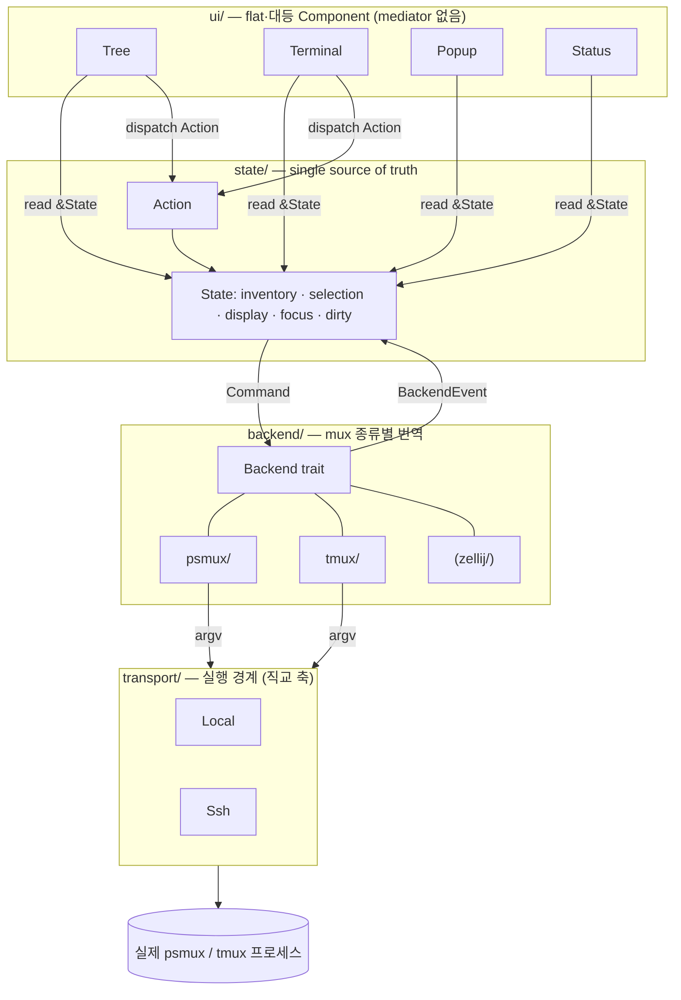

# mux 백엔드 · TUI 재아키텍처 설계

날짜: 2026-06-26
대상 브랜치: feat/rust-rewrite

## 1. 배경과 문제

현재 xmux는 `cockpit.rs`(3591줄)가 TUI 렌더, 입력 라우팅, attach 생명주기, mux 종류별 분기, 상태를 모두 들고 있는 god-object다. `ui/switcher.rs`(5448줄)도 트리·선택·입력을 한 덩어리로 쥐고 있다. 두 가지 결함이 직접 관찰됐다.

**결함 A — 분산 상태로 인한 비동기화.** "지금 보여줄 세션"이 다섯 곳에 흩어져 있다: `cockpit`의 지역변수 `selection`·`last_attached_sel`, `Host.display.shows`, `AttachRegistry`의 grid, `Switcher.terminal_view_target`. 이들을 매 루프 수동 동기화하는데, `select_attach`가 새 attach 결과를 `registry["local"]`에 반영하지 못하면 `selection=test`인데 `display=test2`로 어긋난다(실측 재현). 단일 진실의 원천이 없다.

**결함 B — mux 종류별 분기가 supervisor로 누수.** `cockpit`이 `host.mux.server_model().shares_one_attachment()`, `host.mux.stable_per_session_attachments()`, `matches!(host.mux.event_source(), Control)`(최소 6곳)를 직접 꺼내 case 분기한다. mux의 행동이 trait 뒤에 캡슐화되지 못해 `select_attach`가 3-way 분기로 비대해졌다.

**결함 B의 구체 증상 — psmux 변화 감지 미구현.** `HostEvent::WindowChanged`/`Focus`/`Changed`/`ClientDetached`는 control-mode `%`-notice 파싱(`host.rs run_reader`)에서만 생성된다. psmux는 `control_argv()=None`·`event_source()=Poll`이라 이 경로를 영영 안 탄다. 게다가 `EventSource::Poll { interval_ms }`의 주기 타이머는 구현되어 있지 않다(`PSMUX_POLL_MS` 사용처가 테스트뿐). 결과적으로 터미널에서 psmux를 직접 조작해 윈도우/세션을 바꿔도 xmux가 감지할 경로가 0개다.

## 2. 목표 아키텍처

세 계층으로 분리한다. 위 계층은 아래 계층의 인터페이스만 알고, mux 종류·transport 종류 같은 내부 분류를 읽지 않는다.



- **Backend(mux 종류)와 Transport(머신 도달)는 직교 축이다.** `psmux-over-ssh`·`tmux-local` 같은 조합 때문에 절대 합치지 않는다. Backend는 "무슨 명령"(transport-blind), Transport는 "어떻게 도달". 현 `Mux`+`Transport` 분리가 옳으므로 유지하고, `Mux`→`Backend`로 확장·디렉토리화만 한다.
- ratatui 공식 패턴 매핑: 공유 도메인 상태는 Flux의 store(single source of truth), TUI는 Component 패턴(`handle_event`/`render` co-locate, flat·대등), Elm 단독은 중앙 `update`가 "각 컴포넌트가 직접 mutate" 요구와 충돌하므로 채택하지 않는다.

## 3. 디렉토리 구조

```
src/
├─ app.rs            얇은 런타임: 이벤트 루프 + 입력 라우팅 + 채널 배선 (god-object 아님)
├─ state/            single source of truth
│  ├─ mod.rs         State 구조체 + apply(Action) + apply(BackendEvent) + dirty
│  └─ action.rs      Action enum (현 model/operation.rs 흡수)
├─ backend/          mux 종류별 '번역' — 한 mux = 한 디렉토리
│  ├─ mod.rs         Backend trait + BackendEvent + SelectOutcome + 공통 argv 헬퍼
│  ├─ psmux/         per-session · poll  (mod.rs = impl Backend, + poll·attach·argv)
│  ├─ tmux/          shared · control    (mod.rs = impl Backend, + control reader·argv)
│  └─ (zellij/)      향후 추가 = 이 디렉토리 하나만 늘리면 끝
├─ transport/        local/ssh 실행 경계 (현 model/transport.rs 이전)
└─ ui/               flat·대등 Component
   ├─ mod.rs         Component trait
   ├─ tree.rs        Tree 컴포넌트 (현 switcher.rs의 트리·선택·필터 분해)
   ├─ terminal.rs    Terminal(grid) 컴포넌트
   ├─ popup.rs       Popup(모달) 컴포넌트
   └─ status.rs      StatusBar 컴포넌트
```

새 mux 지원 추가 = `backend/<name>/` 디렉토리 하나 + `backend/mod.rs`의 감지 분기 한 줄. 위 계층(state, ui)은 손대지 않는다.

## 4. State — single source of truth

지금 흩어진 다섯 상태를 하나로 통합한다. `last_attached_sel` 같은 동기화 게이트가 사라진다 — State가 "표시중 = 선택"을 단일 진실로 보장하므로 결함 A가 구조적으로 불가능해진다.

```rust
struct State {
    inventory: Inventory,     // 호스트→세션→윈도우→페인 (reachable 전부). 현 Hosts/Group/Session 재사용
    selection: Address,       // 트리 커서 = source/session[:window]  (단일 진실)
    display: DisplayState,    // 표시중 attachment 핸들 + 그게 보여주는 address
    focus: Focus,             // Tree | Terminal  (입력 라우팅 결정자)
    popup: Option<Popup>,     // 열린 모달
    dirty: Dirty,             // { tree, terminal, status } 영역별 플래그
    prefs: Prefs,             // tree_width, auto_hide … (현 상태 유지)
}
```

- **Action**(`state/action.rs`): `Select{address}` · `Focus{target}` · `Rescan` · `NewWindow` · `KillSession` · `TreeWidth` · `ToggleAutoHide` · `Quit`. 현 `Operation`을 흡수하며, ctl도 동일 Action으로 매핑한다(키 입력과 ctl이 같은 경로 — 현 설계 장점 유지).
- **상태 변경은 두 출처뿐**:
  1. Component가 입력→Action을 `State::apply(action, &backend)`로 적용. State가 자기 갱신 + 필요 시 Backend Command 발행.
  2. Backend 이벤트를 `State::apply_event(BackendEvent)`로 적용. 인벤토리/표시중 갱신.
  - 두 경로 모두 끝에 해당 `dirty` 슬라이스를 세운다.

## 5. Backend trait

`event_source()`·`shares_one_attachment()`·`stable_per_session_attachments()` 같은 분류 노출 메서드를 제거하고 행동으로 흡수한다. State/UI는 mux 종류를 읽지 않는다.

```rust
#[async_trait]
trait Backend: Send + Sync {
    // 읽기 (mux → state)
    async fn enumerate(&self) -> Result<Vec<Session>>;
    fn events(&self) -> BoxStream<'static, BackendEvent>;   // poll/control을 '안'에서 통일

    // 쓰기 (state → mux)
    fn select(&self, addr: &Address) -> SelectOutcome;       // attach 교체 vs switch-client를 내부 결정
    fn new_window(&self, session: &str, name: &str);
    fn kill_window(&self, target: &str);
    fn rename_window(&self, target: &str, new: &str);
}

enum BackendEvent {
    InventoryChanged,                            // 구조 변화 → state가 re-enumerate
    ActiveWindowChanged { session: String, window: i64 },  // 외부 mux 조작 → tree 커서 추적
    DisplayReady { addr: Address, attachment: Attachment },
    DisplayExited { addr: Address },
}
```

- **`backend/psmux/`**: `events()`가 내부에서 poll 타이머(`PSMUX_POLL_MS`를 실제로 구동) + enumerate diff로 `InventoryChanged`/`ActiveWindowChanged`를 생성한다. `select()`는 per-session 서버 모델에 맞춰 기존 attach를 교체한다. → **결함 B의 psmux 변화 감지 미구현이 여기서 해결**된다.
- **`backend/tmux/`**: `events()`가 control `%`-notice를 파싱한다(현 `host.rs run_reader` 이전). `select()`는 `switch-client`.
- **Transport는 직교 계층으로 분리 유지.** Backend는 transport-blind intent(argv)를 만들고, Transport(`Local`/`Ssh`)가 `-S <socket>` 주입 또는 ssh 래핑으로 실행한다. 현 `Transport`·`SwitchPlan`·`lower_switch` 경계가 깨끗하므로 그대로 둔다.
- **이주 대상**: `mux.rs` argv 빌더 → 각 backend 디렉토리, `host.rs` control reader → `backend/tmux/`, `source.rs` enumerate·`proxy/run.rs` attach → backend별 분배.

## 6. Component + 입력 라우팅

ratatui 공식 Component 패턴을 따른다(`handle_event`/`render` co-locate).

```rust
trait Component {
    fn handle_event(&mut self, ev: &Event, state: &mut State, backend: &dyn Backend);
    fn render(&self, frame: &mut Frame, area: Rect, state: &State);
}
```

- **flat·대등**: `app.rs`가 `Tree`·`Terminal`·`Popup`·`Status`를 동등하게 보유한다. 부모-자식·mediator 없음. `app.rs`는 조율하지 않고 `state.focus`(또는 popup 유무)만 보고 입력을 해당 컴포넌트에 넘기는 얇은 배선자다.
- **직접 상호작용**: `Tree`가 커서를 옮기면 자기가 `state.selection`을 바꾸고 `backend.select()`를 직접 호출한다. `Terminal`은 키를 attach PTY로 직접 흘린다. 다른 컴포넌트를 거치지 않는다.
- **직접 변화 감지**: 렌더 루프에서 각 컴포넌트가 자기 관심 `dirty` 슬라이스만 확인해 자기 영역만 redraw한다. 예) `ActiveWindowChanged → state.selection 갱신 + dirty.tree → Tree만 다시 그림`.
- **draw 게이팅 유지**: `dirty && last_draw.elapsed() >= FRAME_MS`(≤30fps 합치기)는 성능상 유지한다. 마우스 라우팅(focus×위치)도 현 로직을 컴포넌트로 분산해 보존한다.

## 7. 두 결함의 해결 경로

- **결함 A(비동기화)**: State가 `display`와 `selection`을 한 구조에 들고, `apply`가 둘을 함께 갱신한다. "selection은 test인데 display는 test2" 같은 분기가 생길 자리가 없다. `last_attached_sel` 게이트 삭제.
- **결함 B(누수·psmux 변화 감지)**: `events()`/`select()`가 mux별 행동을 흡수해 `cockpit`의 `matches!(event_source, …)` 분기가 사라진다. psmux `events()`가 poll 타이머를 실제로 돌려 외부 변화를 `ActiveWindowChanged`로 흘려보내므로 트리가 따라간다.

## 8. 마이그레이션 전략 (점진적, 각 단계 그린 유지)

big-bang 재작성은 위험하다. 동작을 유지한 채 단계별로 옮기고, 매 단계 `cargo test`·clippy 그린 + 라이브 확인을 통과시킨다.

1. **Phase 0 — State 도입**: `state/` 추가. `cockpit`의 지역변수(`selection`·`last_attached_sel`·`display.shows`)를 `State` 구조체로 이전. 동작 동일(순수 리팩터). last_attached_sel 게이트 제거로 결함 A 우선 해소.
2. **Phase 1 — Backend trait 추출**: 현 `Mux`를 `Backend`로 확장하고 `backend/psmux/`·`backend/tmux/` 디렉토리로 재배치. argv 빌더·control reader·attach 이주. 분류 노출 메서드는 아직 남겨둠.
3. **Phase 2 — events() 통일**: psmux poll 타이머 구현 + tmux control 파싱을 `events()` 뒤로. `cockpit`의 `matches!(event_source, Control)` 분기 제거. 결함 B의 변화 감지 해소(라이브 검증: 터미널에서 psmux 윈도우 전환 → 트리 추적).
4. **Phase 3 — select() 통일**: `select_attach`의 3-way 분기를 `backend.select()` 뒤로. `shares_one_attachment`·`stable_per_session_attachments` 제거.
5. **Phase 4 — Component 분해**: `cockpit.rs`/`switcher.rs`를 `app.rs` + `ui/{tree,terminal,popup,status}.rs`로 쪼갬. 각 컴포넌트가 State+Backend를 직접 받는 구조로.

## 9. 테스트 전략

- 단위: `State::apply`(Action·BackendEvent별), 각 Backend의 argv 빌더·이벤트 파싱(psmux poll diff, tmux `%`-notice), 각 Component의 `handle_event`.
- 통합: psmux `select()` 교체 후 표시중 address가 selection과 일치(결함 A 회귀 테스트), psmux `ActiveWindowChanged`가 tree 커서를 옮김(결함 B 회귀 테스트).
- 라이브 게이트: 실제 psmux test/test2 전환 + 터미널 내 윈도우 전환의 트리 추적(헤드리스 ctl `switch`/`dump`로 구동, 사람 눈 최종 확인).

## 10. 비목표 (Non-goals)

- 세션 생성/삭제/이름변경 lifecycle의 신규 기능 추가(현 범위 유지 — Action·Backend 메서드만 형태 정리).
- 새 mux(zellij 등) 실제 구현(디렉토리 슬롯만 열어두고 구현은 별도 작업).
- ctl 와이어 프로토콜 변경(현 도메인 verb 유지).
- Transport 계층 재설계(현 `Local`/`Ssh` 분리가 깨끗하므로 그대로).
